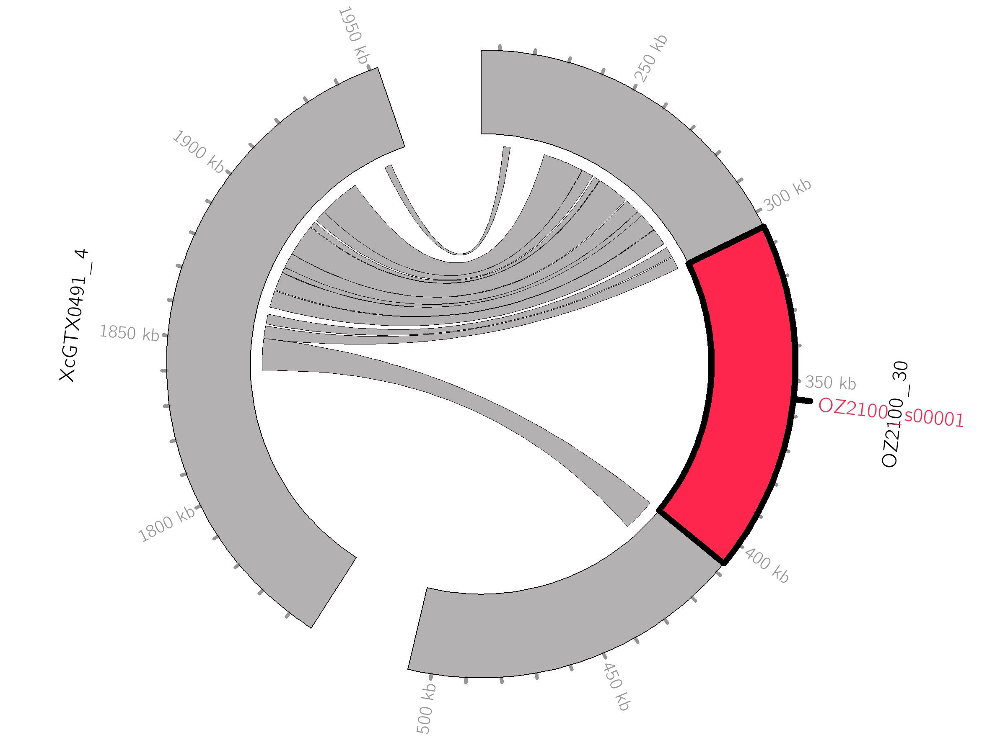
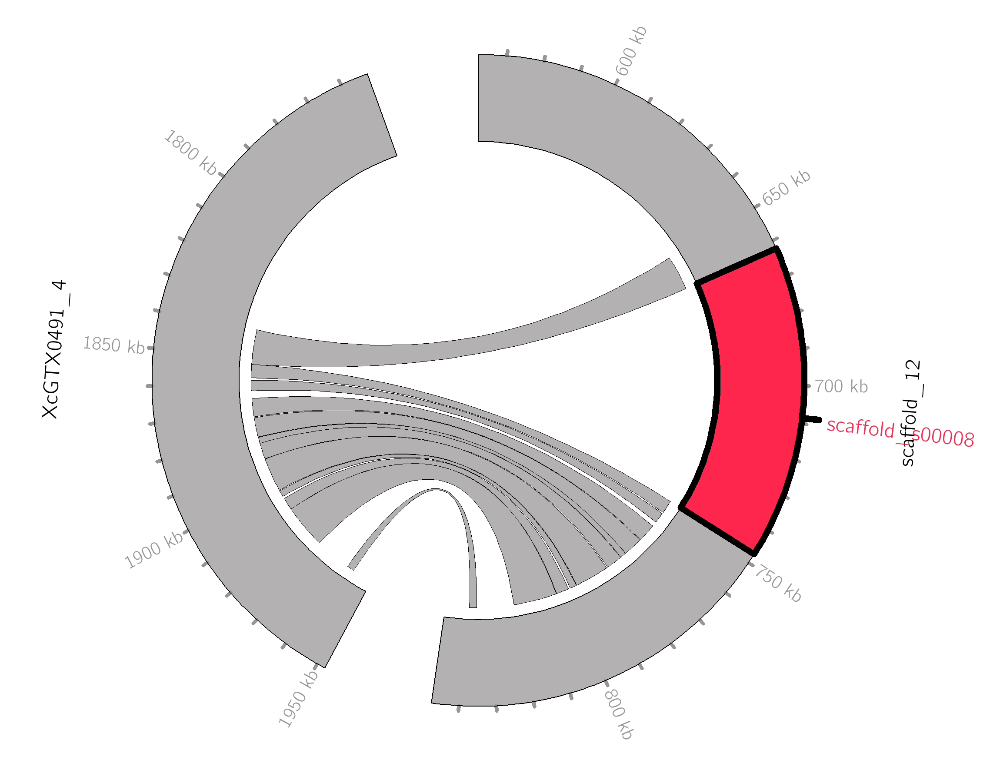
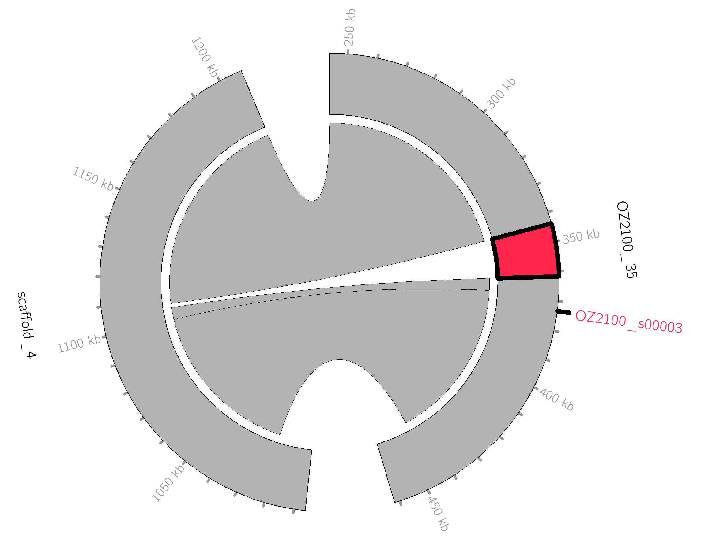
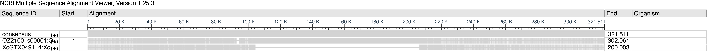
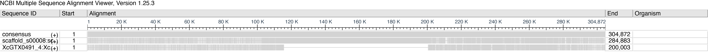

```{r setup, include=FALSE}
library(knitr)
library(tidyverse)
library(kableExtra)
knitr::opts_chunk$set(echo = TRUE)
options(scipen = 100, digits = 4)
```

**Summary:** try detecting Starships in Xanthoria genome. This is a streamlined version of the document, that doesn'r include (many) failed attempts and tangents.

## 1. Installing Starfish
<p>
  <a class="btn btn-primary" data-toggle="collapse" href="#collapse1" role="button" aria-expanded="false" aria-controls="collapse1">
    click to see
  </a>
</p>
<div class="collapse" id="collapse1">
  <div class="card card-body">
  
* Download date 20.05.2024
```{r,eval=F}
ssh software
cd /tsl/scratch/gol22pin/singularity/
singularity pull starfish.sif oras://ghcr.io/egluckthaler/starfish:latest
singularity pull starfish oras://ghcr.io/egluckthaler/starfish:latest
```

* Tried and confirmed it works
```{r,eval=F}
singularity run ../singularity/starfish.sif starfish -h
```
  </div>
</div>

## 2. Assembling dataset
* Included 3 genomes from Xanthoria parietina and one X. calcicola
  * Xanthoria parietina GTX0501 already annotated
  * Xanthoria calcicola GTX0491 already annotated
  * new X. parietina genome produced by Aquatic Symbiosis Genome project (GCA_964656405, SAMEA111342678). Will annotate below
  * new X. parietina genome shared by Ellen Cameron (not public yet). Will annotate below
* All genomes annotated with Funannotate

## 3. Prep files

<p>
  <a class="btn btn-primary" data-toggle="collapse" href="#collapse3" role="button" aria-expanded="false" aria-controls="collapse3">
    click to see re-formatting of various files
  </a>
</p>
<div class="collapse" id="collapse3">
  <div class="card card-body">
  
#### Pre-prepared assemblies and annotations
* Copied all genomes, gff, and protein fastas in a new folder
```{r,eval=F}
mkdir analysis_and_temp_files/03_starfish/genomes

cp analysis_and_temp_files/02_annotate/GCA964656405_pred/annotate_results/Xanthoria_parietina_SAMEA111342678.scaffolds.fa analysis_and_temp_files/03_starfish/genomes
cp analysis_and_temp_files/02_annotate/GCA964656405_pred/annotate_results/Xanthoria_parietina_SAMEA111342678.gff3 analysis_and_temp_files/03_starfish/genomes
cp analysis_and_temp_files/02_annotate/GCA964656405_pred/annotate_results/Xanthoria_parietina_SAMEA111342678.proteins.fa analysis_and_temp_files/03_starfish/genomes

cp analysis_and_temp_files/02_annotate/SAMEA115359166_pred/annotate_results/Xanthoria_parietina_SAMEA115359166.scaffolds.fa analysis_and_temp_files/03_starfish/genomes
cp analysis_and_temp_files/02_annotate/SAMEA115359166_pred/annotate_results/Xanthoria_parietina_SAMEA115359166.gff3 analysis_and_temp_files/03_starfish/genomes
cp analysis_and_temp_files/02_annotate/SAMEA115359166_pred/annotate_results/Xanthoria_parietina_SAMEA115359166.proteins.fa analysis_and_temp_files/03_starfish/genomes

cp  ../02_long_read_assemblies/analysis_and_temp_files/06_annotate_lecanoro/GTX0501_pred/annotate_results/Xanthoria_parietina_GTX0501.scaffolds.fa analysis_and_temp_files/03_starfish/genomes analysis_and_temp_files/03_starfish/genomes
cp ../02_long_read_assemblies/analysis_and_temp_files/06_annotate_lecanoro/GTX0501_pred/annotate_results/Xanthoria_parietina_GTX0501.gff3 analysis_and_temp_files/03_starfish/genomes 
cp ../02_long_read_assemblies/analysis_and_temp_files/06_annotate_lecanoro/GTX0501_pred/annotate_results/Xanthoria_parietina_GTX0501.proteins.fa analysis_and_temp_files/03_starfish/genomes 

cp analysis_and_temp_files/02_annotate/GTX0491_pred/annotate_results/Xanthoria_calcicola_GTX0491.scaffolds.fa analysis_and_temp_files/03_starfish/genomes
cp analysis_and_temp_files/02_annotate//GTX0491_pred/annotate_results/Xanthoria_calcicola_GTX0491.gff3 analysis_and_temp_files/03_starfish/genomes 
cp analysis_and_temp_files/02_annotate/GTX0491_pred/annotate_results/Xanthoria_calcicola_GTX0491.proteins.fa analysis_and_temp_files/03_starfish/genomes 
```

* First, had to (again!) fix the names of the GCA964656405, since got an error downstream saying "is being parsed into <2 components using separator '_'. Make sure ALL sequence headers are formatted like <genomeID><separator><featureID>"
```{r,eval=F}
sed -i -e 's/OZ2100/OZ2100_/g' analysis_and_temp_files/03_starfish/genomes/Xanthoria_parietina_SAMEA111342678.scaffolds.fa
sed -i -e 's/OZ2100/OZ2100_/g' analysis_and_temp_files/03_starfish/genomes/Xanthoria_parietina_SAMEA111342678.gff3
```
* Next, had to edit the gff to change ID tag to Name tag
```{r,eval=F}
sed -i 's/ID/Name/g' analysis_and_temp_files/03_starfish/genomes/Xanthoria_parietina_SAMEA111342678.gff3
sed -i 's/ID/Name/g' analysis_and_temp_files/03_starfish/genomes/Xanthoria_parietina_SAMEA115359166.gff3
sed -i 's/ID/Name/g' analysis_and_temp_files/03_starfish/genomes/Xanthoria_calcicola_GTX0491.gff3
sed -i 's/ID/Name/g' analysis_and_temp_files/03_starfish/genomes/Xanthoria_parietina_GTX0501.gff3
```
* Since I forgot to specify sequence tag for newly annotated genomes, had to replace them manually in gff and protein fasta files (otherwise both of them will have FUN_ sequence tag)
```{r,eval=F}
sed -i 's/FUN_/XANPAOZ2100_/g' analysis_and_temp_files/03_starfish/genomes/Xanthoria_parietina_SAMEA111342678.gff3
sed -i 's/FUN_/XANPAOZ2100_/g' analysis_and_temp_files/03_starfish/genomes/Xanthoria_parietina_SAMEA111342678.proteins.fa

sed -i 's/FUN_/XANPARI20_/g' analysis_and_temp_files/03_starfish/genomes/Xanthoria_parietina_SAMEA115359166.gff3
sed -i 's/FUN_/XANPARI20_/g' analysis_and_temp_files/03_starfish/genomes/Xanthoria_parietina_SAMEA115359166.proteins.fa
```
* For the two genomes previously annotated, had to fix contig names to remove extra underscore
```{r,eval=F}
sed -i 's/Xc_/Xc/g' analysis_and_temp_files/03_starfish/genomes/Xanthoria_calcicola_GTX0491.scaffolds.fa
sed -i 's/Xc_/Xc/g' analysis_and_temp_files/03_starfish/genomes/Xanthoria_calcicola_GTX0491.gff3

sed -i 's/Xp_/Xp/g' analysis_and_temp_files/03_starfish/genomes/Xanthoria_parietina_GTX0501.scaffolds.fa
sed -i 's/Xp_/Xp/g' analysis_and_temp_files/03_starfish/genomes/Xanthoria_parietina_GTX0501.gff3

```

#### Prep following starfish tutorial
* Starfish takes as input a tsv file with genome IDs and paths
```{r,eval=F}
nano analysis_and_temp_files/03_starfish/ome2assembly.txt
    GTX0501  analysis_and_temp_files/03_starfish/genomes/Xanthoria_parietina_GTX0501.scaffolds.fa
    GTX0491  analysis_and_temp_files/03_starfish/genomes/Xanthoria_calcicola_GTX0491.scaffolds.fa
    GCA964656405  analysis_and_temp_files/03_starfish/genomes/Xanthoria_parietina_SAMEA111342678.scaffolds.fa
    SAMEA115359166 analysis_and_temp_files/03_starfish/genomes/Xanthoria_parietina_SAMEA115359166.scaffolds.fa    

    
nano analysis_and_temp_files/03_starfish/ome2gff.txt
    GTX0501  analysis_and_temp_files/03_starfish/genomes/Xanthoria_parietina_GTX0501.gff3
    GTX0491  analysis_and_temp_files/03_starfish/genomes/Xanthoria_calcicola_GTX0491.gff3
    GCA964656405  analysis_and_temp_files/03_starfish/genomes/Xanthoria_parietina_SAMEA111342678.gff3
    SAMEA115359166 analysis_and_temp_files/03_starfish/genomes/Xanthoria_parietina_SAMEA115359166.gff3    
```

* Concatanate assemblies and gff
```{r,eval=F}
mkdir analysis_and_temp_files/03_starfish/blastdb

cut -f2 analysis_and_temp_files/03_starfish/ome2assembly.txt | xargs cat > analysis_and_temp_files/03_starfish/blastdb/manyxanthorias.assemblies.fna

cut -f2 analysis_and_temp_files/03_starfish/ome2gff.txt | xargs cat > analysis_and_temp_files/03_starfish/manyxanthorias.gff3
```
* Make index (samtools v1.18) and blast db
```{r,eval=F}
source package c92263ec-95e5-43eb-a527-8f1496d56f1a 
samtools faidx analysis_and_temp_files/03_starfish/blastdb/manyxanthorias.assemblies.fna
singularity run ../singularity/starfish.sif makeblastdb -in analysis_and_temp_files/03_starfish/blastdb/manyxanthorias.assemblies.fna -out analysis_and_temp_files/03_starfish/blastdb/manyxanthorias.assemblies -parse_seqids -dbtype nucl
```

* Calculate GC%. Couldn't figure out how to run the script inside the singularity container, so instead saved it separately in the `code/` folder and ran outside
```{r,eval=F}
source package b0ed0698-358b-4c9b-9d21-603ea8d6e478
bash code/seq-gc.sh -Nbw 1000 analysis_and_temp_files/03_starfish/blastdb/manyxanthorias.assemblies.fna  > analysis_and_temp_files/03_starfish/blastdb/manyxanthorias.assemblies.gcContent_w1000.bed
```

#### Parse emapper annotations
* Added the genome ID to the file name
```{r,eval=F}
mkdir analysis_and_temp_files/03_starfish/ann

cp analysis_and_temp_files/02_annotate/GCA964656405_pred/annotate_misc/eggnog.emapper.annotations analysis_and_temp_files/03_starfish/ann/GCA964656405_eggnog.emapper.annotations

cp analysis_and_temp_files/02_annotate/SAMEA115359166_pred/annotate_misc/eggnog.emapper.annotations  analysis_and_temp_files/03_starfish/ann/SAMEA115359166_eggnog.emapper.annotations

cp  analysis_and_temp_files/06_annotate_lecanoro/GTX0501_pred/annotate_misc/eggnog.emapper.annotations analysis_and_temp_files/03_starfish/ann/GTX0501_eggnog.emapper.annotations

cp analysis_and_temp_files/06_annotate_lecanoro/GTX0491_pred/annotate_misc/eggnog.emapper.annotations analysis_and_temp_files/03_starfish/ann/GTX0491_eggnog.emapper.annotations
```
* For the new genomes, fixed the sequence tags
```{r,eval=F}
sed -i 's/FUN_/XANPAOZ2100_/g' analysis_and_temp_files/03_starfish/ann/GCA964656405_eggnog.emapper.annotations
sed -i 's/FUN_/XANPARI20_/g' analysis_and_temp_files/03_starfish/ann/SAMEA115359166_eggnog.emapper.annotations
```

* Parse. "sorted 28381 sequences into 9999 ortholog groups.."
```{r,eval=F}
cut -f1,21  analysis_and_temp_files/03_starfish/ann/*emapper.annotations | grep -v  '#' | grep -v -P '\t-' | perl -pe 's/\t/\tEMAP\t/' | grep -vP '\tNA' > analysis_and_temp_files/03_starfish/ann/manyxanthorias.gene2emap.txt

cut -f1,5 analysis_and_temp_files/03_starfish/ann/*emapper.annotations | grep -v '#' | perl -pe 's/(^.+?)\t.+,([^,]+)$/\1\t\2/' | perl -pe 's/@/\t/' > analysis_and_temp_files/03_starfish/ann/manyxanthorias.gene2og.txt

code/geneOG2mclFormat.pl -i analysis_and_temp_files/03_starfish/ann/manyxanthorias.gene2og.txt -o analysis_and_temp_files/03_starfish/ann
```
  </div>
</div>

## 4. Gene finder module
* Annotate tyrosine recombinases 
```{r,eval=F}
mkdir analysis_and_temp_files/03_starfish/geneFinder
singularity run ../singularity/starfish.sif starfish annotate -T 10 -x many_xanthorias_tyr -a analysis_and_temp_files/03_starfish/ome2assembly.txt -g analysis_and_temp_files/03_starfish/ome2gff.txt -p /opt/conda/envs/starfish/db/YRsuperfams.p1-512.hmm -P /opt/conda/envs/starfish/db/YRsuperfamRefs.faa -i tyr -o analysis_and_temp_files/03_starfish/geneFinder
  
  Key parameters:
metaeuk        -v 3 -s 7.5 -e 0.0001 --max-intron 2000 --max-seqs 300 --metaeuk-eval 0.001 --exhaustive-search 1 --metaeuk-tcov 0.25 --allow-deletion 1 --protein 1 --disk-space-limit 100G --compressed 1
hmmsearch      --max -E 0.001

```
* STDOUT:
  * found 5 new tyr genes and 15 tyr genes that overlap with 16 existing genes
* Consolidate new tyr predictions and the pre-existing gff
```{r,eval=F}
singularity run ../singularity/starfish.sif starfish consolidate -o analysis_and_temp_files/03_starfish/ -g analysis_and_temp_files/03_starfish/manyxanthorias.gff3 -G analysis_and_temp_files/03_starfish/geneFinder/many_xanthorias_tyr.filt_intersect.gff 
```

* save file with the file path of the new gff
```{r,eval=F}
realpath analysis_and_temp_files/03_starfish/many_xanthorias_tyr.filt_intersect.consolidated.gff | perl -pe 's/^/manyxanthoria\t/' > analysis_and_temp_files/03_starfish/ome2consolidatedGFF3.txt
```
* Tried to split genes into neighbourhoods (within 10 Kbp of each other),
```{r,eval=F}
singularity run ../singularity/starfish.sif starfish sketch -m 10000 -q analysis_and_temp_files/03_starfish/geneFinder/many_xanthorias_tyr.filt_intersect.ids  -g analysis_and_temp_files/03_starfish/ome2consolidatedGFF3.txt -i s -x manyxanthoria -o analysis_and_temp_files/03_starfish/geneFinder/
```
* STDOUT:
  * merging any of the 20 input query genes within 10000 bp of each other into the same neighborhood..
  * extending neighborhoods by 0 flanking bp and adding all genes within new boundaries to neighborhood..
  * found 19 neighborhoods containing input query genes
* Pull coordinates of the captains
```{r,eval=F}
grep -P '\ttyr\t' analysis_and_temp_files/03_starfish/geneFinder/manyxanthoria.bed > analysis_and_temp_files/03_starfish/geneFinder/manyxanthoria.tyr.bed 
```

## 5. Element finder module
```{r,eval=F}
mkdir analysis_and_temp_files/03_starfish/elementFinder

singularity run ../singularity/starfish.sif starfish insert -T 10 -a analysis_and_temp_files/03_starfish/ome2assembly.txt -d analysis_and_temp_files/03_starfish/blastdb/manyxanthorias.assemblies -b analysis_and_temp_files/03_starfish/geneFinder/manyxanthoria.tyr.bed -i tyr -x manyxanthoria -o analysis_and_temp_files/03_starfish/elementFinder/
```  
* STDOUT:
  * parsing upstream regions of 19 candidate tyr captains..
  * searching for hits to the upstream regions of 19 candidate tyr captains..
  * found 15 tyr captains with candidate insertion sites
  * searching for hits to the downstream regions of candidate insertion sites for 15 tyr captains that are also downstream of those captains..
  * filtering out similar upstream and downstream flanks of insertion sites associated with 7 candidate tyr captains..
  * refining boundary predictions of 7 candidate tyr captains with insertion sites..
  * found 4 candidate tyr captains with refined insertion sites
  * aligning 4 candidate elements back to candidate insertion site contigs to make sure the element is really missing..
  * found element boundaries and insertion sites for 3 tyr captains out of 19 input captains
* This produced manyxanthoria.insert.bed and manyxanthoria.insert.stats, which contain **elements OZ2100_s00001 and scaffold_s00008**, which I will keep an eye on:
```{r}
stats1<-read.delim2("../analysis_and_temp_files/03_starfish/elementFinder/manyxanthoria.insert.stats")
stats1 %>% kable(format = "html", col.names = colnames(stats1)) %>%
  kable_styling() %>%
  kableExtra::scroll_box(width = "100%", height = "200px")
```


* The tutorial says you can search for boundaries iteratively, but I will skip it here
* Summarize
```{r,eval=F}
singularity run ../singularity/starfish.sif starfish summarize -a analysis_and_temp_files/03_starfish/ome2assembly.txt -b analysis_and_temp_files/03_starfish/elementFinder/manyxanthoria.insert.bed -x manyxanthoria_round -o analysis_and_temp_files/03_starfish/elementFinder -S analysis_and_temp_files/03_starfish/elementFinder/manyxanthoria.insert.stats  -g analysis_and_temp_files/03_starfish/ome2consolidatedGFF3.txt -t analysis_and_temp_files/03_starfish/geneFinder/many_xanthorias_tyr.filt_intersect.ids 
```
* STDOUT:
  * we have 0 elements with flank boundaries, 3 with insert boundaries, and 0 with extend boundaries, for a total of 3 elements
  * found 0 elements nested/overlapping with 0 other elements
* OZ2100_s00001 (from genome GCA964656405) and scaffold_s00008 (from genome SAMEA115359166) map to the same empty site in the GTX0491
```{r}
stats2<-read.delim2("../analysis_and_temp_files/03_starfish/elementFinder/manyxanthoria_round.elements.named.stats")
stats2 %>% kable(format = "html", col.names = colnames(stats2)) %>%
  kable_styling() %>%
  kableExtra::scroll_box(width = "100%", height = "200px")
```  

* Assign to a family. This produced files many_xanthorias_tyr_vs_YRsuperfams.out and many_xanthorias_tyr_vs_YRsuperfams_besthits.txt
```{r,eval=F}
singularity run ../singularity/starfish.sif hmmsearch --noali --notextw -E 0.001 --max --cpu 10 --tblout analysis_and_temp_files/03_starfish/elementFinder/many_xanthorias_tyr_vs_YRsuperfams.out /opt/conda/envs/starfish/db/YRsuperfams.p1-512.hmm analysis_and_temp_files/03_starfish/geneFinder/many_xanthorias_tyr.filt_intersect.fas

perl -p -e 's/ +/\t/g' analysis_and_temp_files/03_starfish/elementFinder/many_xanthorias_tyr_vs_YRsuperfams.out | cut -f1,3,5 | grep -v '#' | sort -k3,3g | awk '!x[$1]++' > analysis_and_temp_files/03_starfish/elementFinder/many_xanthorias_tyr_vs_YRsuperfams_besthits.txt
```
* Look into assignments in many_xanthorias_tyr_vs_YRsuperfams_besthits.txt. Our captains (OZ2100_002162-T1 and scaffold_008752-T1) had best hit to clade 1 
```{r}
stats3<-read.delim2("../analysis_and_temp_files/03_starfish/elementFinder/many_xanthorias_tyr_vs_YRsuperfams_besthits.txt",header=F)
stats3 %>% kable(format = "html", col.names = colnames(stats3)) %>%
  kable_styling() %>%
  kableExtra::scroll_box(width = "100%", height = "300px")
```

* replace all captain IDs with starship IDs to simplify downstream parsing. This produced two files,  manyxanthoria_round2.elements.bed.cap2ship.txt and many_xanthorias_tyr_vs_YRsuperfams_besthits_rename.txt
```{r,eval=F}
grep -P '\tcap\t' analysis_and_temp_files/03_starfish/elementFinder/manyxanthoria_round.elements.bed | cut -f4,7 > analysis_and_temp_files/03_starfish/elementFinder/manyxanthoria_round.elements.bed.cap2ship.txt

singularity run ../singularity/starfish.sif /opt/conda/envs/starfish/aux/searchReplace.pl --strict -i analysis_and_temp_files/03_starfish/elementFinder/many_xanthorias_tyr_vs_YRsuperfams_besthits.txt -r analysis_and_temp_files/03_starfish/elementFinder/manyxanthoria_round.elements.bed.cap2ship.txt >> analysis_and_temp_files/03_starfish/elementFinder/many_xanthorias_tyr_vs_YRsuperfams_besthits_rename.txt
```

* now group all Starships into naves using mmseqs2 easy-cluster on the captain sequences with a very permissive 50% percent ID/ 25% coverage threshold.
```{r,eval=F}
singularity run ../singularity/starfish.sif mmseqs easy-cluster analysis_and_temp_files/03_starfish/geneFinder/many_xanthorias_tyr.filt_intersect.fas analysis_and_temp_files/03_starfish/elementFinder/manyxanthoria_round analysis_and_temp_files/03_starfish/elementFinder/ --threads 10 --min-seq-id 0.5 -c 0.25 --alignment-mode 3 --cov-mode 0 --cluster-reassign

singularity run ../singularity/starfish.sif /opt/conda/envs/starfish/aux/mmseqs2mclFormat.pl -i analysis_and_temp_files/03_starfish/elementFinder/manyxanthoria_round_cluster.tsv -g navis -o analysis_and_temp_files/03_starfish/elementFinder/
```
  * Stdout: sorted 20 sequences into 10 ortholog groups..
* Our elements grouped together in navis0002 together with two genes from GTX0501 genome (XpGTX0501_010272-T1 and XpGTX0501_001716-T1)
```{r}
stats4<-read.delim2("../analysis_and_temp_files/03_starfish/elementFinder/manyxanthoria_round_cluster.mcl",header=F)
stats4 %>% kable(format = "html", col.names = colnames(stats4)) %>%
  kable_styling() %>%
  kableExtra::scroll_box(width = "100%", height = "300px")
```

* Added some code here to make a table summarizing all info on the identified YRs
```{r}
gff <- read.delim("../analysis_and_temp_files/03_starfish/geneFinder/many_xanthorias_tyr.filt_intersect.gff",header=F)
gff$geneID <- sub( '^.*Name=',"",gff$V9)
gff <- gff %>% mutate(Genome = case_when(
  grepl("OZ2100",V1) ~ "Xanthoria parietina isolate SAMEA111342678",
  grepl("scaffold",V1) ~ "Xanthoria parietina isolate SAMEA115359166",
  grepl("GTX0491",V1) ~ "Xanthoria calcicola isolate GTX0491",
  grepl("GTX0501",V1) ~ "Xanthoria parietina isolate GTX0501")) %>%
  dplyr::rename(contig=V1,Start=V4,End=V5,Strand=V7) %>%
  select(geneID,Genome,contig,Start,End,Strand)

naves <- stats4 %>% tidyr::unite(geneID, -V1,sep=";") %>%
  select(V1,geneID) %>% 
   separate_longer_delim(geneID,";") %>%
  filter(geneID!="") %>%
  mutate(navis=str_replace(V1,":","")) %>%
  select(-V1)

captains <- gff %>% left_join(naves) %>% left_join(stats3,by=c("geneID"="V1")) %>%
   dplyr::rename(family_hit=V2,evalue=V3) %>%
  arrange(navis)
captains$geneID <- str_replace(captains$geneID,"OZ2100_","XANPAOZ2100_")
captains$geneID <- str_replace(captains$geneID,"XcGTX0491_","XANCAGTX0491_")
captains$geneID <- str_replace(captains$geneID,"XpGTX0501_","XANPAGTX0501_")
captains$geneID <- str_replace(captains$geneID,"scaffold_","XANPARI20_")

write.table(captains,"../results/captains.txt",sep="\t",quote = F, row.names = F)

```

* use sourmash and mcl to group all elements into haplotypes based on pairwise k-mer similarities of element nucleotide sequences. OZ2100_s00001 and scaffold_s00008 have 34% similaruty. 
```{r,eval=F}
singularity run ../singularity/starfish.sif starfish sim -m element -t nucl -b analysis_and_temp_files/03_starfish/elementFinder/manyxanthoria_round.elements.bed -x manyxanthoria_round -o analysis_and_temp_files/03_starfish/elementFinder/ -a analysis_and_temp_files/03_starfish/ome2assembly.txt

singularity run ../singularity/starfish.sif starfish group -m mcl -s analysis_and_temp_files/03_starfish/elementFinder/manyxanthoria_round.element.nucl.sim -i hap -o analysis_and_temp_files/03_starfish/elementFinder/ -t 0.05
```
* Stdout:
  * parsing nucl sequence from 3 elements
  * 0-OZ2100_s00001      [1.   0.34 0.  ]
  * 1-scaffold_s00008       [0.34 1.   0.  ]
  * 2-OZ2100_s00003         [0. 0. 1.]
  * grouping genetic loci into families based on the mcl clustering algorithm..
  * grouped 2 loci into 1 multimember groups
  * 2 loci are singletons
* Our elements are in hap0001
```{r}
read.delim2("../analysis_and_temp_files/03_starfish/elementFinder/manyxanthoria_round.element.nucl.I1.5.mcl",header=F)
```

* replace captain IDs with starship IDs in the naves file
```{r,eval=F}
singularity run ../singularity/starfish.sif /opt/conda/envs/starfish/aux/searchReplace.pl -i analysis_and_temp_files/03_starfish/elementFinder/manyxanthoria_round_cluster.mcl -r analysis_and_temp_files/03_starfish/elementFinder/manyxanthoria_round.elements.bed.cap2ship.txt> analysis_and_temp_files/03_starfish/elementFinder/manyxanthoria_round.element_cluster.mcl
```
* merge navis with haplotype to create a navis-haplotype label for each Starship. This produced manyxanthoria_round2.element.navis-hap.mcl
```{r,eval=F}
singularity run ../singularity/starfish.sif /opt/conda/envs/starfish/aux/mergeGroupfiles.pl -t analysis_and_temp_files/03_starfish/elementFinder/manyxanthoria_round.element_cluster.mcl -q analysis_and_temp_files/03_starfish/elementFinder/manyxanthoria_round.element.nucl.I1.5.mcl > analysis_and_temp_files/03_starfish/elementFinder/manyxanthoria_round.element.navis-hap.mcl
```
* convert mcl to gene2og format to simplify downstream parsing. This produced manyxanthoria_round2.element.navis-hap.txt
```{r,eval=F}
awk '{ for (i = 2; i <= NF; i++) print $i"\t"$1 }' analysis_and_temp_files/03_starfish/elementFinder/manyxanthoria_round.element.navis-hap.mcl > analysis_and_temp_files/03_starfish/elementFinder/manyxanthoria_round.element.navis-hap.txt
```
* now add the family and navis-haplotype into to the element.feat file to consolidate metadata
```{r,eval=F}
join -t$'\t' -1 1 -2 2 <(sort -t$'\t' -k1,1 analysis_and_temp_files/03_starfish/elementFinder/manyxanthoria_round.element.navis-hap.txt | grep -P '_e|_s') <(sort -t$'\t' -k2,2 analysis_and_temp_files/03_starfish/elementFinder/manyxanthoria_round.elements.feat) | awk -F'\t' '{print}' > analysis_and_temp_files/03_starfish/elementFinder/manyxanthoria_round.elements.temp.feat

echo -e "#elementID\tfamilyID\tnavisHapID\tcontigID\tcaptainID\telementBegin\telementEnd\telementLength\tstrand\tboundaryType\temptySiteID\temptyContig\temptyBegin\temptyEnd\temptySeq\tupDR\tdownDR\tDRedit\tupTIR\tdownTIR\tTIRedit\tnestedInside\tcontainNested" > analysis_and_temp_files/03_starfish/elementFinder/manyxanthoria_round.elements.ann.feat

join -t$'\t' -1 1 -2 1 <(sort -t$'\t' -k1,1 analysis_and_temp_files/03_starfish/elementFinder/many_xanthorias_tyr_vs_YRsuperfams_besthits_rename.txt | grep -P '_e|_s' | cut -f1,2) <(sort -t$'\t' -k1,1 analysis_and_temp_files/03_starfish/elementFinder/manyxanthoria_round.elements.temp.feat) | awk -F'\t' '{print}' >> analysis_and_temp_files/03_starfish/elementFinder/manyxanthoria_round.elements.ann.feat
```
* This is the resulting metadata. Our elements are now classified as navis0002-hap0001
```{r}
stat6 <- read.delim2("../analysis_and_temp_files/03_starfish/elementFinder/manyxanthoria_round.elements.ann.feat",header=T)
stat6 %>% kable(format = "html", col.names = colnames(stat6)) %>%
  kable_styling() %>%
  kableExtra::scroll_box(width = "100%", height = "200px")
```

* The current version of starfish tutorial doesn't include the starfish flank step. But my version required the flank file for visualization, so I ran it following the older tutorial. This produced file manyxanthoria_round2.flank.singleDR.stats
```{r,eval=F}
singularity run ../singularity/starfish.sif starfish flank -a analysis_and_temp_files/03_starfish/ome2assembly.txt  -b analysis_and_temp_files/03_starfish/elementFinder/manyxanthoria.insert.bed -x manyxanthoria_round -o analysis_and_temp_files/03_starfish/elementFinder
```
* STDOUT:
  * searching for DR-TIR pairs 100 bp upstream and 100 bp downstream of the insert boundaries of 2 input captains with candidate DRs..
  * found 1 captains with DR boundaries and 1 captains with DR-TIR boundaries out of 2 input captains with candidate DRs
* The file shows DR and TIR for one of our elements, but not the other (is this weird?)
```{r}
stat7<-read.delim2("../analysis_and_temp_files/03_starfish/elementFinder/manyxanthoria_round.flank.singleDR.stats",header=T)
stat7 %>% kable(format = "html", col.names = colnames(stat7)) %>%
  kable_styling() %>%
  kableExtra::scroll_box(width = "100%", height = "150px")
```

* Prepare files to visualize alignments with circos
```{r,eval=F}
mkdir analysis_and_temp_files/03_starfish/pairViz/
  
singularity run ../singularity/starfish.sif  starfish pair-viz -m all -t empty -T 2 -A nucmer -a analysis_and_temp_files/03_starfish/ome2assembly.txt -b analysis_and_temp_files/03_starfish/elementFinder/manyxanthoria_round.elements.bed -f analysis_and_temp_files/03_starfish/elementFinder/manyxanthoria_round.flank.singleDR.stats -S analysis_and_temp_files/03_starfish/elementFinder/manyxanthoria_round.elements.named.stats -o analysis_and_temp_files/03_starfish/pairViz/
```

* Our elements from navis0002-hap0001 look the same here. Concerning is that the aligned parts on one side of the element is very short
```{r,out.width = '50%'}


```


* The remaining element, OZ2100_s00003 is too short to be a starship
```{r, echo=FALSE,out.width = '50%'}

```

* To double-check the alignments on of navis0002-hap0001, will use starfish pair-viz with mafft instead of nucmer. This produced aligned fasta files of ~300 Kbp each (the element itself, plus 100 Kbp on each side), which was too big to load into R for visualization
```{r,eval=F}
singularity run ../singularity/starfish.sif  starfish pair-viz -m all -t empty -T 2 -A mafft -a analysis_and_temp_files/03_starfish/ome2assembly.txt -b analysis_and_temp_files/03_starfish/elementFinder/manyxanthoria_round.elements.bed -f analysis_and_temp_files/03_starfish/elementFinder/manyxanthoria_round.flank.singleDR.stats -S analysis_and_temp_files/03_starfish/elementFinder/manyxanthoria_round.elements.named.stats -o analysis_and_temp_files/03_starfish/pairViz/
```  
* Instead, imaged them using [NCBI alignment viewer](https://www.ncbi.nlm.nih.gov/projects/msaviewer). This analysis shows good alignment on both flanking regions. Here is OZ2100_s00001
```{r, echo=FALSE}

```

* Same for scaffold_s00008
```{r, echo=FALSE}

```

* So far, navis0002-hap0001 seem legit!

## 6. Region finder
* create a file with tyrs that are not found in any elements. this created file `regionFinder/unaffiliated_tyrs.bed`
```{r,eval=F}
mkdir analysis_and_temp_files/03_starfish/regionFinder
grep -f <(comm -23 <(cut -f1 analysis_and_temp_files/03_starfish/geneFinder/many_xanthorias_tyr.filt_intersect.ids | sort) <(grep -P '\tcap\t|\ttyr\t' analysis_and_temp_files/03_starfish/elementFinder/manyxanthoria_round.elements.bed | cut -f4| sort)) analysis_and_temp_files/03_starfish/geneFinder/manyxanthoria.tyr.bed > analysis_and_temp_files/03_starfish/regionFinder/unaffiliated_tyrs.bed
```
* use eggNOG annotations to detect homology
```{r,eval=F}
singularity run ../singularity/starfish.sif /opt/conda/envs/starfish/aux/filterOG.pl -O analysis_and_temp_files/03_starfish/ann/manyxanthorias.gene2og.mcl -a 1 -c 5 -o analysis_and_temp_files/03_starfish/ann/
```
* STDOUT:
  * filtering 9999 OGs..
  * found 6518 OGs absent from max 1 out of 3 genomes with max 5 copies in any given genome
* Dereplicate the data: found 1 regions with at least 1 cross-referenced element-insertion site pair, which is our navis0002-hap0001
```{r,eval=F}
singularity run ../singularity/starfish.sif starfish dereplicate -e analysis_and_temp_files/03_starfish/elementFinder/manyxanthoria_round.element.navis-hap.mcl -t analysis_and_temp_files/03_starfish/regionFinder/unaffiliated_tyrs.bed -F analysis_and_temp_files/03_starfish/elementFinder/manyxanthoria_round.elements.feat -S analysis_and_temp_files/03_starfish/elementFinder/manyxanthoria_round.elements.named.stats -O analysis_and_temp_files/03_starfish/ann/manyxanthorias.gene2og.a1.c5.txt -g analysis_and_temp_files/03_starfish/ome2gff.txt -x manyxanthoria -o analysis_and_temp_files/03_starfish/regionFinder/ --flanking 6 --mismatching 1
```
* STDOUT:
  * parsing 6 flanking OGs within 600000bp of the up and downstream boundaries of 3 elements..
  * failed to retrieve the flanking haplotypes of 0 elements with fewer than 2 OGs on at least one flank
  * grouping the flanks of the remaining 3 elements into homologous region groups, allowing for a maximum of 1 OG mismatches..
  * grouped element flanks into 2 homologous region groups, where 1 region groups have >1 element and 1 have 1
  * searching for haplotypes missing element insertions but with homology to region groups..
  * found 1 empty haplotypes distributed across 1 homologous region groups..
  * searching for fragmented haplotypes missing element insertions but with homology to known region groups..
  * found 1 fragmented haplotypes across 1 homologous region groups..
  * merging regions where >=50% of empty or frag haplotypes overlap by >=25% of their length..
  * after merging: grouped element flanks into 2 homologous region groups, where 1 region groups have >1 element and 1 have 1
  * after merging: found 1 empty haplotypes distributed across 1 homologous region groups..
  * after merging: found 1 fragmented haplotypes across 1 homologous region groups..
  * cross-referencing the coordinates of 2 element insertion sites with empty and fragmented haplotypes..
  * validated 1 insertion sites found inside empty and fragmented haplotypes
  * cross-referencing the coordinates of 16 tyrs not associated with elements with the coordinates of fragmented haplotypes..
  * found 0 tyrs inside fragmented haplotypes
  * choosing one representative element per element family at each of the 2 homologous region groups..
  * found 1 regions with at least 1 cross-referenced element-insertion site pair
  * found 1 regions with 1 element and >=1 empty/fragmented haplotype
  * found 0 regions with >1 element and >=1 empty/fragmented haplotype
  * found 0 regions with 1 element and 0 empty/fragmented haplotypes
  * found 1 regions with >1 element and 0 empty/fragmented haplotypes
* Looking inside `manyxanthoria.fog6.d600000.m1.regions.txt`, see our elements are in region0001. The flanking OGs match between them (but in reverse, since they are in opposite strands)
```{r}
stat8<-read.delim2("../analysis_and_temp_files/03_starfish/regionFinder/manyxanthoria.fog6.d600000.m1.regions.txt",header=T)
stat8 %>% kable(format = "html", col.names = colnames(stat8)) %>%
  kable_styling() %>%
  kableExtra::scroll_box(width = "100%", height = "200px")
```

* Visualize locus
```{r,eval=F}
mkdir analysis_and_temp_files/03_starfish/locusViz

singularity run ../singularity/starfish.sif starfish locus-viz -T 2 -m region -a analysis_and_temp_files/03_starfish/ome2assembly.txt -b analysis_and_temp_files/03_starfish/elementFinder/manyxanthoria_round.elements.bed  -x manyxanthoria -o analysis_and_temp_files/03_starfish/locusViz/ -A nucmer -r analysis_and_temp_files/03_starfish/regionFinder/manyxanthoria.fog6.d600000.m1.regions.txt -d analysis_and_temp_files/03_starfish/regionFinder/manyxanthoria.fog6.d600000.m1.dereplicated.txt -j analysis_and_temp_files/03_starfish/regionFinder/manyxanthoria.fog6.d600000.m1.haplotype_jaccard.sim  -g analysis_and_temp_files/03_starfish/ome2consolidatedGFF3.txt --tags analysis_and_temp_files/03_starfish/geneFinder/many_xanthorias_tyr.filt_intersect.ids --gc analysis_and_temp_files/03_starfish/blastdb/manyxanthorias.assemblies.gcContent_w1000.bed
```

## 7. Genes inside the elements
* What are the genes present in the elements? First, looking into GCA964656405 (that contains OZ2100_s00001) and listed all the genes in the contig OZ2100_30 in the window 304726-406787. Among the six genes, in addition to the captain, there is an NLR, DUF3723 domain protein, and a Patatin-like phospholipase (PLP), which are all common in starships. Also, there is a Methyltransferase
```{r}
OZ2100_s00001_genes <-read.delim2("../analysis_and_temp_files/03_starfish/ann/Xanthoria_parietina_SAMEA111342678.annotations.txt",header=T) %>% 
  select(GeneID,TranscriptID,Contig,Start,Stop,Strand,InterPro) %>%
  filter(Contig == "OZ210030",Start>=304726,Stop<=406787)
OZ2100_s00001_genes$GeneID <- str_replace(OZ2100_s00001_genes$GeneID,"FUN_","XANPAOZ2100_")
OZ2100_s00001_genes$TranscriptID <- str_replace(OZ2100_s00001_genes$TranscriptID,"FUN_","XANPAOZ2100_")

OZ2100_s00001_genes %>% kable(format = "html", col.names = colnames(OZ2100_s00001_genes)) %>%
  kable_styling() %>%
  kableExtra::scroll_box(width = "100%", height = "200px")
```

* In the SAMEA115359166 genome, got the same set, plus two non-anottated and another proteins with ankyrin domain
```{r}
scaffold_s00008_genes <-read.delim2("../analysis_and_temp_files/03_starfish/ann/Xanthoria_parietina_SAMEA115359166.annotations.txt",header=T) %>% 
  select(GeneID,TranscriptID,Contig,Start,Stop,Strand,InterPro) %>%
  filter(Contig == "scaffold_12",Start>=662355,Stop<=747238)

scaffold_s00008_genes$GeneID <- str_replace(scaffold_s00008_genes$GeneID,"FUN_","XANPARI20_")
scaffold_s00008_genes$TranscriptID <- str_replace(scaffold_s00008_genes$TranscriptID,"FUN_","XANPARI20_")

scaffold_s00008_genes %>% kable(format = "html", col.names = colnames(scaffold_s00008_genes)) %>%
  kable_styling() %>%
  kableExtra::scroll_box(width = "100%", height = "200px")
```

* Visualized. Copied the R code produced by starfish and modiefied it to add appropriate tags to the proteins
```{r,message=FALSE,warning=F}
library(gggenomes)
regionGenes = utils::read.table("../analysis_and_temp_files/03_starfish/locusViz//manyxanthoria.region0001.genes.config", header = T, sep = '	')
regionSeqs = utils::read.table("../analysis_and_temp_files/03_starfish/locusViz//manyxanthoria.region0001.seqs.config", header = T, sep = '	')
regionFeats = utils::read.table("../analysis_and_temp_files/03_starfish/locusViz//manyxanthoria.region0001.feats.config", header = T, sep = '	')
linkFeats = read_links("../analysis_and_temp_files/03_starfish/locusViz//manyxanthoria.region0001.links.filt.tsv", format = 'blast')
regionGC <- read_bed("../analysis_and_temp_files/03_starfish/locusViz//manyxanthoria.region0001.gc.config")

#add names
regionGenes$name[regionGenes$feat_id %in% c("XANPARI20_008749-T1", "XANPAOZ2100_002164-T1")] <- "d37" 
regionGenes$name[regionGenes$feat_id %in% c("XANPAOZ2100_002165-T1", "XANPARI20_008748-T1")] <- "plp" 
regionGenes$name[regionGenes$feat_id %in% c("XANPAOZ2100_002167-T1", "XANPARI20_008746-T1")] <- "nlr" 


widthFrac = max(regionSeqs$length) / 20000
#heightFrac = nrow(regionSeqs) / 2 # for default cases
heightFrac = nrow(regionSeqs) / 1.1 # for when OG ids are included as gene_name

align <- gggenomes(genes = regionGenes, seqs = regionSeqs, feats = regionFeats, links = linkFeats) %>% add_feats(gc=regionGC) +
  geom_link(offset = 0.04) +
  geom_bin_label(size = 3, expand_x = -100000, nudge_left = 0.05) +
  geom_feat(alpha=.6, linewidth=3, position="identity", color = "#ff0000") +
  geom_seq(linewidth = 0.5) +
  geom_gene(aes(fill=name), show.legend = T, shape = 3) + geom_wiggle(aes(z=score, group=seq_id), feats(gc), fill="lavenderblush4", offset=-.3, height=.38, bounds=c(.5,0.15,0.65)) +
  scale_fill_manual("Gene tags", values = c("cap" = "#ff0000", "tyr" = "#ff0000", "d37" = "#92e9ff", "fre" = "#b17227", "plp" = "#fdb735", "nlr" = "#048dfb"), na.value = "cornsilk3") +
  geom_gene_tag(aes(label=name), size = 2, nudge_y=0.1, check_overlap = FALSE)
align
```

#### Blasting against STARBASE: hits for NLR and PLP only
* Can we find any of the genes from our elements in starships from other fungi?
* Downloaded the complete STARBASE (both curated and non-curated starships) on 2025/03/26
```{r,eval=F}
mkdir analysis_and_temp_files/03_starfish/search_starbase

source package d6092385-3a81-49d9-b044-8ffb85d0c446 
tblastn -query analysis_and_temp_files/03_starfish/blast_genes/genes_from_OZ2100_SAMEA115359166.fa -subject data/starships_20250326_134638.fasta -outfmt 6 -evalue 1e-40 -out analysis_and_temp_files/03_starfish/search_starbase/genes_from_OZ2100_SAMEA115359166_in_starbase.out

#saved a file with the fasta headers for future use
grep ">" data/starships_20250326_134638.fasta > analysis_and_temp_files/03_starfish/search_starbase/metadata.txt
```
* Blasting the proteins form our elements against the starships, got:
  * Many hits for accessory proteins: NLR and PLP. Hits to a variety of starships
  * One lower quality hit (evalue 6.08e-41, pid 55.034) to XANPARI20_008745-T1 (another protein with ankyrin domain, only present in one of the two elements). The hit is to Prometheus starship from Colletotrichum (Sordariomycetes)
* No hits for the captains (is this weird?). No hits for the methyltransferase. Tried with lower threshold (evalue 1e-30), but that didn't yeild hits to any other proteins
* NLR (XANPAOZ2100_002167-T1 and XANPARI20_008746-T1) is one of the proteins with ismilarity to Chaetothyriales proteins. Which starships does it have hits to? Mostly to Eurotiales and Pleosporales (Dothideo), which is inconsistent with the results above. Also the best hits only have 53% pid, which is lower than the Chaetothyriales hits we got from NCBI. 
```{r,eval=F}
#make a table for the starship identity
starbase_metadata <- read.delim("../analysis_and_temp_files/03_starfish/search_starbase/metadata.txt",header=F)
starbase_metadata$ID <- str_match(starbase_metadata$V1, ">(.*?)\\s\\[org")[,2]
starbase_metadata$species <- str_match(starbase_metadata$V1, "organism=(.*?)\\]\\s\\[lineage")[,2]
starbase_metadata$taxonomy <- str_match(starbase_metadata$V1, "lineage=Fungi;\\s(.*?)\\]\\s\\[location")[,2]
starbase_metadata <- starbase_metadata %>% separate_wider_delim(cols = taxonomy, delim = "; ", names = c("order", "family","genus"))


starbase_blast <- read.delim("../analysis_and_temp_files/03_starfish/search_starbase/genes_from_OZ2100_SAMEA115359166_in_starbase.out",header=F) %>%
  left_join(starbase_metadata,by=c("V2"="ID"))

starbase_blast %>% filter(V1.x=="XANPAOZ2100_002167-T1") %>%
  group_by(order) %>% summarize(hit_number = n())
```

* Seems that our element cannot be said to be docoumented in the database?

## 8. Look into TEs in and around our element
### 8.1. TEs inside the starship
* List TEs inside the element in the SAMEA111342678 genome (column 6 shows score from RepeatMasker; TSTART and TEND in the final column show to which part of the TE sequence is the match)
```{r}
earlgrey_SAMEA111342678 <- read.delim2("../analysis_and_temp_files/02_annotate/earlgrey_data/Xp_SAMEA111342678_summaryFiles/Xp_SAMEA111342678.filteredRepeats.gff",sep="\t",skip=1,header=F)
earlgrey_SAMEA111342678$V3 <- str_replace_all(earlgrey_SAMEA111342678$V3,"Gypsy","Ty3")

earlgrey_SAMEA111342678_element <- earlgrey_SAMEA111342678 %>% filter(V1=="OZ2100_30",V4>304726,V5<406787) %>%
  mutate(length=V5-V4,
    family=str_match(V9, "ID=(.*?);")[,2])

earlgrey_SAMEA111342678_element %>% kable(format = "html", col.names = colnames(earlgrey_SAMEA111342678_element)) %>%
  kable_styling() %>%
  kableExtra::scroll_box(width = "100%", height = "200px")
```

* On the family level, have one dominant (RND-1_FAMILY-1; LINE/Tad1). The sequence for this family is 5334 bp, so the starship contains two almost complete sequences and several fragments
```{r}
earlgrey_SAMEA111342678_element %>% group_by(family,V3) %>% summarize(total_bp=sum(length)) %>% arrange(desc(total_bp)) %>% head(20)
```

* But over superfamilies, LTR/Ty3 has higher coverage
```{r}
earlgrey_SAMEA111342678_element %>% group_by(V3) %>% summarize(total_bp=sum(length)) %>% arrange(desc(total_bp)) %>% head(20)
```


* Same for SAMEA115359166 
```{r}
earlgrey_SAMEA115359166 <- read.delim2("../analysis_and_temp_files/02_annotate/earlgrey_data/Xp_SAMEA115359166_summaryFiles/Xp_SAMEA115359166.filteredRepeats.gff",sep="\t",skip=1,header=F)
earlgrey_SAMEA115359166$V3 <- str_replace_all(earlgrey_SAMEA115359166$V3,"Gypsy","Ty3")
earlgrey_SAMEA115359166_element <- earlgrey_SAMEA115359166 %>% filter(V1=="scaffold_12",V4>662355,V5<747238) %>%
  mutate(length=V5-V4,
    family=str_match(V9, "ID=(.*?);")[,2])

earlgrey_SAMEA115359166_element %>% kable(format = "html", col.names = colnames(earlgrey_SAMEA111342678_element)) %>%
  kable_styling() %>%
  kableExtra::scroll_box(width = "100%", height = "200px")
```

* Same dominant family (RND-1_FAMILY-1; LINE/Tad1), aligns well to RND-1_FAMILY-1 from SAMEA111342678 (98.2% identical over 100% query)
```{r}
earlgrey_SAMEA115359166_element %>% group_by(family,V3) %>% summarize(total_bp=sum(length)) %>% arrange(desc(total_bp)) %>% head(20)
```

* Over superfamilies, LTR/Ty3 has higher coverage, but not by much
```{r}
earlgrey_SAMEA115359166_element %>% group_by(V3) %>% summarize(total_bp=sum(length)) %>% arrange(desc(total_bp)) %>% head(20)
```

* Total repeat cov in the element is `r earlgrey_SAMEA111342678_element$length %>% sum()` in SAMEA111342678 and `r earlgrey_SAMEA115359166_element$length %>% sum()` in SAMEA115359166, which corresponds to `r sum(earlgrey_SAMEA111342678_element$length)/102062` and `r sum(earlgrey_SAMEA115359166_element$length)/84884`
* Most of the difference in the starship length between these two genomes comes from repeats and non-repeat portions have similar lengths: `r 102062-sum(earlgrey_SAMEA111342678_element$length)` in SAMEA111342678 (compared to 102062 bp total length) and `r 84884-sum(earlgrey_SAMEA115359166_element$length)` SAMEA115359166 (84884 bp in total)


### 8.2. TEs in the LRAR right downstream of the starship
* Same Ty3 and Tad1 dominate the LRAR in SAMEA111342678
```{r}
earlgrey_SAMEA111342678_lrar <- earlgrey_SAMEA111342678 %>% filter(V1=="OZ2100_30",V4>419500,V5<480500) %>%
  mutate(length=V5-V4,
    family=str_match(V9, "ID=(.*?);")[,2])

earlgrey_SAMEA111342678_lrar %>% kable(format = "html", col.names = colnames(earlgrey_SAMEA111342678_element)) %>%
  kable_styling() %>%
  kableExtra::scroll_box(width = "100%", height = "200px")
```

* Same Ty3 and Tad1 dominate the LRAR in SAMEA115359166
```{r}
earlgrey_SAMEA115359166_lrar <- earlgrey_SAMEA115359166 %>% filter(V1=="scaffold_12",V4>602500,V5<649500) %>%
  mutate(length=V5-V4,
    family=str_match(V9, "ID=(.*?);")[,2])

earlgrey_SAMEA115359166_lrar %>% kable(format = "html", col.names = colnames(earlgrey_SAMEA111342678_element)) %>%
  kable_styling() %>%
  kableExtra::scroll_box(width = "100%", height = "200px")
```


* In X.calcicola, have some LTR/Copia and LTR/Ty3 too, but plurality of identified entries (29 out of 71) are classified as unknown
```{r}
earlgrey_GTX0491 <- read.delim2("../analysis_and_temp_files/02_annotate/earlgrey_data/Xc_GTX0491_summaryFiles/Xc_GTX0491.filteredRepeats.gff",sep="\t",skip=1,header=F)
earlgrey_GTX0491$V3 <- str_replace_all(earlgrey_GTX0491$V3,"Gypsy","Ty3")

earlgrey_GTX0491_lrar <- earlgrey_GTX0491 %>% filter(V1=="XcGTX0491_4",V4>1739500,V5<1839000) %>%
  mutate(length=V5-V4,
    family=str_match(V9, "ID=(.*?);")[,2])

earlgrey_GTX0491_lrar %>% kable(format = "html", col.names = colnames(earlgrey_GTX0491_lrar)) %>%
  kable_styling() %>%
  kableExtra::scroll_box(width = "100%", height = "200px")
```

* In terms of bp, LTR/Ty3 has more
```{r}
earlgrey_GTX0491_lrar %>% group_by(family,V3) %>% summarize(total_bp=sum(length)) %>% arrange(desc(total_bp)) %>% head(20)
```

```{r}
earlgrey_GTX0491_lrar %>% group_by(V3) %>% summarize(total_bp=sum(length)) %>% arrange(desc(total_bp)) %>% head(20)
```

* Save table for all repeats in the starship and in the LRAR downstream
```{r}
earlgrey_SAMEA111342678_element$position <- "Tangerine, X. parietina SAMEA111342678"
earlgrey_SAMEA115359166_element$position <- "Tangerine, X. parietina SAMEA115359166"
earlgrey_SAMEA111342678_lrar$position <- "LRAR downstream of Tangerine, X. parietina SAMEA111342678"
earlgrey_SAMEA115359166_lrar$position <- "LRAR downstream of Tangerine, X. parietina SAMEA115359166"
earlgrey_GTX0491_lrar$position <- "LRAR downstream of the empty site, X. calcicola GTX0491"

earlgrey_lrar_starship <- rbind(earlgrey_SAMEA111342678_element,earlgrey_SAMEA115359166_element,earlgrey_SAMEA111342678_lrar,
                                earlgrey_SAMEA115359166_lrar,earlgrey_GTX0491_lrar) %>%
  group_by(position,V3,family) %>% summarize(total_bp=sum(length)) %>% arrange(desc(total_bp)) %>% arrange(desc(position))

colnames(earlgrey_lrar_starship)[2] <- "superfamily"

write.table(earlgrey_lrar_starship,"../results/repeats_starship_lrar.txt",sep="\t",quote = F, row.names = F)
```

* In GTX0491, the LRAR has a large portion of repeats that are unclassified: `r earlgrey_GTX0491_lrar$length[earlgrey_GTX0491_lrar$V3=="Unknown"] %>% sum` bp `r sum(earlgrey_GTX0491_lrar$length[earlgrey_GTX0491_lrar$V3=="Unknown"])/sum(earlgrey_GTX0491_lrar$length)`. Compare to SAMEA111342678, where it is `r earlgrey_SAMEA111342678_lrar$length[earlgrey_SAMEA111342678_lrar$V3=="Unknown"] %>% sum` bp `r sum(earlgrey_SAMEA111342678_lrar$length[earlgrey_SAMEA111342678_lrar$V3=="Unknown"])/sum(earlgrey_SAMEA111342678_lrar$length)`

### 8.3. Can we align the LRAR downstream of the Starship?
* Maybe if we use a different method / more liberal cut-off, we can align the LRAR of X.calcicola and X.parietina?
* Existing alignemnt showing the gap are done with nucmer. For comparison, also tried Minimap2. Tried 3 different settings (asm5, asm10, and asm20), all gave results similar to nucmer (gaps shortly after the Starship, corresponding to the LRAR)
* This is true even for completely unfiltered paf file
```{r,eval=F}
source package 222eac79-310f-4d4b-8e1c-0cece4150333

minimap2 -x asm5 -t 10  -c --eqx --secondary=no analysis_and_temp_files/03_starfish/genomes/Xanthoria_calcicola_GTX0491.scaffolds.fa analysis_and_temp_files/03_starfish/genomes/Xanthoria_parietina_SAMEA115359166.scaffolds.fa  > analysis_and_temp_files/06_genome_viz/GTX0491_SAMEA115359166_minimap_asm5.paf 

minimap2 -x asm10 -t 10  -c --eqx --secondary=no analysis_and_temp_files/03_starfish/genomes/Xanthoria_calcicola_GTX0491.scaffolds.fa analysis_and_temp_files/03_starfish/genomes/Xanthoria_parietina_SAMEA115359166.scaffolds.fa  > analysis_and_temp_files/06_genome_viz/GTX0491_SAMEA115359166_minimap_asm10.paf

minimap2 -x asm20 -t 10  -c --eqx --secondary=no analysis_and_temp_files/03_starfish/genomes/Xanthoria_calcicola_GTX0491.scaffolds.fa analysis_and_temp_files/03_starfish/genomes/Xanthoria_parietina_SAMEA115359166.scaffolds.fa  > analysis_and_temp_files/06_genome_viz/GTX0491_SAMEA115359166_minimap_asm20.paf

library(pafr)
paf<-read_paf("../analysis_and_temp_files/06_genome_viz/GTX0491_SAMEA115359166_minimap_asm20.paf")
paf_filtered <-filter_secondary_alignments(paf)
paf_filtered <-subset(paf_filtered, alen > 2000 ) %>% dplyr::filter(qname=="scaffold_12")

plot_synteny(paf_filtered, q_chrom="scaffold_12", t_chrom="XcGTX0491_4", centre=T)

```

* Extracted the LRAR and tried aligning it in MAFFT and minimap. In both cases have a decent chunk of alignment but only 3300 bp (26193-29492 in OZ2100_30 LRAR, which corresponds to 445693-448992 and overlaps with a Ty3)
```{r,eval=F}
source package c92263ec-95e5-43eb-a527-8f1496d56f1a 
samtools faidx analysis_and_temp_files/03_starfish/genomes/Xanthoria_calcicola_GTX0491.scaffolds.fa XcGTX0491_4:1739500-1839000 -i > analysis_and_temp_files/03_starfish/LRAR.fa

samtools faidx analysis_and_temp_files/03_starfish/genomes/Xanthoria_parietina_SAMEA111342678.scaffolds.fa OZ2100_30:419500-480500 >> analysis_and_temp_files/03_starfishz/LRAR.fa

sbatch --mem=100G -c 20 --partition=nbi-long --wrap="source package /tgac/software/testing/bin/mafft-7.271; mafft --thread 20 analysis_and_temp_files/03_starfish/LRAR.fa > analysis_and_temp_files/06_genome_viz/LRAR_aligned.fa"


source package c92263ec-95e5-43eb-a527-8f1496d56f1a 
samtools faidx analysis_and_temp_files/03_starfish/genomes/Xanthoria_calcicola_GTX0491.scaffolds.fa XcGTX0491_4:1739500-1839000 -i > analysis_and_temp_files/03_starfish/GTX0491_LRAR.fa

samtools faidx analysis_and_temp_files/03_starfish/genomes/Xanthoria_parietina_SAMEA111342678.scaffolds.fa OZ2100_30:419500-480500 > analysis_and_temp_files/03_starfish/SAMEA111342678_LRAR.fa


minimap2 -x asm20 -t 10  -c --eqx --secondary=no analysis_and_temp_files/03_starfish/SAMEA111342678_LRAR.fa analysis_and_temp_files/03_starfish/GTX0491_LRAR.fa  > analysis_and_temp_files/03_starfish/LRAR_GTX0491_SAMEA111342678_minimap_asm20.paf

```

* Blastn of the two sequences using web blast with megablast (highly similar sequences option)
  * out of 11 hits, 7 are from Ty3 to Ty3
  * remaining 4 are identified as 'unknown' repeats in GTX0491 and non-repeats in SAMEA111342678. they come from 2 families: RND-1_FAMILY-158 (3 hits to the same repeat element) and RND-1_FAMILY-17 (1 hit). These two families are not that common in the genome
  * overall, seems that these hits are couased by repeats, 
```{r,message=FALSE,warning=FALSE}
blast <- read.delim2("../analysis_and_temp_files/03_starfish/lrar_blast.txt",skip=7,header=F)
blast <- blast %>% mutate(strand = if_else(V9<V10,"+","-")) %>%
  mutate(OZ2100_30_start = if_else(V9<V10,V9+419500,V10+419500),
         OZ2100_30_end = if_else(V9<V10,V10+419500,V9+419500),
        XcGTX0491_4_start = 1839000-V8,
        XcGTX0491_4_end = 1839000-V7) 

library(GenomicRanges)
blast_OZ2100_30 <- GRanges(seqnames=rep("OZ2100_30",nrow(blast)),
         ranges=IRanges(start=blast$OZ2100_30_start,end=blast$OZ2100_30_end),
         strand=blast$strand)
blast_XcGTX0491_4 <- GRanges(seqnames=rep("XcGTX0491_4",nrow(blast)),
         ranges=IRanges(start=blast$XcGTX0491_4_start,end=blast$XcGTX0491_4_end),
         strand=blast$strand)
  
#check with overlaps with repeats for SAMEA115359166
earlgrey_SAMEA111342678_lrar_grange <- GRanges(seqnames=rep("OZ2100_30",nrow(earlgrey_SAMEA111342678_lrar)),
         ranges=IRanges(start=earlgrey_SAMEA111342678_lrar$V4,end=earlgrey_SAMEA111342678_lrar$V5),
         type = earlgrey_SAMEA111342678_lrar$V3,
         family = earlgrey_SAMEA111342678_lrar$family)
overlap <-findOverlaps(blast_OZ2100_30,earlgrey_SAMEA111342678_lrar_grange,ignore.strand=F)

#combine info on blast hits and repeats for SAMEA115359166
OZ2100_30_blast_repeat_ranges <-blast_OZ2100_30[overlap@from,]  %>% as.data.frame() %>% 
  mutate(OZ2100_repeat_start = earlgrey_SAMEA111342678_lrar_grange[overlap@to,]@ranges@start,
         OZ2100_repeat_end = earlgrey_SAMEA111342678_lrar_grange[overlap@to,]@ranges@width+earlgrey_SAMEA111342678_lrar_grange[overlap@to,]@ranges@start-1,
        OZ2100_repeat_type =  earlgrey_SAMEA111342678_lrar_grange[overlap@to,]$type,
        OZ2100_repeat_family =  earlgrey_SAMEA111342678_lrar_grange[overlap@to,]$family,
       OZ2100_repeat_overlap =width(pintersect(blast_OZ2100_30[from(overlap)], earlgrey_SAMEA111342678_lrar_grange[to(overlap)]))) %>%
  mutate(OZ2100_repeat_overlap=OZ2100_repeat_overlap/width) %>% filter(OZ2100_repeat_overlap>0.05) %>%
  select(start,end,OZ2100_repeat_start,OZ2100_repeat_end,OZ2100_repeat_type,OZ2100_repeat_family,OZ2100_repeat_overlap)
colnames(OZ2100_30_blast_repeat_ranges)[1:2]<-c("OZ2100_30_start" , "OZ2100_30_end")

#check with overlaps with repeats for GTX0491
earlgrey_GTX0491_lrar_grange <- GRanges(seqnames=rep("XcGTX0491_4",nrow(earlgrey_GTX0491_lrar)),
         ranges=IRanges(start=earlgrey_GTX0491_lrar$V4,end=earlgrey_GTX0491_lrar$V5),
         type = earlgrey_GTX0491_lrar$V3,
         family = earlgrey_GTX0491_lrar$family)
overlap2 <-findOverlaps(blast_XcGTX0491_4,earlgrey_GTX0491_lrar_grange,ignore.strand=F)

#combine info on blast hits and repeats for SAMEA115359166
XcGTX0491_4_blast_repeat_ranges <-blast_XcGTX0491_4[overlap2@from,]  %>% as.data.frame() %>% 
  mutate(XcGTX0491_4_repeat_start = earlgrey_GTX0491_lrar_grange[overlap2@to,]@ranges@start,
         XcGTX0491_4_repeat_end = earlgrey_GTX0491_lrar_grange[overlap2@to,]@ranges@width+earlgrey_GTX0491_lrar_grange[overlap2@to,]@ranges@start-1,
        XcGTX0491_4_repeat_type =  earlgrey_GTX0491_lrar_grange[overlap2@to,]$type,
        XcGTX0491_4_repeat_family =  earlgrey_GTX0491_lrar_grange[overlap2@to,]$family,
       XcGTX0491_4_repeat_overlap =width(pintersect(blast_XcGTX0491_4[from(overlap2)], earlgrey_GTX0491_lrar_grange[to(overlap2)]))) %>%
  mutate(XcGTX0491_4_repeat_overlap=XcGTX0491_4_repeat_overlap/width) %>%
  select(start,end,XcGTX0491_4_repeat_start,XcGTX0491_4_repeat_end,XcGTX0491_4_repeat_type,XcGTX0491_4_repeat_family,XcGTX0491_4_repeat_overlap) %>% filter(XcGTX0491_4_repeat_overlap>0.05)
colnames(XcGTX0491_4_blast_repeat_ranges)[1:2]<-c("XcGTX0491_4_start" , "XcGTX0491_4_end")

#combine all together
blast2 <- blast[,c(14:17,3,13)] %>% left_join(OZ2100_30_blast_repeat_ranges) %>% left_join(XcGTX0491_4_blast_repeat_ranges) %>% distinct() %>%
  mutate(width_OZ2100=OZ2100_30_end-OZ2100_30_start+1,
        width_XcGTX0491_4=XcGTX0491_4_end-XcGTX0491_4_start+1 )

 blast2 %>% kable(format = "html", col.names = colnames(blast2 )) %>%
  kable_styling() %>%
  kableExtra::scroll_box(width = "100%", height = "200px")
```

* If we look at unique hits between regions, we have 3 Ty3 elements in SAMEA111342678 and 2 in GTX0491 with hits to each other, and 2 unknowns in GTX0491 with hits to non-repeats
```{r}
blast3 <- blast2 %>% select(OZ2100_repeat_start,OZ2100_repeat_end,OZ2100_repeat_type,
                  XcGTX0491_4_repeat_start,XcGTX0491_4_repeat_end,XcGTX0491_4_repeat_type) %>%
  distinct()

 blast3 %>% kable(format = "html", col.names = colnames(blast3)) %>%
  kable_styling() %>%
  kableExtra::scroll_box(width = "100%", height = "200px")

```

* Tried with 'somewhat similar' blast setting and got many more short hits, including a hit between LINE/Tad1 and LTR/Copia, which is most certainly spurious
```{r,eval=F,message=FALSE,warning=FALSE}
blast <- read.delim2("../analysis_and_temp_files/03_starfish/lrar_blast_deRIP1.txt",skip=7,header=F)
blast <- blast %>% mutate(strand = if_else(V9<V10,"+","-")) %>%
  mutate(OZ2100_30_start = if_else(V9<V10,V9+419500,V10+419500),
         OZ2100_30_end = if_else(V9<V10,V10+419500,V9+419500),
        XcGTX0491_4_start = 1839000-V8,
        XcGTX0491_4_end = 1839000-V7) 

library(GenomicRanges)
blast_OZ2100_30 <- GRanges(seqnames=rep("OZ2100_30",nrow(blast)),
         ranges=IRanges(start=blast$OZ2100_30_start,end=blast$OZ2100_30_end),
         strand=blast$strand)
blast_XcGTX0491_4 <- GRanges(seqnames=rep("XcGTX0491_4",nrow(blast)),
         ranges=IRanges(start=blast$XcGTX0491_4_start,end=blast$XcGTX0491_4_end),
         strand=blast$strand)
  
#check with overlaps with repeats for SAMEA115359166
earlgrey_SAMEA111342678_lrar_grange <- GRanges(seqnames=rep("OZ2100_30",nrow(earlgrey_SAMEA111342678_lrar)),
         ranges=IRanges(start=earlgrey_SAMEA111342678_lrar$V4,end=earlgrey_SAMEA111342678_lrar$V5),
         type = earlgrey_SAMEA111342678_lrar$V3,
         family = earlgrey_SAMEA111342678_lrar$family)
overlap <-findOverlaps(blast_OZ2100_30,earlgrey_SAMEA111342678_lrar_grange,ignore.strand=F)

#combine info on blast hits and repeats for SAMEA115359166
OZ2100_30_blast_repeat_ranges <-blast_OZ2100_30[overlap@from,]  %>% as.data.frame() %>% 
  mutate(OZ2100_repeat_start = earlgrey_SAMEA111342678_lrar_grange[overlap@to,]@ranges@start,
         OZ2100_repeat_end = earlgrey_SAMEA111342678_lrar_grange[overlap@to,]@ranges@width+earlgrey_SAMEA111342678_lrar_grange[overlap@to,]@ranges@start-1,
        OZ2100_repeat_type =  earlgrey_SAMEA111342678_lrar_grange[overlap@to,]$type,
        OZ2100_repeat_family =  earlgrey_SAMEA111342678_lrar_grange[overlap@to,]$family,
       OZ2100_repeat_overlap =width(pintersect(blast_OZ2100_30[from(overlap)], earlgrey_SAMEA111342678_lrar_grange[to(overlap)]))) %>%
  mutate(OZ2100_repeat_overlap=OZ2100_repeat_overlap/width) %>% filter(OZ2100_repeat_overlap>0.05) %>%
  select(start,end,OZ2100_repeat_start,OZ2100_repeat_end,OZ2100_repeat_type,OZ2100_repeat_family,OZ2100_repeat_overlap)
colnames(OZ2100_30_blast_repeat_ranges)[1:2]<-c("OZ2100_30_start" , "OZ2100_30_end")

#check with overlaps with repeats for GTX0491
earlgrey_GTX0491_lrar_grange <- GRanges(seqnames=rep("XcGTX0491_4",nrow(earlgrey_GTX0491_lrar)),
         ranges=IRanges(start=earlgrey_GTX0491_lrar$V4,end=earlgrey_GTX0491_lrar$V5),
         type = earlgrey_GTX0491_lrar$V3,
         family = earlgrey_GTX0491_lrar$family)
overlap2 <-findOverlaps(blast_XcGTX0491_4,earlgrey_GTX0491_lrar_grange,ignore.strand=F)

#combine info on blast hits and repeats for SAMEA115359166
XcGTX0491_4_blast_repeat_ranges <-blast_XcGTX0491_4[overlap2@from,]  %>% as.data.frame() %>% 
  mutate(XcGTX0491_4_repeat_start = earlgrey_GTX0491_lrar_grange[overlap2@to,]@ranges@start,
         XcGTX0491_4_repeat_end = earlgrey_GTX0491_lrar_grange[overlap2@to,]@ranges@width+earlgrey_GTX0491_lrar_grange[overlap2@to,]@ranges@start-1,
        XcGTX0491_4_repeat_type =  earlgrey_GTX0491_lrar_grange[overlap2@to,]$type,
        XcGTX0491_4_repeat_family =  earlgrey_GTX0491_lrar_grange[overlap2@to,]$family,
       XcGTX0491_4_repeat_overlap =width(pintersect(blast_XcGTX0491_4[from(overlap2)], earlgrey_GTX0491_lrar_grange[to(overlap2)]))) %>%
  mutate(XcGTX0491_4_repeat_overlap=XcGTX0491_4_repeat_overlap/width) %>%
  select(start,end,XcGTX0491_4_repeat_start,XcGTX0491_4_repeat_end,XcGTX0491_4_repeat_type,XcGTX0491_4_repeat_family,XcGTX0491_4_repeat_overlap) %>% filter(XcGTX0491_4_repeat_overlap>0.05)
colnames(XcGTX0491_4_blast_repeat_ranges)[1:2]<-c("XcGTX0491_4_start" , "XcGTX0491_4_end")

#combine all together
blast2 <- blast[,c(14:17,3,13)] %>% left_join(OZ2100_30_blast_repeat_ranges) %>% left_join(XcGTX0491_4_blast_repeat_ranges) %>% distinct() %>%
  mutate(width_OZ2100=OZ2100_30_end-OZ2100_30_start+1,
        width_XcGTX0491_4=XcGTX0491_4_end-XcGTX0491_4_start+1 )

 blast2 %>% kable(format = "html", col.names = colnames(blast2 )) %>%
  kable_styling() %>%
  kableExtra::scroll_box(width = "100%", height = "200px")
```

* Let's try to visualize the original blast results
```{r,message=FALSE,warning=FALSE}

#make new df for sequences
seqs <- tibble::tibble(seq_id = c("OZ2100_30","XcGTX0491_4"),
  start = c(419500,1739500),
  end = c(480500,1839000))
seqs$length<-seqs$end - seqs$start +1

#make gff with repeats
repeats<-rbind(earlgrey_GTX0491_lrar,earlgrey_SAMEA111342678_lrar) 
repeats$V9 = paste0("ID=feat_id",1:nrow(repeats),";family=",repeats$family)
write.table(repeats,"../analysis_and_temp_files/03_starfish/lrar_two.gff",quote=F,col.names=F,row.names=F,sep="\t")
repeats <- read_feats("../analysis_and_temp_files/03_starfish/lrar_two.gff") 

#make link dataset
links <- blast2 %>% mutate(seq_id="OZ2100_30",seq_id2="XcGTX0491_4",strand="-") %>%
  dplyr::rename(start=OZ2100_30_start,end=OZ2100_30_end,start2=XcGTX0491_4_start,end2=XcGTX0491_4_end) %>%
  select(seq_id,seq_id2,start,end,start2,end2,strand)


gggenomes(seqs = seqs,links = links) %>% 
  add_feats(repeats ) %>%
  flip(2)+
  geom_seq()+ 
  geom_feat(data=feats(repeats),aes(color=type), position="identity")+
  geom_link() +
  geom_seq_label(size=4)+
  theme(legend.text = element_text(size=12),
      legend.titile = element_text(size=8),
      legend.position="bottom")+
  labs(fill="",color="")
  
ggsave("../results/lrar_blast.png",width=8,height = 4)
ggsave("../results/lrar_blast.pdf",width=8,height = 4)
```

* Could it be that unknown is RIped LINE/Tad? Tried aligning, but it doesn't seem like anything
* Tried de-RIPing by replacing TA to CA and TG
```{r,eval=F}
cp analysis_and_temp_files/03_starfish/LRAR.fa analysis_and_temp_files/03_starfish/LRAR_deRIP1.fa
sed -i -e 's/TA/CA/g' analysis_and_temp_files/03_starfish/LRAR_deRIP1.fa

source package /tgac/software/testing/bin/mafft-7.271; mafft --thread 20 analysis_and_temp_files/03_starfish/LRAR_deRIP1.fa > analysis_and_temp_files/03_starfish/LRAR_deRIP1_aligned.fa

cp analysis_and_temp_files/03_starfish/LRAR.fa analysis_and_temp_files/03_starfish/LRAR_deRIP2.fa
sed -i -e 's/TA/TG/g' analysis_and_temp_files/03_starfish/LRAR_deRIP2.fa

source package /tgac/software/testing/bin/mafft-7.271; mafft --thread 20 analysis_and_temp_files/03_starfish/LRAR_deRIP2.fa > analysis_and_temp_files/03_starfish/LRAR_deRIP2_aligned.fa

```
* Did blast search as before, but it didn't improve the mapping
```{r,eval=F}
blast <- read.delim2("../analysis_and_temp_files/03_starfish/lrar_blast_deRIP1.txt",skip=7,header=F)
blast <- blast %>% mutate(strand = if_else(V9<V10,"+","-")) %>%
  mutate(OZ2100_30_start = if_else(V9<V10,V9+419500,V10+419500),
         OZ2100_30_end = if_else(V9<V10,V10+419500,V9+419500),
        XcGTX0491_4_start = 1839000-V8,
        XcGTX0491_4_end = 1839000-V7) 

library(GenomicRanges)
blast_OZ2100_30 <- GRanges(seqnames=rep("OZ2100_30",nrow(blast)),
         ranges=IRanges(start=blast$OZ2100_30_start,end=blast$OZ2100_30_end),
         strand=blast$strand)
blast_XcGTX0491_4 <- GRanges(seqnames=rep("XcGTX0491_4",nrow(blast)),
         ranges=IRanges(start=blast$XcGTX0491_4_start,end=blast$XcGTX0491_4_end),
         strand=blast$strand)
  
#check with overlaps with repeats for SAMEA115359166
earlgrey_SAMEA111342678_lrar_grange <- GRanges(seqnames=rep("OZ2100_30",nrow(earlgrey_SAMEA111342678_lrar)),
         ranges=IRanges(start=earlgrey_SAMEA111342678_lrar$V4,end=earlgrey_SAMEA111342678_lrar$V5),
         type = earlgrey_SAMEA111342678_lrar$V3,
         family = earlgrey_SAMEA111342678_lrar$family)
overlap <-findOverlaps(blast_OZ2100_30,earlgrey_SAMEA111342678_lrar_grange,ignore.strand=F)

#combine info on blast hits and repeats for SAMEA115359166
OZ2100_30_blast_repeat_ranges <-blast_OZ2100_30[overlap@from,]  %>% as.data.frame() %>% 
  mutate(OZ2100_repeat_start = earlgrey_SAMEA111342678_lrar_grange[overlap@to,]@ranges@start,
         OZ2100_repeat_end = earlgrey_SAMEA111342678_lrar_grange[overlap@to,]@ranges@width+earlgrey_SAMEA111342678_lrar_grange[overlap@to,]@ranges@start-1,
        OZ2100_repeat_type =  earlgrey_SAMEA111342678_lrar_grange[overlap@to,]$type,
        OZ2100_repeat_family =  earlgrey_SAMEA111342678_lrar_grange[overlap@to,]$family,
       OZ2100_repeat_overlap =width(pintersect(blast_OZ2100_30[from(overlap)], earlgrey_SAMEA111342678_lrar_grange[to(overlap)]))) %>%
  mutate(OZ2100_repeat_overlap=OZ2100_repeat_overlap/width) %>% filter(OZ2100_repeat_overlap>0.05) %>%
  select(start,end,OZ2100_repeat_start,OZ2100_repeat_end,OZ2100_repeat_type,OZ2100_repeat_family,OZ2100_repeat_overlap)
colnames(OZ2100_30_blast_repeat_ranges)[1:2]<-c("OZ2100_30_start" , "OZ2100_30_end")

#check with overlaps with repeats for GTX0491
earlgrey_GTX0491_lrar_grange <- GRanges(seqnames=rep("XcGTX0491_4",nrow(earlgrey_GTX0491_lrar)),
         ranges=IRanges(start=earlgrey_GTX0491_lrar$V4,end=earlgrey_GTX0491_lrar$V5),
         type = earlgrey_GTX0491_lrar$V3,
         family = earlgrey_GTX0491_lrar$family)
overlap2 <-findOverlaps(blast_XcGTX0491_4,earlgrey_GTX0491_lrar_grange,ignore.strand=F)

#combine info on blast hits and repeats for SAMEA115359166
XcGTX0491_4_blast_repeat_ranges <-blast_XcGTX0491_4[overlap2@from,]  %>% as.data.frame() %>% 
  mutate(XcGTX0491_4_repeat_start = earlgrey_GTX0491_lrar_grange[overlap2@to,]@ranges@start,
         XcGTX0491_4_repeat_end = earlgrey_GTX0491_lrar_grange[overlap2@to,]@ranges@width+earlgrey_GTX0491_lrar_grange[overlap2@to,]@ranges@start-1,
        XcGTX0491_4_repeat_type =  earlgrey_GTX0491_lrar_grange[overlap2@to,]$type,
        XcGTX0491_4_repeat_family =  earlgrey_GTX0491_lrar_grange[overlap2@to,]$family,
       XcGTX0491_4_repeat_overlap =width(pintersect(blast_XcGTX0491_4[from(overlap2)], earlgrey_GTX0491_lrar_grange[to(overlap2)]))) %>%
  mutate(XcGTX0491_4_repeat_overlap=XcGTX0491_4_repeat_overlap/width) %>%
  select(start,end,XcGTX0491_4_repeat_start,XcGTX0491_4_repeat_end,XcGTX0491_4_repeat_type,XcGTX0491_4_repeat_family,XcGTX0491_4_repeat_overlap) %>% filter(XcGTX0491_4_repeat_overlap>0.05)
colnames(XcGTX0491_4_blast_repeat_ranges)[1:2]<-c("XcGTX0491_4_start" , "XcGTX0491_4_end")

#combine all together
blast2 <- blast[,c(14:17,3,13)] %>% left_join(OZ2100_30_blast_repeat_ranges) %>% left_join(XcGTX0491_4_blast_repeat_ranges) %>% distinct() %>%
  mutate(width_OZ2100=OZ2100_30_end-OZ2100_30_start+1,
        width_XcGTX0491_4=XcGTX0491_4_end-XcGTX0491_4_start+1 )

links <- blast2 %>% mutate(seq_id="OZ2100_30",seq_id2="XcGTX0491_4",strand="-") %>%
  dplyr::rename(start=OZ2100_30_start,end=OZ2100_30_end,start2=XcGTX0491_4_start,end2=XcGTX0491_4_end) %>%
  select(seq_id,seq_id2,start,end,start2,end2,strand)


gggenomes(seqs = seqs,links = links) %>% 
 # add_clusters(ortho_assignments) %>%
  add_feats(repeats ) %>%
  flip(2)+
  geom_seq()+ 
  geom_feat(data=feats(repeats),aes(color=type), position="identity")+
  geom_link() +
  geom_seq_label(size=4)+
  theme(legend.text = element_text(size=7),
      legend.titile = element_text(size=8),
      legend.position="bottom")+
  labs(fill="",color="")
```


