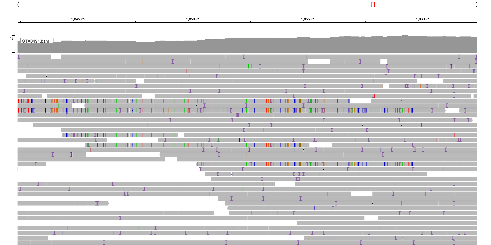
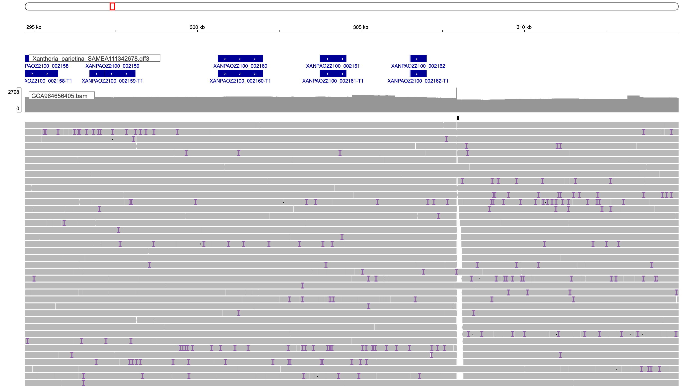
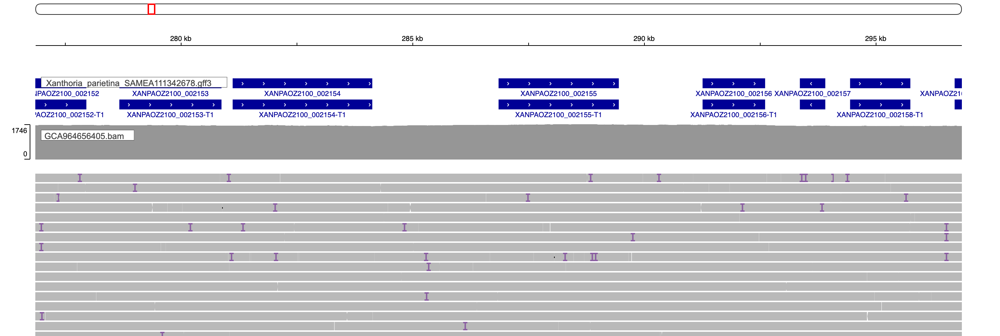
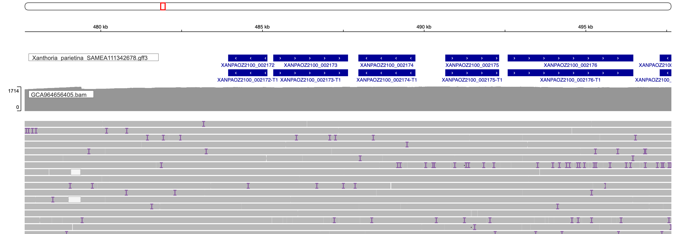
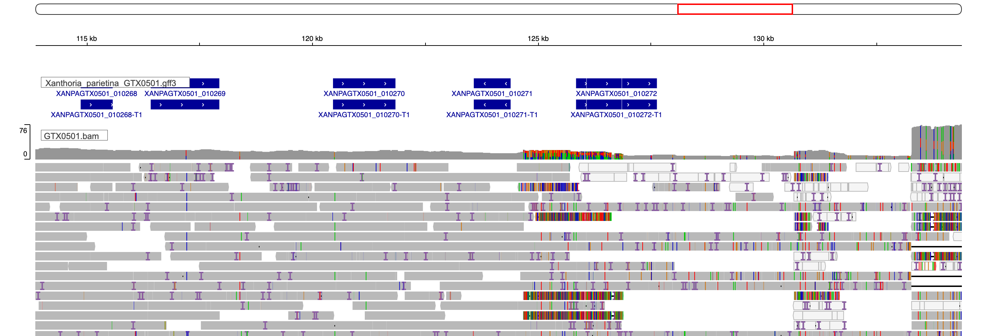
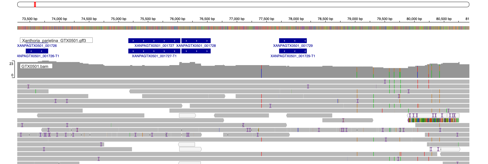

```{r setup, include=FALSE}
library(knitr)
library(tidyverse)
library(kableExtra)
knitr::opts_chunk$set(echo = TRUE)
```

**Summary:** we only see our elements navis0002-hap0001 present in one region only. So far, it is either present in region0001 (as is the case for X. parietina genomes GCA964656405 and SAMEA115359166), or missing (in X. parietina GTX0501 and X. calcicola GTX0491). But maybe in the remaning genomes it got split into multiple contigs?

## 1. Found the element in GTX0501 in the same region, but split between two contigs
* First, searched the protein fasta
```{r,eval=F}
mkdir  analysis_and_temp_files/04_search_genomes/search_genomes

source package d6092385-3a81-49d9-b044-8ffb85d0c446 
blastp -query analysis_and_temp_files/04_search_genomes/blast_genes/genes_from_OZ2100_SAMEA115359166.fa -subject analysis_and_temp_files/03_starfish/genomes/Xanthoria_calcicola_GTX0491.proteins.fa -outfmt 6 -evalue 1e-40 -out analysis_and_temp_files/04_search_genomes/search_genomes/genes_from_OZ2100_SAMEA115359166_in_GTX0491_proteins.out

blastp -query analysis_and_temp_files/04_search_genomes/blast_genes/genes_from_OZ2100_SAMEA115359166.fa -subject analysis_and_temp_files/03_starfish/genomes/Xanthoria_parietina_GTX0501.proteins.fa -outfmt 6 -evalue 1e-40 -out analysis_and_temp_files/04_search_genomes/search_genomes/genes_from_OZ2100_SAMEA115359166_in_GTX0501_proteins.out
```

* In GTX0501, I was able to find all of the genes. The hits are to three contigs: 
  * Xp_GTX0501_3.contains all the relevant genes as XANPAGTX0501_001716-T1 to XANPAGTX0501_001728-T1; all >80% identical; at the beginning of the a contig.
  * Xp_GTX0501_31. only the captain as  XANPAGTX0501_010272-T1; 100% identical; it's on the end of a contig
  * Xp_GTX0501_37. only Patatin-like phospholipase domain and an unannotated proteins; 30-65% identical.
* Appears most likely that the element is split between contigs Xp_GTX0501_31 (very beginning) and Xp_GTX0501_3 (most of the element)
* Looked at the flanking genes:
  * upstream of XANPAGTX0501_010272-T1 on the contig Xp_GTX0501_31, got (moving reverse XANPAGTX0501_010271-T1 to XANPAGTX0501_010265-T1): 3MU0N,20H38,20XMQ,1F2SJ,20WFN,3S84T. This matches precisely the elements in the other genomes
  * downstream of XANPAGTX0501_001728-T1 on Xp_GTX0501_3, got (moving XANPAGTX0501_001729-T1 to XANPAGTX0501_001739-T1): 3MRMU,3S6YP,20YEW,209XE,3FMSM,212ZF,21MYE,201C2,1ZX93. This is similar to the other genomes, and differs only by the presence of two additional genes (which might be due to a different procedure for the genome annotation)
* Aligned GTX0501 and GCA964656405 genomes
```{r,eval=F}
source package 222eac79-310f-4d4b-8e1c-0cece4150333
minimap2 -x asm20 -t 10 analysis_and_temp_files/03_starfish/genomes/Xanthoria_parietina_GTX0501.scaffolds.fa analysis_and_temp_files/03_starfish/genomes/Xanthoria_parietina_SAMEA111342678.scaffolds.fa > analysis_and_temp_files/04_search_genomes/search_genomes/GTX0501_GCA964656405.paf
```

* Looking at the contig OZ2100_30, that is hosting the element in the GCA964656405 genome, we can confirm that it is split between multiple contigs, including Xp_GTX0501_3 and Xp_GTX0501_31
```{r,fig.width=8,fig.height=2,message=F,warning=F}
library(pafr)
paf<-pafr::read_paf("../analysis_and_temp_files/04_search_genomes/search_genomes/GTX0501_GCA964656405.paf")
paf_filtered <-filter_secondary_alignments(paf)
paf_filtered <-subset(paf_filtered, alen > 2000 & mapq > 40) %>% dplyr::filter(qname=="OZ2100_30")

plot_coverage(paf_filtered, fill='tname',target=F) +
   scale_fill_brewer(palette="Set1")
```

* Conversely, Xp_GTX0501_3 and Xp_GTX0501_31 are entirely covered by OZ2100_30
```{r,fig.width=8,fig.height=3,message=F,warning=F}
paf_filtered <-filter_secondary_alignments(paf)
paf_filtered <-subset(paf_filtered, alen > 2000 & mapq > 40) %>% dplyr::filter(qname=="OZ2100_30")

plot_coverage(paf_filtered, fill='qname') +
   scale_fill_brewer(palette="Set1")
```

* All in all, can reasonably conclude that in the GTX0501 genome our element is present in the same region, and was not detected by starfish because it was split between two contigs

## 2. GTX0491: potentially present but RIPed
* Searched the protein fasta for the cargo genes and the captain:
  * Only one match!
  * A very good match to one of the genes in the cargo, specifically to the metyltransferase (XANPAOZ2100_002166 or XANPARI20_008747). The match is to XANCAGTX0491_008091-T1, it has evalue of 5.69e-165 and 95.2% identical over 100% cover. It's located on contig XcGTX0491_11, which is not the same as the location of the empty site
```{r,eval=F}
blastp -query analysis_and_temp_files/04_search_genomes/blast_genes/genes_from_OZ2100_SAMEA115359166.fa -subject analysis_and_temp_files/03_starfish/genomes/Xanthoria_calcicola_GTX0491.proteins.fa -outfmt 6 -evalue 1e-40 -out analysis_and_temp_files/04_search_genomes/search_genomes/genes_from_OZ2100_SAMEA115359166_in_GTX0491_proteins.out
```

* What if the hits are absent because of imperfect genome annotation? Searched the nucleotide fasta:
  * Got match to the contig XcGTX0491_11 (948940-949741), which is the same contig as the one hosting XANCAGTX0491_008091-T1
```{r,eval=F}
tblastn -query analysis_and_temp_files/04_search_genomes/blast_genes/genes_from_OZ2100_SAMEA115359166.fa -subject analysis_and_temp_files/03_starfish/genomes/Xanthoria_calcicola_GTX0491.scaffolds.fa -outfmt 6 -evalue 1e-40 -out analysis_and_temp_files/04_search_genomes/search_genomes/genes_from_OZ2100_SAMEA115359166_in_GTX0491_assembly.out
```

* What if the contig that contains the element was erroneously removed from the genome assembly at the de-contamination step? Searched the metagenomic assembly, from which the GTX0491 genome was extracted:
  * Same result as above (except that the contig was called contig_8_pilon_pilon in this assembly)
```{r,eval=F}
tblastn -query analysis_and_temp_files/04_search_genomes/blast_genes/genes_from_OZ2100_SAMEA115359166.fa -subject data/your-data_fg23004_2023-03-03_135/FG23004_02_flye-medaka_2xpilon.fasta -outfmt 6 -evalue 1e-40 -out analysis_and_temp_files/04_search_genomes/search_genomes/genes_from_OZ2100_SAMEA115359166_in_GTX0491_metaassembly.out
```

* Finally, checked raw metagenomic reads:
```{r,eval=F}
source package d6c2932f-b01d-4039-8736-a2e15d4867e2 
seqtk seq -a data/your-data_fg23004_2023-03-03_135/FG23004_02_alldata_dorado_v0.2.1_duplex_sup_Q12.fastq > data/your-data_fg23004_2023-03-03_135/FG23004_02_alldata_dorado_v0.2.1_duplex_sup_Q12.rawreads.fasta

tblastn -query analysis_and_temp_files/04_search_genomes/blast_genes/genes_from_OZ2100_SAMEA115359166.fa -subject data/your-data_fg23004_2023-03-03_135/FG23004_02_alldata_dorado_v0.2.1_duplex_sup_Q12.rawreads.fasta -outfmt 6 -evalue 1e-40 -out analysis_and_temp_files/04_search_genomes/search_genomes/genes_from_OZ2100_SAMEA115359166_in_GTX0491_reads.out
```
* Got most hits to the methyltransferase, but a few to the NLR and the captain. 
```{r}
reads<-read.delim("../analysis_and_temp_files/04_search_genomes/search_genomes/genes_from_OZ2100_SAMEA115359166_in_GTX0491_reads.out",header=F)

reads$name[reads$V1 %in% c("XANPARI20_008749-T1", "XANPAOZ2100_002164-T1")] <- "d37" 
reads$name[reads$V1 %in% c("XANPAOZ2100_002165-T1", "XANPARI20_008748-T1")] <- "plp" 
reads$name[reads$V1 %in% c("XANPAOZ2100_002167-T1", "XANPARI20_008746-T1")] <- "nlr" 
reads$name[reads$V1 %in% c("XANPAOZ2100_002162-T1", "XANPARI20_008752-T1")] <- "captain" 
reads$name[reads$V1 %in% c("XANPAOZ2100_002166-T1", "XANPARI20_008747-T1")] <- "Methyltransferase"


reads %>% select(name,V2) %>% distinct() %>% group_by(name) %>% summarize(n=n())
```

* Saved the reads that mapped to the genes in a new fasta and align it to the genome GTX0491 and to the element OZ2100_s00001
```{r,eval=F}
reads$V2 %>% unique()
write.table(reads$V2 %>% unique(), "../analysis_and_temp_files/04_search_genomes/search_genomes/read_list_OZ2100_SAMEA115359166_in_GTX0491.txt",col.names = F, row.names = F, quote = F,sep="\t")

source package 1041444f-cd25-4107-a5c7-5e86cb1728fe
while read line; do less data/your-data_fg23004_2023-03-03_135/FG23004_02_alldata_dorado_v0.2.1_duplex_sup_Q12.rawreads.fasta | seqkit grep -p $line; done < analysis_and_temp_files/04_search_genomes/search_genomes/read_list_OZ2100_SAMEA115359166_in_GTX0491.txt >> analysis_and_temp_files/04_search_genomes/search_genomes/reads_OZ2100_SAMEA115359166_in_GTX0491.fasta

minimap2 -x asm20 -t 10 --secondary=no analysis_and_temp_files/03_starfish/genomes/Xanthoria_calcicola_GTX0491.scaffolds.fa  analysis_and_temp_files/04_search_genomes/search_genomes/reads_OZ2100_SAMEA115359166_in_GTX0491.fasta > analysis_and_temp_files/04_search_genomes/search_genomes/reads_OZ2100_SAMEA115359166_in_GTX0491_mapped_GTX0491.paf

minimap2 -x asm20 -t 10 --secondary=no analysis_and_temp_files/04_search_genomes/search_genomes/OZ2100_s00001.fna  analysis_and_temp_files/04_search_genomes/search_genomes/reads_OZ2100_SAMEA115359166_in_GTX0491.fasta > analysis_and_temp_files/04_search_genomes/search_genomes/reads_OZ2100_SAMEA115359166_in_GTX0491_mapped_OZ2100_s00001.paf
```

* Mapped to the GTX0491 genome, the reads with hits to methyltransferase are mapped to the same XcGTX0491_11 contig. The reads that have hits for the captain and the NLR, only have short matches. Combined with the low number of these reads compared to the reads that mapped to XcGTX0491_11, can conclude that these reads likely are not coming from the nuclear genome
```{r}
paf<-pafr::read_paf("../analysis_and_temp_files/04_search_genomes/search_genomes/reads_OZ2100_SAMEA115359166_in_GTX0491_mapped_GTX0491.paf")
paf_filtered <-filter_secondary_alignments(paf)
paf_filtered <-subset(paf_filtered, alen > 500 & mapq > 40)

paf_filtered<-reads %>% select(name,V2) %>% distinct() %>% 
  left_join(paf_filtered, by=c("V2"="qname") ) %>% select(name,tname,qlen,alen,V2) %>%
  arrange(desc(tname))
paf_filtered %>% kable(format = "html", col.names = c("gene_hit","contig","read_length",
                                             "aligned_length","read")) %>%
  kable_styling() %>%
  kableExtra::scroll_box(width = "100%", height = "200px")
```

* Mapped to the element OZ2100_s00001, got only very short hits, which can only cover the individual gene
```{r}
paf<-pafr::read_paf("../analysis_and_temp_files/04_search_genomes/search_genomes/reads_OZ2100_SAMEA115359166_in_GTX0491_mapped_OZ2100_s00001.paf")
paf_filtered <-filter_secondary_alignments(paf)
paf_filtered <-subset(paf_filtered, alen > 500 & mapq > 40)

paf_filtered<-reads %>% select(name,V2) %>% distinct() %>% 
  left_join(paf_filtered, by=c("V2"="qname") ) %>% select(name,tname,qlen,alen,V2) %>%
  arrange(desc(tname))
paf_filtered %>% kable(format = "html", col.names = c("gene_hit","contig","read_length",
                                             "aligned_length","read")) %>%
  kable_styling() %>%
  kableExtra::scroll_box(width = "100%", height = "200px")
```

* To double-check will look a the empty site in the contig XcGTX0491_4. Can I find the same flanking gernes as we find in the genomes that had the element?
```{r}
GTX0491_eggnog <- read.delim2("../analysis_and_temp_files/03_starfish/ann/GTX0491_eggnog.emapper.annotations",header=T,skip=4)
GTX0491_upstream_genes <-read.delim2("../analysis_and_temp_files/03_starfish/ann/Xanthoria_calcicola_GTX0491.annotations.txt",header=T) %>% 
  filter(Contig == "Xc_GTX0491_4",Start<=1852373) %>% tail %>% 
  left_join(GTX0491_eggnog,by=c("TranscriptID"="X.query")) %>%
  mutate(position = "upstream")%>%
  select(TranscriptID,position,eggNOG_OGs)

GTX0491_downstream_genes <-read.delim2("../analysis_and_temp_files/03_starfish/ann/Xanthoria_calcicola_GTX0491.annotations.txt",header=T) %>% 
  filter(Contig == "Xc_GTX0491_4",Start>=1852373) %>% head %>% 
  left_join(GTX0491_eggnog,by=c("TranscriptID"="X.query")) %>%
  mutate(position = "downstream")%>%
  select(TranscriptID,position,eggNOG_OGs)

rbind(GTX0491_upstream_genes,GTX0491_downstream_genes) %>% kable(format = "html", col.names = colnames(GTX0491_upstream_genes)) %>%
  kable_styling() %>%
  kableExtra::scroll_box(width = "100%", height = "200px")
```
  * Upstream (moving reverse FUN_004042-T1 to FUN_004038-T1): 3S6YP,3MRMU,209XE,3FMSM,212ZF. This matches the downstream flanking proteins from our elements
  * Downstream (moving FUN_004038-T1 to FUN_004049-T1): 3MU0N,20H38,3MVES,3MV0I,20WFN. This matches the upstream flanking proteins from our elements
  * Can confirm that the empty region is homologous 
* All in all, seems that our element is genuinely missing from the GTX0491 genome! Got one (very good) match to one of the cargo genes, but nothing else.

#### Could it be that the element got ripped in GTX0491?
* Looked at the region that contains the methyltransferase in Xc_GTX0491_11:948780-949793
* FUN_008091-T1 sits in a middle of a gene-less region. It has 62605 bp upstream and 60298 bp downstream to its closest neighbor
* RIPper identified the flanking regions as LRARs
  * Upstream: 941500-948000. GC% 31.42
  * Downstream: partially overlaps with the gene: 949500-994500. GC% 25.36
  * These two regions are part of a larger LRAR region (712,500-1,142,000) which is interrupted by genes
* Aligned GTX0491 and GCA964656405 genomes
```{r,eval=F}
source package 222eac79-310f-4d4b-8e1c-0cece4150333
minimap2 -x asm20 -t 10 analysis_and_temp_files/03_starfish/genomes/Xanthoria_calcicola_GTX0491.scaffolds.fa analysis_and_temp_files/03_starfish/genomes/Xanthoria_parietina_SAMEA111342678.scaffolds.fa > analysis_and_temp_files/04_search_genomes/search_genomes/GTX0491_GCA964656405.paf
```
* Visualize mapping of Xc_GTX0491_11. Almost all maps to OZ2100_39, with a gap 
```{r,fig.width=8,fig.height=2,message=F,warning=F}
library(pafr)
paf<-pafr::read_paf("../analysis_and_temp_files/04_search_genomes/search_genomes/GTX0491_GCA964656405.paf")
paf_filtered <-filter_secondary_alignments(paf)
paf_filtered <-subset(paf_filtered, alen > 2000 & mapq > 40) %>% dplyr::filter(tname=="XcGTX0491_11")

plot_coverage(paf_filtered, fill='qname') +
   scale_fill_brewer(palette="Set1")
```

* Most contigs map to each other, but there is a gap in the middle in both. In GTX0491 the bigger gap is 219 Kbp (793698-1013124), which includes FUN_008091-T1. There is a short 4 Kbp alignment in the middle of the gap for GTX0491 (844981-848958). This alignment corresponds to FUN_008089-T1 (844977-848932). The smaller gap (848958-1013124) is 164 Kbp; the FUN_008091-T1 sits in the middle
```{r}
plot_synteny(paf_filtered, q_chrom="OZ2100_39", t_chrom="XcGTX0491_11", centre=TRUE)
```

* In this alignment, got no mapping between this contig XcGTX0491_11, and the contig OZ2100_30, which hosts the element in X.p. Even in the unfiltered paf, the region containing methyltransferase isn't mapped to anything. Maybe this is because this region is already 'mapped' - erroneously to the empty site in XcGTX0491_4?
* Tried aligning with MAFFT the gap to the starship to see if any areas other than the metyltransferase will align
  * FUN_008091-T1 is on - strand
  * XANPAOZ2100_002166 is on + strand
  * XANPARI20_008747 is on - strand (but it's already reverse-complemented in the starfish-produced fasta)
```{r,eval=F}
source package c92263ec-95e5-43eb-a527-8f1496d56f1a 
samtools faidx analysis_and_temp_files/03_starfish/genomes/Xanthoria_calcicola_GTX0491.scaffolds.fa XcGTX0491_11:793698-1013124 -i > analysis_and_temp_files/04_search_genomes/XcGTX0491_11_gap_align.fa

samtools faidx analysis_and_temp_files/03_starfish/elementFinder/manyxanthoria_round.elements.fna "OZ2100_s00001|+" >> analysis_and_temp_files/04_search_genomes/XcGTX0491_11_gap_align.fa

samtools faidx analysis_and_temp_files/03_starfish/elementFinder/manyxanthoria_round.elements.fna "scaffold_s00008|-" >> analysis_and_temp_files/04_search_genomes/XcGTX0491_11_gap_align.fa

source package  05bafab5-380c-4fe6-b5b6-3df70db09722
mafft analysis_and_temp_files/04_search_genomes/XcGTX0491_11_gap_align.fa > analysis_and_temp_files/04_search_genomes/XcGTX0491_11_gap_align_mafft.fa
```
* Find stretches of similarity in few different patches, not just methyltransferase

#### Align GTX0491 and OZ2100 to visualize the gaps in alignment better
* Tried nucmer
```{r,eval=F}
source package eab121cb-2eb8-49c1-a9a5-a33754ea9fea 

nucmer  --prefix=GTX0491_OZ2100_mummer --mum  analysis_and_temp_files/03_starfish/genomes/Xanthoria_calcicola_GTX0491.scaffolds.fa analysis_and_temp_files/03_starfish/genomes/Xanthoria_parietina_SAMEA111342678.scaffolds.fa 

mv GTX0491_OZ2100_mummer.delta  analysis_and_temp_files/04_search_genomes/
  
show-coords -r -c -l analysis_and_temp_files/04_search_genomes/GTX0491_OZ2100_mummer.delta > analysis_and_temp_files/04_search_genomes/GTX0491_OZ2100_mummer.coords
```

* Nucmer confirms a gap in alignment in the middle of the contig
  * had to define the function to transform nucmer output into PAF. Used the nucmer2PAF function from SVbyEye as a basis, but had to modify it
```{r}
library(SVbyEye)
nucmer2PAF2 <- function (nucmer.coords = NULL) 
{
  if (!is.null(nucmer.coords)) {
    if (file.exists(nucmer.coords)) {
      coords <- utils::read.table(nucmer.coords, skip = 5, 
        stringsAsFactors = FALSE)
      coords.tb <- tibble::tibble(qname = coords$V18, 
        qlen = coords$V12, qstart = coords$V1, 
        qend = coords$V2, strand = ifelse(coords$V4 < 
          coords$V5, "+", "-"), tname = coords$V19, 
        tlen = coords$V13, tstart = pmin(coords$V4, 
          coords$V5), tend = pmax(coords$V4, coords$V5), 
        nmatch = coords$V10, alen = coords$V8, mapq = NA)
    }
    else {
      coords.tb <- NULL
    }
    return(coords.tb)
  }
}


npaf<- nucmer2PAF2(nucmer.coords = "../analysis_and_temp_files/04_search_genomes/GTX0491_OZ2100_mummer.coords")

plot_synteny(npaf %>% dplyr::filter(alen>2000,nmatch>90), t_chrom="OZ2100_39", q_chrom="XcGTX0491_11", centre=TRUE)
```

* But only shows very minor alignemnts to the Starship
```{r}
plot_synteny(npaf, t_chrom="OZ2100_30", q_chrom="XcGTX0491_11", centre=TRUE)


```

* The second line corresponds to methyltransferase, the first line isn't annotated as agene; the other free are not in the elemenet
```{r}
npaf %>% filter(tname=="OZ2100_30",qname=="XcGTX0491_11")%>% kable(format = "html", col.names = colnames(npaf)) %>%
  kable_styling() %>%
  kableExtra::scroll_box(width = "100%", height = "200px")

```

#### Try the same with SAMEA115359166
* Nucmer
```{r,eval=F}
nucmer  --prefix=GTX0491_SAMEA115359166_mummer --mum  analysis_and_temp_files/03_starfish/genomes/Xanthoria_calcicola_GTX0491.scaffolds.fa analysis_and_temp_files/03_starfish/genomes/Xanthoria_parietina_SAMEA115359166.scaffolds.fa 

mv GTX0491_SAMEA115359166_mummer.delta  analysis_and_temp_files/04_search_genomes/
  
show-coords -r -c -l analysis_and_temp_files/04_search_genomes/GTX0491_SAMEA115359166_mummer.delta > analysis_and_temp_files/04_search_genomes/GTX0491_SAMEA115359166_mummer.coords
```
* Same picture
```{r}
npaf<- nucmer2PAF2(nucmer.coords = "../analysis_and_temp_files/04_search_genomes/GTX0491_SAMEA115359166_mummer.coords")

plot_synteny(npaf %>% dplyr::filter(alen>2000,nmatch>90), t_chrom="scaffold_3", q_chrom="XcGTX0491_11", centre=F)
```

* Same picture
```{r}
npaf<- nucmer2PAF2(nucmer.coords = "../analysis_and_temp_files/04_search_genomes/GTX0491_SAMEA115359166_mummer.coords")

plot_synteny(npaf, t_chrom="scaffold_12", q_chrom="XcGTX0491_11", centre=TRUE)
```

* The second line is again methyltransferase. The first is the same as above, but now it's identifie as outside of the element (it's also short and low identity and therefore probably erroneous), the third is to a geneless region
```{r}
npaf %>% filter(tname=="scaffold_12",qname=="XcGTX0491_11")%>% kable(format = "html", col.names = colnames(npaf)) %>%
  kable_styling() %>%
  kableExtra::scroll_box(width = "100%", height = "200px")

```

* Not clear how indicative these matches are, given that the starshi region of SAMEA115359166 has matches to various contigs, not just XcGTX0491_11
```{r}
plot_coverage(npaf %>% dplyr::filter(tname=="scaffold_12",alen>1000,tstart>662355,tend<747238,nmatch>80), fill='qname',target=T) +
   scale_fill_brewer(palette="Set1")
```

## 3. Can we see our element jumping if we include other lichen genomes? 
#### Tried using nucleotedi alignments, which didn't really work
* Tried to leverage short-read genomes. Identified the genes that match the captain and check the upstream region. Is it always the same as in the genomes we already examined?
* Searched the captain against NCBI, and picked all hits with >60% identity, which all happened to be from the same order Teloschistales
* For each captain, downloaded the entire contig on which it resided
* Mapped all of them onto the GCA964656405 genome
```{r,eval=F}
cat analysis_and_temp_files/04_search_genomes/search_genomes/shortread_genomes/*.fasta > analysis_and_temp_files/04_search_genomes/search_genomes/shortread_genomes/hits.fasta

source package 222eac79-310f-4d4b-8e1c-0cece4150333
minimap2 -x asm20 -t 10  analysis_and_temp_files/03_starfish/genomes/Xanthoria_parietina_SAMEA111342678.scaffolds.fa analysis_and_temp_files/04_search_genomes/search_genomes/shortread_genomes/hits.fasta > analysis_and_temp_files/04_search_genomes/search_genomes/shortread_genomes_GCA964656405.paf
```
* There was surprisingly little alignement. The best case is below. Only a tiny portion at the end of the contig of the selected contig from Seirophora lacunosa aligns to the element on OZ2100_30 (304827-307516). All other hits are to OZ2100_31, but overall quality doesn;t really allow to draw conclusions form here
```{r,fig.width=8,fig.height=2,message=F,warning=F}
paf<-pafr::read_paf("../analysis_and_temp_files/04_search_genomes/search_genomes/shortread_genomes_GCA964656405.paf")
paf_filtered <-subset(paf, alen > 2000 & mapq > 40)

paf_filtered1 <- paf_filtered%>% dplyr::filter(qname=="JALAHX010000004.1")

plot_coverage(paf_filtered1, fill='tname',target = F) +
   scale_fill_brewer(palette="Set1")

```

* Not sure I'm doing this correctly (is this the right way to align?), but will leave it here for now.

#### Let's use Orthofinder run to identify synteny blocks
* The Orthofinder run described in `05_HGT.html`
* X. mediterranea has all the relevant genes 
  * most flanking genes neatly fall in JALAIA010000025.1, where the ortholog of XANPAOZ2100_002161-T1 (immediately before the Starhip) KAI4106692.1 runs 54454-55077, and ortholog of XANPAOZ2100_002168-T1 (immediately after) KAI4106691.1 runs 51009-53974, leaving only 480 bp in between them
  * Starship genes are scattered. 
  * Most closest to the captain is KAI4090404.1 (82% cover and	86.59% identical to XANPAOZ2100_002162-T1) sits in a contig JALAIA010000201.1. This contig has only 3 gene models, and one of them (KAI4090405.1) is in the same orthogroup as KAI4090404.1 and the captain, but it's very short and has no similairty to XANPAOZ2100_002162-T1 (maybe a gene fragment that got detached from the cpatain?). The third model, KAI4090403.1, had no ortholog in XANPAOZ2100
  * XANPAOZ2100_002163-T1 has no ortholog in X. mediterranea
  * XANPAOZ2100_002164-T1 and XANPAOZ2100_002165-T1 (PLP and DUF) sit in JALAIA010000216.1, which has 13 gene models.The orthologs (KAI4089637.1 and KAI4089636.1 respectively) sit in the middle of the contig, but none of the other gene models have orthologs in XANPAOZ2100. These proteins are not super similar to ours: 26% coverage / 44.19% identity for XANPAOZ2100_002164-T1, and 79% coverage / 50.00% identity for XANPAOZ2100_002165-T1
  * XANPAOZ2100_002166-T1 and XANPAOZ2100_002167-T1 (methytransferase and NLR) sit in JALAIA010000152.1, which has only 6 gene models. The orthologs (KAI4093293.1 and KAI4093292.1 respectively) sit in an end of the contig. These proteins are highly similar: 100% coverage /	95.71% identity for methyltransferase and 100% coverage / 95.82% identity for NLR
  * Remaining gene models again don't have orthologs in XANPAOZ2100
  * Overall, have not-super-strong evidence that the starship is absent in the region that contains it in X. parietina, and present elsewhere, but cannot say where exactly
  
```{r}
ortho <-read.delim2("../analysis_and_temp_files/05_HGT/Orthofinder/Results_May21/Orthogroups.tsv") 

ortho1 <- ortho %>% 
filter(grepl("XANPAOZ2100_00216",Xanthoria_parietina_SAMEA111342678.proteins) | 
       grepl("XANPAOZ2100_00217",Xanthoria_parietina_SAMEA111342678.proteins) |
         grepl("XANPAOZ2100_00215",Xanthoria_parietina_SAMEA111342678.proteins)) 

#define function for summarizing
find_synt <- function(gff,col_name){
gff$protein <- gsub("ID=cds-(.*);Parent=.*$", "\\1",gff$V9)
gff2 <- gff %>% filter(!grepl("ID",protein) & !grepl("#",V1)) %>% 
  group_by(protein,V1) %>% summarize(from=min(V4),to=max(V5))

ortho_gff<-ortho1 %>% select(Orthogroup,Xanthoria_parietina_SAMEA111342678.proteins, col_name) %>%
  dplyr::rename("protein"=col_name) %>%
  separate_longer_delim(protein,", ") %>%
  left_join(gff2) %>% arrange(Xanthoria_parietina_SAMEA111342678.proteins)
return(ortho_gff)}

xmed <- read.delim2("../analysis_and_temp_files/04_search_genomes/search_genomes/shortread_gff/JALAIA01.gff",skip=7,header=F)
ortho_xmed <- find_synt(xmed,"JALAIA01_protein")

ortho_xmed %>%  kable(format = "html", col.names = colnames(ortho_xmed)) %>%
  kable_styling() %>%
  kableExtra::scroll_box(width = "100%", height = "200px")

```

* X.aureola (JALAII01). Seems very fragmented
  * Immediately flanking genes (orthologues to XANPAOZ2100_002158-61 and XANPAOZ2100_002168-69) are together in contig JALAII010000567.1, which only has these 5 gene models. They are seprated by only 275 bp between the end of XANPAOZ2100_002161 and beginning of XANPAOZ2100_002168
  * Has methylstrasferase (KAI4207110.1; 100% coverage, 94.51% identity) on JALAII010004863.1, which is small and only contins this protein
  * NLR is missing
  * Has four genes from the Captain OG, all are low-quality matches:
    * KAI4232632.1: no significant similarity found
    * KAI4231758.1: 17%	coverage,	27.69% identity
    * KAI4224567.1: 19%	coverage,	30.51% identity
    * KAI4239095.1: 15%	coverage,	24.59% identity
  * Even poorer match to our PLP: KAI4233293.1 has 12%	coverage,	28.72%  identity
  * Overall, evidence that the starship is absent in the region that contains it in X. parietina, and weak evidence that it's present elsewhere, but cannot say where exactly
```{r}
xau <- read.delim2("../analysis_and_temp_files/04_search_genomes/search_genomes/shortread_gff/Xau.gff",skip=7,header=F)
ortho_xau<- find_synt(xau,"JALAII01_protein")

ortho_xau %>%  filter(Xanthoria_parietina_SAMEA111342678.proteins %in% c("XANPAOZ2100_002166-T1","XANPAOZ2100_002167-T1")) %>%
  kable(format = "html", col.names = colnames(ortho_xau)) %>%
  kable_styling() %>%
  kableExtra::scroll_box(width = "100%", height = "200px")

```

* Exophiala (JAXLPM01). Overall the genomes are too far divergent, can find any real synteny
  * **Except,** the orthologs of methyltransferase and NLR are together and are separated by only 2836 bp
  * These genes are quite similar to ours: 92% cover / 77.52% identity for methyltransferase and 100% cover / 68.11% identity for NLR
```{r}
ex <- read.delim2("../analysis_and_temp_files/04_search_genomes/search_genomes/shortread_gff/JAXLPM01.gff",skip=7,header=F)
ortho_ex<- find_synt(ex,"JAXLPM01")

ortho_ex %>%  filter(Xanthoria_parietina_SAMEA111342678.proteins %in% c("XANPAOZ2100_002166-T1","XANPAOZ2100_002167-T1")) %>%
  kable(format = "html", col.names = colnames(ortho_ex)) %>%
  kable_styling() %>%
  kableExtra::scroll_box(width = "100%", height = "200px")

```

* Chaenotheca: too little similarity. There is some synteny in the flanking regions, but not enough to say anything
```{r}
chaeno <- read.delim2("../analysis_and_temp_files/04_search_genomes/search_genomes/shortread_gff/Chaeno.gff",skip=7,header=F)
ortho_chaeno<- find_synt(chaeno,"JAPETQ01")

ortho_chaeno %>%  filter(Xanthoria_parietina_SAMEA111342678.proteins %in% c("XANPAOZ2100_002166-T1","XANPAOZ2100_002167-T1")) %>%
  kable(format = "html", col.names = colnames(ortho_chaeno)) %>%
  kable_styling() %>%
  kableExtra::scroll_box(width = "100%", height = "200px")

```

* Teloshistes has synteny in the flanking regins, but potential accessory genes and  captains are not together. The captain that most similar to our captain (KAI4086156.1, 43%	coverage,	43.83% identity) is in contig JALAHW010000743.1, which is small and contins only this gene. No orthologs of methyltransferase and NLR
```{r}
telo <- read.delim2("../analysis_and_temp_files/04_search_genomes/search_genomes/shortread_gff/Telo.gff",skip=7,header=F)
ortho_telo<- find_synt(telo,"JALAHW01_protein")

ortho_telo %>%  filter(Xanthoria_parietina_SAMEA111342678.proteins %in% c("XANPAOZ2100_002166-T1","XANPAOZ2100_002167-T1")) %>%
  kable(format = "html", col.names = colnames(ortho_telo)) %>%
  kable_styling() %>%
  kableExtra::scroll_box(width = "100%", height = "200px")

```

#### Visualize empty sites in short-read Xanthoria genomes
* Prepare files
```{r}
#X.aurelola
xau_empty <- xau %>% filter(V1=="JALAII010000567.1")
xau_empty$V1 <- "Xanthoria aureola, JALAII010000567.1: 1-15265 (entire contig)"

#X.mediterranea
xmed_empty <-  xmed %>% filter(V1=="JALAIA010000025.1",V4>45000,V5<75000)
xmed_empty$V1 <- "Xanthoria mediterranea, JALAIA010000025.1: 45000-75000 (out of 261636 bp)"

#X.calcicola
xcac <- read.delim2("../analysis_and_temp_files/03_starfish/genomes/Xanthoria_calcicola_GTX0491.gff3",skip=1,header=F)
xcac_empty <-  xcac %>% filter(V1=="XcGTX0491_4",V4>1840000,V5<1875000)
xcac_empty$V1 <- "Xanthoria calcicola, XcGTX0491_4: 1840000-1875000 (out of 2393242 bp)"

#X.parietina
xp <- read.delim2("../analysis_and_temp_files/03_starfish/genomes/Xanthoria_parietina_SAMEA111342678.gff3",skip=1,header=F)
xp_site <- xp %>% filter(V1=="OZ2100_30",V4>285000,V5<425000)
xp_site$V1 <- "Xanthoria parietina, OZ210030: 285000-425000 (out of 2273945 bp)"

 
#combine and save as a single gff
empty <- rbind(xp_site,xcac_empty,xmed_empty,xau_empty)
write.table(empty,"../analysis_and_temp_files/04_search_genomes/search_genomes/empty.gff",quote=F,col.names=F,row.names=F,sep="\t")
 
```
* Visualize
```{r,message=FALSE,warning=FALSE}
library(gggenomes)
genes <- read_feats("../analysis_and_temp_files/04_search_genomes/search_genomes/empty.gff") %>% filter(type=="CDS")
genes$feat_id <- genes$name
genes$feat_id <- str_replace(genes$feat_id,".cds","")

#make a table with Orthgroup annotations
ortho_assignments <- ortho1 %>% pivot_longer(-Orthogroup,names_to = "genome",values_to="feat_id") %>% separate_longer_delim(feat_id,", ") %>%
  dplyr::rename(cluster_id=Orthogroup) %>% filter(feat_id!="")

#make a different column that would only include two flanking genes on each side
ortho_assignments<- ortho_assignments %>% 
  mutate(cluster_id2 = ifelse(cluster_id %in% c("OG0005234","OG0000030","OG0002403","OG0003533"),cluster_id,NA))

#make a df for the starship
feat_star <- data.frame("seq_id" = "Xanthoria parietina, OZ210030: 285000-425000 (out of 2273945 bp)", 
    start = 304726,end=	406787,feat_id="OZ2100_s00003"	                    )

seqs <- tibble::tibble(seq_id = genes$seq_id %>% unique(),
  start = as.numeric(gsub("^.*\\s([0-9]+)\\-.*$","\\1",genes$seq_id %>% unique())),
  end = as.numeric(gsub("^.*\\-([0-9]+)\\s\\(.*$","\\1",genes$seq_id %>% unique())))
seqs$length<-seqs$end - seqs$start +1


p0<-gggenomes(seqs = seqs, genes = genes,feats =feat_star ) %>% add_clusters(ortho_assignments) %>%
  flip(2:3) +
  geom_seq()+ 
  geom_feat(alpha=.4, linewidth=3, position="identity", color = "#D95F02")+
  geom_gene(aes(fill=cluster_id2,color=cluster_id2))+
  geom_link() +geom_seq_label(size=4)+
  scale_color_discrete(labels=c("OG0005234","OG0000030","OG0002403","OG0003533","Other"))+
  scale_fill_discrete(labels=c("OG0005234","OG0000030","OG0002403","OG0003533","Other"))+
  labs(fill="Flanking Orthogroups",color="Flanking Orthogroups")+
  theme(legend.position = "bottom",legend.text = element_text(size=7),
      legend.titile = element_text(size=8) )
  
p0 |> shift(2:4, by = c(50000,50000,60000))

ggsave("../results/shortread_emptysite.pdf",width=8,height = 6)
```

#### Visualize Starship gene orthologs in X. mediterranea and X. aureola
* Only showing matches with >40 pid. Will add annotations detailing the quality of the match in illustrator
```{r}
#X.aurelola
xau_star <- xau %>% filter(V1=="JALAII010004863.1")
xau_star$V1 <- "Xanthoria aureola, JALAII010004863.1: 1-1223 (entire contig)"

#X.mediterranea
xmed_star <-  xmed %>% filter(V1=="JALAIA010000201.1" | V1=="JALAIA010000152.1" | V1=="JALAIA010000216.1")
xmed_star$V1[xmed_star$V1=="JALAIA010000201.1"] <- "Xanthoria mediterranea, JALAIA010000201.1: 1-47995 (entire contig)"
xmed_star$V1[xmed_star$V1=="JALAIA010000152.1"] <- "Xanthoria mediterranea, JALAIA010000152.1: 1-68632 (entire contig)"
xmed_star$V1[xmed_star$V1=="JALAIA010000216.1"] <- "Xanthoria mediterranea, JALAIA010000216.1: 1-42555 (entire contig)"


#combine and save as a single gff
star <- rbind(xp_site,xmed_star,xau_star)
write.table(star,"../analysis_and_temp_files/04_search_genomes/search_genomes/star.gff",quote=F,col.names=F,row.names=F,sep="\t")
 
```
* Visualize
```{r,message=FALSE,warning=FALSE}
genes <- read_feats("../analysis_and_temp_files/04_search_genomes/search_genomes/star.gff") %>% filter(type=="CDS")
genes$feat_id <- genes$name
genes$feat_id <- str_replace(genes$feat_id,".cds","")

#make a new table with Orthgroup-derived annotations
ortho_assignments2 <- ortho %>% select(Orthogroup,Xanthoria_parietina_SAMEA111342678.proteins,JALAIA01_protein,JALAII01_protein) %>% 
  pivot_longer(-Orthogroup,names_to="genome",values_to = "feat_id") %>%
  separate_longer_delim(feat_id,", ") %>%
  mutate(cluster_id = case_when(
    Orthogroup=="OG0000084" ~ "OG0000084: captain",
    Orthogroup=="OG0006598" ~ "OG0006598: Methyltransferase",
    Orthogroup=="OG0007437" ~ "OG0007437: NLR",
    Orthogroup=="OG0000444" ~ "OG0000444: DUF3723",
    Orthogroup=="OG0000266" ~ "OG0000266: PLP",
    !(Orthogroup %in% c("OG0000084","OG0006598","OG0007437","OG0000444","OG0000266")) &
    Orthogroup %in%  ortho$Orthogroup[ortho$Xanthoria_parietina_SAMEA111342678.proteins!=""]~
        "other OG present in X. parietina CAZZRQ01",
  !(Orthogroup %in%  ortho$Orthogroup[ortho$Xanthoria_parietina_SAMEA111342678.proteins!=""])~
  "OG absent from X. parietina CAZZRQ01"))


seqs <- tibble::tibble(seq_id = genes$seq_id %>% unique(),
  start = as.numeric(gsub("^.*\\s([0-9]+)\\-.*$","\\1",genes$seq_id %>% unique())),
  end = as.numeric(gsub("^.*\\-([0-9]+)\\s\\(.*$","\\1",genes$seq_id %>% unique())))
seqs$length<-seqs$end - seqs$start +1


gggenomes(seqs = seqs, genes = genes,feats =feat_star ) %>% 
  add_clusters(ortho_assignments2) +
 # flip(2:3) +
  geom_seq()+ 
  geom_feat(alpha=.4, linewidth=3, position="identity", color = "#D95F02")+
  geom_gene(aes(color=cluster_id,fill=cluster_id))+
  #geom_link() +
  geom_seq_label(size=4)+
  scale_fill_manual(values=c("OG0006598: Methyltransferase"="#F8766D",
   "OG0007437: NLR"="#00a9ff","OG0000532: flanking gene"="#a2fcbd",
   "other OG present in X. parietina CAZZRQ01"="#5c5c5c",
   "OG absent from X. parietina CAZZRQ01"="#dbdbdb",
   "OG0000084: captain" = "#66A61E",
   "OG0000444: DUF3723" = "#A6761D",
   "OG0000266: PLP" = "#E6AB02"))+
  scale_color_manual(values=c("OG0006598: Methyltransferase"="#F8766D",
   "OG0007437: NLR"="#00a9ff","OG0000532: flanking gene"="#a2fcbd",
   "other OG present in X. parietina CAZZRQ01"="#5c5c5c",
   "OG absent from X. parietina CAZZRQ01"="#dbdbdb",
   "OG0000084: captain" = "#66A61E",
   "OG0000444: DUF3723" = "#A6761D",
   "OG0000266: PLP" = "#E6AB02"))+
  theme(legend.text = element_text(size=7),
      legend.titile = element_text(size=8) )+
  labs(fill="",color="")
  

ggsave("../results/shortread_starship.pdf",width=8,height = 6)

```
#### Which other genomes have methyltransferase and NLR together?
* In total, got 21 genomes (including ours) have at least on gene assigned to each orthogroup. 
```{r}
library(fuzzyjoin)
ortho_decr <-read.delim2("../analysis_and_temp_files/05_HGT/orthofinder_list_genomes.csv",sep=",")

ortho_filt <-ortho %>% pivot_longer(-Orthogroup,names_to = "genome",values_to="gene") %>%
  pivot_wider(names_from = Orthogroup,values_from = gene, values_fill = "") %>%
  filter(OG0006598!="",OG0007437!="") %>% select(genome,OG0006598,OG0007437) %>% fuzzy_join(ortho_decr, by = c("genome"="ID"), 
                          match_fun = list( stringr::str_detect),
                          mode="left") 
  
ortho_filt %>%  
  kable(format = "html", col.names = colnames(ortho_filt)) %>%
  kable_styling() %>%
  kableExtra::scroll_box(width = "100%", height = "200px")
```

* This includes:
  * Three ours X.parietina, for which we already established that the two genes are next two each other
  * One Chaetothyriales MAG from Tagirdzhanova et al. Curr. Biol. There, based on the locus tags we can see that the gene models aren't together
  * 14 NCBI genomes (including X. mediterranea), for which the position can be guessed also based on the locus tag. In 9 out of these 14, the genes are next to each other!
```{r}
ortho_filt2<-ortho_filt %>%
  separate_longer_delim(OG0006598,", ") %>%
  separate_longer_delim(OG0007437,", ") %>%
  mutate(OG0006598_number = gsub("[a-zA-Z]+([0-9]+)\\.1","\\1",OG0006598)) %>%
   mutate(OG0007437_number = gsub("[a-zA-Z]+([0-9]+)\\.1","\\1",OG0007437)) %>%
  filter(!grepl("[a-zA-Z]",OG0007437_number),!grepl("[a-zA-Z]",OG0006598_number)) %>%
  mutate(position_diff = abs(as.numeric(OG0006598_number) - as.numeric(OG0007437_number))) %>%
  filter(position_diff<3) %>% select(-c(position_diff,OG0006598_number,OG0007437_number))

ortho_filt2 %>%  
  kable(format = "html", col.names = colnames(ortho_filt2)) %>%
  kable_styling() %>%
  kableExtra::scroll_box(width = "100%", height = "200px")
```

* For the remaining 3 genomes from JGI, had to check manually. None of them had the genes on the same contig:
  * Fonsecaea multimorphosa: scaffold_16:430513-431383 and scaffold_45:36398-40273
  * Endocarpon pusillum: scaffold_637:10305-11113 and scaffold_228:392338-396472
  * Fusarium graminearum: Supercontig_3.9:451994-452744 and Supercontig_3.7:1837974-1840165

* Downloaded gff files for the relevant genomes, named them with names matching the ID, and saved in the folder `../analysis_and_temp_files/04_search_genomes/search_genomes/shortread_gff`
  * Most these genomes had any of the other Startship of flanking genes on the same contig the methytransferase-NLR duo
  * Apiospora arundinis (JAPCWZ01) has ortholog to XANPAOZ2100_002165-T1 on the same contig, but it's 1.06 Mbp away
  * The only real exception is Thyridium curvatum (SKBQ01). There, in the same contig as methyltransferase-NLR duo (SKBQ01000024.1), we find orthologs of XANPAOZ2100_002159-T1, XANPAOZ2100_002174-T1, XANPAOZ2100_002175-T1. They are intermixed with hits to other contigs, so it's not very clear-cut. This genome doesn't have an ortholog to our captain!

```{r}
Thyridium <- read.delim2("../analysis_and_temp_files/04_search_genomes/search_genomes/shortread_gff/SKBQ01.gff",skip=7,header=F)
ortho_Thyridium<- find_synt(Thyridium,"SKBQ01")

ortho_Thyridium %>%  filter(Xanthoria_parietina_SAMEA111342678.proteins %in% c("XANPAOZ2100_002166-T1","XANPAOZ2100_002167-T1")) %>%
  kable(format = "html", col.names = colnames(ortho_Thyridium)) %>%
  kable_styling() %>%
  kableExtra::scroll_box(width = "100%", height = "200px")

```

#### Visualize screening of short-read genomes for methyltransferase and NLR
* First, let's make short versions of gff files that only show the methyltransferase + NLR and 50 kbp flanking on each side
```{r,warning=F,message=F}
gff <- read.delim2("../analysis_and_temp_files/04_search_genomes/search_genomes/shortread_gff/Cenge3.gff",skip=7,header=F)

make_gff_subset <- function(file,two_genes,name,new_file){
  gff<-read.delim2(file,skip=7,header=F)
  gff$protein <- gsub("ID=cds-(.*);Parent=.*$", "\\1",gff$V9)
  #save only the contig of intrest
  gff<-gff %>% filter(V1 %in% gff$V1[gff$protein %in% two_genes])
  #this only contains our gene
  gff_only_our_gene<- gff[which( gff$protein %in% two_genes),]
  #include only lines within the defined region
  min_border <- min(gff_only_our_gene$V4)-50000
  max_border <- max(gff_only_our_gene$V5)+50000
  gff_filt <- gff %>% filter(V3=="region" | (V4>min_border & V5<max_border))
  
  #make a new name
  if(min_border<1){
    min_border2 <- 1
  }else{min_border2 <- min_border}
  if(max_border>gff_filt$V5[gff$V3=="region"]){
    max_border2 <- paste0(gff_filt$V5[gff$V3=="region"]," (end of contig)")
  }else{max_border2 <-paste0(max_border, " (out of total ",gff_filt$V5[gff$V3=="region"], " bp)")}
  
  name_new<-paste0(name,", ",gff$V1[gff$protein %in% two_genes][1],": ",min_border2,"-",max_border2)
  gff_filt$V1<-name_new
  
  cat("##sequence-region\n",file=new_file)
  write.table(gff_filt,new_file,append=T,quote=F,col.names=F,row.names=F,sep="\t")
}

#remove the word Ascomycota from the description
ortho_filt2$Taxonomy<-str_replace(ortho_filt2$Taxonomy,"Ascomycota; ","")

#apply the function
for(n in 1:9){
  make_gff_subset(
  paste0("../analysis_and_temp_files/04_search_genomes/search_genomes/shortread_gff/",ortho_filt2[n,4],".gff"),
  ortho_filt2[n,2:3],
  paste0(ortho_filt2[n,5]," (", ortho_filt2[n,7],")"),  
  paste0("../analysis_and_temp_files/04_search_genomes/search_genomes/shortread_gff/fragment/",ortho_filt2[n,4],".gff"))
}


```
* Visualize
```{r,warning=F,message=F}
library(gggenomes)

#read in base line gffs
genes <- read_feats(list.files("../analysis_and_temp_files/04_search_genomes/search_genomes/shortread_gff/fragment", "*.gff$", full.names=TRUE))%>% filter(!is.na(protein_id))
genes$feat_id <- genes$protein_id

#make a table with Orthgroup annotations
ortho_assignments <- ortho1 %>% pivot_longer(-Orthogroup,names_to = "genome",values_to="feat_id") %>% separate_longer_delim(feat_id,", ") %>%
  rename(cluster_id=Orthogroup) %>% filter(feat_id!="")
#rename selected OGs
ortho_assignments$cluster_id[ortho_assignments$cluster_id=="OG0006598"] <- "OG0006598: Methyltransferase"
ortho_assignments$cluster_id[ortho_assignments$cluster_id=="OG0007437"] <- "OG0007437: NLR"
ortho_assignments$cluster_id[ortho_assignments$cluster_id=="OG0000532"] <- "OG0000532: flanking gene"


seqs <- tibble::tibble(seq_id = genes$seq_id %>% unique(),
  start = as.numeric(gsub("^.*\\s([0-9]+)\\-.*$","\\1",genes$seq_id %>% unique())),
  end = as.numeric(gsub("^.*\\-([0-9]+)\\s\\(.*$","\\1",genes$seq_id %>% unique())))
seqs$length<-seqs$end - seqs$start +1

gggenomes(seqs = seqs, genes = genes %>% select(-genome)) %>% add_clusters(ortho_assignments) +
  geom_seq()+ geom_gene(aes(fill=cluster_id,color=cluster_id))+
  geom_seq_label(size=3.5)+
  scale_fill_manual(values=c("OG0006598: Methyltransferase"="#F8766D",
   "OG0007437: NLR"="#00a9ff","OG0000532: flanking gene"="#a2fcbd",
   "Other"="#878787"),labels=c("OG0000532: flanking gene","OG0006598: Methyltransferase",
   "OG0007437: NLR","Other"))+
  scale_color_manual(values=c("OG0006598: Methyltransferase"="#F8766D",
   "OG0007437: NLR"="#00a9ff","OG0000532: flanking gene"="#a2fcbd",
   "Other"="#878787"),labels=c("OG0000532: flanking gene","OG0006598: Methyltransferase",
   "OG0007437: NLR","Other"))+  
  labs(fill="Flanking Orthogroups",color="Flanking Orthogroups")+
  theme(legend.position = "bottom",legend.text = element_text(size=7),
      legend.titile = element_text(size=8) )

ggsave("../results/shortread_methyl_nlr.pdf",width=8,height = 6)
```


## 4. Checking read alignments
#### First, confirm that the empty site in GXT0491 is legit
* Aligned the reads from GTX0491 onto the genome
```{r,eval=F}
mkdir analysis_and_temp_files/04_search_genomes/read_alignments
source package c92263ec-95e5-43eb-a527-8f1496d56f1a 

minimap2 -t 10 -a analysis_and_temp_files/03_starfish/genomes/Xanthoria_calcicola_GTX0491.scaffolds.fa data/your-data_fg23004_2023-03-03_135/FG23004_02_alldata_dorado_v0.2.1_duplex_sup_Q12.fastq | samtools sort -@8 -o analysis_and_temp_files/04_search_genomes/read_alignments/GTX0491.bam

samtools index analysis_and_temp_files/04_search_genomes/read_alignments/GTX0491.bam
samtools faidx analysis_and_temp_files/03_starfish/genomes/Xanthoria_calcicola_GTX0491.scaffolds.fa 
```

* Looked in the region XcGTX0491_4:1842373-1862373 (10 Kbp up and downstream of the empty site). It got even coverage of about 40x. Scrolling through neighbouring regions shows the same coverage. This site looks legit
```{r, out.width = '80%'}

```

#### Look at the region boundaries in GCA964656405
* Downloaded the raw data from ENA (ERX13030796). The coverage is at ~3000x, so it will take a while!
* Aligned the reads to the GCA964656405 genome
```{r,eval=F}
minimap2 -t 10 -a analysis_and_temp_files/03_starfish/genomes/Xanthoria_parietina_SAMEA111342678.scaffolds.fa /tsl/data/externalData/ntalbot/lichen_project/ERR13660094.fastq.gz | samtools sort -@5 -o analysis_and_temp_files/04_search_genomes/read_alignments/GCA964656405.bam

samtools index analysis_and_temp_files/04_search_genomes/read_alignments/GCA964656405.bam
samtools faidx analysis_and_temp_files/03_starfish/genomes/Xanthoria_parietina_SAMEA111342678.scaffolds.fa 
```

* Element start: OZ2100_30:294726-314726 (10 Kbp up and downstream of the element start) is covered evenly, but there is something like a break after the captain
```{r,out.width = '80%'}

```

* Element end: OZ2100_30:396787-416787 (10 Kbp up and downstream of the element end) at the end of the element (399-405.5 kbp) has heterogeneity, where some reads span the entire region, but others have a gap there. The coverage is also uneven in 315-341 kbp (which is a region in the middle of the element with no genes). In the regions with genes, the coverage is even
```{r, out.width = '80%'}
knitr::include_graphics("../analysis_and_temp_files/04_search_genomes/read_alignments/GCA964656405_element_end.png")
```

* RegionFinder report region boundaries, that are broader than the element boundaries. To be safe, let's look at these too. Region start: OZ2100_30:276856-296856 (10 Kbp up and downstream of the regions start) looks very even and smooth
```{r, out.width = '80%'}

```

* Region end: OZ2100_30:477647-497647 (10 Kbp up and downstream of the regions start) also even and smooth. Also checked the space between the end of the element and the end of the region, and it's also even
```{r, out.width = '80%'}

```

#### Couldn't find reads that would span the entire region
* On the off-chance: can we find reads that span the entire element and the flanking regions?
* There is probably a smarter way to do it, but here I will make a list of reads mapping to the beginning and the end of the region, and check if there are any overlaps in the lists
```{r, eval=F}
samtools view analysis_and_temp_files/04_search_genomes/read_alignments/GCA964656405.bam OZ2100_30:285856-287856 | sort > analysis_and_temp_files/04_search_genomes/read_alignments/GCA964656405_beginning.sam

samtools view analysis_and_temp_files/04_search_genomes/read_alignments/GCA964656405.bam OZ2100_30:486647-488647 | sort > analysis_and_temp_files/04_search_genomes/read_alignments/GCA964656405_end.sam

comm -12  <(awk '{print $1}' analysis_and_temp_files/04_search_genomes/read_alignments/GCA964656405_end.sam) <(awk '{print $1}' analysis_and_temp_files/04_search_genomes/read_alignments/GCA964656405_beginning.sam) 
```

* This returned an empty list

#### Look at the region boundaries in GTX0501
* In this genome, our element is split between two contigs, but I can still look at the boundaries
```{r,eval=F}
minimap2 -t 10 -a analysis_and_temp_files/03_starfish/genomes/Xanthoria_parietina_GTX0501.scaffolds.fa data/FG23028_01_PAO53885_dorado_v0.2.4_duplex_pass.fastq.gz | samtools sort -@5 -o analysis_and_temp_files/04_search_genomes/read_alignments/GTX0501.bam

samtools index analysis_and_temp_files/04_search_genomes/read_alignments/GTX0501.bam
samtools faidx analysis_and_temp_files/03_starfish/genomes/Xanthoria_parietina_GTX0501.scaffolds.fa 
```

* Element start: end of contig XpGTX0501_31. The start of the element shoud be between XANPAGTX0501_010271-T1 and XANPAGTX0501_010272-T1 (captain). The coverage is uneven in the element, but there are reads that span the element border 
```{r, out.width = '80%'}

```

* Element end: XpGTX0501_3. The end of the element should be between XANPAGTX0501_001728-T1 and XANPAGTX0501_001729. The coverage here and in neighbouring regions is very even. As above, there coverage is all over place in the part of the element that has no genes - probably due to repeats?
```{r, out.width = '80%'}

```

* **Conclusion:** the boundaries seem okay. The irregularities in coverage are probably due to repeats

## 5. Align ends
* Got 500 bp outside of the elements on both sides and 50 bp on the edge of the elements. Put 10 Ns as a placeholder
* Used X. mediteranea and X. aureola as well 
```{r,eval=F}
source package c92263ec-95e5-43eb-a527-8f1496d56f1a 

#X.calcicola
samtools faidx analysis_and_temp_files/03_starfish/genomes/Xanthoria_calcicola_GTX0491.scaffolds.fa XcGTX0491_4:1851873-1852876 -i > analysis_and_temp_files/04_search_genomes/align_edges.fa

# X.p. SAMEA111342678
samtools faidx analysis_and_temp_files/03_starfish/genomes/Xanthoria_parietina_SAMEA111342678.scaffolds.fa OZ2100_30:304226-304776 >> analysis_and_temp_files/04_search_genomes/align_edges.fa
echo NNNNNNNNNN  >> analysis_and_temp_files/04_search_genomes/align_edges.fa
samtools faidx analysis_and_temp_files/03_starfish/genomes/Xanthoria_parietina_SAMEA111342678.scaffolds.fa OZ2100_30:406737-407287 | tail -n +2 >> analysis_and_temp_files/04_search_genomes/align_edges.fa

# X.p. SAMEA115359166
samtools faidx analysis_and_temp_files/03_starfish/genomes/Xanthoria_parietina_SAMEA115359166.scaffolds.fa scaffold_12:747188-747738 -i >> analysis_and_temp_files/04_search_genomes/align_edges.fa
echo NNNNNNNNNN  >> analysis_and_temp_files/04_search_genomes/align_edges.fa
samtools faidx analysis_and_temp_files/03_starfish/genomes/Xanthoria_parietina_SAMEA115359166.scaffolds.fa scaffold_12:661855-662405 -i | tail -n +2 >> analysis_and_temp_files/04_search_genomes/align_edges.fa

# X.p. GTX0501
blastn -query analysis_and_temp_files/04_search_genomes/align_edges.fa -subject analysis_and_temp_files/03_starfish/genomes/Xanthoria_parietina_GTX0501.scaffolds.fa -outfmt 6
XcGTX0491_4:1851873-1852876/rc  XpGTX0501_31    98.611  504     7       0       1       504     124054  124557  0.0     893
XcGTX0491_4:1851873-1852876/rc  XpGTX0501_3     98.016  504     10      0       501     1004    105671  106174  0.0     876
OZ2100_30:304226-304776 XpGTX0501_31    100.000 551     0       0       1       551     124057  124607  0.0     1018
OZ2100_30:304226-304776 XpGTX0501_3     100.000 551     0       0       562     1112    105621  106171  0.0     1018
OZ2100_30:304226-304776 XpGTX0501_1     98.276  58      1       0       563     620     1903646 1903589 3.99e-21        102
OZ2100_30:304226-304776 XpGTX0501_2     100.000 41      0       0       577     617     1784929 1784969 2.42e-13        76.8
scaffold_12:747188-747738/rc    XpGTX0501_31    100.000 551     0       0       1       551     124057  124607  0.0     1018
scaffold_12:747188-747738/rc    XpGTX0501_3     100.000 551     0       0       562     1112    105621  106171  0.0     1018
scaffold_12:747188-747738/rc    XpGTX0501_1     98.276  58      1       0       563     620     1903646 1903589 3.99e-21        102
scaffold_12:747188-747738/rc    XpGTX0501_2     100.000 41      0       0       577     617     1784929 1784969 2.42e-13        76.8


samtools faidx analysis_and_temp_files/03_starfish/genomes/Xanthoria_parietina_GTX0501.scaffolds.fa XpGTX0501_31:124057-124607 >> analysis_and_temp_files/04_search_genomes/align_edges.fa
echo NNNNNNNNNN  >> analysis_and_temp_files/04_search_genomes/align_edges.fa
samtools faidx analysis_and_temp_files/03_starfish/genomes/Xanthoria_parietina_GTX0501.scaffolds.fa XpGTX0501_3:105621-106171 | tail -n +2  >> analysis_and_temp_files/04_search_genomes/align_edges.fa

#X. mediterranea
blastn -query analysis_and_temp_files/04_search_genomes/align_edges.fa -subject data/GCA_023645845.1_KEW_Xmed_genomic.fna -outfmt 6
XcGTX0491_4:1851873-1852876/rc  JALAIA010000025.1       95.285  1018    33      5       1       1004    54601   53585   0.0     1600
OZ2100_30:304226-304776 JALAIA010000025.1       95.464  507     16      2       1       501     54598   54093   0.0     802
OZ2100_30:304226-304776 JALAIA010000025.1       94.695  509     19      1       612     1112    54096   53588   0.0     784
scaffold_12:747188-747738/rc    JALAIA010000025.1       95.464  507     16      2       1       501     54598   54093   0.0     802
scaffold_12:747188-747738/rc    JALAIA010000025.1       94.695  509     19      1       612     1112    54096   53588   0.0     784
XpGTX0501_31:124057-124607      JALAIA010000025.1       95.464  507     16      2       1       501     54598   54093   0.0     802
XpGTX0501_31:124057-124607      JALAIA010000025.1       94.695  509     19      1       612     1112    54096   53588   0.0     784

samtools faidx data/GCA_023645845.1_KEW_Xmed_genomic.fna JALAIA010000025.1:53588-54598 -i >> analysis_and_temp_files/04_search_genomes/align_edges.fa

# X. aureola
blastn -query analysis_and_temp_files/04_search_genomes/align_edges.fa -subject data/GCA_023646375.1_KEW_Xaur_genomic.fna -outfmt 6
XcGTX0491_4:1851873-1852876/rc  JALAII010000567.1       99.900  1004    1       0       1       1004    9814    10817   0.0     1849
OZ2100_30:304226-304776 JALAII010000567.1       98.802  501     6       0       1       501     9817    10317   0.0     893
OZ2100_30:304226-304776 JALAII010000567.1       98.004  501     10      0       612     1112    10314   10814   0.0     870
OZ2100_30:304226-304776 JALAII010002841.1       100.000 59      0       0       562     620     3025    2967    3.06e-23        110
OZ2100_30:304226-304776 JALAII010000858.1       100.000 33      0       0       562     594     9151    9183    8.68e-09        62.1
scaffold_12:747188-747738/rc    JALAII010000567.1       98.802  501     6       0       1       501     9817    10317   0.0     893
scaffold_12:747188-747738/rc    JALAII010000567.1       98.004  501     10      0       612     1112    10314   10814   0.0     870
scaffold_12:747188-747738/rc    JALAII010002841.1       100.000 59      0       0       562     620     3025    2967    3.06e-23        110
scaffold_12:747188-747738/rc    JALAII010000858.1       100.000 33      0       0       562     594     9151    9183    8.68e-09        62.1
XpGTX0501_31:124057-124607      JALAII010000567.1       98.802  501     6       0       1       501     9817    10317   0.0     893
XpGTX0501_31:124057-124607      JALAII010000567.1       98.004  501     10      0       612     1112    10314   10814   0.0     870
XpGTX0501_31:124057-124607      JALAII010002841.1       100.000 59      0       0       562     620     3025    2967    3.06e-23        110
XpGTX0501_31:124057-124607      JALAII010000858.1       100.000 33      0       0       562     594     9151    9183    8.68e-09        62.1
JALAIA010000025.1:53588-54598/rc        JALAII010000567.1       95.356  1012    32      5       1       1011    9817    10814   0.0     1594

samtools faidx data/GCA_023646375.1_KEW_Xaur_genomic.fna JALAII010000567.1:9817-10814  >> analysis_and_temp_files/04_search_genomes/align_edges.fa

#shortread MAGs from our Curr. Biol. paper
cp ../01_Xanthoria_metagenomics/analysis_and_temp_files/03_assembly/GTX0465_megahit/final.contigs.fa.metabat/bin.21.fa.gz analysis_and_temp_files/04_search_genomes/GTX0465.bin.21.fa.gz
cp ../01_Xanthoria_metagenomics/analysis_and_temp_files/03_assembly/GTX0466_megahit/final.contigs.fa.metabat/bin.35.fa.gz analysis_and_temp_files/04_search_genomes/GTX0466.bin.35.fa.gz
cp ../01_Xanthoria_metagenomics/analysis_and_temp_files/03_assembly/GTX0468_megahit/final.contigs.fa.metabat/bin.24.fa.gz analysis_and_temp_files/04_search_genomes/GTX0468.bin.24.fa.gz
cp ../01_Xanthoria_metagenomics/analysis_and_temp_files/03_assembly/GTX0481_megahit/final.contigs.fa.metabat/bin.18.fa.gz analysis_and_temp_files/04_search_genomes/GTX0481.bin.18.fa.gz
cp ../01_Xanthoria_metagenomics/analysis_and_temp_files/03_assembly/GTX0484_megahit/final.contigs.fa.metabat/bin.40.fa.gz analysis_and_temp_files/04_search_genomes/GTX0484.bin.40.fa.gz
cp ../01_Xanthoria_metagenomics/analysis_and_temp_files/03_assembly/GTX0486_487_megahit/final.contigs.fa.metabat/bin.46.fa.gz analysis_and_temp_files/04_search_genomes/GTX0486_487.bin.46.fa.gz
cp ../01_Xanthoria_metagenomics/analysis_and_temp_files/03_assembly/GTX0494_megahit/final.contigs.fa.metabat/bin.19.fa.gz analysis_and_temp_files/04_search_genomes/GTX0494.bin.19.fa.gz
cp ../01_Xanthoria_metagenomics/analysis_and_temp_files/03_assembly/GTX0493_megahit/final.contigs.fa.metabat/bin.28.fa.gz analysis_and_temp_files/04_search_genomes/GTX0493.bin.28.fa.gz
gzip -d analysis_and_temp_files/04_search_genomes/GTX04*gz

#GTX0465.bin.21 has only match to the upstream end, will not use
blastn -query analysis_and_temp_files/04_search_genomes/align_edges.fa -subject analysis_and_temp_files/04_search_genomes/GTX0465.bin.21.fa -outfmt 6
XcGTX0491_4:1851873-1852876/rc  k141_243672     98.611  504     7       0       1       504     9719    9216    0.0     893
OZ2100_30:304226-304776 k141_243672     100.000 551     0       0       1       551     9716    9166    0.0     1018
scaffold_12:747188-747738/rc    k141_243672     100.000 551     0       0       1       551     9716    9166    0.0     1018
XpGTX0501_31:124057-124607      k141_243672     100.000 551     0       0       1       551     9716    9166    0.0     1018
JALAIA010000025.1:53588-54598/rc        k141_243672     95.464  507     16      2       1       506     9716    9216    0.0     802
JALAII010000567.1:9817-10814    k141_243672     98.802  501     6       0       1       501     9716    9216    0.0     893

#GTX0466.bin.35. two ends are on two different contigs. The 3'end however seems to be in adifferent place, while the 5' end is in the same place asin othe X.p. Not clear what's goin on
blastn -query analysis_and_temp_files/04_search_genomes/align_edges.fa -subject analysis_and_temp_files/04_search_genomes/GTX0466.bin.35.fa -outfmt 6
XcGTX0491_4:1851873-1852876/rc  k141_834510     98.611  504     7       0       1       504     77562   78065   0.0     893
OZ2100_30:304226-304776 k141_834510     100.000 551     0       0       1       551     77565   78115   0.0     1018
OZ2100_30:304226-304776 k141_854536     98.276  58      1       0       563     620     38575   38632   2.93e-21        102
scaffold_12:747188-747738/rc    k141_834510     100.000 551     0       0       1       551     77565   78115   0.0     1018
scaffold_12:747188-747738/rc    k141_854536     98.276  58      1       0       563     620     38575   38632   2.93e-21        102
XpGTX0501_31:124057-124607      k141_834510     100.000 551     0       0       1       551     77565   78115   0.0     1018
XpGTX0501_31:124057-124607      k141_854536     98.276  58      1       0       563     620     38575   38632   2.93e-21        102
JALAIA010000025.1:53588-54598/rc        k141_834510     95.464  507     16      2       1       506     77565   78065   0.0     802
JALAII010000567.1:9817-10814    k141_834510     98.802  501     6       0       1       501     77565   78065   0.0     893

#GTX0468.bin.24. same picture here
blastn -query analysis_and_temp_files/04_search_genomes/align_edges.fa -subject analysis_and_temp_files/04_search_genomes/GTX0468.bin.24.fa -outfmt 6
XcGTX0491_4:1851873-1852876/rc  k141_219922     98.810  504     6       0       1       504     136303  136806  0.0     898
OZ2100_30:304226-304776 k141_219922     99.274  551     4       0       1       551     136306  136856  0.0     996
OZ2100_30:304226-304776 k141_231257     95.000  60      3       0       562     621     678     737     5.76e-19        95.3
OZ2100_30:304226-304776 k141_257778     97.727  44      1       0       508     551     199665  199708  2.09e-13        76.8
scaffold_12:747188-747738/rc    k141_219922     99.274  551     4       0       1       551     136306  136856  0.0     996
scaffold_12:747188-747738/rc    k141_231257     95.000  60      3       0       562     621     678     737     5.76e-19        95.3
scaffold_12:747188-747738/rc    k141_257778     97.727  44      1       0       508     551     199665  199708  2.09e-13        76.8
XpGTX0501_31:124057-124607      k141_219922     99.274  551     4       0       1       551     136306  136856  0.0     996
XpGTX0501_31:124057-124607      k141_231257     95.000  60      3       0       562     621     678     737     5.76e-19        95.3
XpGTX0501_31:124057-124607      k141_257778     97.727  44      1       0       508     551     199665  199708  2.09e-13        76.8
JALAIA010000025.1:53588-54598/rc        k141_219922     95.266  507     17      2       1       506     136306  136806  0.0     797
JALAII010000567.1:9817-10814    k141_219922     99.002  501     5       0       1       501     136306  136806  0.0     898

#GTX0481.bin.18 same picture here
blastn -query analysis_and_temp_files/04_search_genomes/align_edges.fa -subject analysis_and_temp_files/04_search_genomes/GTX0481.bin.18.fa -outfmt 6
XcGTX0491_4:1851873-1852876/rc  k141_236132     98.611  504     7       0       1       504     6570    6067    0.0     893
XcGTX0491_4:1851873-1852876/rc  k141_240808     98.016  504     10      0       501     1004    3576    4079    0.0     876
OZ2100_30:304226-304776 k141_240808     100.000 551     0       0       562     1112    3526    4076    0.0     1018
OZ2100_30:304226-304776 k141_236132     100.000 551     0       0       1       551     6567    6017    0.0     1018
OZ2100_30:304226-304776 k141_381434     98.276  58      1       0       563     620     38963   39020   2.86e-21        102
scaffold_12:747188-747738/rc    k141_240808     100.000 551     0       0       562     1112    3526    4076    0.0     1018
scaffold_12:747188-747738/rc    k141_236132     100.000 551     0       0       1       551     6567    6017    0.0     1018
scaffold_12:747188-747738/rc    k141_381434     98.276  58      1       0       563     620     38963   39020   2.86e-21        102
XpGTX0501_31:124057-124607      k141_240808     100.000 551     0       0       562     1112    3526    4076    0.0     1018
XpGTX0501_31:124057-124607      k141_236132     100.000 551     0       0       1       551     6567    6017    0.0     1018
XpGTX0501_31:124057-124607      k141_381434     98.276  58      1       0       563     620     38963   39020   2.86e-21        102
JALAIA010000025.1:53588-54598/rc        k141_236132     95.464  507     16      2       1       506     6567    6067    0.0     802
JALAIA010000025.1:53588-54598/rc        k141_240808     94.695  509     19      1       503     1011    3576    4076    0.0     784
JALAII010000567.1:9817-10814    k141_236132     98.802  501     6       0       1       501     6567    6067    0.0     893
JALAII010000567.1:9817-10814    k141_240808     98.004  501     10      0       498     998     3576    4076    0.0     870


source package  05bafab5-380c-4fe6-b5b6-3df70db09722
mafft analysis_and_temp_files/04_search_genomes/align_edges.fa > analysis_and_temp_files/04_search_genomes/align_edges_mafft.fa
```


```{r,eval=F}
source package c92263ec-95e5-43eb-a527-8f1496d56f1a 

#X.calcicola
samtools faidx analysis_and_temp_files/03_starfish/genomes/Xanthoria_calcicola_GTX0491.scaffolds.fa XcGTX0491_4:1851873-1852876 -i > analysis_and_temp_files/04_search_genomes/align_edges.fa

# X.p. SAMEA111342678
samtools faidx analysis_and_temp_files/03_starfish/genomes/Xanthoria_parietina_SAMEA111342678.scaffolds.fa OZ2100_30:304226-304776 >> analysis_and_temp_files/04_search_genomes/align_edges.fa
echo NNNNNNNNNN  >> analysis_and_temp_files/04_search_genomes/align_edges.fa
samtools faidx analysis_and_temp_files/03_starfish/genomes/Xanthoria_parietina_SAMEA111342678.scaffolds.fa OZ2100_30:406737-407287 | tail -n +2 >> analysis_and_temp_files/04_search_genomes/align_edges.fa

# X.p. SAMEA115359166
samtools faidx analysis_and_temp_files/03_starfish/genomes/Xanthoria_parietina_SAMEA115359166.scaffolds.fa scaffold_12:747188-747738 -i >> analysis_and_temp_files/04_search_genomes/align_edges.fa
echo NNNNNNNNNN  >> analysis_and_temp_files/04_search_genomes/align_edges.fa
samtools faidx analysis_and_temp_files/03_starfish/genomes/Xanthoria_parietina_SAMEA115359166.scaffolds.fa scaffold_12:661855-662405 -i | tail -n +2 >> analysis_and_temp_files/04_search_genomes/align_edges.fa

# X.p. GTX0501
blastn -query analysis_and_temp_files/04_search_genomes/align_edges.fa -subject analysis_and_temp_files/03_starfish/genomes/Xanthoria_parietina_GTX0501.scaffolds.fa -outfmt 6
XcGTX0491_4:1851873-1852876/rc  XpGTX0501_31    98.611  504     7       0       1       504     124054  124557  0.0     893
XcGTX0491_4:1851873-1852876/rc  XpGTX0501_3     98.016  504     10      0       501     1004    105671  106174  0.0     876
OZ2100_30:304226-304776 XpGTX0501_31    100.000 551     0       0       1       551     124057  124607  0.0     1018
OZ2100_30:304226-304776 XpGTX0501_3     100.000 551     0       0       562     1112    105621  106171  0.0     1018
OZ2100_30:304226-304776 XpGTX0501_1     98.276  58      1       0       563     620     1903646 1903589 3.99e-21        102
OZ2100_30:304226-304776 XpGTX0501_2     100.000 41      0       0       577     617     1784929 1784969 2.42e-13        76.8
scaffold_12:747188-747738/rc    XpGTX0501_31    100.000 551     0       0       1       551     124057  124607  0.0     1018
scaffold_12:747188-747738/rc    XpGTX0501_3     100.000 551     0       0       562     1112    105621  106171  0.0     1018
scaffold_12:747188-747738/rc    XpGTX0501_1     98.276  58      1       0       563     620     1903646 1903589 3.99e-21        102
scaffold_12:747188-747738/rc    XpGTX0501_2     100.000 41      0       0       577     617     1784929 1784969 2.42e-13        76.8


samtools faidx analysis_and_temp_files/03_starfish/genomes/Xanthoria_parietina_GTX0501.scaffolds.fa XpGTX0501_31:124057-124607 >> analysis_and_temp_files/04_search_genomes/align_edges.fa
echo NNNNNNNNNN  >> analysis_and_temp_files/04_search_genomes/align_edges.fa
samtools faidx analysis_and_temp_files/03_starfish/genomes/Xanthoria_parietina_GTX0501.scaffolds.fa XpGTX0501_3:105621-106171 | tail -n +2  >> analysis_and_temp_files/04_search_genomes/align_edges.fa

#X. mediterranea
blastn -query analysis_and_temp_files/04_search_genomes/align_edges.fa -subject data/GCA_023645845.1_KEW_Xmed_genomic.fna -outfmt 6
XcGTX0491_4:1851873-1852876/rc  JALAIA010000025.1       95.285  1018    33      5       1       1004    54601   53585   0.0     1600
OZ2100_30:304226-304776 JALAIA010000025.1       95.464  507     16      2       1       501     54598   54093   0.0     802
OZ2100_30:304226-304776 JALAIA010000025.1       94.695  509     19      1       612     1112    54096   53588   0.0     784
scaffold_12:747188-747738/rc    JALAIA010000025.1       95.464  507     16      2       1       501     54598   54093   0.0     802
scaffold_12:747188-747738/rc    JALAIA010000025.1       94.695  509     19      1       612     1112    54096   53588   0.0     784
XpGTX0501_31:124057-124607      JALAIA010000025.1       95.464  507     16      2       1       501     54598   54093   0.0     802
XpGTX0501_31:124057-124607      JALAIA010000025.1       94.695  509     19      1       612     1112    54096   53588   0.0     784

samtools faidx data/GCA_023645845.1_KEW_Xmed_genomic.fna JALAIA010000025.1:53588-54598 -i >> analysis_and_temp_files/04_search_genomes/align_edges.fa

# X. aureola
blastn -query analysis_and_temp_files/04_search_genomes/align_edges.fa -subject data/GCA_023646375.1_KEW_Xaur_genomic.fna -outfmt 6
XcGTX0491_4:1851873-1852876/rc  JALAII010000567.1       99.900  1004    1       0       1       1004    9814    10817   0.0     1849
OZ2100_30:304226-304776 JALAII010000567.1       98.802  501     6       0       1       501     9817    10317   0.0     893
OZ2100_30:304226-304776 JALAII010000567.1       98.004  501     10      0       612     1112    10314   10814   0.0     870
OZ2100_30:304226-304776 JALAII010002841.1       100.000 59      0       0       562     620     3025    2967    3.06e-23        110
OZ2100_30:304226-304776 JALAII010000858.1       100.000 33      0       0       562     594     9151    9183    8.68e-09        62.1
scaffold_12:747188-747738/rc    JALAII010000567.1       98.802  501     6       0       1       501     9817    10317   0.0     893
scaffold_12:747188-747738/rc    JALAII010000567.1       98.004  501     10      0       612     1112    10314   10814   0.0     870
scaffold_12:747188-747738/rc    JALAII010002841.1       100.000 59      0       0       562     620     3025    2967    3.06e-23        110
scaffold_12:747188-747738/rc    JALAII010000858.1       100.000 33      0       0       562     594     9151    9183    8.68e-09        62.1
XpGTX0501_31:124057-124607      JALAII010000567.1       98.802  501     6       0       1       501     9817    10317   0.0     893
XpGTX0501_31:124057-124607      JALAII010000567.1       98.004  501     10      0       612     1112    10314   10814   0.0     870
XpGTX0501_31:124057-124607      JALAII010002841.1       100.000 59      0       0       562     620     3025    2967    3.06e-23        110
XpGTX0501_31:124057-124607      JALAII010000858.1       100.000 33      0       0       562     594     9151    9183    8.68e-09        62.1
JALAIA010000025.1:53588-54598/rc        JALAII010000567.1       95.356  1012    32      5       1       1011    9817    10814   0.0     1594

samtools faidx data/GCA_023646375.1_KEW_Xaur_genomic.fna JALAII010000567.1:9817-10814  >> analysis_and_temp_files/04_search_genomes/align_edges.fa

 9814    10817 

source package  05bafab5-380c-4fe6-b5b6-3df70db09722
mafft analysis_and_temp_files/04_search_genomes/align_edges.fa > analysis_and_temp_files/04_search_genomes/align_edges_mafft.fa
```
* Visualize
```{r,warning=FALSE,message=FALSE}
library(Biostrings)
library(ggmsa)
align <- readDNAStringSet("../analysis_and_temp_files/04_search_genomes/align_edges_mafft.fa")
names(align)<-c("X. calcicola GTX0491","X. parietina OZ2100","X. parietina SAMEA115359166","X. parietina GTX0501","X. mediterranea JALAIA01", "X. aureola JALAII01")
align<-align[c(2:4,1,5,6)]
ggmsa(align, start=485,end = 625, seq_name = T,color='Chemistry_NT',char_width = 0.5)
ggsave("../results/align_ends.pdf",width=9,height=5)
```

* Save without the nucleotide symbols
```{r,warning=FALSE,message=FALSE}
ggmsa(align, start=485,end = 625, seq_name = T,color='Chemistry_NT',font=NULL)
ggsave("../results/align_ends_no_symbols.pdf",width=9,height=5)
```


## 6. Bubble-plot showing similarity between proteins in different genomes
* Saved manually matching proteins in the folder `analysis_and_temp_files/04_search_genomes/prot_similarity`, named by the locus tag in the SAMEA111342678 genome
* For each, made a blastp all-vs-all
  * NB: the sequences are corrected to fix truncated versions (see `09_captain`)
```{r,eval=F}
~/Documents/software/ncbi-blast-2.10.0+/bin/blastp -query analysis_and_temp_files/04_search_genomes/prot_similarity/XANPAOZ2100_002162.fa -subject analysis_and_temp_files/04_search_genomes/prot_similarity/XANPAOZ2100_002162.fa -outfmt '6 qseqid sseqid pident qcovs' > analysis_and_temp_files/04_search_genomes/prot_similarity/XANPAOZ2100_002162.blast

~/Documents/software/ncbi-blast-2.10.0+/bin/blastp -query analysis_and_temp_files/04_search_genomes/prot_similarity/XANPAOZ2100_002163.fa -subject analysis_and_temp_files/04_search_genomes/prot_similarity/XANPAOZ2100_002163.fa -outfmt '6 qseqid sseqid pident qcovs' > analysis_and_temp_files/04_search_genomes/prot_similarity/XANPAOZ2100_002163.blast

~/Documents/software/ncbi-blast-2.10.0+/bin/blastp -query analysis_and_temp_files/04_search_genomes/prot_similarity/XANPARI20_008751.fa -subject analysis_and_temp_files/04_search_genomes/prot_similarity/XANPARI20_008751.fa -outfmt '6 qseqid sseqid pident qcovs' > analysis_and_temp_files/04_search_genomes/prot_similarity/XANPARI20_008751.blast

~/Documents/software/ncbi-blast-2.10.0+/bin/blastp -query analysis_and_temp_files/04_search_genomes/prot_similarity/XANPAOZ2100_002164.fa -subject analysis_and_temp_files/04_search_genomes/prot_similarity/XANPAOZ2100_002164.fa -outfmt '6 qseqid sseqid pident qcovs' > analysis_and_temp_files/04_search_genomes/prot_similarity/XANPAOZ2100_002164.blast

~/Documents/software/ncbi-blast-2.10.0+/bin/blastp -query analysis_and_temp_files/04_search_genomes/prot_similarity/XANPAOZ2100_002165.fa -subject analysis_and_temp_files/04_search_genomes/prot_similarity/XANPAOZ2100_002165.fa -outfmt '6 qseqid sseqid pident qcovs' > analysis_and_temp_files/04_search_genomes/prot_similarity/XANPAOZ2100_002165.blast

~/Documents/software/ncbi-blast-2.10.0+/bin/blastp -query analysis_and_temp_files/04_search_genomes/prot_similarity/XANPAOZ2100_002166.fa -subject analysis_and_temp_files/04_search_genomes/prot_similarity/XANPAOZ2100_002166.fa -outfmt '6 qseqid sseqid pident qcovs' > analysis_and_temp_files/04_search_genomes/prot_similarity/XANPAOZ2100_002166.blast

~/Documents/software/ncbi-blast-2.10.0+/bin/blastp -query analysis_and_temp_files/04_search_genomes/prot_similarity/XANPAOZ2100_002167.fa -subject analysis_and_temp_files/04_search_genomes/prot_similarity/XANPAOZ2100_002167.fa -outfmt '6 qseqid sseqid pident qcovs' > analysis_and_temp_files/04_search_genomes/prot_similarity/XANPAOZ2100_002167.blast

~/Documents/software/ncbi-blast-2.10.0+/bin/blastp -query analysis_and_temp_files/04_search_genomes/prot_similarity/XANPARI20_008745.fa -subject analysis_and_temp_files/04_search_genomes/prot_similarity/XANPARI20_008745.fa -outfmt '6 qseqid sseqid pident qcovs' > analysis_and_temp_files/04_search_genomes/prot_similarity/XANPARI20_008745.blast
```
* Captains:
```{r,warning=FALSE,message=FALSE,fig.pos="hold"}
library(patchwork)
library(corrplot)

plot_pid<-function(file){
blast<-read.delim(file,header=F)
colnames(blast)<-c("qseqid", "sseqid","pident", "qcovs")
blast<- blast  %>% filter(pident==max(pident), .by=qseqid:sseqid) %>% distinct()
pid<-blast %>% select(-qcovs) %>% mutate(pident=pident/100) %>%
  pivot_wider(names_from = sseqid,values_from = pident,values_fill = 0 ) %>%
  arrange(desc(qseqid)) %>%
  as.data.frame()
row.names(pid) <- pid$qseqid
pid<-pid %>% select(-qseqid)
pid<-pid %>% select(order(names(pid),decreasing = TRUE))%>%
  as.matrix()
colnames(pid)<-1:nrow(pid)
corrplot(pid,method='circle',is.corr=T,type="lower",
         addgrid.col = 0,tl.cex = 0.75, tl.col = "black",addCoef.col = "black",
         col.lim=c(0,1),col=colorRampPalette(c("blue","white","#A63446"))(1000),
         title="Percent Identity",number.cex = 0.625,cl.cex=0.5)}

plot_cov<-function(file){
blast<-read.delim(file,header=F)
colnames(blast)<-c("qseqid", "sseqid","pident", "qcovs")
blast<- blast  %>% filter(pident==max(pident), .by=qseqid:sseqid) %>% distinct()
cov<-blast %>% select(-pident) %>% mutate(qcovs=qcovs/100) %>%
  pivot_wider(names_from = sseqid,values_from = qcovs,values_fill = 0) %>%
  arrange(desc(qseqid)) %>% as.data.frame()
row.names(cov) <- cov$qseqid
cov<-cov %>% select(-qseqid) 
cov<-cov %>% select(order(names(cov),decreasing = TRUE)) %>% as.matrix()
colnames(cov)<-1:nrow(cov)
corrplot(cov,method='circle',is.corr=F,type="full",
         addgrid.col = 0,tl.col = "black",addCoef.col = "black",
         col.lim=c(0,1),col=colorRampPalette(c("white","#A63446"))(1000),
         title="Query cover",number.cex = 0.625,tl.cex=0.75,cl.cex=0.5)
}

pdf("../results/similarity_XANPAOZ2100_002162_pid.pdf",width=4,height=3)
plot_pid("../analysis_and_temp_files/04_search_genomes/prot_similarity/XANPAOZ2100_002162.blast")
dev.off()

pdf("../results/similarity_XANPAOZ2100_002162_cov.pdf",width=4,height=3)
plot_cov("../analysis_and_temp_files/04_search_genomes/prot_similarity/XANPAOZ2100_002162.blast")
dev.off()
```

* Unannotated XANPAOZ2100_002163
```{r,warning=FALSE,message=FALSE,fig.pos="hold"}
pdf("../results/similarity_XANPAOZ2100_002163_pid.pdf",width=4,height=1.75)
plot_pid("../analysis_and_temp_files/04_search_genomes/prot_similarity/XANPAOZ2100_002163.blast")
dev.off()

pdf("../results/similarity_XANPAOZ2100_002163_cov.pdf",width=4,height=1.75)
plot_cov("../analysis_and_temp_files/04_search_genomes/prot_similarity/XANPAOZ2100_002163.blast")
dev.off()

plot_pid("../analysis_and_temp_files/04_search_genomes/prot_similarity/XANPAOZ2100_002163.blast")
plot_cov("../analysis_and_temp_files/04_search_genomes/prot_similarity/XANPAOZ2100_002163.blast")
```

* Unannotated XANPARI20_008751
```{r,warning=FALSE,message=FALSE,fig.pos="hold"}
pdf("../results/similarity_XANPARI20_008751_pid.pdf",width=4,height=1)
plot_pid("../analysis_and_temp_files/04_search_genomes/prot_similarity/XANPARI20_008751.blast")
dev.off()

pdf("../results/similarity_XANPARI20_008751_cov.pdf",width=4,height=1)
plot_cov("../analysis_and_temp_files/04_search_genomes/prot_similarity/XANPARI20_008751.blast")
dev.off()

plot_pid("../analysis_and_temp_files/04_search_genomes/prot_similarity/XANPARI20_008751.blast")
plot_cov("../analysis_and_temp_files/04_search_genomes/prot_similarity/XANPARI20_008751.blast")
```

* DUF3723 XANPAOZ2100_002164
```{r,warning=FALSE,message=FALSE,fig.pos="hold"}
pdf("../results/similarity_XANPAOZ2100_002164_pid.pdf",width=4,height=1.75)
plot_pid("../analysis_and_temp_files/04_search_genomes/prot_similarity/XANPAOZ2100_002164.blast")
dev.off()

pdf("../results/similarity_XANPAOZ2100_002164_cov.pdf",width=4,height=1.75)
plot_cov("../analysis_and_temp_files/04_search_genomes/prot_similarity/XANPAOZ2100_002164.blast")
dev.off()

plot_pid("../analysis_and_temp_files/04_search_genomes/prot_similarity/XANPAOZ2100_002164.blast")
plot_cov("../analysis_and_temp_files/04_search_genomes/prot_similarity/XANPAOZ2100_002164.blast")
```


* PLP XANPAOZ2100_002165
```{r,warning=FALSE,message=FALSE,fig.pos="hold"}
pdf("../results/similarity_XANPAOZ2100_002165_pid.pdf",width=4,height=3)
plot_pid("../analysis_and_temp_files/04_search_genomes/prot_similarity/XANPAOZ2100_002165.blast")
dev.off()

pdf("../results/similarity_XANPAOZ2100_002165_cov.pdf",width=4,height=3)
plot_cov("../analysis_and_temp_files/04_search_genomes/prot_similarity/XANPAOZ2100_002165.blast")
dev.off()

plot_pid("../analysis_and_temp_files/04_search_genomes/prot_similarity/XANPAOZ2100_002165.blast")
plot_cov("../analysis_and_temp_files/04_search_genomes/prot_similarity/XANPAOZ2100_002165.blast")
```

* XANPAOZ2100_002166 methyltransferase
```{r,warning=FALSE,message=FALSE,fig.pos="hold"}
pdf("../results/similarity_XANPAOZ2100_002166_pid.pdf",width=4,height=3)
plot_pid("../analysis_and_temp_files/04_search_genomes/prot_similarity/XANPAOZ2100_002166.blast")
dev.off()

pdf("../results/similarity_XANPAOZ2100_002166_cov.pdf",width=4,height=3)
plot_cov("../analysis_and_temp_files/04_search_genomes/prot_similarity/XANPAOZ2100_002166.blast")
dev.off()

plot_pid("../analysis_and_temp_files/04_search_genomes/prot_similarity/XANPAOZ2100_002166.blast")
plot_cov("../analysis_and_temp_files/04_search_genomes/prot_similarity/XANPAOZ2100_002166.blast")
```

* XANPAOZ2100_002167 NLR
```{r,warning=FALSE,message=FALSE,fig.pos="hold"}
pdf("../results/similarity_XANPAOZ2100_002167_pid.pdf",width=4,height=3)
plot_pid("../analysis_and_temp_files/04_search_genomes/prot_similarity/XANPAOZ2100_002167.blast")
dev.off()

pdf("../results/similarity_XANPAOZ2100_002167_cov.pdf",width=4,height=3)
plot_cov("../analysis_and_temp_files/04_search_genomes/prot_similarity/XANPAOZ2100_002167.blast")
dev.off()

plot_pid("../analysis_and_temp_files/04_search_genomes/prot_similarity/XANPAOZ2100_002167.blast")
plot_cov("../analysis_and_temp_files/04_search_genomes/prot_similarity/XANPAOZ2100_002167.blast")
```

* XANPAOZ2100_002167 NLR
```{r,warning=FALSE,message=FALSE,fig.pos="hold"}
pdf("../results/similarity_XANPAOZ2100_002167_pid.pdf",width=4,height=3)
plot_pid("../analysis_and_temp_files/04_search_genomes/prot_similarity/XANPAOZ2100_002167.blast")
dev.off()

pdf("../results/similarity_XANPAOZ2100_002167_cov.pdf",width=4,height=3)
plot_cov("../analysis_and_temp_files/04_search_genomes/prot_similarity/XANPAOZ2100_002167.blast")
dev.off()

plot_pid("../analysis_and_temp_files/04_search_genomes/prot_similarity/XANPAOZ2100_002167.blast")
plot_cov("../analysis_and_temp_files/04_search_genomes/prot_similarity/XANPAOZ2100_002167.blast")
```

* Ankyrin-repeat XANPARI20_008745
```{r,warning=FALSE,message=FALSE,fig.pos="hold"}
pdf("../results/similarity_XANPARI20_008745_pid.pdf",width=4,height=1)
plot_pid("../analysis_and_temp_files/04_search_genomes/prot_similarity/XANPARI20_008745.blast")
dev.off()

pdf("../results/similarity_XANPARI20_008745_cov.pdf",width=4,height=1)
plot_cov("../analysis_and_temp_files/04_search_genomes/prot_similarity/XANPARI20_008745.blast")
dev.off()

plot_pid("../analysis_and_temp_files/04_search_genomes/prot_similarity/XANPARI20_008745.blast")
plot_cov("../analysis_and_temp_files/04_search_genomes/prot_similarity/XANPARI20_008745.blast")
```


## 7. Screen shortread MAGs from our Curr. Biol. paper
* Will see whether we can detect our element in the 8 short-read MAGs that we generated in our earlier metagenomics work
* Copied the MAGs
```{r,eval=F}
cp ../01_Xanthoria_metagenomics/analysis_and_temp_files/03_assembly/GTX0465_megahit/final.contigs.fa.metabat/bin.21.fa.gz analysis_and_temp_files/04_search_genomes/GTX0465.bin.21.fa.gz
cp ../01_Xanthoria_metagenomics/analysis_and_temp_files/03_assembly/GTX0466_megahit/final.contigs.fa.metabat/bin.35.fa.gz analysis_and_temp_files/04_search_genomes/GTX0466.bin.35.fa.gz
cp ../01_Xanthoria_metagenomics/analysis_and_temp_files/03_assembly/GTX0468_megahit/final.contigs.fa.metabat/bin.24.fa.gz analysis_and_temp_files/04_search_genomes/GTX0468.bin.24.fa.gz
cp ../01_Xanthoria_metagenomics/analysis_and_temp_files/03_assembly/GTX0481_megahit/final.contigs.fa.metabat/bin.18.fa.gz analysis_and_temp_files/04_search_genomes/GTX0481.bin.18.fa.gz
cp ../01_Xanthoria_metagenomics/analysis_and_temp_files/03_assembly/GTX0484_megahit/final.contigs.fa.metabat/bin.40.fa.gz analysis_and_temp_files/04_search_genomes/GTX0484.bin.40.fa.gz
cp ../01_Xanthoria_metagenomics/analysis_and_temp_files/03_assembly/GTX0486_487_megahit/final.contigs.fa.metabat/bin.46.fa.gz analysis_and_temp_files/04_search_genomes/GTX0486_487.bin.46.fa.gz
cp ../01_Xanthoria_metagenomics/analysis_and_temp_files/03_assembly/GTX0494_megahit/final.contigs.fa.metabat/bin.19.fa.gz analysis_and_temp_files/04_search_genomes/GTX0494.bin.19.fa.gz
cp ../01_Xanthoria_metagenomics/analysis_and_temp_files/03_assembly/GTX0493_megahit/final.contigs.fa.metabat/bin.28.fa.gz analysis_and_temp_files/04_search_genomes/GTX0493.bin.28.fa.gz
gzip -d analysis_and_temp_files/04_search_genomes/GTX04*gz
```

### Blasting element ends
* GTX0465.bin.21 has only match to the upstream end, will not use
```
blastn -query analysis_and_temp_files/04_search_genomes/align_edges.fa -subject analysis_and_temp_files/04_search_genomes/GTX0465.bin.21.fa -outfmt 6
XcGTX0491_4:1851873-1852876/rc  k141_243672     98.611  504     7       0       1       504     9719    9216    0.0     893
OZ2100_30:304226-304776 k141_243672     100.000 551     0       0       1       551     9716    9166    0.0     1018
scaffold_12:747188-747738/rc    k141_243672     100.000 551     0       0       1       551     9716    9166    0.0     1018
XpGTX0501_31:124057-124607      k141_243672     100.000 551     0       0       1       551     9716    9166    0.0     1018
JALAIA010000025.1:53588-54598/rc        k141_243672     95.464  507     16      2       1       506     9716    9216    0.0     802
JALAII010000567.1:9817-10814    k141_243672     98.802  501     6       0       1       501     9716    9216    0.0     893
```
* GTX0466.bin.35. two ends are on two different contigs. The 5' end is in the same place as in the long-read X.p. But the 3'end seems to be in a different place. The 3' end of the element (positions 562-614) is present, but donwstream of it we find a different sequence. The 3' flank from the long-read X.p (positions 615-1000) is not found at all. the Not clear what's going on, maybe a misassembly?
```
blastn -query analysis_and_temp_files/04_search_genomes/align_edges.fa -subject analysis_and_temp_files/04_search_genomes/GTX0466.bin.35.fa -outfmt 6
XcGTX0491_4:1851873-1852876/rc  k141_834510     98.611  504     7       0       1       504     77562   78065   0.0     893
OZ2100_30:304226-304776 k141_834510     100.000 551     0       0       1       551     77565   78115   0.0     1018
OZ2100_30:304226-304776 k141_854536     98.276  58      1       0       563     620     38575   38632   2.93e-21        102
scaffold_12:747188-747738/rc    k141_834510     100.000 551     0       0       1       551     77565   78115   0.0     1018
scaffold_12:747188-747738/rc    k141_854536     98.276  58      1       0       563     620     38575   38632   2.93e-21        102
XpGTX0501_31:124057-124607      k141_834510     100.000 551     0       0       1       551     77565   78115   0.0     1018
XpGTX0501_31:124057-124607      k141_854536     98.276  58      1       0       563     620     38575   38632   2.93e-21        102
JALAIA010000025.1:53588-54598/rc        k141_834510     95.464  507     16      2       1       506     77565   78065   0.0     802
JALAII010000567.1:9817-10814    k141_834510     98.802  501     6       0       1       501     77565   78065   0.0     893
```
* GTX0468.bin.24. same picture here
```
blastn -query analysis_and_temp_files/04_search_genomes/align_edges.fa -subject analysis_and_temp_files/04_search_genomes/GTX0468.bin.24.fa -outfmt 6
XcGTX0491_4:1851873-1852876/rc  k141_219922     98.810  504     6       0       1       504     136303  136806  0.0     898
OZ2100_30:304226-304776 k141_219922     99.274  551     4       0       1       551     136306  136856  0.0     996
OZ2100_30:304226-304776 k141_231257     95.000  60      3       0       562     621     678     737     5.76e-19        95.3
OZ2100_30:304226-304776 k141_257778     97.727  44      1       0       508     551     199665  199708  2.09e-13        76.8
scaffold_12:747188-747738/rc    k141_219922     99.274  551     4       0       1       551     136306  136856  0.0     996
scaffold_12:747188-747738/rc    k141_231257     95.000  60      3       0       562     621     678     737     5.76e-19        95.3
scaffold_12:747188-747738/rc    k141_257778     97.727  44      1       0       508     551     199665  199708  2.09e-13        76.8
XpGTX0501_31:124057-124607      k141_219922     99.274  551     4       0       1       551     136306  136856  0.0     996
XpGTX0501_31:124057-124607      k141_231257     95.000  60      3       0       562     621     678     737     5.76e-19        95.3
XpGTX0501_31:124057-124607      k141_257778     97.727  44      1       0       508     551     199665  199708  2.09e-13        76.8
JALAIA010000025.1:53588-54598/rc        k141_219922     95.266  507     17      2       1       506     136306  136806  0.0     797
JALAII010000567.1:9817-10814    k141_219922     99.002  501     5       0       1       501     136306  136806  0.0     898
```
* GTX0481.bin.18 has the same pattern as GTX0501: the two ends are in the right place but in different contigs, alignment is perfect
```
blastn -query analysis_and_temp_files/04_search_genomes/align_edges.fa -subject analysis_and_temp_files/04_search_genomes/GTX0481.bin.18.fa -outfmt 6
XcGTX0491_4:1851873-1852876/rc  k141_236132     98.611  504     7       0       1       504     6570    6067    0.0     893
XcGTX0491_4:1851873-1852876/rc  k141_240808     98.016  504     10      0       501     1004    3576    4079    0.0     876
OZ2100_30:304226-304776 k141_240808     100.000 551     0       0       562     1112    3526    4076    0.0     1018
OZ2100_30:304226-304776 k141_236132     100.000 551     0       0       1       551     6567    6017    0.0     1018
OZ2100_30:304226-304776 k141_381434     98.276  58      1       0       563     620     38963   39020   2.86e-21        102
scaffold_12:747188-747738/rc    k141_240808     100.000 551     0       0       562     1112    3526    4076    0.0     1018
scaffold_12:747188-747738/rc    k141_236132     100.000 551     0       0       1       551     6567    6017    0.0     1018
scaffold_12:747188-747738/rc    k141_381434     98.276  58      1       0       563     620     38963   39020   2.86e-21        102
XpGTX0501_31:124057-124607      k141_240808     100.000 551     0       0       562     1112    3526    4076    0.0     1018
XpGTX0501_31:124057-124607      k141_236132     100.000 551     0       0       1       551     6567    6017    0.0     1018
XpGTX0501_31:124057-124607      k141_381434     98.276  58      1       0       563     620     38963   39020   2.86e-21        102
JALAIA010000025.1:53588-54598/rc        k141_236132     95.464  507     16      2       1       506     6567    6067    0.0     802
JALAIA010000025.1:53588-54598/rc        k141_240808     94.695  509     19      1       503     1011    3576    4076    0.0     784
JALAII010000567.1:9817-10814    k141_236132     98.802  501     6       0       1       501     6567    6067    0.0     893
JALAII010000567.1:9817-10814    k141_240808     98.004  501     10      0       498     998     3576    4076    0.0     870
```
* GTX0484.bin.40 has the same pattern as GTX0466.bin.35
```
blastn -query analysis_and_temp_files/04_search_genomes/align_edges.fa -subject analysis_and_temp_files/04_search_genomes/GTX0484.bin.40.fa -outfmt 6
XcGTX0491_4:1851873-1852876/rc  k141_703103     98.611  504     7       0       1       504     51838   52341   0.0     893
OZ2100_30:304226-304776 k141_703103     100.000 551     0       0       1       551     51841   52391   0.0     1018
OZ2100_30:304226-304776 k141_226575     98.276  58      1       0       563     620     33070   33127   2.69e-21        102
scaffold_12:747188-747738/rc    k141_703103     100.000 551     0       0       1       551     51841   52391   0.0     1018
scaffold_12:747188-747738/rc    k141_226575     98.276  58      1       0       563     620     33070   33127   2.69e-21        102
XpGTX0501_31:124057-124607      k141_703103     100.000 551     0       0       1       551     51841   52391   0.0     1018
XpGTX0501_31:124057-124607      k141_226575     98.276  58      1       0       563     620     33070   33127   2.69e-21        102
JALAIA010000025.1:53588-54598/rc        k141_703103     95.464  507     16      2       1       506     51841   52341   0.0     802
JALAII010000567.1:9817-10814    k141_703103     98.802  501     6       0       1       501     51841   52341   0.0     893

```
* GTX0486_487.bin.46 has the same pattern as GTX0510
```
blastn -query analysis_and_temp_files/04_search_genomes/align_edges.fa -subject analysis_and_temp_files/04_search_genomes/GTX0486_487.bin.46.fa -outfmt 6

XcGTX0491_4:1851873-1852876/rc  k141_188442     98.810  504     6       0       1       504     524     21      0.0     898
XcGTX0491_4:1851873-1852876/rc  k141_85328      98.214  504     9       0       501     1004    70      573     0.0     881
OZ2100_30:304226-304776 k141_85328      99.819  551     1       0       562     1112    20      570     0.0     1013
OZ2100_30:304226-304776 k141_188442     99.808  521     1       0       1       521     521     1       0.0     957
OZ2100_30:304226-304776 k141_23296      97.727  44      1       0       508     551     1453    1410    1.68e-13        76.8
scaffold_12:747188-747738/rc    k141_85328      99.819  551     1       0       562     1112    20      570     0.0     1013
scaffold_12:747188-747738/rc    k141_188442     99.808  521     1       0       1       521     521     1       0.0     957
scaffold_12:747188-747738/rc    k141_23296      97.727  44      1       0       508     551     1453    1410    1.68e-13        76.8
XpGTX0501_31:124057-124607      k141_85328      99.819  551     1       0       562     1112    20      570     0.0     1013
XpGTX0501_31:124057-124607      k141_188442     99.808  521     1       0       1       521     521     1       0.0     957
XpGTX0501_31:124057-124607      k141_23296      97.727  44      1       0       508     551     1453    1410    1.68e-13        76.8
JALAIA010000025.1:53588-54598/rc        k141_188442     95.266  507     17      2       1       506     521     21      0.0     797
JALAIA010000025.1:53588-54598/rc        k141_85328      94.892  509     18      1       503     1011    70      570     0.0     789
JALAII010000567.1:9817-10814    k141_188442     99.002  501     5       0       1       501     521     21      0.0     898
JALAII010000567.1:9817-10814    k141_85328      98.204  501     9       0       498     998     70      570     0.0     876

```
* GTX0494.bin.19 has the same pattern as GTX0510
```
blastn -query analysis_and_temp_files/04_search_genomes/align_edges.fa -subject analysis_and_temp_files/04_search_genomes/GTX0494.bin.19.fa -outfmt 6

XcGTX0491_4:1851873-1852876/rc  k141_128186     98.611  504     7       0       1       504     9641    9138    0.0     893
XcGTX0491_4:1851873-1852876/rc  k141_132752     98.016  504     10      0       501     1004    1715    2218    0.0     876
OZ2100_30:304226-304776 k141_132752     100.000 551     0       0       562     1112    1665    2215    0.0     1018
OZ2100_30:304226-304776 k141_128186     100.000 551     0       0       1       551     9638    9088    0.0     1018
OZ2100_30:304226-304776 k141_34589      98.276  58      1       0       563     620     59475   59532   3.41e-21        102
scaffold_12:747188-747738/rc    k141_132752     100.000 551     0       0       562     1112    1665    2215    0.0     1018
scaffold_12:747188-747738/rc    k141_128186     100.000 551     0       0       1       551     9638    9088    0.0     1018
scaffold_12:747188-747738/rc    k141_34589      98.276  58      1       0       563     620     59475   59532   3.41e-21        102
XpGTX0501_31:124057-124607      k141_132752     100.000 551     0       0       562     1112    1665    2215    0.0     1018
XpGTX0501_31:124057-124607      k141_128186     100.000 551     0       0       1       551     9638    9088    0.0     1018
XpGTX0501_31:124057-124607      k141_34589      98.276  58      1       0       563     620     59475   59532   3.41e-21        102
JALAIA010000025.1:53588-54598/rc        k141_128186     95.464  507     16      2       1       506     9638    9138    0.0     802
JALAIA010000025.1:53588-54598/rc        k141_132752     94.695  509     19      1       503     1011    1715    2215    0.0     784
JALAII010000567.1:9817-10814    k141_128186     98.802  501     6       0       1       501     9638    9138    0.0     893
JALAII010000567.1:9817-10814    k141_132752     98.004  501     10      0       498     998     1715    2215    0.0     870

```

* GTX0493.bin.28 has the same pattern as GTX0466.bin.35
```
blastn -query analysis_and_temp_files/04_search_genomes/align_edges.fa -subject analysis_and_temp_files/04_search_genomes/GTX0493.bin.28.fa -outfmt 6

XcGTX0491_4:1851873-1852876/rc  k141_226415     98.611  504     7       0       1       504     123669  124172  0.0     893
OZ2100_30:304226-304776 k141_226415     100.000 551     0       0       1       551     123672  124222  0.0     1018
OZ2100_30:304226-304776 k141_12902      98.276  58      1       0       563     620     91684   91627   3.29e-21        102
scaffold_12:747188-747738/rc    k141_226415     100.000 551     0       0       1       551     123672  124222  0.0     1018
scaffold_12:747188-747738/rc    k141_12902      98.276  58      1       0       563     620     91684   91627   3.29e-21        102
XpGTX0501_31:124057-124607      k141_226415     100.000 551     0       0       1       551     123672  124222  0.0     1018
XpGTX0501_31:124057-124607      k141_12902      98.276  58      1       0       563     620     91684   91627   3.29e-21        102
JALAIA010000025.1:53588-54598/rc        k141_226415     95.464  507     16      2       1       506     123672  124172  0.0     802
JALAII010000567.1:9817-10814    k141_226415     98.802  501     6       0       1       501     123672  124172  0.0     893

```

### Blasting genes
* GTX0465.bin.21 has all the relevant genes. The captain is in the same contig as the start of the element (k141_243672, 7Kbp from the start, which is in the right direction to assume that the sequence broke within the element, downstream of the captain), but the rest are in the contig k141_236117 (at the beginning)
```
tblastn -query analysis_and_temp_files/04_search_genomes/blast_genes/genes_from_OZ2100_SAMEA115359166.fa -subject analysis_and_temp_files/04_search_genomes/GTX0465.bin.21.fa -outfmt 6 -evalue 1e-40 -out analysis_and_temp_files/04_search_genomes/search_genomes/genes_from_OZ2100_SAMEA115359166_in_GTX0465.bin.21.out

XANPAOZ2100_002162-T1   k141_243672     100.000 164     0       0       3       166     7418    6927    1.30e-107       336
XANPAOZ2100_002163-T1   k141_236117     100.000 235     0       0       11      245     16755   16051   2.35e-156       479
XANPAOZ2100_002164-T1   k141_236117     92.437  238     1       1       1       221     13397   14110   4.24e-142       447
XANPAOZ2100_002164-T1   k141_236117     100.000 192     0       0       221     412     15390   15965   2.58e-115       370
XANPAOZ2100_002165-T1   k141_236117     100.000 274     0       0       1       274     13196   12375   0.0     571
XANPAOZ2100_002165-T1   k141_236117     89.404  151     0       1       325     459     11518   11066   2.15e-82        277
XANPAOZ2100_002166-T1   k141_236117     90.608  181     0       1       67      230     7290    6748    7.95e-127       329
XANPAOZ2100_002166-T1   k141_236117     98.507  67      1       0       1       67      7549    7349    7.95e-127       142
XANPAOZ2100_002167-T1   k141_236117     99.778  899     2       0       582     1480    3696    6392    0.0     1738
XANPAOZ2100_002167-T1   k141_236117     89.329  328     2       2       1       295     582     1565    0.0     605
XANPAOZ2100_002167-T1   k141_236117     86.446  332     5       2       296     587     2660    3655    2.07e-145       494
XANPARI20_008745-T1    k141_352684     85.185  162     8       1       92      253     3198    2761    4.93e-83        270
XANPARI20_008746-T1    k141_236117     99.889  899     1       0       710     1608    3696    6392    0.0     1746
XANPARI20_008746-T1    k141_236117     91.924  421     1       2       39      426     303     1565    0.0     795
XANPARI20_008746-T1    k141_236117     85.241  332     6       2       427     715     2660    3655    1.18e-140       483
XANPARI20_008747-T1    k141_236117     90.608  181     0       1       67      230     7290    6748    7.95e-127       329
XANPARI20_008747-T1    k141_236117     98.507  67      1       0       1       67      7549    7349    7.95e-127       142
XANPARI20_008748-T1    k141_236117     100.000 341     0       0       1       341     13196   12174   0.0     707
XANPARI20_008748-T1    k141_236117     89.404  151     0       1       398     532     11518   11066   9.80e-82        278
XANPARI20_008749-T1    k141_236117     100.000 418     0       0       1       418     14712   15965   0.0     785
XANPARI20_008750-T1    k141_236117     100.000 235     0       0       161     395     16755   16051   2.54e-154       481
XANPARI20_008750-T1    k141_236117     100.000 82      0       0       1       82      17587   17342   7.47e-79        178
XANPARI20_008750-T1    k141_236117     98.438  64      1       0       83      146     17292   17101   7.47e-79        134
XANPARI20_008751-T1    k141_236117     82.234  197     0       2       1       162     17946   18536   1.70e-99        312
XANPARI20_008752-T1    k141_243672     85.514  214     18      3       42      242     7568    6927    4.51e-113       355
```

* GTX0465.bin.21 has all the relevant genes. The captain is in the same contig as the start of the element (k141_834510, 3Kbp from the end of the contig), but the rest are present in two contigs, neither of them the same as the end of the element
```
tblastn -query analysis_and_temp_files/04_search_genomes/blast_genes/genes_from_OZ2100_SAMEA115359166.fa -subject analysis_and_temp_files/04_search_genomes/GTX0466.bin.35.fa -outfmt 6 -evalue 1e-40 -out analysis_and_temp_files/04_search_genomes/search_genomes/genes_from_OZ2100_SAMEA115359166_in_GTX0466.bin.35.out

XANPAOZ2100_002162-T1   k141_834510     99.390  164     1       0       3       166     79863   80354   1.01e-106       333
XANPAOZ2100_002163-T1   k141_740745     100.000 235     0       0       11      245     28107   27403   2.43e-156       479
XANPAOZ2100_002164-T1   k141_740745     92.437  238     1       1       1       221     24749   25462   4.43e-142       447
XANPAOZ2100_002164-T1   k141_740745     100.000 192     0       0       221     412     26742   27317   2.69e-115       370
XANPAOZ2100_002164-T1   k141_7524       44.361  133     71      2       9       139     12875   12480   2.50e-44        117
XANPAOZ2100_002164-T1   k141_7524       46.250  80      43      0       142     221     12424   12185   2.50e-44        80.1
XANPAOZ2100_002165-T1   k141_740745     100.000 274     0       0       1       274     24548   23727   0.0     571
XANPAOZ2100_002165-T1   k141_740745     89.404  151     0       1       325     459     22870   22418   2.26e-82        277
XANPAOZ2100_002165-T1   k141_7524       50.000  272     133     3       4       274     13158   13967   6.91e-82        275
XANPAOZ2100_002165-T1   k141_7524       54.237  118     54      0       324     441     14810   15163   2.03e-60        144
XANPAOZ2100_002165-T1   k141_7524       74.576  59      15      0       272     330     14605   14781   2.03e-60        95.9
XANPAOZ2100_002165-T1   k141_7524       63.158  19      7       0       441     459     15210   15266   2.03e-60        32.3
XANPAOZ2100_002166-T1   k141_740745     90.608  181     0       1       67      230     18642   18100   8.14e-127       329
XANPAOZ2100_002166-T1   k141_740745     98.507  67      1       0       1       67      18901   18701   8.14e-127       142
XANPAOZ2100_002167-T1   k141_740745     99.666  899     3       0       582     1480    15048   17744   0.0     1738
XANPAOZ2100_002167-T1   k141_740745     89.329  328     2       2       1       295     11934   12917   0.0     605
XANPAOZ2100_002167-T1   k141_740745     86.446  332     5       2       296     587     14012   15007   2.33e-145       494
XANPAOZ2100_002167-T1   k141_7524       32.283  254     148     4       70      301     53254   54009   2.85e-44        128
XANPAOZ2100_002167-T1   k141_7524       48.529  68      34      1       1       67      52995   53198   2.85e-44        71.2
XANPARI20_008745-T1    k141_740745     84.916  179     10      1       92      253     4381    3845    9.60e-92        295
XANPARI20_008746-T1    k141_740745     99.778  899     2       0       710     1608    15048   17744   0.0     1746
XANPARI20_008746-T1    k141_740745     91.924  421     1       2       39      426     11655   12917   0.0     795
XANPARI20_008746-T1    k141_740745     85.241  332     6       2       427     715     14012   15007   1.34e-140       483
XANPARI20_008746-T1    k141_7524       49.068  161     79      2       39      198     52722   53198   1.22e-74        146
XANPARI20_008746-T1    k141_7524       32.283  254     148     4       201     432     53254   54009   1.22e-74        129
XANPARI20_008746-T1    k141_7524       53.846  39      18      0       1       39      52567   52683   1.22e-74        46.2
XANPARI20_008747-T1    k141_740745     90.608  181     0       1       67      230     18642   18100   8.14e-127       329
XANPARI20_008747-T1    k141_740745     98.507  67      1       0       1       67      18901   18701   8.14e-127       142
XANPARI20_008748-T1    k141_740745     100.000 341     0       0       1       341     24548   23526   0.0     707
XANPARI20_008748-T1    k141_740745     89.404  151     0       1       398     532     22870   22418   1.03e-81        278
XANPARI20_008748-T1    k141_7524       47.788  339     174     3       4       341     13158   14168   1.08e-96        321
XANPARI20_008748-T1    k141_7524       54.237  118     54      0       397     514     14810   15163   2.13e-60        144
XANPARI20_008748-T1    k141_7524       76.786  56      13      0       348     403     14614   14781   2.13e-60        95.9
XANPARI20_008748-T1    k141_7524       63.158  19      7       0       514     532     15210   15266   2.13e-60        32.3
XANPARI20_008749-T1    k141_740745     100.000 418     0       0       1       418     26064   27317   0.0     785
XANPARI20_008750-T1    k141_740745     100.000 235     0       0       161     395     28107   27403   2.65e-154       481
XANPARI20_008750-T1    k141_740745     100.000 82      0       0       1       82      28939   28694   7.61e-79        178
XANPARI20_008750-T1    k141_740745     98.438  64      1       0       83      146     28644   28453   7.61e-79        134
XANPARI20_008751-T1    k141_740745     82.234  197     0       2       1       162     29298   29888   1.75e-99        312
XANPARI20_008752-T1    k141_834510     85.047  214     19      3       42      242     79713   80354   3.10e-112       353
```

* GTX0468.bin.24 has only the captain, on the same contig as the start of the element
```
tblastn -query analysis_and_temp_files/04_search_genomes/blast_genes/genes_from_OZ2100_SAMEA115359166.fa -subject analysis_and_temp_files/04_search_genomes/GTX0468.bin.24.fa -outfmt 6 -evalue 1e-40 -out analysis_and_temp_files/04_search_genomes/search_genomes/genes_from_OZ2100_SAMEA115359166_in_GTX0468.bin.24.out

XANPAOZ2100_002162-T1   k141_219922     68.712  163     51      0       3       165     138600  139088  7.56e-58        194
XANPARI20_008752-T1    k141_219922     66.923  260     67      1       1       241     138309  139088  1.75e-104       331
```
* GTX0481.bin.18 has all the relevant genes. The captain is in the same contig as the start of the element (k141_236132, 4Kbp from the start of the contig), but the rest are at a different contig starting at 4kb from the start of the contig
```
tblastn -query analysis_and_temp_files/04_search_genomes/blast_genes/genes_from_OZ2100_SAMEA115359166.fa -subject analysis_and_temp_files/04_search_genomes/GTX0481.bin.18.fa -outfmt 6 -evalue 1e-40 -out analysis_and_temp_files/04_search_genomes/search_genomes/genes_from_OZ2100_SAMEA115359166_in_GTX0481.bin.18.out

XANPAOZ2100_002162-T1   k141_236132     99.390  164     1       0       3       166     4269    3778    2.15e-106       332
XANPAOZ2100_002163-T1   k141_34871      100.000 235     0       0       11      245     3566    4270    2.38e-156       479
XANPAOZ2100_002164-T1   k141_34871      92.437  238     1       1       1       221     6924    6211    4.38e-142       447
XANPAOZ2100_002164-T1   k141_34871      100.000 192     0       0       221     412     4931    4356    2.66e-115       370
XANPAOZ2100_002165-T1   k141_34871      100.000 274     0       0       1       274     7125    7946    0.0     571
XANPAOZ2100_002165-T1   k141_34871      89.404  151     0       1       325     459     8803    9255    2.23e-82        277
XANPAOZ2100_002166-T1   k141_34871      90.608  181     0       1       67      230     13031   13573   7.92e-127       329
XANPAOZ2100_002166-T1   k141_34871      98.507  67      1       0       1       67      12772   12972   7.92e-127       142
XANPAOZ2100_002167-T1   k141_34871      99.778  899     2       0       582     1480    16625   13929   0.0     1738
XANPAOZ2100_002167-T1   k141_34871      89.329  328     2       2       1       295     19739   18756   0.0     605
XANPAOZ2100_002167-T1   k141_34871      86.446  332     5       2       296     587     17661   16666   2.39e-145       494
XANPAOZ2100_002167-T1   k141_408115     32.143  252     147     4       70      299     1207    458     1.42e-43        125
XANPAOZ2100_002167-T1   k141_408115     48.529  68      34      1       1       67      1466    1263    1.42e-43        71.2
XANPARI20_008745-T1    k141_34871      84.916  179     10      1       92      253     27244   27780   9.44e-92        295
XANPARI20_008746-T1    k141_34871      99.889  899     1       0       710     1608    16625   13929   0.0     1746
XANPARI20_008746-T1    k141_34871      91.924  421     1       2       39      426     20018   18756   0.0     795
XANPARI20_008746-T1    k141_34871      85.241  332     6       2       427     715     17661   16666   1.38e-140       483
XANPARI20_008746-T1    k141_408115     49.068  161     79      2       39      198     1739    1263    6.03e-74        146
XANPARI20_008746-T1    k141_408115     31.890  254     149     4       201     432     1207    452     6.03e-74        127
XANPARI20_008746-T1    k141_408115     53.846  39      18      0       1       39      1894    1778    6.03e-74        46.2
XANPARI20_008746-T1    k141_202163     40.994  161     92      2       39      198     13941   14417   5.06e-45        100
XANPARI20_008746-T1    k141_202163     26.087  253     167     2       202     434     14476   15234   5.06e-45        83.2
XANPARI20_008746-T1    k141_202163     48.718  39      20      0       1       39      13786   13902   5.06e-45        39.3
XANPARI20_008747-T1    k141_34871      90.608  181     0       1       67      230     13031   13573   7.92e-127       329
XANPARI20_008747-T1    k141_34871      98.507  67      1       0       1       67      12772   12972   7.92e-127       142
XANPARI20_008748-T1    k141_34871      100.000 341     0       0       1       341     7125    8147    0.0     707
XANPARI20_008748-T1    k141_34871      89.404  151     0       1       398     532     8803    9255    1.02e-81        278
XANPARI20_008749-T1    k141_34871      100.000 418     0       0       1       418     5609    4356    0.0     785
XANPARI20_008750-T1    k141_34871      100.000 235     0       0       161     395     3566    4270    2.62e-154       481
XANPARI20_008750-T1    k141_34871      100.000 82      0       0       1       82      2734    2979    7.43e-79        178
XANPARI20_008750-T1    k141_34871      98.438  64      1       0       83      146     3029    3220    7.43e-79        134
XANPARI20_008751-T1    k141_34871      82.234  197     0       2       1       162     2375    1785    1.72e-99        312
XANPARI20_008752-T1    k141_236132     85.047  214     19      3       42      242     4419    3778    6.58e-112       352
```
* GTX0484.bin.40 has only the captain, on the same contig as the start of the element. it's 3 Kbp from the end of the contig
```
tblastn -query analysis_and_temp_files/04_search_genomes/blast_genes/genes_from_OZ2100_SAMEA115359166.fa -subject analysis_and_temp_files/04_search_genomes/GTX0484.bin.40.fa -outfmt 6 -evalue 1e-40 -out analysis_and_temp_files/04_search_genomes/search_genomes/genes_from_OZ2100_SAMEA115359166_in_GTX0484.bin.40.out

XANPAOZ2100_002162-T1   k141_703103     99.390  164     1       0       3       166     54139   54630   9.30e-107       333
XANPARI20_008752-T1    k141_703103     85.047  214     19      3       42      242     53989   54630   2.84e-112       353
```
* GTX0486_487.bin.46 has only DUF3723 and PLP. The captain is missing. In the contig that has the start of the starship, it is placed right at the beginning of the contig
```
tblastn -query analysis_and_temp_files/04_search_genomes/blast_genes/genes_from_OZ2100_SAMEA115359166.fa -subject analysis_and_temp_files/04_search_genomes/GTX0486_487.bin.46.fa -outfmt 6 -evalue 1e-40 -out analysis_and_temp_files/04_search_genomes/search_genomes/genes_from_OZ2100_SAMEA115359166_in_GTX0486_487.bin.46.out

XANPAOZ2100_002164-T1   k141_232066     44.361  133     71      2       9       139     27408   27803   2.35e-44        117
XANPAOZ2100_002164-T1   k141_232066     46.250  80      43      0       142     221     27859   28098   2.35e-44        80.1
XANPAOZ2100_002165-T1   k141_232066     50.000  272     133     3       4       274     27125   26316   6.55e-82        275
XANPAOZ2100_002165-T1   k141_232066     54.237  118     54      0       324     441     25473   25120   1.91e-60        144
XANPAOZ2100_002165-T1   k141_232066     74.576  59      15      0       272     330     25678   25502   1.91e-60        95.9
XANPAOZ2100_002165-T1   k141_232066     63.158  19      7       0       441     459     25073   25017   1.91e-60        32.3
XANPARI20_008748-T1    k141_232066     47.788  339     174     3       4       341     27125   26115   1.02e-96        321
XANPARI20_008748-T1    k141_232066     54.237  118     54      0       397     514     25473   25120   2.01e-60        144
XANPARI20_008748-T1    k141_232066     76.786  56      13      0       348     403     25669   25502   2.01e-60        95.9
XANPARI20_008748-T1    k141_232066     63.158  19      7       0       514     532     25073   25017   2.01e-60        32.3
```

* GTX0494.bin.19 has all the relevant genes. The captain is in the same contig as the start of the element (k141_128186, 7Kbp from the start of the contig), but the rest are at a different contig, where they are spread thoughout (the contig is 40 Kbp long)
```
tblastn -query analysis_and_temp_files/04_search_genomes/blast_genes/genes_from_OZ2100_SAMEA115359166.fa -subject analysis_and_temp_files/04_search_genomes/GTX0494.bin.19.fa -outfmt 6 -evalue 1e-40 -out analysis_and_temp_files/04_search_genomes/search_genomes/genes_from_OZ2100_SAMEA115359166_in_GTX0494.bin.19.out

XANPAOZ2100_002162-T1   k141_128186     99.390  164     1       0       3       166     7340    6849    1.18e-106       333
XANPAOZ2100_002163-T1   k141_216495     100.000 235     0       0       11      245     33070   32366   2.84e-156       479
XANPAOZ2100_002164-T1   k141_216495     92.437  238     1       1       1       221     29712   30425   5.20e-142       447
XANPAOZ2100_002164-T1   k141_216495     100.000 192     0       0       221     412     31705   32280   3.16e-115       370
XANPAOZ2100_002165-T1   k141_216495     97.436  234     5       1       42      274     29398   28697   1.82e-147       464
XANPAOZ2100_002165-T1   k141_216495     89.404  151     0       1       325     459     27840   27388   2.65e-82        277
XANPAOZ2100_002166-T1   k141_216495     90.608  181     0       1       67      230     23612   23070   9.47e-127       329
XANPAOZ2100_002166-T1   k141_216495     98.507  67      1       0       1       67      23871   23671   9.47e-127       142
XANPAOZ2100_002167-T1   k141_216495     99.666  899     3       0       582     1480    20018   22714   0.0     1738
XANPAOZ2100_002167-T1   k141_216495     89.329  328     2       2       1       295     16904   17887   0.0     605
XANPAOZ2100_002167-T1   k141_216495     86.446  332     5       2       296     587     18982   19977   2.81e-145       494
XANPAOZ2100_002167-T1   k141_212367     32.283  254     148     4       70      301     2970    3725    2.78e-44        128
XANPAOZ2100_002167-T1   k141_212367     48.529  68      34      1       1       67      2711    2914    2.78e-44        71.2
XANPARI20_008745-T1    k141_216495     98.165  109     2       0       145     253     9339    9013    7.40e-66        221
XANPARI20_008746-T1    k141_216495     99.778  899     2       0       710     1608    20018   22714   0.0     1746
XANPARI20_008746-T1    k141_216495     91.924  421     1       2       39      426     16625   17887   0.0     795
XANPARI20_008746-T1    k141_216495     85.241  332     6       2       427     715     18982   19977   1.63e-140       483
XANPARI20_008746-T1    k141_212367     49.068  161     79      2       39      198     2438    2914    1.14e-74        146
XANPARI20_008746-T1    k141_212367     32.283  254     148     4       201     432     2970    3725    1.14e-74        130
XANPARI20_008746-T1    k141_212367     53.846  39      18      0       1       39      2283    2399    1.14e-74        46.2
XANPARI20_008747-T1    k141_216495     90.608  181     0       1       67      230     23612   23070   9.47e-127       329
XANPARI20_008747-T1    k141_216495     98.507  67      1       0       1       67      23871   23671   9.47e-127       142
XANPARI20_008748-T1    k141_216495     98.007  301     5       1       42      341     29398   28496   0.0     601
XANPARI20_008748-T1    k141_216495     89.404  151     0       1       398     532     27840   27388   1.21e-81        278
XANPARI20_008749-T1    k141_216495     100.000 418     0       0       1       418     31027   32280   0.0     785
XANPARI20_008750-T1    k141_216495     100.000 235     0       0       161     395     33070   32366   3.11e-154       481
XANPARI20_008750-T1    k141_216495     100.000 82      0       0       1       82      33902   33657   8.90e-79        178
XANPARI20_008750-T1    k141_216495     98.438  64      1       0       83      146     33607   33416   8.90e-79        134
XANPARI20_008751-T1    k141_216495     82.234  197     0       2       1       162     34261   34851   2.04e-99        312
XANPARI20_008752-T1    k141_128186     85.047  214     19      3       42      242     7490    6849    3.62e-112       353

```


* GTX0493.bin.28 has 3 genes (captain, PLP, and NLR), each in a different contig. The captain is at the same contig as the start of the element, 10 Kbp from the end of the contig
```
tblastn -query analysis_and_temp_files/04_search_genomes/blast_genes/genes_from_OZ2100_SAMEA115359166.fa -subject analysis_and_temp_files/04_search_genomes/GTX0493.bin.28.fa -outfmt 6 -evalue 1e-40 -out analysis_and_temp_files/04_search_genomes/search_genomes/genes_from_OZ2100_SAMEA115359166_in_GTX0493.bin.28.out

XANPAOZ2100_002162-T1   k141_226415     99.390  164     1       0       3       166     125970  126461  2.48e-106       332
XANPAOZ2100_002165-T1   k141_131560     46.330  218     84      3       275     459     2489    3142    3.99e-53        192
XANPAOZ2100_002165-T1   k141_131560     35.766  274     169     4       1       271     1006    1815    1.23e-43        164
XANPAOZ2100_002167-T1   k141_120635     30.709  254     152     4       70      301     20721   21476   4.65e-41        119
XANPAOZ2100_002167-T1   k141_120635     47.059  68      35      1       1       67      20462   20665   4.65e-41        69.7
XANPARI20_008746-T1    k141_120635     48.447  161     80      2       39      198     20189   20665   1.68e-71        144
XANPARI20_008746-T1    k141_120635     30.709  254     152     4       201     432     20721   21476   1.68e-71        120
XANPARI20_008746-T1    k141_120635     53.846  39      18      0       1       39      20034   20150   1.68e-71        46.2
XANPARI20_008748-T1    k141_131560     36.337  344     212     4       1       341     1006    2025    1.33e-57        207
XANPARI20_008748-T1    k141_131560     46.330  218     84      3       348     532     2489    3142    1.31e-52        192
XANPARI20_008752-T1    k141_226415     85.047  214     19      3       42      242     125820  126461  7.58e-112       352

```

### Align Starship start
* Aligned first 50 bp of the element and 50 bp before it
* Make a new file with the Starship starts
```{r,eval=F}
samtools faidx analysis_and_temp_files/03_starfish/genomes/Xanthoria_calcicola_GTX0491.scaffolds.fa XcGTX0491_4:1852373-1852423 -i > analysis_and_temp_files/04_search_genomes/align_start_mags.fa

samtools faidx analysis_and_temp_files/03_starfish/genomes/Xanthoria_parietina_SAMEA111342678.scaffolds.fa OZ2100_30:304676-304776 >> analysis_and_temp_files/04_search_genomes/align_start_mags.fa

samtools faidx analysis_and_temp_files/04_search_genomes/GTX0465.bin.21.fa k141_243672:9166-9266 -i  >> analysis_and_temp_files/04_search_genomes/align_start_mags.fa

samtools faidx analysis_and_temp_files/04_search_genomes/GTX0466.bin.35.fa k141_834510:78015-78115  >> analysis_and_temp_files/04_search_genomes/align_start_mags.fa

samtools faidx analysis_and_temp_files/04_search_genomes/GTX0468.bin.24.fa k141_219922:136756-136856  >> analysis_and_temp_files/04_search_genomes/align_start_mags.fa

samtools faidx analysis_and_temp_files/04_search_genomes/GTX0481.bin.18.fa k141_236132:6017-6117 -i >> analysis_and_temp_files/04_search_genomes/align_start_mags.fa

samtools faidx analysis_and_temp_files/04_search_genomes/GTX0484.bin.40.fa k141_703103:52291-52391 >> analysis_and_temp_files/04_search_genomes/align_start_mags.fa

samtools faidx analysis_and_temp_files/04_search_genomes/GTX0486_487.bin.46.fa k141_188442:1-71 -i >> analysis_and_temp_files/04_search_genomes/align_start_mags.fa

samtools faidx analysis_and_temp_files/04_search_genomes/GTX0493.bin.28.fa k141_226415:124122-124222 >> analysis_and_temp_files/04_search_genomes/align_start_mags.fa

samtools faidx analysis_and_temp_files/04_search_genomes/GTX0494.bin.19.fa k141_128186:9088-9188 -i >> analysis_and_temp_files/04_search_genomes/align_start_mags.fa
```

* Align
```{r,eval=F}
source package  05bafab5-380c-4fe6-b5b6-3df70db09722
mafft analysis_and_temp_files/04_search_genomes/align_start_mags.fa > analysis_and_temp_files/04_search_genomes/align_start_mags_mafft.fa
```
* Visualize
```{r,warning=F}
align <- readDNAStringSet("../analysis_and_temp_files/04_search_genomes/align_start_mags_mafft.fa")
names(align)<-paste(c("X. calcicola","X. parietina SAMEA111342678",
                "X. parietina MAG GTX0465.bin.21","X. parietina MAG GTX0466.bin.35",
   "X. parietina MAG GTX0468.bin.24","X. parietina MAG GTX0481.bin.18",
   "X. parietina MAG GTX0484.bin.40","X. parietina MAG GTX0486_487.bin.46",
   "X. parietina MAG GTX0493.bin.28","X. parietina MAG GTX0494.bin.19"),names(align),sep=": ")

a1<-ggmsa(align,start=1,end = 33,seq_name = T,color='Chemistry_NT',char_width = 0.8)
a2<-ggmsa(align,start=34,end = 67,seq_name = T,color='Chemistry_NT',char_width = 0.8)
a3<-ggmsa(align,start=68,end = 101,seq_name = T,color='Chemistry_NT',char_width = 0.8)
a1/a2/a3
```

* Save without nucleotide symbols
```{r,warning=F}
a1<-ggmsa(align,start=1,end = 33,seq_name = T,color='Chemistry_NT',font=NULL)
a2<-ggmsa(align,start=34,end = 67,seq_name = T,color='Chemistry_NT',font=NULL)
a3<-ggmsa(align,start=68,end = 101,seq_name = T,color='Chemistry_NT',font=NULL)
a1/a2/a3
ggsave("../results/MAG_insert.pdf")
```

## 7. Map proteomes of X.calcicola and X.pareitina SAMEA111342678
* Methyltransferase is 95% identical between these two genomes. Is it what we expect for orthologues between them?
* Aligned the two predicted proteomes with mmseq
```{r,eval=F}
source mmseqs2-13.0
 
mmseqs easy-rbh \
    analysis_and_temp_files/03_starfish/genomes/Xanthoria_parietina_SAMEA111342678.proteins.fa \
    analysis_and_temp_files/03_starfish/genomes/Xanthoria_calcicola_GTX0491.proteins.fa \
    analysis_and_temp_files/04_search_genomes/mmseqs_mapping_GTX0491_SAMEA111342678.txt \
    --threads 10 \
    tmp --format-output query,target,pident,qcov,alnlen,mismatch,gapopen,qstart,qend,tstart,tend,evalue \
    --e-profile 1e-30 \
    --sort-results 1 \
    --remove-tmp-files 1
```

```{r}
library(plyr)
library(patchwork)
map <- read.delim("../analysis_and_temp_files/04_search_genomes/mmseqs_mapping_GTX0491_SAMEA111342678.txt",header = F)
colnames(map)<-c("query","target","pident","qcov","alnlen","mismatch","gapopen","qstart","qend","tstart","tend","evalue")
map$gene<-"other"
map$gene[map$query=="XANPAOZ2100_002166-T1"] <- "Methyltransferase"
map$alpha<-1
map$alpha[map$gene=="other"]<-0.4
map$gene <- factor(map$gene,levels=c("Methyltransferase","NLR",
          "other Starship genes","other"))

dot3<-ggplot(map)+geom_point(aes(y=qcov,x=pident,color=gene,alpha=alpha))+
  geom_point(data = subset(map, gene != 'other'),
             aes(y=qcov,x=pident,color=gene,alpha=alpha))+
  scale_colour_manual(values = c("Methyltransferase"="#F8766D","other"="#878787"))+
  scale_alpha(guide = 'none')+
  xlab("Percent Identity")+ ylab("Query Cover")+
  theme_bw()+
  scale_x_continuous(limits = c(0, 100), breaks = seq(0, 100, by = 25))
hist3<-ggplot(map)+geom_histogram(aes(x=pident),binwidth = 1)+ xlab("Percent Identity")+ theme_bw()+
   ggtitle("X. parietina SAMEA111342678 to X. calcicola GTX0491")+
  scale_x_continuous(limits = c(0, 100), breaks = seq(0, 100, by = 25))+
  theme(axis.title.x = element_blank(),axis.text.x = element_blank())

hist3/dot3 + plot_layout(guides = 'collect')
```

* Save the figures
```{r,message=F,warning=F,fig.width=6,fig.height=3}
hist3/dot3 +  plot_layout(guides = 'collect')
ggsave("../results/map_GTX0491_SAMEA111342678.pdf",width=5,height=5)
```


