```{r setup, include=FALSE}
library(knitr)
library(tidyverse)
library(kableExtra)
knitr::opts_chunk$set(echo = TRUE)
```

**Summary:** investigating Starship genes for HGT.

## 1. Put here the list of genes again
* What are the genes present in the elements? First, looking into GCA964656405 (that contains OZ2100_s00001) and listed all the genes in the contig OZ2100_30 in the window 304726-406787. Among the six genes, in addition to the captain, there is an NLR, DUF3723 domain protein, and a Patatin-like phospholipase (PLP), which are all common in starships. Also, there is a Methyltransferase
```{r}
OZ2100_s00001_genes <-read.delim2("../analysis_and_temp_files/03_starfish/ann/Xanthoria_parietina_SAMEA111342678.annotations.txt",header=T) %>% 
  select(GeneID,TranscriptID,Contig,Start,Stop,Strand,InterPro) %>%
  filter(Contig == "OZ210030",Start>=304726,Stop<=406787)
OZ2100_s00001_genes$GeneID <- str_replace(OZ2100_s00001_genes$GeneID,"FUN_","XANPAOZ2100_")
OZ2100_s00001_genes$TranscriptID <- str_replace(OZ2100_s00001_genes$TranscriptID,"FUN_","XANPAOZ2100_")

OZ2100_s00001_genes %>% kable(format = "html", col.names = colnames(OZ2100_s00001_genes)) %>%
  kable_styling() %>%
  kableExtra::scroll_box(width = "100%", height = "200px")
```

* In the SAMEA115359166 genome, got the same set, plus one non-anottated and another proteins with ankyrin domain
```{r}
scaffold_s00008_genes <-read.delim2("../analysis_and_temp_files/03_starfish/ann/Xanthoria_parietina_SAMEA115359166.annotations.txt",header=T) %>% 
  select(GeneID,TranscriptID,Contig,Start,Stop,Strand,InterPro) %>%
  filter(Contig == "scaffold_12",Start>=662355,Stop<=747238)

scaffold_s00008_genes$GeneID <- str_replace(scaffold_s00008_genes$GeneID,"FUN_","XANPARI20_")
scaffold_s00008_genes$TranscriptID <- str_replace(scaffold_s00008_genes$TranscriptID,"FUN_","XANPARI20_")

scaffold_s00008_genes %>% kable(format = "html", col.names = colnames(scaffold_s00008_genes)) %>%
  kable_styling() %>%
  kableExtra::scroll_box(width = "100%", height = "200px")
```

## 2. Blasting the genes against NCBI hints at HGT from Chaetothyriales
* Blasting the cargo genes against NCBI, I noticed that for some of them had many hits from a specific group of fungi. Chaetothyriales are an order from Eurotiomycetes and they are known to be associated with lichens. However, Eurotiomycetes are a sister class to Lecanoromycetes, so I needed to check more
* To detect potential HGT, blasted the proteins against NBCI:
  * all protein models from OZ2100_s00001 and scaffold_s00008 (from XANPAOZ2100_002162-T1 to XANPAOZ2100_002167-T1, and from XANPARI20_008745-T1 to XANPARI20_008752-T1)
  * 5 flanking protein models on the each side of OZ2100_s00001 (from XANPAOZ2100_002157-T1 to XANPAOZ2100_002161-T1, and from XANPAOZ2100_002168-T1 to XANPAOZ2100_002172-T1)
  * 10 randomly selected proteins:
```{r}
set.seed(111)
genes<-read.delim2("../analysis_and_temp_files/03_starfish/ann/Xanthoria_parietina_SAMEA111342678.annotations.txt",header=T)
genes$TranscriptID <- str_replace(genes$TranscriptID,"FUN_","XANPAOZ2100_")
random_genes <- genes[sample(1:nrow(genes),size=10),] %>% arrange(TranscriptID)
random_genes <- random_genes$TranscriptID
random_genes
```

* Concatenated all csv files into `analysis_and_temp_files/05_HGT/blast_genes/blast_out.csv` and got the taxID and the taxonomy for each
  * Note that ENTREZ API failed to retrieve info on sequences from two specific papers (Accession starting with MCJ1 and MDI), probably due to a bug. These accounted for 417 matches out of 3516 and had to be removed. This seems to be a known problem
```{r,eval=F}
library(taxize)

#get taxid for each hit based on its accession ID
blast_results<-read.csv("../analysis_and_temp_files/05_HGT/blast_genes/all_blast_results.csv",header=F)
get_taxid <- function(x){
df <- data.frame("accession"=x,"taxid"=genbank2uid(id = x,key="86df5e42e9751ae03c5e114326c1740ef008")[[1]][1])
return(df)}

l<-lapply(blast_results$V2,get_taxid)
acc_taxid <- do.call(rbind,l)
acc_taxid <- acc_taxid %>% filter(!is.na(taxid),taxid!="") %>% distinct()

#get taxonomy for each taxid
get_taxonomy<- function(x){
  df <- classification(x,db="ncbi",key="86df5e42e9751ae03c5e114326c1740ef008")[[1]]
  df <- df %>% filter(rank %in% c("phylum","class","order","family","species")) %>% select(-id) %>% mutate(taxid=x)
  return(df)}

#had to split in groups because was getting connection timed out error
l2<-lapply(unique(acc_taxid$taxid)[1:344] ,get_taxonomy)
taxonomy1 <- do.call(rbind,l2)
l3<-lapply(unique(acc_taxid$taxid)[345:688] ,get_taxonomy)
taxonomy2 <- do.call(rbind,l3)
taxonomy <- rbind(taxonomy1,taxonomy2)
taxonomy <- taxonomy %>% pivot_wider(names_from=rank,values_from=name)

#get the protein lengths for the selected protines, to calculate the query coverage
prot_length1 <- genes %>% filter(TranscriptID %in% random_genes | grepl("XANPAOZ2100_00216",TranscriptID)| grepl("XANPAOZ2100_00215",TranscriptID)| grepl("XANPAOZ2100_00217",TranscriptID)) %>%
  mutate(prot_length = str_count(Translation)) %>% select(TranscriptID,prot_length)
prot_length2 <- read.delim2("../analysis_and_temp_files/03_starfish/ann/Xanthoria_parietina_SAMEA115359166.annotations.txt",header=T) %>% 
  filter(Contig == "scaffold_12",Start>=662355,Stop<=747238) %>% 
  mutate(prot_length = str_count(Translation)) %>% select(TranscriptID,prot_length)
prot_length2$TranscriptID <- str_replace(prot_length2$TranscriptID,"FUN_","XANPARI20_")
prot_length<- rbind(prot_length1,prot_length2)

#combine all data together
blast <- blast_results %>% select(V1,V2,V3,V7,V8,V11,V12)
colnames(blast) <- c("query","subject","pid","qstart","qend","evalue","bitscore")
blast <- blast %>% left_join(prot_length,by=c("query"="TranscriptID")) %>%
  mutate(query_cov = (qend-qstart+1)/prot_length) %>%
  left_join(acc_taxid,by=c("subject"="accession")) %>%
  left_join(taxonomy) 

#save the table so that I don't need to re-run the 
write.table(blast, "../analysis_and_temp_files/05_HGT/blast_genes/all_blast_results_add_taxonomy.csv",col.names = T, row.names = F, quote = F,sep=",")

```
* First, let's look how the random gene look like. Here, we get a bunch of hits with high percent identity form Teloschistales (the order from which Xanthoria comes from), less similar hits from other orders within the same class, and then a tail of lower quality hits form other fungi
  * Here and below, only showing hits with >0.5 query cover
  * Due to this cut-off, we don't have any hits for XANPAOZ2100_002117-T1
```{r,message=F,warning=F,fig.width=9,fig.height=5}
library(RColorBrewer)
blast <- read.delim("../analysis_and_temp_files/05_HGT/blast_genes/all_blast_results_add_taxonomy.csv",sep=",")
blast <- blast %>% filter(query_cov>0.5)
blast <- blast %>% mutate(taxonomy = case_when(
  order=="Teloschistales" ~ "Teloschistales",
  class=="Lecanoromycetes" & order!="Teloschistales" ~ "other Lecanoromycetes",
  order=="Chaetothyriales" ~ "Chaetothyriales",
  class=="Eurotiomycetes" & order!="Chaetothyriales" ~  "other Eurotiomycetes",
  class %in% c("Sordariomycetes","Arthoniomycetes") ~ class,
  phylum=="Ascomycota" & !(class %in% c("Sordariomycetes","Arthoniomycetes","Eurotiomycetes","Lecanoromycetes")) ~ "other Ascomycota",
  phylum=="Basidiomycota" ~ phylum),
  gene = case_when(
    query %in% c("XANPAOZ2100_002162-T1","XANPARI20_008752-T1") ~ "captain",
    query %in% c(OZ2100_s00001_genes$TranscriptID,scaffold_s00008_genes$TranscriptID) ~ "cargo",
    query %in% c("XANPAOZ2100_002157-T1","XANPAOZ2100_002158-T1","XANPAOZ2100_002159-T1","XANPAOZ2100_002160-T1","XANPAOZ2100_002161-T1") ~ "flanking upstream",
    query %in% c("XANPAOZ2100_002168-T1","XANPAOZ2100_002169-T1","XANPAOZ2100_002170-T1","XANPAOZ2100_002171-T1","XANPAOZ2100_002172-T1") ~ "flanking downstream",
    query %in% random_genes ~ "random genes",
  ))

blast$taxonomy <- factor(blast$taxonomy,levels=c("Teloschistales","other Lecanoromycetes","Chaetothyriales","other Eurotiomycetes","Sordariomycetes","Arthoniomycetes","other Ascomycota","Basidiomycota"))

ggplot(blast %>% filter(gene=="random genes", !is.na(taxonomy)),aes(color=taxonomy,x=taxonomy,y=pid))+
  geom_jitter() + theme(axis.text.x = element_blank())+
  scale_color_manual(values=c("Teloschistales" = brewer.pal(8,"Dark2")[2], 
  "other Lecanoromycetes" = brewer.pal(8,"Dark2")[6],
  "Chaetothyriales" = brewer.pal(8,"Dark2")[1],
  "other Eurotiomycetes" = brewer.pal(8,"Dark2")[5],
  "Sordariomycetes" = brewer.pal(8,"Dark2")[3], 
  "Arthoniomycetes" = brewer.pal(8,"Dark2")[7],
  "other Ascomycota" = brewer.pal(8,"Dark2")[8],
  "Basidiomycota" = brewer.pal(8,"Dark2")[4]))+
  theme_bw()+ylab("Percent identical")+
  theme(legend.position="bottom",axis.text.x = element_blank())  +
  facet_wrap(~query,ncol=5)
ggsave("../results/blast_random.pdf",width=9,height=5)
```


* Genes up- and down stream of the element look the same, more or less 
```{r,message=F,warning=F,fig.width=9,fig.height=5}
ggplot(blast %>% filter(gene=="flanking upstream" | gene=="flanking downstream", !is.na(taxonomy)),aes(color=taxonomy,x=taxonomy,y=pid))+
  geom_jitter() + theme(axis.text.x = element_blank())+  scale_color_manual(values=c("Teloschistales" = brewer.pal(8,"Dark2")[2], 
  "other Lecanoromycetes" = brewer.pal(8,"Dark2")[6],
  "Chaetothyriales" = brewer.pal(8,"Dark2")[1],
  "other Eurotiomycetes" = brewer.pal(8,"Dark2")[5],
  "Sordariomycetes" = brewer.pal(8,"Dark2")[3], 
  "Arthoniomycetes" = brewer.pal(8,"Dark2")[7],
  "other Ascomycota" = brewer.pal(8,"Dark2")[8],
  "Basidiomycota" = brewer.pal(8,"Dark2")[4]))+
  theme_bw()+ylab("Percent identical")+
  theme(legend.position="bottom",axis.text.x = element_blank())  +
  facet_wrap(~query,ncol=5)
ggsave("../results/blast_flanking.pdf",width=9,height=5)
```

* Put all genes in starship together, different orthologues in different rows:
  * Some genes look just like random genes above. This includes captains (XANPARI20_008752-T1 and XANPAOZ2100_002162-T1), DUF3723 (XANPARI20_008749-T1 and XANPAOZ2100_002164-T1) and PLP (XANPAOZ2100_002165-T1 and XANPARI20_008748-T1)
  * Others just don't have any hits other than to the Teloschistales. Those are unannotated gene models
  * And some have good hits to Teloschistales but no hits to other Lecanoromycetes. They have very good hits to Chaetothyriales, but no or very few hits to other Eurotiomycetes. These are NLR (XANPAOZ2100_002167-T1 and XANPARI20_008746-T1) and methyltransferase (XANPAOZ2100_002166-T1 and XANPARI20_008747-T1)
  * The methyltransferase also has a disproportionally large number of hits to Sordariomycetes, which separates it from all other genes we saw. Unlike Eurotios, which are a sister class to Lecanoros after all, Sordarios are further away, and the fact that they have more hits than e.g. Dothideos (which more closely related to Lecanoros) is noteworthy. The hits to Sordarios are split between different orders with no clear pattern. Notably, the only hits to "other Eurotiomycetes" and "other Ascomycota" are both coming from lichenized fungi (Endocarpon from Verrucariales and Chaenotheca from Lichinomycetes respectively)
```{r,message=F,warning=F,fig.width=6,fig.height=10}
blast_star <- blast %>% filter(gene=="captain" | gene=="cargo", !is.na(taxonomy))
blast_star$query <- factor(blast_star$query,levels = c(
  "XANPAOZ2100_002162-T1","XANPARI20_008752-T1",
  "XANPAOZ2100_002163-T1","XANPARI20_008750-T1",
  "XANPAOZ2100_002164-T1","XANPARI20_008749-T1",
  "XANPAOZ2100_002165-T1","XANPARI20_008748-T1",
  "XANPAOZ2100_002166-T1","XANPARI20_008747-T1",
  "XANPAOZ2100_002167-T1","XANPARI20_008746-T1",
  "XANPARI20_008745-T1","XANPARI20_008751-T1" ))

ggplot(blast_star,aes(color=taxonomy,x=taxonomy,y=pid))+
  geom_jitter() + theme(axis.text.x = element_blank())+  scale_color_manual(values=c("Teloschistales" = brewer.pal(8,"Dark2")[2], 
  "other Lecanoromycetes" = brewer.pal(8,"Dark2")[6],
  "Chaetothyriales" = brewer.pal(8,"Dark2")[1],
  "other Eurotiomycetes" = brewer.pal(8,"Dark2")[5],
  "Sordariomycetes" = brewer.pal(8,"Dark2")[3], 
  "Arthoniomycetes" = brewer.pal(8,"Dark2")[7],
  "other Ascomycota" = brewer.pal(8,"Dark2")[8],
  "Basidiomycota" = brewer.pal(8,"Dark2")[4]))+
   theme_bw()+ylab("Percent identical")+
  theme(legend.position="right",axis.text.x = element_blank())  +
  facet_wrap(~query,ncol=2)
ggsave("../results/blast_starship.pdf",width=6,height=10)
```

* **Can the NLR and the methyltransferase in the cargo be transferred from Chaetothyriales?** Is it weird that the pattern is different for different genes within the element?


## 3. Orthofinder-powered HGT analysis
#### Make the list of genomes to be used
* Used the same set of genomes from the fungal phylogenomic tree from my Current Biology paper. This included representatives of all Pezizomycotina classes
  * This list included Cyphellophora europaea (AOBU01), which came up as a match to the methyltransferase (as XP_008712036.1)
* Added genomes from which we has matches from the blast search, both from Teloschistales, and other classes
* Included the 3 genomes of Chaetothyriales that we previously extracted from Xanthoria metagenomes
* All are listed in `analysis_and_temp_files/05_HGT/orthofinder_list_genomes.csv`

#### Orthofinder
* Put all genomes in one place
```{r,eval=F}
cp analysis_and_temp_files/03_starfish/genomes/*prot* analysis_and_temp_files/05_HGT/
cp data/*.faa analysis_and_temp_files/05_HGT/
gzip -d  analysis_and_temp_files/05_HGT/*gz
```
* Ran Orthofinder. NB: needed to increase the soft limit for file creation
```{r,eval=F}
source package fc91613f-1095-4f67-b5aa-b86d702b36da
ulimit -n 21764
/software/fc91613f-1095-4f67-b5aa-b86d702b36da/bin/orthofinder  -f analysis_and_temp_files/05_HGT/
```

* This run produced 17916 orthogroups

#### Visualize gene trees from the Starship
* Make a function for renaming tree tips, and another for creating a file for iTOL to highlight specific taxonomic groups
```{r,message=FALSE,warning=FALSE}
library(ape)
library(ggtree)
library(fuzzyjoin)

genome_id<-read.delim2("../analysis_and_temp_files/05_HGT/orthofinder_list_genomes.csv",sep=",")

collect_og_info<-function(x){
filename <- paste0("../analysis_and_temp_files/05_HGT/Orthofinder/Results_May21/Resolved_Gene_Trees/",x,"_tree.txt")
tree<-read.tree(filename)

treedf <- data.frame("old"=tree$tip.label)
treedf <- treedf %>% fuzzy_join(genome_id %>% filter(), by = c("old"="ID"), 
                          match_fun = list( stringr::str_detect),
                          mode="left") 

treedf$locustag <-  str_replace(treedf$old, '.*_(.*)', '\\1')
treedf$new<-paste(treedf$locustag,treedf$ID,treedf$Species,treedf$Taxonomy,sep="_")  
treedf$new <- str_replace_all(treedf$new,"; ","_")
treedf$new <- str_replace_all(treedf$new," ","_")
return(treedf)}

rename_og_tree<-function(x,treedf,gene){
filename <- paste0("../analysis_and_temp_files/05_HGT/Orthofinder/Results_May21/Resolved_Gene_Trees/",x,"_tree.txt")
tree<-read.tree(filename)
tree$tip.label<-treedf[[10]][match(tree$tip.label, treedf[[1]])]
return(tree)}

itol_ann <- function(x,treedf,gene){
  filename<-paste0("../analysis_and_temp_files/05_HGT/Orthofinder/Results_May21/Resolved_Gene_Trees/named_",x,"_itol.txt")
cat("DATASET_COLORSTRIP\nSEPARATOR COMMA\nDATASET_LABEL,Taxonomy\nLEGEND_TITLE,Taxonomy\nLEGEND_SHAPES,1,1,1,1,1\nLEGEND_COLORS,#D95F02,#E6AB02,#1B9E77,#d1ff87,#7570B3\nLEGEND_LABELS,Teloschistales,other Lecanoromycetes,Chaetothyriales,other Eurotiomycetes,Sordariomycetes\nDATA\n",file=filename)
itol<-treedf %>% mutate(label = case_when(
  grepl("Teloschistales",new) ~ "#D95F02",
  !grepl("Teloschistales",new) & grepl("Lecanoromycetes",new) ~ "#E6AB02",
  grepl("Chaetothyriales",new) ~ "#1B9E77",
  !grepl("Chaetothyriales",new) & grepl("Eurotiomycetes",new) ~ "#d1ff87",
  grepl("Sordariomycetes",new) ~ "#7570B3",
  T ~ "#ffffff")) %>%
  select(new,label)
write.table(itol,filename,append=TRUE,sep=",",quote = F, row.names = F, col.names=F)

filename2<-paste0("../analysis_and_temp_files/05_HGT/Orthofinder/Results_May21/Resolved_Gene_Trees/named_",x,"_itol2.txt")
cat("DATASET_BINARY\nSEPARATOR,COMMA\nDATASET_LABEL,GOI\nCOLOR,#b30000\nFIELD_LABELS,GOI\nFIELD_COLORS,#b30000\nFIELD_SHAPES,5\nHEIGHT_FACTOR,2.5\nMARGIN,30\nDATA\n",file=filename2)
itol2<-treedf %>% mutate(label = if_else(
  grepl(gene,old),1,-1)) %>%
  select(new,label)
write.table(itol2,filename2,append=TRUE,sep=",",quote = F, row.names = F, col.names=F)

}

```
* Methyltransferase was recovered in OG0006598. Visualized the tree with iTOL, and it showed Teloschistales clade (together with one sequence from Endocarpon and another from Chaenotheca, both lichen fungi) nested within a Chaetothyriales clade, which is in turn nested in Sordariomycetes clade. The rest of Lecanoromycetes are in a completely different part of the tree
```{r}
treedf<-collect_og_info("OG0006598")
tree<-rename_og_tree("OG0006598",treedf)
ape::write.tree(tree,"../analysis_and_temp_files/05_HGT/Orthofinder/Results_May21/Resolved_Gene_Trees/named_OG0006598_tree.txt")
itol_ann("OG0006598",treedf,"_002166-T1")

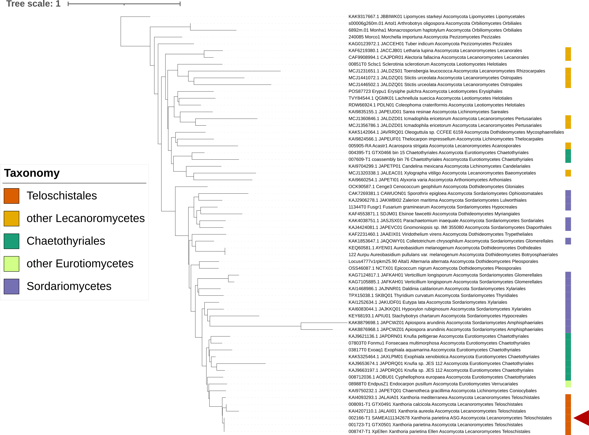
```

* NLR was recovered in OG0007437. The Teloschistales clade is sister to Chaetothyriales, which is close to the root of the tree. The rest of the group is Sordariomycetes with a bunch of other classes peppered through
```{r}
treedf<-collect_og_info("OG0007437")
tree<-rename_og_tree("OG0007437",treedf)
ape::write.tree(tree,"../analysis_and_temp_files/05_HGT/Orthofinder/Results_May21/Resolved_Gene_Trees/named_OG0007437_tree.txt")
itol_ann("OG0007437",treedf,"_002167-T1")

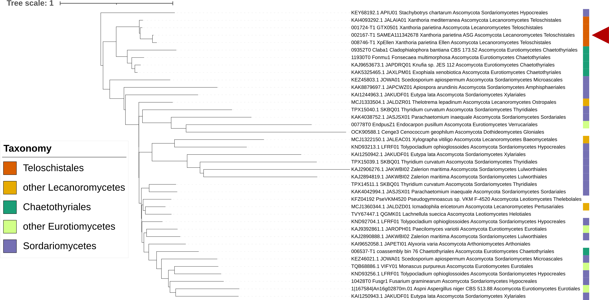
```

* Captain is in OG0000084, which is a large OG with many genes per genome. Our captains are nested in a Lecanoromycetes clade
```{r}
treedf<-collect_og_info("OG0000084")
tree<-rename_og_tree("OG0000084",treedf)
ape::write.tree(tree,"../analysis_and_temp_files/05_HGT/Orthofinder/Results_May21/Resolved_Gene_Trees/named_OG0000084_tree.txt")
itol_ann("OG0000084",treedf,"_002162-T1")

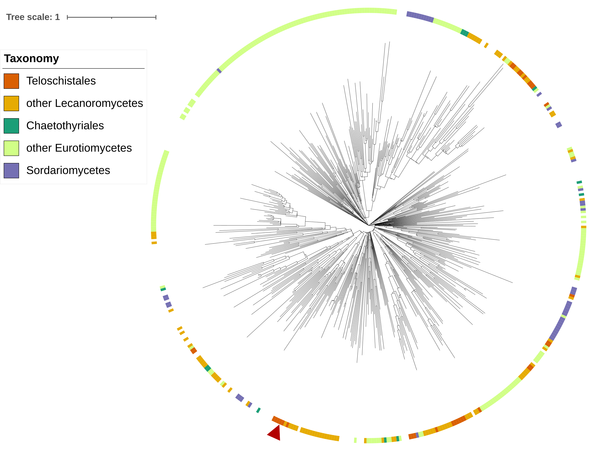
```

* DUF3723 is in OG0000444, which is also large and less structured. Our clade's immediate neighbour is Lecanoromycetes, but the larger clade includes a bunch of Eurotios, Lecanoros, Sordarios in random order
```{r}
treedf<-collect_og_info("OG0000444")
tree<-rename_og_tree("OG0000444",treedf)
ape::write.tree(tree,"../analysis_and_temp_files/05_HGT/Orthofinder/Results_May21/Resolved_Gene_Trees/named_OG0000444_tree.txt")
itol_ann("OG0000444",treedf,"_002164-T1")

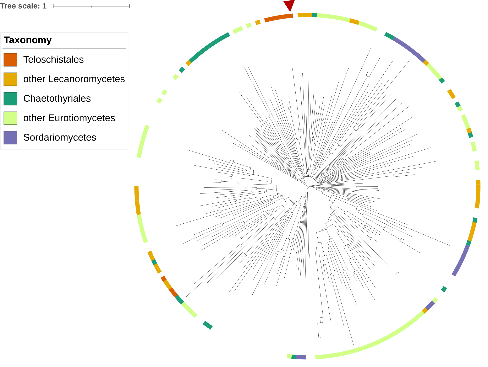
```


* PLP is in OG0000266, which is also large. Our genes are embedded in a Lecanoromycete clade, which is embedded in a Eurotio clade
```{r}
treedf<-collect_og_info("OG0000266")
tree<-rename_og_tree("OG0000266",treedf)
ape::write.tree(tree,"../analysis_and_temp_files/05_HGT/Orthofinder/Results_May21/Resolved_Gene_Trees/named_OG0000266_tree.txt")
itol_ann("OG0000266",treedf,"_002165-T1")

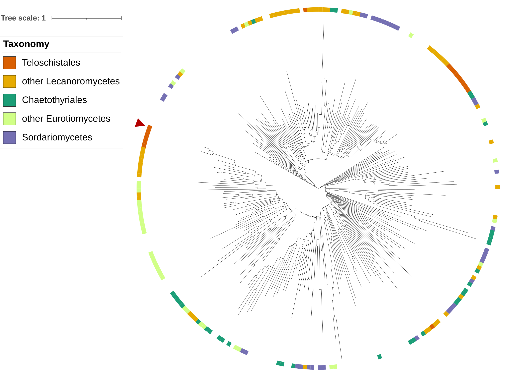
```


* XANPAOZ2100_002163-T1 is in OG0013117, but this OG only has Teloschistales genes
* Looking at the gene models that were present in SAMEA115359166, but not in the SAMEA111342678. XANPARI20_008750 and XANPARI20_008751 are only found in Teloschistales. XANPARI20_008745 is in OG0000154, which is a large clade mostly made of Lecanoromycete genes. Our gene is sister to a gene from GTX0501 X.p. genome (XANPAGTX0501_001728-T1), both are sister to Viridothelium. Overall taxonomy is a mess
```{r}
treedf<-collect_og_info("OG0000154")
tree<-rename_og_tree("OG0000154",treedf)
ape::write.tree(tree,"../analysis_and_temp_files/05_HGT/Orthofinder/Results_May21/Resolved_Gene_Trees/named_OG0000154_tree.txt")
itol_ann("OG0000154",treedf,"_008745")

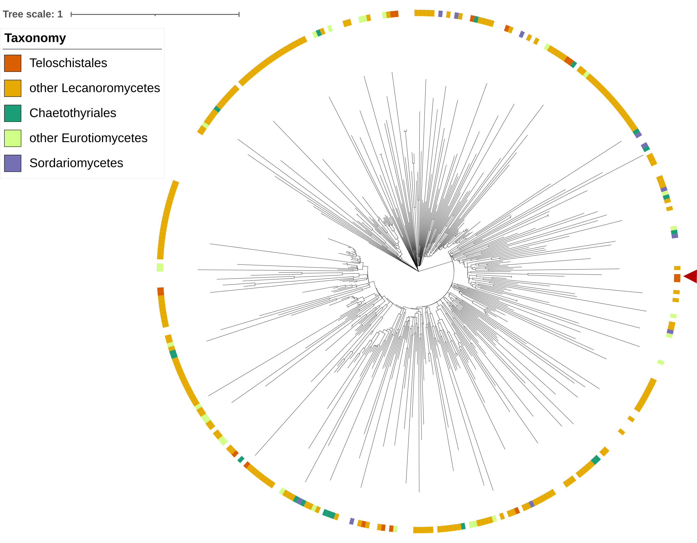
```

* BTW, is XANPARI20_008745 actually missing from the SAMEA111342678 genome, or was it just missed in annotation? Blasted it against the genome sequence and got sequences from OZ2100_30 382774-384304, which falls within the element
```{r,eval=F}
source package c92263ec-95e5-43eb-a527-8f1496d56f1a 
source package d6092385-3a81-49d9-b044-8ffb85d0c446

samtools faidx analysis_and_temp_files/02_annotate/SAMEA115359166_pred/annotate_results/Xanthoria_parietina_SAMEA115359166.cds-transcripts.fa FUN_008745-T1 > analysis_and_temp_files/05_HGT/XANPARI20_008745.cds.fa
samtools faidx analysis_and_temp_files/03_starfish/genomes/Xanthoria_parietina_SAMEA115359166.scaffolds.fa scaffold_12:678924-680403 -i > analysis_and_temp_files/05_HGT/XANPARI20_008745.gene.fa

blastn -query analysis_and_temp_files/05_HGT/XANPARI20_008745.gene.fa -subject analysis_and_temp_files/03_starfish/genomes/Xanthoria_parietina_SAMEA111342678.scaffolds.fa -outfmt 6
scaffold_12:678924-680403/rc    OZ2100_30       100.000 1131    0       0       1       1131    382774  383904  0.0     2089
scaffold_12:678924-680403/rc    OZ2100_30       99.148  352     3       0       1129    1480    383953  384304  0.0     634
scaffold_12:678924-680403/rc    OZ2100_30       94.608  204     10      1       1124    1327    383850  384052  6.40e-85        315
scaffold_12:678924-680403/rc    OZ2100_30       89.362  188     20      0       1140    1327    383766  383953  1.42e-61        237
scaffold_12:678924-680403/rc    OZ2100_30       93.525  139     9       0       993     1131    383964  384102  1.12e-52        207
scaffold_12:678924-680403/rc    OZ2100_30       92.806  139     10      0       993     1131    383865  384003  5.19e-51        202
```

* Extracted the match and aligned them. Compared to SAMEA115359166, the corresponding sequence in SAMEA111342678 has an insertion, which is in frame (not clear, an intron or a genuine difference, but probably the latter). All in all, seems that this model is there but was missed.
```{r,eval=F}
samtools faidx analysis_and_temp_files/03_starfish/genomes/Xanthoria_parietina_SAMEA111342678.scaffolds.fa OZ2100_30:382774-384304 > analysis_and_temp_files/05_HGT/XANPARI20_008745_match_SAMEA111342678.fa

cat analysis_and_temp_files/05_HGT/XANPARI20_008745_match_SAMEA111342678.fa analysis_and_temp_files/05_HGT/XANPARI20_008745.cds.fa
```


#### Visualize controls
* Will start with thegenes that we randomly selected above
* Now, looking at a random gene XANPAOZ2100_000699-T1, which is in OG0000244. The gene is in a Teloschistales clade embedded in the Lecanoromycetes clade 
```{r}
treedf<-collect_og_info("OG0000244")
tree<-rename_og_tree("OG0000244",treedf)
ape::write.tree(tree,"../analysis_and_temp_files/05_HGT/Orthofinder/Results_May21/Resolved_Gene_Trees/named_OG0000244_tree.txt")
itol_ann("OG0000244",treedf,"_000699-T1")

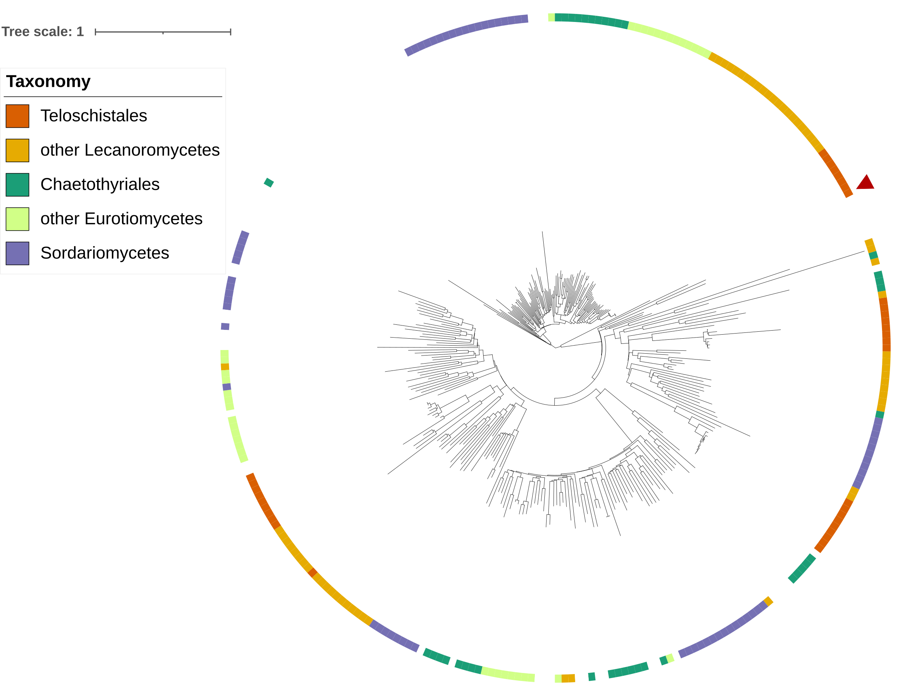
```

* Another random gene XANPAOZ2100_000979-T1, which is in OG0002213. Looks the same as above
```{r}
treedf<-collect_og_info("OG0002213")
tree<-rename_og_tree("OG0002213",treedf)
ape::write.tree(tree,"../analysis_and_temp_files/05_HGT/Orthofinder/Results_May21/Resolved_Gene_Trees/named_OG0002213_tree.txt")
itol_ann("OG0002213",treedf,"_000979-T1")

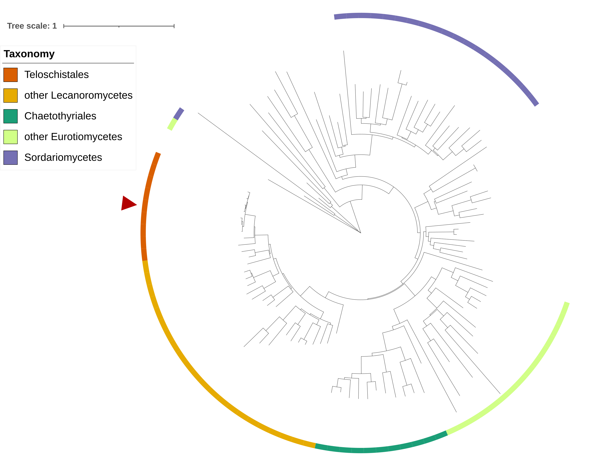
```

* Another random gene XANPAOZ2100_003656-T1 is in OG0001359, same
```{r}
treedf<-collect_og_info("OG0001359")
tree<-rename_og_tree("OG0001359",treedf)
ape::write.tree(tree,"../analysis_and_temp_files/05_HGT/Orthofinder/Results_May21/Resolved_Gene_Trees/named_OG0001359_tree.txt")
itol_ann("OG0001359",treedf,"_003656-T1")

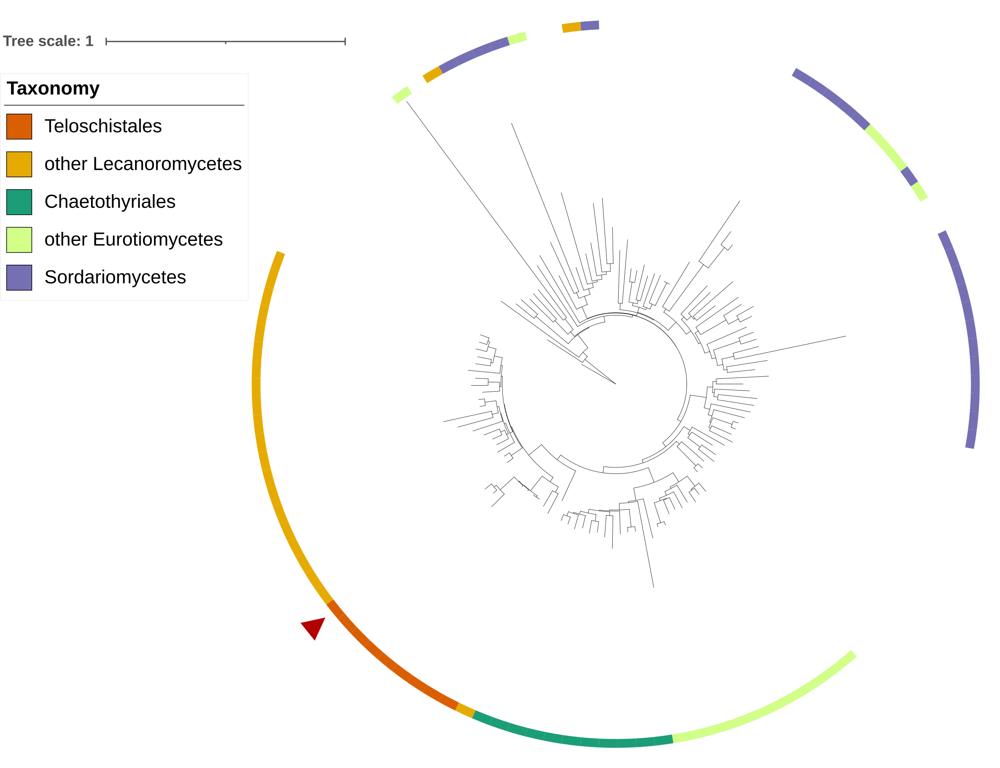
```

* Another random gene XANPAOZ2100_004401-T1 is in OG0005763, same
```{r}
treedf<-collect_og_info("OG0005763")
tree<-rename_og_tree("OG0005763",treedf)
ape::write.tree(tree,"../analysis_and_temp_files/05_HGT/Orthofinder/Results_May21/Resolved_Gene_Trees/named_OG0005763_tree.txt")
itol_ann("OG0005763",treedf,"_004401-T1")

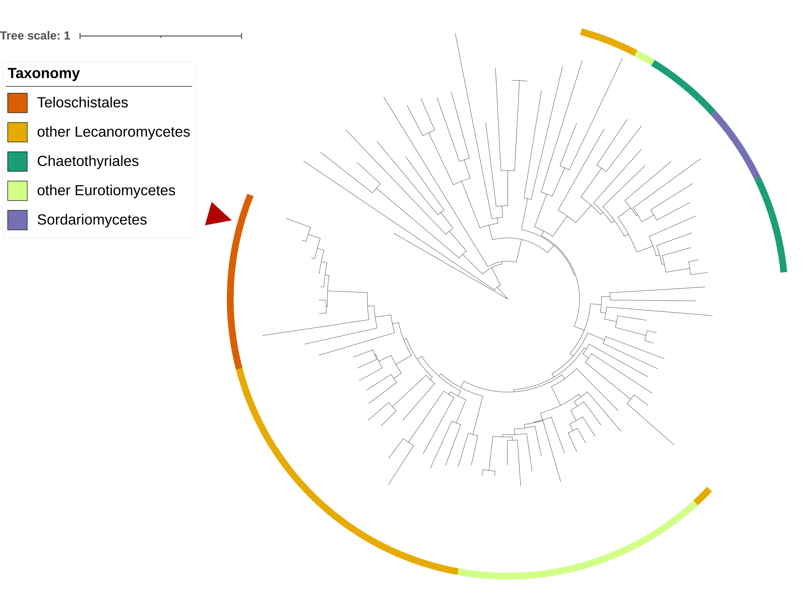
```

* Another random gene XANPAOZ2100_005914-T1 is in OG0000214, it's in a clade with other Lecanoromycetes, and a random Verticilium
```{r}
treedf<-collect_og_info("OG0000214")
tree<-rename_og_tree("OG0000214",treedf)
ape::write.tree(tree,"../analysis_and_temp_files/05_HGT/Orthofinder/Results_May21/Resolved_Gene_Trees/named_OG0000214_tree.txt")
itol_ann("OG0000214",treedf,"_005914-T1")

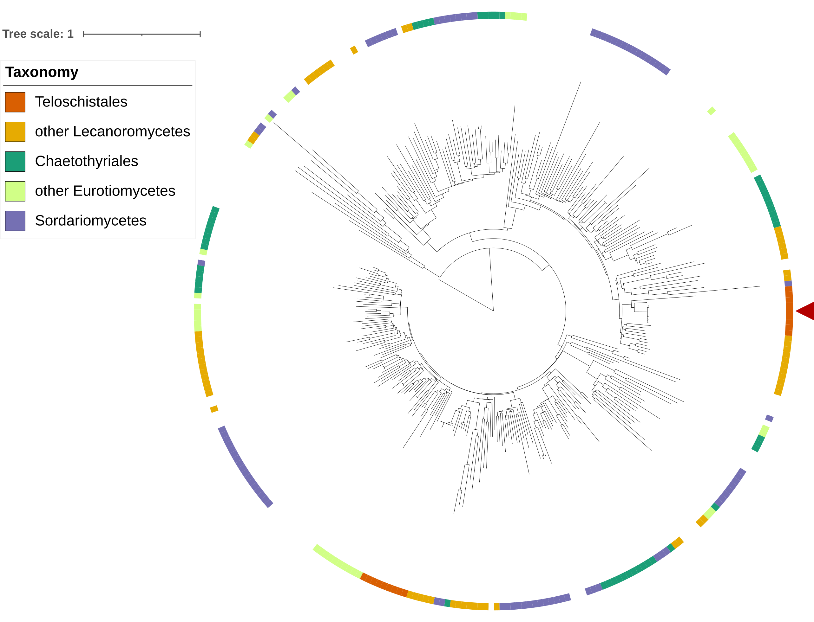
```

* Another random gene XANPAOZ2100_006094-T1 is in OG0000043, which is a large OG. Our genes are in a Teloschistales clade embedded in a Lecanoromycetes clade
```{r}
treedf<-collect_og_info("OG0000043")
tree<-rename_og_tree("OG0000043",treedf)
ape::write.tree(tree,"../analysis_and_temp_files/05_HGT/Orthofinder/Results_May21/Resolved_Gene_Trees/named_OG0000043_tree.txt")
itol_ann("OG0000043",treedf,"_006094-T1")

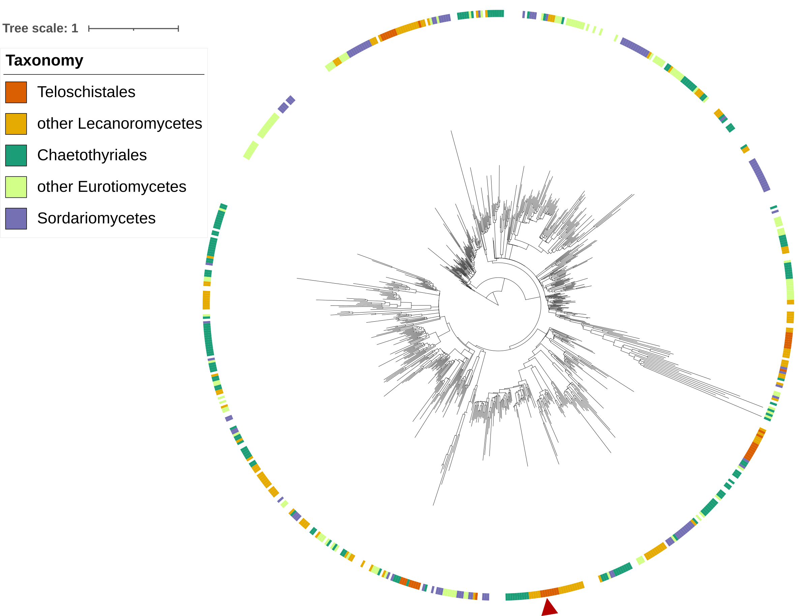
```

* Another random gene XANPAOZ2100_006140-T1 is in OG0000472, which mostly contains Lecanoromycetes genes. Our gene lands in a poorly resolved place
```{r}
treedf<-collect_og_info("OG0000472")
tree<-rename_og_tree("OG0000472",treedf)
ape::write.tree(tree,"../analysis_and_temp_files/05_HGT/Orthofinder/Results_May21/Resolved_Gene_Trees/named_OG0000472_tree.txt")
itol_ann("OG0000472",treedf,"_006140-T1")

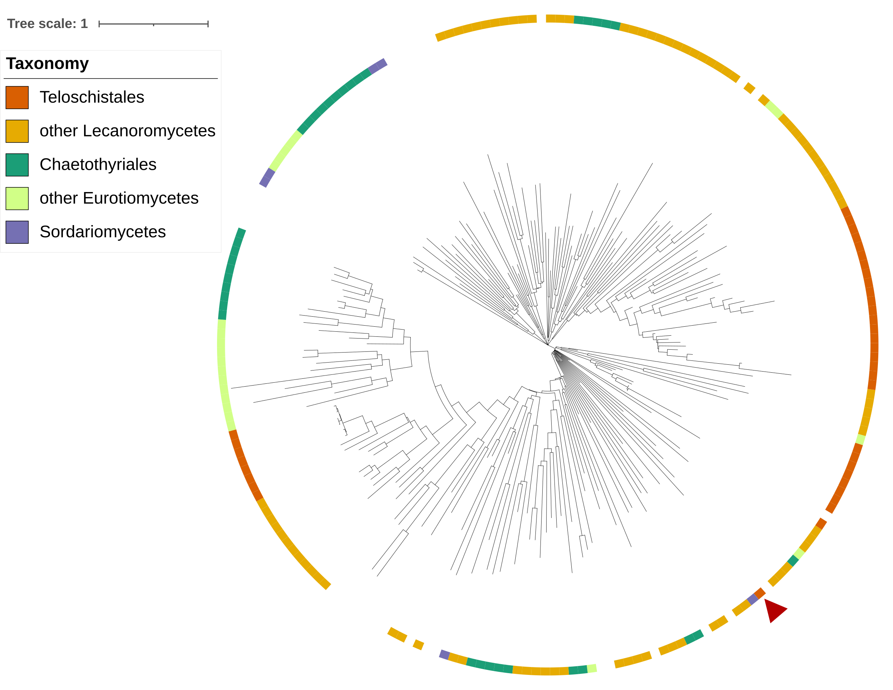
```

* Another random gene XANPAOZ2100_007892-T1 is in OG0004810. Our genes are in a Teloschistales clade embedded in a Lecanoromycetes clade
```{r}
treedf<-collect_og_info("OG0004810")
tree<-rename_og_tree("OG0004810",treedf)
ape::write.tree(tree,"../analysis_and_temp_files/05_HGT/Orthofinder/Results_May21/Resolved_Gene_Trees/named_OG0004810_tree.txt")
itol_ann("OG0004810",treedf,"007892-T1")

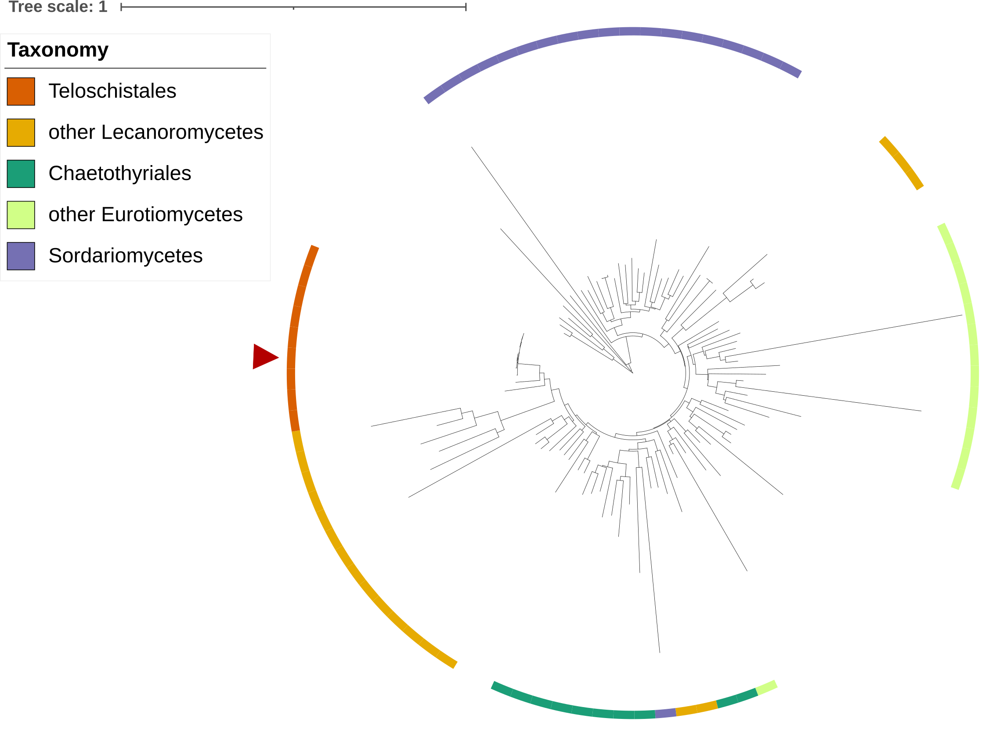
```

* Another random gene XANPAOZ2100_008367-T1 is in OG0003708. Our genes are in a Teloschistales clade embedded in a Lecanoromycetes clade
```{r}
treedf<-collect_og_info("OG0003708")
tree<-rename_og_tree("OG0003708",treedf)
ape::write.tree(tree,"../analysis_and_temp_files/05_HGT/Orthofinder/Results_May21/Resolved_Gene_Trees/named_OG0003708_tree.txt")
itol_ann("OG0003708",treedf,"008367-T1")

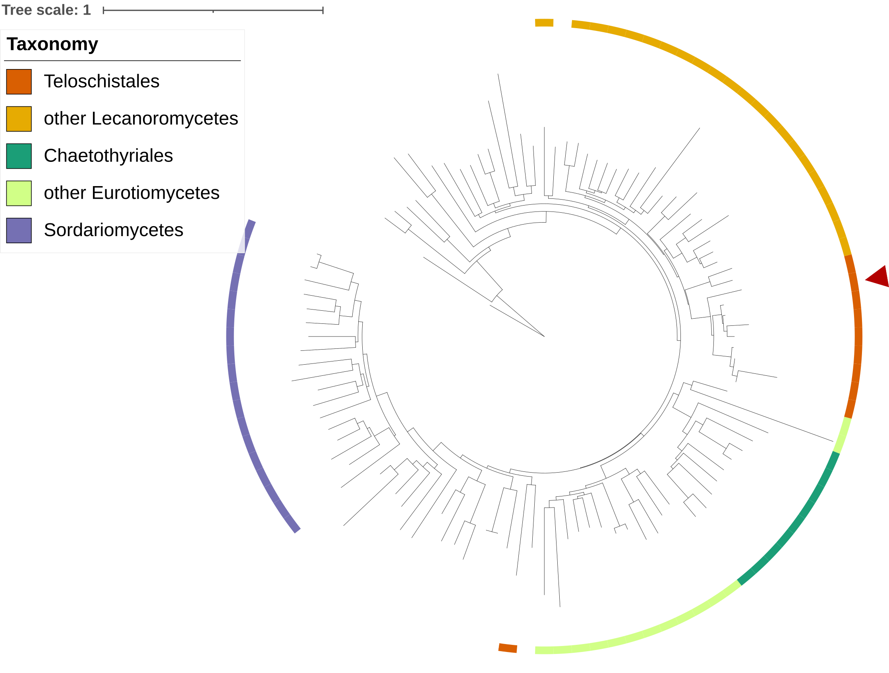
```

* Another random gene XANPAOZ2100_002117-T1, is only in Teloschistales, so didn't image it

* Flanking gene upstream is XANPAOZ2100_002161-T1 is in OG0000030, which is a giant OG.Our gene is in a Teloschistales clade which is embedded in Lecanoromycetes clade
```{r}
treedf<-collect_og_info("OG0000030")
tree<-rename_og_tree("OG0000030",treedf)
ape::write.tree(tree,"../analysis_and_temp_files/05_HGT/Orthofinder/Results_May21/Resolved_Gene_Trees/named_OG0000030_tree.txt")
itol_ann("OG0000030",treedf,"_002161-T1")

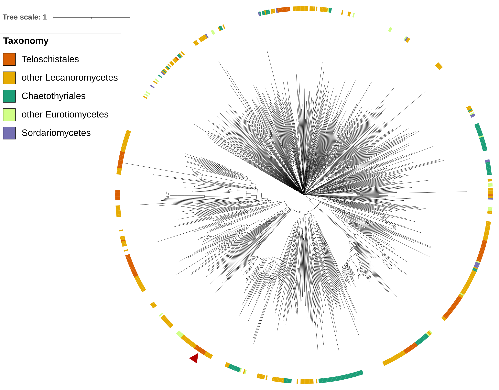
```

* XANPAOZ2100_002168-T1 is downstream is in OG0002403. A single Teloschistales clade is embedded in Lecanoromycetes clade
```{r}
treedf<-collect_og_info("OG0002403")
tree<-rename_og_tree("OG0002403",treedf)
ape::write.tree(tree,"../analysis_and_temp_files/05_HGT/Orthofinder/Results_May21/Resolved_Gene_Trees/named_OG0002403_tree.txt")
itol_ann("OG0002403",treedf,"002168-T1")

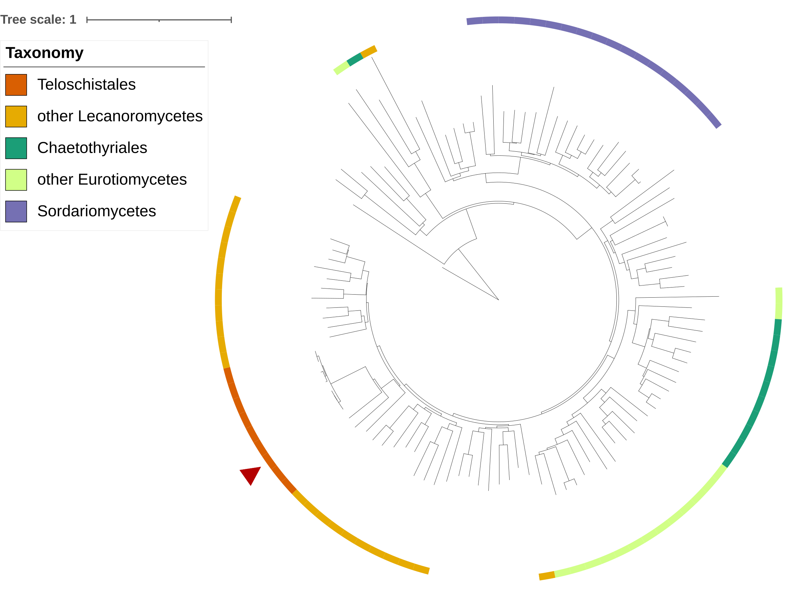
```

#### Visualize species tree
```{r}
tree<-read.tree("../analysis_and_temp_files/05_HGT/Orthofinder/Results_May21/Species_Tree/SpeciesTree_rooted_node_labels.txt")

treedf <- data.frame("old"=tree$tip.label)
treedf$rename_MAGs <- treedf$old
treedf$rename_MAGs[treedf$rename_MAGs=="GTX0466.bin.15.proteins"]<-"GTX0466_bin_15"
treedf$rename_MAGs[treedf$rename_MAGs=="coassembly.bin.64.proteins"]<-"coassembly_bin_64"
treedf$rename_MAGs[treedf$rename_MAGs=="coassembly.bin.76.proteins"]<-"coassembly_bin_76"

treedf <- treedf  %>% 
  fuzzy_join(genome_id %>% filter(), by = c("rename_MAGs"="ID"), 
                          match_fun = list( stringr::str_detect),
                          mode="left") 

treedf$new<-paste(treedf$ID,treedf$Species,sep="_")  
treedf$new <- str_replace_all(treedf$new," ","_")
tree$tip.label<-treedf[[10]][match(tree$tip.label, treedf[[1]])]
ape::write.tree(tree,"../analysis_and_temp_files/05_HGT/Orthofinder/Results_May21/Species_Tree/SpeciesTree_rooted_node_labels_renamed.txt")


cat("DATASET_COLORSTRIP\nSEPARATOR COMMA\nDATASET_LABEL,Taxonomy\nLEGEND_TITLE,Taxonomy\nLEGEND_SHAPES,1,1,1,1,1\nLEGEND_COLORS,#D95F02,#E6AB02,#1B9E77,#d1ff87,#7570B3\nLEGEND_LABELS,Teloschistales,other Lecanoromycetes,Chaetothyriales,other Eurotiomycetes,Sordariomycetes\nDATA\n",file="../analysis_and_temp_files/05_HGT/Orthofinder/Results_May21/Species_Tree/SpeciesTree.itol.txt")
itol<-treedf %>% mutate(label = case_when(
  grepl("Teloschistales",Taxonomy) ~ "#D95F02",
  !grepl("Teloschistales",Taxonomy) & grepl("Lecanoromycetes",Taxonomy) ~ "#E6AB02",
  grepl("Chaetothyriales",Taxonomy) ~ "#1B9E77",
  !grepl("Chaetothyriales",Taxonomy) & grepl("Eurotiomycetes",Taxonomy) ~ "#d1ff87",
  grepl("Sordariomycetes",Taxonomy) ~ "#7570B3",
  T ~ "#ffffff")) %>%
  select(new,label)
write.table(itol,"../analysis_and_temp_files/05_HGT/Orthofinder/Results_May21/Species_Tree/SpeciesTree.itol.txt",append=TRUE,sep=",",quote = F, row.names = F, col.names=F)

cat("DATASET_BINARY\nSEPARATOR,COMMA\nDATASET_LABEL,GOI\nCOLOR,#b30000\nFIELD_LABELS,GOI\nFIELD_COLORS,#b30000\nFIELD_SHAPES,4\nHEIGHT_FACTOR,2.5\nMARGIN,30\nDATA\n",file="../analysis_and_temp_files/05_HGT/Orthofinder/Results_May21/Species_Tree/SpeciesTree.itol2.txt")
itol2<-treedf %>% mutate(label = if_else(
  grepl("SAMEA111342678",ID),1,-1)) %>%
  select(new,label)
write.table(itol2,"../analysis_and_temp_files/05_HGT/Orthofinder/Results_May21/Species_Tree/SpeciesTree.itol2.txt",append=TRUE,sep=",",quote = F, row.names = F, col.names=F)
```
* Visualized the tree after rerooting it using the Saccaromycotina (S.cerevesiae and Lipomyces) as the outgroup. Saved both the full version and the version with the clades collapsed
```{r,fig.show="hold", out.width="50%"}
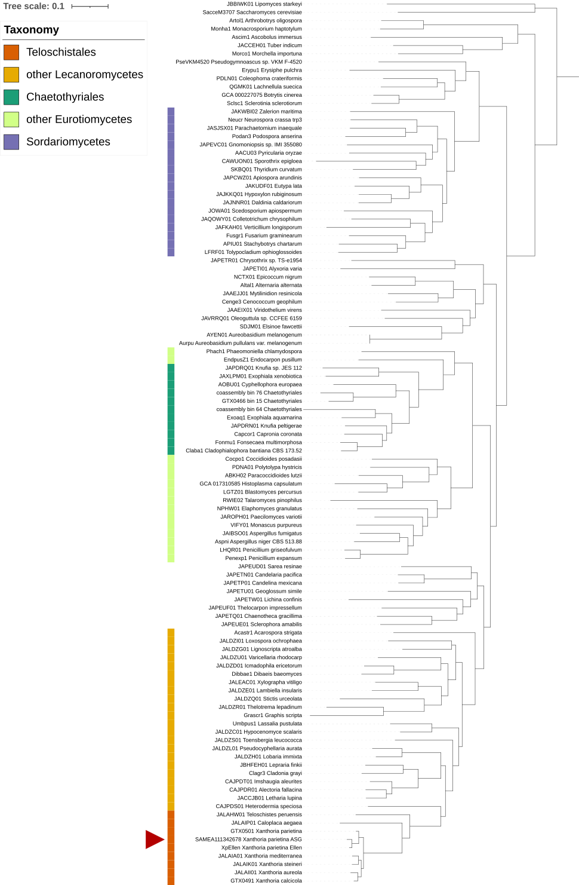
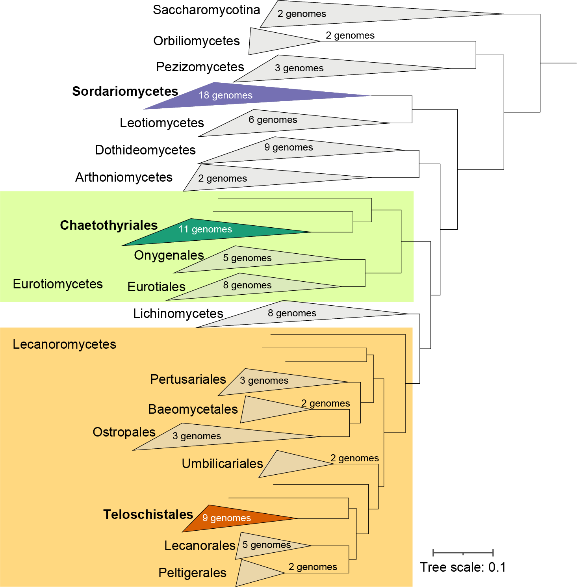
```

## 4. Better trees for the selected HGT candidates
* For the methyltransferase and the NLR, made trees with IQ-TRee, since it would be nice to have bootstrap support
* For the methyltransferase, just used the fasta made by Orthofinder as is to make alignments. This tree was rooted in Orthofinder with a Lipomycetes (Saccharomycotina) as an outgroup, so no need to add anything
* For the NLR, added an outgroup. Searched the protein against the NCBI nr with limiting results to Pezizomycetes, and got a sequence from Morchella conica (RPB12414.1), with 23.16% pid over 45% query cover. 

#### Methyltransferase
* Align and make a tree
```{r,eval=F}
source package /tgac/software/testing/bin/mafft-7.271
source package /tsl/software/testing/bin/trimal-latest 
source package /tgac/software/testing/bin/gcc-4.9.1 
source package /tgac/software/testing/bin/iqtree-2.2.2.2

mafft --maxiterate 1000 --genafpair --thread 10  analysis_and_temp_files/05_HGT/OrthoFinder/Results_May21/Orthogroup_Sequences/OG0006598.fa >  analysis_and_temp_files/05_HGT/OG0006598_aligned.fa

trimal -in analysis_and_temp_files/05_HGT/OG0006598_aligned.fa -out analysis_and_temp_files/05_HGT/OG0006598_aligned.phyl -gt 0.2 -phylip  -keepheader

iqtree2 -s analysis_and_temp_files/05_HGT/OG0006598_aligned.phyl  -B 10000 -T AUTO --threads-max 20

```
* Renamed the tree
```{r}
og <- read.delim("../analysis_and_temp_files/05_HGT/OrthoFinder/Results_May21/Orthogroups.tsv")
og_OG0006598<-og[og$Orthogroup=="OG0006598",] %>% 
  pivot_longer(-Orthogroup,names_to = "genome",values_to = "genes") %>%
  separate_rows(genes, sep = ", ")
og_OG0006598$genes <- str_replace_all(og_OG0006598$genes,"#","_")
og_OG0006598$genome[og_OG0006598$genome=="GTX0466.bin.15.proteins"]<-"GTX0466_bin_15"
og_OG0006598$genome[og_OG0006598$genome=="coassembly.bin.64.proteins"]<-"coassembly_bin_64"
og_OG0006598$genome[og_OG0006598$genome=="coassembly.bin.76.proteins"]<-"coassembly_bin_76"

tree<-read.tree("../analysis_and_temp_files/05_HGT/OG0006598_aligned.phyl.contree")

treedf <- data.frame("old"=tree$tip.label)
treedf <- treedf %>% left_join(og_OG0006598,by=c("old"="genes")) %>%
  fuzzy_join(genome_id %>% filter(), by = c("genome"="ID"), 
                          match_fun = list( stringr::str_detect),
                          mode="left") 

treedf$locustag <-  str_replace(treedf$old, '.*_(.*)', '\\1')
treedf$new<-paste(treedf$locustag,treedf$ID,treedf$Species,treedf$Taxonomy,sep="_")  
treedf$new <- str_replace_all(treedf$new,"; ","_")
treedf$new <- str_replace_all(treedf$new," ","_")
tree$tip.label<-treedf[[12]][match(tree$tip.label, treedf[[1]])]
ape::write.tree(tree,"../analysis_and_temp_files/05_HGT/OG0006598_aligned.phyl.renamed.contree")


cat("DATASET_COLORSTRIP\nSEPARATOR COMMA\nDATASET_LABEL,Taxonomy\nLEGEND_TITLE,Taxonomy\nLEGEND_SHAPES,1,1,1,1,1\nLEGEND_COLORS,#D95F02,#E6AB02,#1B9E77,#d1ff87,#7570B3\nLEGEND_LABELS,Teloschistales,other Lecanoromycetes,Chaetothyriales,other Eurotiomycetes,Sordariomycetes\nDATA\n",file="../analysis_and_temp_files/05_HGT/OG0006598_aligned.itol.txt")
itol<-treedf %>% mutate(label = case_when(
  grepl("Teloschistales",new) ~ "#D95F02",
  !grepl("Teloschistales",new) & grepl("Lecanoromycetes",new) ~ "#E6AB02",
  grepl("Chaetothyriales",new) ~ "#1B9E77",
  !grepl("Chaetothyriales",new) & grepl("Eurotiomycetes",new) ~ "#d1ff87",
  grepl("Sordariomycetes",new) ~ "#7570B3",
  T ~ "#ffffff")) %>%
  select(new,label)
write.table(itol,"../analysis_and_temp_files/05_HGT/OG0006598_aligned.itol.txt",append=TRUE,sep=",",quote = F, row.names = F, col.names=F)

cat("DATASET_BINARY\nSEPARATOR,COMMA\nDATASET_LABEL,GOI\nCOLOR,#b30000\nFIELD_LABELS,GOI\nFIELD_COLORS,#b30000\nFIELD_SHAPES,5\nHEIGHT_FACTOR,2.5\nMARGIN,30\nDATA\n",file="../analysis_and_temp_files/05_HGT/OG0006598_aligned.itol2.txt")
itol2<-treedf %>% mutate(label = if_else(
  grepl("XANPAOZ2100_002166-T1",old),1,-1)) %>%
  select(new,label)
write.table(itol2,"../analysis_and_temp_files/05_HGT/OG0006598_aligned.itol2.txt",append=TRUE,sep=",",quote = F, row.names = F, col.names=F)
```
* Saved the tree as pdf and png with and without labels
```{r}
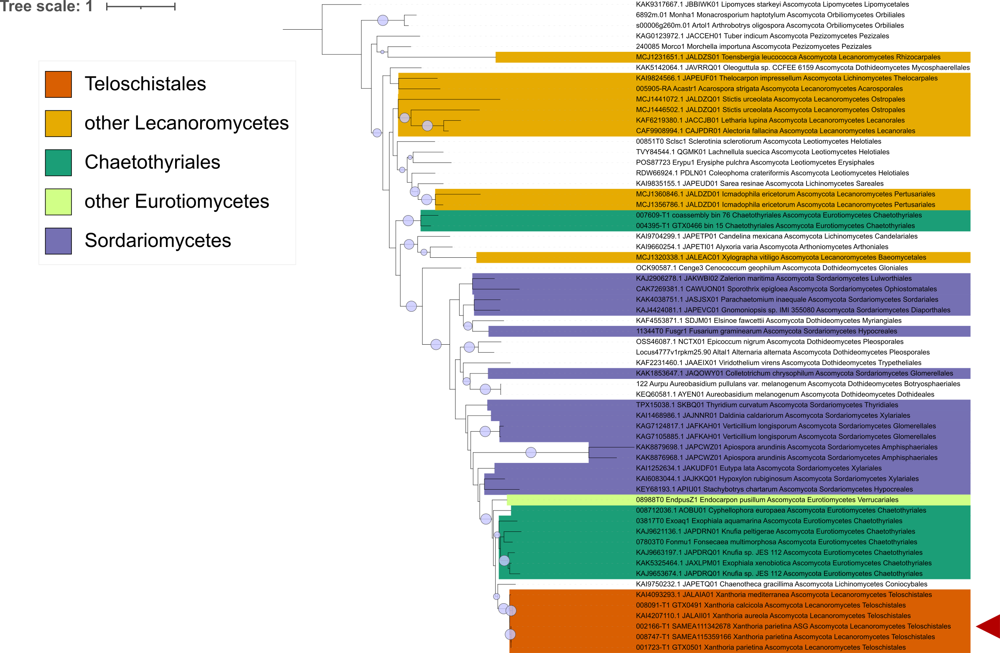
```

#### NLR
* Align and make a tree. Saved the file with the outgroup as `analysis_and_temp_files/05_HGT/OG0007437_with_outgroup.fa`
```{r,eval=F}
cp analysis_and_temp_files/05_HGT/OrthoFinder/Results_May21/Orthogroup_Sequences/OG0007437.fa analysis_and_temp_files/05_HGT/OG0007437_with_outgroup.fa

mafft --maxiterate 1000 --genafpair --thread 10  analysis_and_temp_files/05_HGT/OG0007437_with_outgroup.fa >  analysis_and_temp_files/05_HGT/OG0007437_aligned.fa

trimal -in analysis_and_temp_files/05_HGT/OG0007437_aligned.fa -out analysis_and_temp_files/05_HGT/OG0007437_aligned.phyl -gt 0.2 -phylip  -keepheader

iqtree2 -s analysis_and_temp_files/05_HGT/OG0007437_aligned.phyl  -B 10000 -T AUTO --threads-max 20

```
* Renamed the tree
```{r}
og_OG0007437<-og[og$Orthogroup=="OG0007437",] %>% 
  pivot_longer(-Orthogroup,names_to = "genome",values_to = "genes") %>%
  separate_rows(genes, sep = ", ")
og_OG0007437$genes <- str_replace_all(og_OG0007437$genes,"#","_")
og_OG0007437$genome[og_OG0007437$genome=="GTX0466.bin.15.proteins"]<-"GTX0466_bin_15"
og_OG0007437$genome[og_OG0007437$genome=="coassembly.bin.64.proteins"]<-"coassembly_bin_64"
og_OG0007437$genome[og_OG0007437$genome=="coassembly.bin.76.proteins"]<-"coassembly_bin_76"

tree<-read.tree("../analysis_and_temp_files/05_HGT/OG0007437_aligned.phyl.contree")

treedf <- data.frame("old"=tree$tip.label)
treedf <- treedf %>% left_join(og_OG0007437,by=c("old"="genes")) %>%
  fuzzy_join(genome_id %>% filter(), by = c("genome"="ID"), 
                          match_fun = list( stringr::str_detect),
                          mode="left") 

treedf$locustag <-  str_replace(treedf$old, '.*_(.*)', '\\1')
treedf$new<-paste(treedf$locustag,treedf$ID,treedf$Species,treedf$Taxonomy,sep="_")  
treedf$new <- str_replace_all(treedf$new,"; ","_")
treedf$new <- str_replace_all(treedf$new," ","_")
treedf$new[treedf$new=="RPB12414.1_NA_NA_NA"] <- "RPB12414.1_Morchella_conica_Ascomycota_Pezizomycetes_Pezizales"

tree$tip.label<-treedf[[12]][match(tree$tip.label, treedf[[1]])]
ape::write.tree(tree,"../analysis_and_temp_files/05_HGT/OG0007437_aligned.phyl.renamed.contree")


cat("DATASET_COLORSTRIP\nSEPARATOR COMMA\nDATASET_LABEL,Taxonomy\nLEGEND_TITLE,Taxonomy\nLEGEND_SHAPES,1,1,1,1,1\nLEGEND_COLORS,#D95F02,#E6AB02,#1B9E77,#d1ff87,#7570B3\nLEGEND_LABELS,Teloschistales,other Lecanoromycetes,Chaetothyriales,other Eurotiomycetes,Sordariomycetes\nDATA\n",file="../analysis_and_temp_files/05_HGT/OG0007437_aligned.itol.txt")
itol<-treedf %>% mutate(label = case_when(
  grepl("Teloschistales",new) ~ "#D95F02",
  !grepl("Teloschistales",new) & grepl("Lecanoromycetes",new) ~ "#E6AB02",
  grepl("Chaetothyriales",new) ~ "#1B9E77",
  !grepl("Chaetothyriales",new) & grepl("Eurotiomycetes",new) ~ "#d1ff87",
  grepl("Sordariomycetes",new) ~ "#7570B3",
  T ~ "#ffffff")) %>%
  select(new,label)
write.table(itol,"../analysis_and_temp_files/05_HGT/OG0007437_aligned.itol.txt",append=TRUE,sep=",",quote = F, row.names = F, col.names=F)

cat("DATASET_BINARY\nSEPARATOR,COMMA\nDATASET_LABEL,GOI\nCOLOR,#b30000\nFIELD_LABELS,GOI\nFIELD_COLORS,#b30000\nFIELD_SHAPES,5\nHEIGHT_FACTOR,2.5\nMARGIN,30\nDATA\n",file="../analysis_and_temp_files/05_HGT/OG0007437_aligned.itol2.txt")
itol2<-treedf %>% mutate(label = if_else(
  grepl("XANPAOZ2100_002167-T1",old),1,-1)) %>%
  select(new,label)
write.table(itol2,"../analysis_and_temp_files/05_HGT/OG0007437_aligned.itol2.txt",append=TRUE,sep=",",quote = F, row.names = F, col.names=F)
```
* Saved the tree as pdf and png with and without labels
```{r}
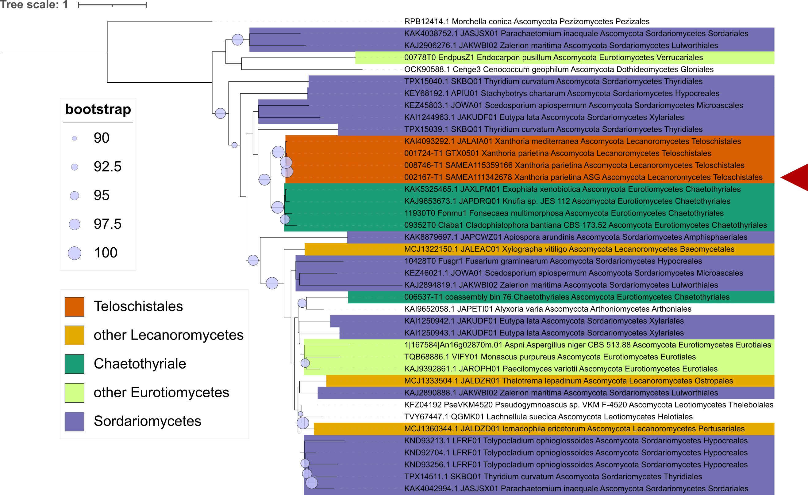
```

## 5. Cross-map proteomes of Xanthoria and Exophiala xenobiotica
* Found best match to each Xp protein frm the proteome of Exophiala xenobiotica  (JAXLPM01), which had orthologues for all genes inside the element (except XANPAOZ2100_002163-T1, which is only in Teloschistales)
```{r,eval=F}
source mmseqs2-13.0
 
mmseqs easy-rbh \
    analysis_and_temp_files/03_starfish/genomes/Xanthoria_parietina_SAMEA111342678.proteins.fa \
    analysis_and_temp_files/05_HGT/JAXLPM01.faa \
    analysis_and_temp_files/05_HGT/mmseqs_mapping_Xp_Exophiala.txt \
    --threads 10 \
    tmp --format-output query,target,pident,qcov,alnlen,mismatch,gapopen,qstart,qend,tstart,tend,evalue \
    --e-profile 1e-30 \
    --sort-results 1 \
    --remove-tmp-files 1

```

* The similarity is high but not at all the highest
```{r,message=FALSE,warning=FALSE}
library(plyr)
library(patchwork)
map <- read.delim("../analysis_and_temp_files/05_HGT/mmseqs_mapping_Xp_Exophiala.txt",header = F)
colnames(map)<-c("query","target","pident","qcov","alnlen","mismatch","gapopen","qstart","qend","tstart","tend","evalue")
map$gene<-"other"
map$gene[map$query=="XANPAOZ2100_002166-T1"] <- "Methyltransferase"
map$gene[map$query=="XANPAOZ2100_002167-T1"] <- "NLR"
map$gene[map$query %in% c("XANPAOZ2100_002162-T1","XANPAOZ2100_002163-T1","XANPAOZ2100_002164-T1","XANPAOZ2100_002165-T1")] <- "other Starship genes"
map$alpha<-1
map$alpha[map$gene=="other"]<-0.4
map$gene <- factor(map$gene,levels=c("Methyltransferase","NLR",
          "other Starship genes","other"))

  
dot1<-ggplot(map)+geom_point(aes(y=qcov,x=pident,color=gene,alpha=alpha))+
  geom_point(data = subset(map, gene != 'other'),
             aes(y=qcov,x=pident,color=gene,alpha=alpha))+
  scale_colour_manual(values = c("Methyltransferase"="#F8766D",
    "NLR"="#00a9ff","other Starship genes"="#00ba38","other"="#878787"))+
  scale_alpha(guide = 'none')+
  xlab("Percent Identity")+ ylab("Query Cover")+
  theme_bw()+
  scale_x_continuous(limits = c(0, 100), breaks = seq(0, 100, by = 25))
hist1<-ggplot(map)+geom_histogram(aes(x=pident))+ xlab("Percent Identity")+ theme_bw()+
   ggtitle("X. parietina to Exophiala xenobiotica (Chaetothyriales)")+
  scale_x_continuous(limits = c(0, 100), breaks = seq(0, 100, by = 25))+
  theme(axis.title.x = element_blank(),axis.text.x = element_blank())

hist1/dot1 + plot_layout(guides = 'collect')
```

* As a control, let's do the same for a lecanoromycete Icmadophila (JALDZD01)
```{r,eval=F}
source mmseqs2-13.0
 
mmseqs easy-rbh \
    analysis_and_temp_files/03_starfish/genomes/Xanthoria_parietina_SAMEA111342678.proteins.fa \
    analysis_and_temp_files/05_HGT/JALDZD01.faa \
    analysis_and_temp_files/05_HGT/mmseqs_mapping_Xp_Icmadophila.txt \
    --threads 10 \
    tmp --format-output query,target,pident,qcov,alnlen,mismatch,gapopen,qstart,qend,tstart,tend,evalue \
    --e-profile 1e-30 \
    --sort-results 1 \
    --remove-tmp-files 1

```

* This looks completely different, and the similarity overall is higher, but for the methyltransferase is much smaller
```{r}
library(plyr)
library(patchwork)
map <- read.delim("../analysis_and_temp_files/05_HGT/mmseqs_mapping_Xp_Icmadophila.txt",header = F)
colnames(map)<-c("query","target","pident","qcov","alnlen","mismatch","gapopen","qstart","qend","tstart","tend","evalue")
map$gene<-"other"
map$gene[map$query=="XANPAOZ2100_002166-T1"] <- "Methyltransferase"
map$gene[map$query=="XANPAOZ2100_002167-T1"] <- "NLR"
map$gene[map$query %in% c("XANPAOZ2100_002162-T1","XANPAOZ2100_002163-T1","XANPAOZ2100_002164-T1","XANPAOZ2100_002165-T1")] <- "other Starship genes"
map$alpha<-1
map$alpha[map$gene=="other"]<-0.4
map$gene <- factor(map$gene,levels=c("Methyltransferase","NLR",
          "other Starship genes","other"))

dot2<-ggplot(map)+geom_point(aes(y=qcov,x=pident,color=gene,alpha=alpha))+
  geom_point(data = subset(map, gene != 'other'),
             aes(y=qcov,x=pident,color=gene,alpha=alpha))+
  scale_colour_manual(values = c("Methyltransferase"="#F8766D",
    "NLR"="#00a9ff","other Starship genes"="#00ba38","other"="#878787"))+
  scale_alpha(guide = 'none')+
  xlab("Percent Identity")+ ylab("Query Cover")+
  theme_bw()+
  scale_x_continuous(limits = c(0, 100), breaks = seq(0, 100, by = 25))
hist2<-ggplot(map)+geom_histogram(aes(x=pident))+ xlab("Percent Identity")+ theme_bw()+
   ggtitle("X. parietina to Icmadophila ericetorum (Lecanoromycetes)")+
  scale_x_continuous(limits = c(0, 100), breaks = seq(0, 100, by = 25))+
  theme(axis.title.x = element_blank(),axis.text.x = element_blank())

hist2/dot2 + plot_layout(guides = 'collect')
```

* Letharia lupina (JACCJB01)
```{r,eval=F}
source mmseqs2-13.0
 
mmseqs easy-rbh \
    analysis_and_temp_files/03_starfish/genomes/Xanthoria_parietina_SAMEA111342678.proteins.fa \
    analysis_and_temp_files/05_HGT/JACCJB01.faa \
    analysis_and_temp_files/05_HGT/mmseqs_mapping_Xp_Letharia.txt \
    --threads 10 \
    tmp --format-output query,target,pident,qcov,alnlen,mismatch,gapopen,qstart,qend,tstart,tend,evalue \
    --e-profile 1e-30 \
    --sort-results 1 \
    --remove-tmp-files 1

```

* This looks completely different, and the similarity overall is higher, but for the methyltransferase is much smaller
```{r}
library(plyr)
library(patchwork)
map <- read.delim("../analysis_and_temp_files/05_HGT/mmseqs_mapping_Xp_Letharia.txt",header = F)
colnames(map)<-c("query","target","pident","qcov","alnlen","mismatch","gapopen","qstart","qend","tstart","tend","evalue")
map$gene<-"other"
map$gene[map$query=="XANPAOZ2100_002166-T1"] <- "Methyltransferase"
map$gene[map$query=="XANPAOZ2100_002167-T1"] <- "NLR"
map$gene[map$query %in% c("XANPAOZ2100_002162-T1","XANPAOZ2100_002163-T1","XANPAOZ2100_002164-T1","XANPAOZ2100_002165-T1")] <- "other Starship genes"
map$alpha<-1
map$alpha[map$gene=="other"]<-0.4
map$gene <- factor(map$gene,levels=c("Methyltransferase","NLR",
          "other Starship genes","other"))

dot3<-ggplot(map)+geom_point(aes(y=qcov,x=pident,color=gene,alpha=alpha))+
  geom_point(data = subset(map, gene != 'other'),
             aes(y=qcov,x=pident,color=gene,alpha=alpha))+
  scale_colour_manual(values = c("Methyltransferase"="#F8766D",
    "NLR"="#00a9ff","other Starship genes"="#00ba38","other"="#878787"))+
  scale_alpha(guide = 'none')+
  xlab("Percent Identity")+ ylab("Query Cover")+
  theme_bw()+
  scale_x_continuous(limits = c(0, 100), breaks = seq(0, 100, by = 25))
hist3<-ggplot(map)+geom_histogram(aes(x=pident))+ xlab("Percent Identity")+ theme_bw()+
   ggtitle("X. parietina to Letharia lupina (Lecanoromycetes)")+
  scale_x_continuous(limits = c(0, 100), breaks = seq(0, 100, by = 25))+
  theme(axis.title.x = element_blank(),axis.text.x = element_blank())

hist3/dot3 + plot_layout(guides = 'collect')
```

* And Fusarium
```{r,eval=F}
source mmseqs2-13.0
 
mmseqs easy-rbh \
    analysis_and_temp_files/03_starfish/genomes/Xanthoria_parietina_SAMEA111342678.proteins.fa \
    analysis_and_temp_files/05_HGT/Fusgr1_GeneCatalog_proteins_20110524.aa.fasta \
    analysis_and_temp_files/05_HGT/mmseqs_mapping_Xp_Fusarium.txt \
    --threads 10 \
    tmp --format-output query,target,pident,qcov,alnlen,mismatch,gapopen,qstart,qend,tstart,tend,evalue \
    --e-profile 1e-30 \
    --sort-results 1 \
    --remove-tmp-files 1

```

* Fusarium methyltransferase is a bit more similar to Xanthoria that Icmadophila and Letharia are to Xanthoria!
```{r}
library(plyr)
library(patchwork)
map <- read.delim("../analysis_and_temp_files/05_HGT/mmseqs_mapping_Xp_Fusarium.txt",header = F)
colnames(map)<-c("query","target","pident","qcov","alnlen","mismatch","gapopen","qstart","qend","tstart","tend","evalue")
map$gene<-"other"
map$gene[map$query=="XANPAOZ2100_002166-T1"] <- "Methyltransferase"
map$gene[map$query=="XANPAOZ2100_002167-T1"] <- "NLR"
map$gene[map$query %in% c("XANPAOZ2100_002162-T1","XANPAOZ2100_002163-T1","XANPAOZ2100_002164-T1","XANPAOZ2100_002165-T1")] <- "other Starship genes"
map$alpha<-1
map$alpha[map$gene=="other"]<-0.4
map$gene <- factor(map$gene,levels=c("Methyltransferase","NLR",
          "other Starship genes","other"))

dot4<-ggplot(map)+geom_point(aes(y=qcov,x=pident,color=gene,alpha=alpha))+
  geom_point(data = subset(map, gene != 'other'),
             aes(y=qcov,x=pident,color=gene,alpha=alpha))+
  scale_colour_manual(values = c("Methyltransferase"="#F8766D",
    "NLR"="#00a9ff","other Starship genes"="#00ba38","other"="#878787"))+
  scale_alpha(guide = 'none')+
  xlab("Percent Identity")+ ylab("Query Cover")+
  theme_bw()+
  scale_x_continuous(limits = c(0, 100), breaks = seq(0, 100, by = 25))
hist4<-ggplot(map)+geom_histogram(aes(x=pident))+ xlab("Percent Identity")+ theme_bw()+
   ggtitle("X. parietina to Fusarium graminearum (Sordariomycetes)")+
  scale_x_continuous(limits = c(0, 100), breaks = seq(0, 100, by = 25))+
  theme(axis.title.x = element_blank(),axis.text.x = element_blank())

hist4/dot4
```

* Non-chaetothyriales eurotios didn't have methyltransferase (except for Endocarpon)

#### Save the figures
* Exophiala andd Icmadophila will use for the main figure, Fusarium and Letharia for supplementary
```{r,message=F,warning=F,fig.width=6,fig.height=3}
hist1/dot1/hist2/dot2 +  plot_layout(guides = 'collect')
ggsave("../results/map_to_exophiala_icmadophila.pdf",width=5,height=5)

hist3/dot3/hist4/dot4 +  plot_layout(guides = 'collect')
ggsave("../results/map_to_letharia_fusarium.pdf",width=8,height=8)
```
## 6. Alien Index
* Used AI as defined in [Gladysev et al.](https://www.science.org/doi/10.1126/science.1156407)
* Searching against NCBI nt is very resource-consuming, so I decided to use the web interface (accessed on 23/05/2025)
* Saved the table with AI as `results/ai.txt`
```{r}
blast <- read.delim("../analysis_and_temp_files/05_HGT/blast_genes/all_blast_results_add_taxonomy.csv",sep=",")

ai <- blast %>% filter(!is.na(class)) %>%
  mutate(for_ai = case_when(
  class=="Lecanoromycetes" & order != "Teloschistales" ~ "Lecanoro_non_Telosch",
  class=="Lecanoromycetes" & is.na(order) ~ "Lecanoro_non_Telosch",
  class!="Lecanoromycetes" ~ "non_Lecanoro",
  order == "Teloschistales" ~ "Telosch")) %>%
  dplyr::group_by(query,for_ai) %>%
  dplyr::summarize(evalue2 = min(evalue)) %>%
  pivot_wider(names_from = for_ai,values_from = evalue2,values_fill=1) %>%
  mutate(ai=log(Lecanoro_non_Telosch+1e-200) - log(non_Lecanoro+1e-200)) %>%
  mutate(gene_type = case_when(
   query %in% c(scaffold_s00008_genes$TranscriptID,OZ2100_s00001_genes$TranscriptID) & !(query %in% c("XANPAOZ2100_002166-T1","XANPARI20_008747-T1","XANPAOZ2100_002167-T1","XANPARI20_008746-T1")) ~ "other Starship genes",
    query %in% c("XANPAOZ2100_002166-T1","XANPARI20_008747-T1") ~  "Methyltransferase",
    query %in% c("XANPAOZ2100_002167-T1","XANPARI20_008746-T1") ~  "NLR",
    query %in% random_genes ~ "Random genes",
   query %in% c("XANPAOZ2100_002157-T1","XANPAOZ2100_002158-T1","XANPAOZ2100_002159-T1","XANPAOZ2100_002160-T1","XANPAOZ2100_002161-T1") ~ "Flanking upstream",
    query %in% c("XANPAOZ2100_002168-T1","XANPAOZ2100_002169-T1","XANPAOZ2100_002170-T1","XANPAOZ2100_002171-T1","XANPAOZ2100_002172-T1") ~ "Flanking downstream"
  ))

write.table(ai,"../results/ai.txt",sep="\t",quote = F, row.names = F, col.names=T)

```

* Visualized adding a line on AI = 45, since it's the threshold used by Glladyshev to select likely HGT
```{r}
ai$gene_type2 <- "Random\ngenes"
ai$gene_type2[ai$gene_type %in% c("NLR","Methyltransferase","other Starship genes")] <- "Starship\ngenes"
ai$gene_type2[ai$gene_type =="Flanking upstream"] <- "Flanking\nupstream"
ai$gene_type2[ai$gene_type =="Flanking downstream"] <- "Flanking\ndownstream"
ai$gene_type2 <- factor(ai$gene_type2,levels=c("Starship\ngenes","Flanking\nupstream","Flanking\ndownstream","Random\ngenes"))

ai$Gene_function <- "Other"
ai$Gene_function[ai$gene_type=="Methyltransferase"]<-"Methyltransferase"
ai$Gene_function[ai$gene_type =="NLR"]<-"NLR"

ggplot(ai %>% filter(grepl("XANPAOZ2100",query)),aes(x=gene_type2,y=ai,color=Gene_function))+
  geom_jitter(width=0.1)+geom_hline(yintercept=45)+
  scale_colour_manual(values = c("Methyltransferase"="#F8766D",
    "NLR"="#00a9ff","other Starship genes"="#00ba38","Other"="#878787"))+
  xlab("")+ylab("Alien Index")+
  theme_bw() 

ggsave("../results/ai.pdf",width=6,height=3)
```

## 7. Search agains nt collection
* Needed to check that the absence of our putative HGT in other Leconoromycete genomes is real and not caused by missing annotations
* On 24/05/2025, searched NCBI core_nt collection (no taxonomy restriction), and full nt/nr (limiting to Lecanoromycetes)
* The first search yielded no non-Teloschistales hits
* The second got hits, which were much worse than the non-Lecanoro hits from the first search:
* For methyltransferase, best hits were:
  * 43.4 pid over 89% query in Letharia columbiana (XM_037302941.1)
  * 75.7 pid over 96% query in Cladophialophora yegresii CBS 114405 (XM_007760484.1)
* For NLR, had:
  * 40.8 pid over 74% query in Platismatia glauca (OY745767.1)
  * 61.8 pid over 79% query in Cladophialophora psammophila CBS 110553 (XM_007748714.1)
* Saved the table as `results/hgt_blast_nt.txt`
* On 10/10/2025, blasted transcripts of the genes (i.e. nucleotide fasta) against NCBI core_nt collection (no taxonomy restriction), and full nt/nr (limiting to Lecanoromycetes). Used blastn for somewhat similar hits
* For methyltransferase, best hits were:
  * 76.71 pid over 11% query in Ramalina siliquosa (OZ244603.1) <- only hit
  * 79.08 pid over 94% query in Endocarpon pusillum (XM_007805357.1)
* For NLR:
  * 80.77 pid over 4% query in Platismatia glauca (OY745766.1) <- only hit
  * 74.30 pid over 93% query in Cladophialophora psammophila (XM_007748714.1)


