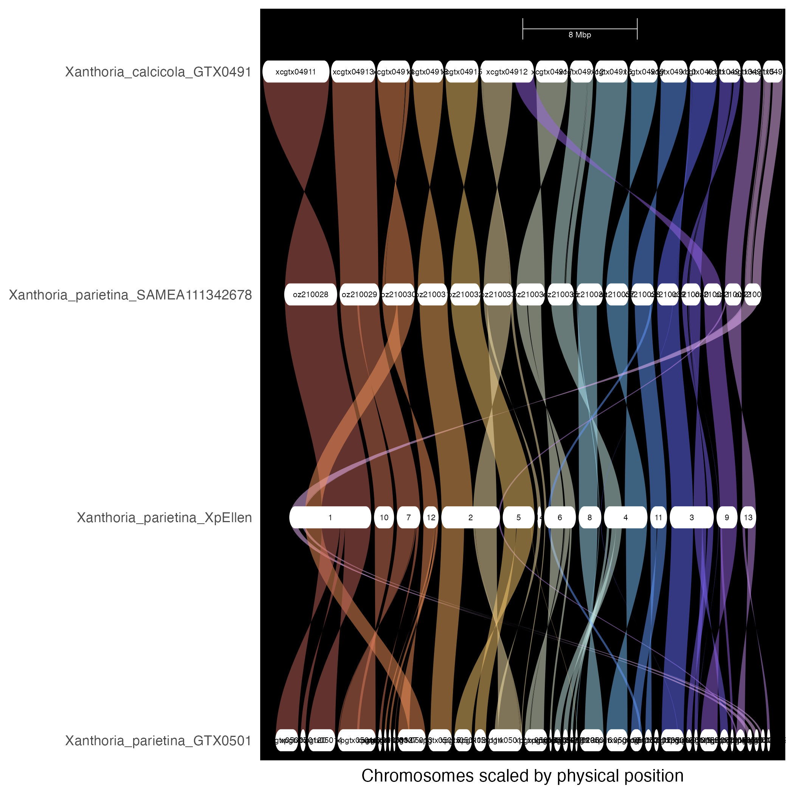

```{r setup, include=FALSE}
knitr::opts_chunk$set(echo = TRUE)
library(tidyverse)
```

* Make alignments for the whole genomes, and for the Starship regions

## 1. Install GENESPACE
* Install OrthoFinder
```{r,eval=F}
conda install -c bioconda orthofinder=2.5.5
export PATH="/usr/local/Caskroom/miniconda/base/bin:$PATH"
```
* Install JDK (java) from [here](https://www.oracle.com/uk/java/technologies/downloads/#jdk24-mac)
* Install MCScanX
```{r,eval=F}
cd ~/Documents/software
git clone https://github.com/wyp1125/MCScanX
cd MCScanX
make
```
* Install GENESPACE
```{r,eval=F}
devtools::install_github("jtlovell/GENESPACE")
BiocManager::install( "rtracklayer")
```

## 2. Format annotations
* Prepared folders
```{r,eval=F}
mkdir -p analysis_and_temp_files/06_genome_viz/workingDirectory/bed
mkdir -p analysis_and_temp_files/06_genome_viz/workingDirectory/peptide
```
* Need to get annotations in bed format
```{r}
bed1 <- read.delim2("../analysis_and_temp_files/03_starfish/ann/Xanthoria_calcicola_GTX0491.annotations.txt")[,c(4,5,6,2)]
bed1$TranscriptID <- str_replace(bed1$TranscriptID,"FUN_","XANCAGTX0491_")
write.table(bed1, "../analysis_and_temp_files/06_genome_viz/workingDirectory/bed/Xanthoria_calcicola_GTX0491.bed",sep="\t",quote = F, row.names = F, col.names=F)

bed2 <- read.delim2("../analysis_and_temp_files/03_starfish/ann/Xanthoria_parietina_GTX0501.annotations.txt")[,c(4,5,6,2)]
bed2$TranscriptID <- str_replace(bed2$TranscriptID,"FUN_","XANPAGTX0501_")
write.table(bed2, "../analysis_and_temp_files/06_genome_viz/workingDirectory/bed/Xanthoria_parietina_GTX0501.bed",sep="\t",quote = F, row.names = F, col.names=F)

bed3 <- read.delim2("../analysis_and_temp_files/03_starfish/ann/Xanthoria_parietina_SAMEA111342678.annotations.txt")[,c(4,5,6,2)]
bed3$TranscriptID <- str_replace(bed3$TranscriptID,"FUN_","XANPAOZ2100_")
write.table(bed3, "../analysis_and_temp_files/06_genome_viz/workingDirectory/bed/Xanthoria_parietina_SAMEA111342678.bed",sep="\t",quote = F, row.names = F, col.names=F)

bed4 <- read.delim2("../analysis_and_temp_files/03_starfish/ann/Xanthoria_parietina_SAMEA115359166.annotations.txt")[,c(4,5,6,2)]
bed4$TranscriptID <- str_replace(bed4$TranscriptID,"FUN_","XANPARI20_")
write.table(bed4, "../analysis_and_temp_files/06_genome_viz/workingDirectory/bed/Xanthoria_parietina_SAMEA115359166.bed",sep="\t",quote = F, row.names = F, col.names=F)
```
* Save fasta files with headings matching the bed file
```{r,message=FALSE}
library(Biostrings)
fa1<- readAAStringSet("../analysis_and_temp_files/03_starfish/genomes/Xanthoria_calcicola_GTX0491.proteins.fa")
names(fa1)<-sub("\\s.*", "", names(fa1))
writeXStringSet(fa1,"../analysis_and_temp_files/06_genome_viz/workingDirectory/peptide/Xanthoria_calcicola_GTX0491.fa")

fa2<- readAAStringSet("../analysis_and_temp_files/03_starfish/genomes/Xanthoria_parietina_GTX0501.proteins.fa")
names(fa2)<-sub("\\s.*", "", names(fa2))
writeXStringSet(fa2,"../analysis_and_temp_files/06_genome_viz/workingDirectory/peptide/Xanthoria_parietina_GTX0501.fa")

fa3<- readAAStringSet("../analysis_and_temp_files/03_starfish/genomes/Xanthoria_parietina_SAMEA111342678.proteins.fa")
names(fa3)<-sub("\\s.*", "", names(fa3))
writeXStringSet(fa3,"../analysis_and_temp_files/06_genome_viz/workingDirectory/peptide/Xanthoria_parietina_SAMEA111342678.fa")

fa4<- readAAStringSet("../analysis_and_temp_files/03_starfish/genomes/Xanthoria_parietina_SAMEA115359166.proteins.fa")
names(fa4)<-sub("\\s.*", "", names(fa4))
writeXStringSet(fa4,"../analysis_and_temp_files/06_genome_viz/workingDirectory/peptide/Xanthoria_parietina_SAMEA115359166.fa")
```

## 3. Plot global synteny
* Started this run, which generated tmp folder, but failed at Orthofinder step
```{r,eval=F}
library(GENESPACE)
gpar <- init_genespace(
  wd = "../analysis_and_temp_files/06_genome_viz/workingDirectory", 
  path2mcscanx = "/Users/gol22pin/Documents/software/MCScanX")
gpar <- run_genespace(gsParam = gpar) 

```

* Ran Orthfinder separately on hpc
```{r,eval=FALSE}
source package fc91613f-1095-4f67-b5aa-b86d702b36da

orthofinder -f analysis_and_temp_files/06_genome_viz/workingDirectory/tmp -t 4 -a 1 -X -o analysis_and_temp_files/06_genome_viz/workingDirectory/orthofinder
```
* Copied the Orthofinder results in the `analysis_and_temp_files/06_genome_viz/workingDirectory/orthofinder`
```{r,eval=F}
library(GENESPACE)
gpar <- init_genespace(
  wd = "../analysis_and_temp_files/06_genome_viz/workingDirectory", 
  path2mcscanx = "/Users/gol22pin/Documents/software/MCScanX"
  )
gpar <- run_genespace(gsParam = gpar, overwrite = T) 


plot_riparian(
  gsParam = gpar, 
  refGenome = "Xanthoria_parietina_SAMEA111342678", 
  useOrder = F, 
  useRegions = F,
  forceRecalcBlocks = T,
   syntenyWeight = 0.8,
  genomeIDs = c("Xanthoria_parietina_GTX0501","Xanthoria_parietina_SAMEA115359166",
               "Xanthoria_parietina_SAMEA111342678", "Xanthoria_calcicola_GTX0491"))
ggsave("../results/global_synteny.pdf")
ggsave("../analysis_and_temp_files/06_genome_viz/global_synteny.png")
```

```{r}

```


## 6. Plot region alignments
### 6.1. Starship zooming out
* plot the elements with 200 Kbp flanking regions

#### Prep files
* Extracted the contigs hosting elements and empty sites
  * element 1 refers to our starship
```{r,eval=F}
source package c92263ec-95e5-43eb-a527-8f1496d56f1a 
samtools faidx analysis_and_temp_files/03_starfish/genomes/Xanthoria_calcicola_GTX0491.scaffolds.fa XcGTX0491_4 > analysis_and_temp_files/06_genome_viz/element1.fa

samtools faidx analysis_and_temp_files/03_starfish/genomes/Xanthoria_parietina_SAMEA111342678.scaffolds.fa OZ2100_30 >> analysis_and_temp_files/06_genome_viz/element1.fa

samtools faidx analysis_and_temp_files/03_starfish/genomes/Xanthoria_parietina_SAMEA115359166.scaffolds.fa scaffold_12 >> analysis_and_temp_files/06_genome_viz/element1.fa

samtools faidx analysis_and_temp_files/03_starfish/genomes/Xanthoria_parietina_GTX0501.scaffolds.fa XpGTX0501_31 >> analysis_and_temp_files/06_genome_viz/element1.fa

samtools faidx analysis_and_temp_files/03_starfish/genomes/Xanthoria_parietina_GTX0501.scaffolds.fa XpGTX0501_3 >> analysis_and_temp_files/06_genome_viz/element1.fa
```
* Aligned genomes with nucmer. I already have alignment between GTX0491 and SAMEA111342678 genome. Now made similar alignment for SAMEA111342678 and SAMEA115359166
```{r,eval=F}
source package eab121cb-2eb8-49c1-a9a5-a33754ea9fea 

nucmer  --prefix=OZ2100_SAMEA115359166_mummer --mum   analysis_and_temp_files/03_starfish/genomes/Xanthoria_parietina_SAMEA111342678.scaffolds.fa analysis_and_temp_files/03_starfish/genomes/Xanthoria_parietina_SAMEA115359166.scaffolds.fa

mv OZ2100_SAMEA115359166_mummer.delta  analysis_and_temp_files/06_genome_viz/
  
show-coords -r -c -l analysis_and_temp_files/06_genome_viz/OZ2100_SAMEA115359166_mummer.delta > analysis_and_temp_files/06_genome_viz/OZ2100_SAMEA115359166_mummer.coords


nucmer  --prefix=Xcalc_SAMEA115359166_mummer --mum   analysis_and_temp_files/03_starfish/genomes/Xanthoria_calcicola_GTX0491.scaffolds.fa analysis_and_temp_files/03_starfish/genomes/Xanthoria_parietina_SAMEA115359166.scaffolds.fa 

mv Xcalc_SAMEA115359166_mummer.delta  analysis_and_temp_files/06_genome_viz/
  
show-coords -r -c -l analysis_and_temp_files/06_genome_viz/Xcalc_SAMEA115359166_mummer.delta > analysis_and_temp_files/06_genome_viz/Xcalc_SAMEA115359166_mummer.coords

nucmer  --prefix=Xcalc_GTX0501_mummer --mum   analysis_and_temp_files/03_starfish/genomes/Xanthoria_calcicola_GTX0491.scaffolds.fa analysis_and_temp_files/03_starfish/genomes/Xanthoria_parietina_GTX0501.scaffolds.fa 

mv Xcalc_GTX0501_mummer.delta  analysis_and_temp_files/06_genome_viz/
  
show-coords -r -c -l analysis_and_temp_files/06_genome_viz/Xcalc_GTX0501_mummer.delta > analysis_and_temp_files/06_genome_viz/Xcalc_GTX0501_mummer.coords


nucmer  --prefix=GTX0501_SAMEA115359166_mummer --mum   analysis_and_temp_files/03_starfish/genomes/Xanthoria_parietina_GTX0501.scaffolds.fa analysis_and_temp_files/03_starfish/genomes/Xanthoria_parietina_SAMEA115359166.scaffolds.fa

mv GTX0501_SAMEA115359166_mummer.delta  analysis_and_temp_files/06_genome_viz/
  
show-coords -r -c -l analysis_and_temp_files/06_genome_viz/GTX0501_SAMEA115359166_mummer.delta > analysis_and_temp_files/06_genome_viz/GTX0501_SAMEA115359166_mummer.coords


```

* GC%
```{r,eval=F}
samtools faidx analysis_and_temp_files/06_genome_viz/element1.fa
bedtools makewindows -g  analysis_and_temp_files/06_genome_viz/element1.fa.fai  -w 50 > analysis_and_temp_files/06_genome_viz/element1.bed
bedtools nuc -fi analysis_and_temp_files/06_genome_viz/element1.fa -bed analysis_and_temp_files/06_genome_viz/element1.bed > analysis_and_temp_files/06_genome_viz/element1_GC.txt
```


#### Use gggenomes to visualize 
* Made sequences for the elements plus 200 kbp on each side (in the case of the empty site, got 200,000 on either side of the empty site)
* For GTX0501, included ends of both contigs into which starship got split (for Xp_GTX0501_31 it's the entire contig, for Xp_GTX0501_3 used 276559 first bp)
* As boundaries for Starship in GTX0501, used the boundaries of the genes that belonged to the same OG as the genes flanking Starship in other genomes: 
  * On Xp_GTX0501_31 it's XANPAGTX0501_010271 (OG0005234; 121841)
  * On Xp_GTX0501_3 it's XANPAGTX0501_001731-T1 (OG0000030; 105480)
```{r}
library(gggenomes)
#remotes::install_github("thackl/thacklr")
#df for sequences
seqs <- tibble::tibble(seq_id = c("OZ2100_30","scaffold_12","XpGTX0501_31","XpGTX0501_3","XcGTX0491_4"),
  start = c(104726,445177,1,1,1600315),
  end = c(606787,947238,164270,316559,2102376),
  bin_id = c("X. parietina SAMEA111342678", "X. parietina SAMEA115359166", "X. parietina GTX0501","X. parietina GTX0501","X. calcicola GTX0491"))
seqs$length<-seqs$end - seqs$start +1

#make a df for the starship
feat_star <- data.frame("seq_id" = c("OZ2100_30","scaffold_12","XpGTX0501_31","XpGTX0501_3"), 
    start = c(304726,662355,121841,1),
    end=	c(406787,747238,164270,105480),feat_id=rep("Tangerine",4)) 

#make a df for genes
xp1_genes <- read.delim2("../analysis_and_temp_files/03_starfish/genomes/Xanthoria_parietina_SAMEA111342678.gff3",skip=1,header=F)
xp1_genes <- xp1_genes %>% filter(V1=="OZ2100_30",V4>104726,V5<606787)

xp2_genes <- read.delim2("../analysis_and_temp_files/03_starfish/genomes/Xanthoria_parietina_SAMEA115359166.gff3",skip=1,header=F)
xp2_genes <- xp2_genes %>% filter(V1=="scaffold_12",V4>462355,V5<947238)

xp3_genes <- read.delim2("../analysis_and_temp_files/03_starfish/genomes/Xanthoria_parietina_GTX0501.gff3",skip=1,header=F)
xp3_genes <- xp3_genes %>% filter(V1=="XpGTX0501_31" |
                                   (V1=="XpGTX0501_3"&V5<276559) )

xc_genes <- read.delim2("../analysis_and_temp_files/03_starfish/genomes/Xanthoria_calcicola_GTX0491.gff3",skip=1,header=F)
xc_genes <- xc_genes %>% filter(V1=="XcGTX0491_4",V4>1652373,V5<2052376)

site1 <- rbind(xp1_genes,xp2_genes,xp3_genes ,xc_genes)
write.table(site1,"../analysis_and_temp_files/06_genome_viz/site1.gff",quote=F,col.names=F,row.names=F,sep="\t")

genes <- read_feats("../analysis_and_temp_files/06_genome_viz/site1.gff") %>% filter(type=="CDS")
genes$feat_id <- genes$name
genes$feat_id <- str_replace(genes$feat_id,".cds","")

#df for alignments
library(SVbyEye)
nucmer2PAF2 <- function (nucmer.coords = NULL) 
{
  if (!is.null(nucmer.coords)) {
    if (file.exists(nucmer.coords)) {
      coords <- utils::read.table(nucmer.coords, skip = 5, 
        stringsAsFactors = FALSE)
      coords.tb <- tibble::tibble(qname = coords$V18, 
        qlen = coords$V12, qstart = coords$V1, 
        qend = coords$V2, strand = ifelse(coords$V4 < 
          coords$V5, "+", "-"), tname = coords$V19, 
        tlen = coords$V13, tstart = pmin(coords$V4, 
          coords$V5), tend = pmax(coords$V4, coords$V5), 
        nmatch = coords$V10, alen = coords$V8, mapq = NA)
    }
    else {
      coords.tb <- NULL
    }
    return(coords.tb)
  }
}

links1 <- nucmer2PAF2("../analysis_and_temp_files/06_genome_viz/OZ2100_SAMEA115359166_mummer.coords") %>% filter(qname=="OZ2100_30",alen>3000)
colnames(links1)[1:10] <- c("seq_id","length","start","end","strand",
                          "seq_id2","length2","start2","end2","pid")
links2 <- nucmer2PAF2("../analysis_and_temp_files/06_genome_viz/Xcalc_GTX0501_mummer.coords") %>% filter(qname=="XcGTX0491_4",alen>3000)
colnames(links2)[1:10] <- c("seq_id","length","start","end","strand",
                          "seq_id2","length2","start2","end2","pid")
links3 <- nucmer2PAF2("../analysis_and_temp_files/06_genome_viz/GTX0501_SAMEA115359166_mummer.coords") %>% filter(tname=="scaffold_12",alen>3000)
colnames(links3)[1:10] <- c("seq_id","length","start","end","strand",
                          "seq_id2","length2","start2","end2","pid")
 links <- rbind(links1,links2,links3) %>% filter(pid>=90)

##gc%
gc <- thacklr::read_bed("../analysis_and_temp_files/06_genome_viz/element1_GC.txt") %>%
  select(-strand)

#add LRARs
lrar<-rbind(read.delim2("../analysis_and_temp_files/02_annotate/Xc_GTX0491_LRAR.csv",sep=","),
read.delim2("../analysis_and_temp_files/02_annotate/Xp_GCA964656405_LRAR.csv",sep=","),
read.delim2("../analysis_and_temp_files/02_annotate/Xp_GTX0501_LRAR.csv",sep=","),
read.delim2("../analysis_and_temp_files/02_annotate/Xp_SAMEA115359166_LRAR.csv",sep=",") ) %>%
  select(Name,Start,End) %>% 
  dplyr::rename(seq_id = Name,start=Start,end=End) %>% 
  mutate(feat_id="LRAR")
lrar$seq_id[lrar$seq_id=="ENA|OZ210030|OZ210030.1 Xanthoria parietina genome assembly, chromosome: 3"]<-"OZ2100_30"
lrar$seq_id[lrar$seq_id=="ENA|OZ210039|OZ210039.1 Xanthoria parietina genome assembly, chromosome: 12"]<-"OZ2100_39"
lrar$seq_id<-str_replace(lrar$seq_id,"Xp_GTX0501","XpGTX0501")
  
gggenomes(seqs = seqs,genes = genes,links = links) %>%
  gggenomes::add_feats(gc,feat_star) %>%
  flip(c(2,4)) +
  geom_seq()+ 
 geom_feat(data=feats(feat_star),alpha=.4, linewidth=3, position="identity", color = "#D95F02")+
    geom_gene(fill="#7F8080",color="#7F8080")+geom_link()+
  geom_wiggle(aes(z = score), offset = -.3, height = .3,
              fill="blue", alpha=.5)+
  geom_seq_label()

ggsave("../results/starship_zooming_out.pdf",width=4,height = 4)
```


### 6.2. Starship zooming in
* Showing 
```{r,message=FALSE,warning=FALSE}
#make a new table with Orthgroup-derived annotations
ortho <-read.delim2("../analysis_and_temp_files/05_HGT/Orthofinder/Results_May21/Orthogroups.tsv") 

ortho_assignments <- ortho %>% select(Orthogroup,Xanthoria_parietina_SAMEA111342678.proteins,Xanthoria_parietina_SAMEA115359166.proteins,Xanthoria_calcicola_GTX0491.proteins,Xanthoria_parietina_GTX0501.proteins) %>% 
  pivot_longer(-Orthogroup,names_to="genome",values_to = "feat_id") %>%
  separate_longer_delim(feat_id,", ") %>%
  mutate(cluster_id2 = case_when(
    Orthogroup=="OG0000084" ~ "OG0000084: captain",
    Orthogroup=="OG0006598" ~ "OG0006598: Methyltransferase",
    Orthogroup=="OG0007437" ~ "OG0007437: NLR",
    Orthogroup=="OG0000444" ~ "OG0000444: DUF3723",
    Orthogroup=="OG0000266" ~ "OG0000266: PLP",
    !(Orthogroup %in% c("OG0000084","OG0006598","OG0007437","OG0000444","OG0000266")) ~
        "other")) %>%
  dplyr::rename(cluster_id= Orthogroup)

#make new df for sequences, now shorter span
seqs <- tibble::tibble(seq_id = c("OZ2100_30","scaffold_12","XpGTX0501_31","XpGTX0501_3","XcGTX0491_4"),
  start = c(285000,582355,101841,1,1755000),
  end = c(475000,767238,164270,125480,1940000),
  bin_id = c("X. parietina SAMEA111342678", "X. parietina SAMEA115359166", "X. parietina GTX0501","X. parietina GTX0501","X. calcicola GTX0491"))
seqs$length<-seqs$end - seqs$start +1


gggenomes(seqs = seqs, genes = genes,) %>% 
  add_clusters(ortho_assignments) %>%
  add_feats(lrar,feat_star ) %>%
  flip(c(4,2))+
  geom_seq()+ 
  geom_feat(data=feats(feat_star),alpha=.4, linewidth=3, position="identity", color = "#D95F02")+
  geom_feat(data=feats(lrar),linewidth=1.5, position="identity", color = "#bfd8ff")+
  geom_gene(aes(color=cluster_id2,fill=cluster_id2))+
  geom_link() +
  geom_seq_label(size=4)+
  scale_fill_manual(values=c("OG0006598: Methyltransferase"="#F8766D",
   "OG0007437: NLR"="#00a9ff","OG0000532: flanking gene"="#a2fcbd",
   "other OG present in X. parietina SAMEA111342678"="#5c5c5c",
   "OG absent from X. parietina SAMEA111342678"="#dbdbdb",
   "OG0000084: captain" = "#66A61E",
   "OG0000444: DUF3723" = "#A6761D",
   "OG0000266: PLP" = "#E6AB02"))+
  scale_color_manual(values=c("OG0006598: Methyltransferase"="#F8766D",
   "OG0007437: NLR"="#00a9ff","OG0000532: flanking gene"="#a2fcbd",
   "other OG present in X. parietina SAMEA111342678"="#5c5c5c",
   "OG absent from X. parietina SAMEA111342678"="#dbdbdb",
   "OG0000084: captain" = "#66A61E",
   "OG0000444: DUF3723" = "#A6761D",
   "OG0000266: PLP" = "#E6AB02",
   "Other"=""))+
  theme(legend.text = element_text(size=7),
      legend.titile = element_text(size=8),
      legend.position="bottom")+
  labs(fill="",color="")
  

ggsave("../results/starship_zooming_in.pdf",width=8,height = 4)
```

## 6.3 Starship fossil: element2

#### Prep files
* Extracted the contigs 
```{r,eval=F}
source package c92263ec-95e5-43eb-a527-8f1496d56f1a 
samtools faidx analysis_and_temp_files/03_starfish/genomes/Xanthoria_calcicola_GTX0491.scaffolds.fa XcGTX0491_11 > analysis_and_temp_files/06_genome_viz/element2.fa

samtools faidx analysis_and_temp_files/03_starfish/genomes/Xanthoria_parietina_SAMEA111342678.scaffolds.fa OZ2100_39 >> analysis_and_temp_files/06_genome_viz/element2.fa

samtools faidx analysis_and_temp_files/03_starfish/genomes/Xanthoria_parietina_SAMEA115359166.scaffolds.fa scaffold_3 >> analysis_and_temp_files/06_genome_viz/element2.fa

samtools faidx analysis_and_temp_files/03_starfish/genomes/Xanthoria_parietina_GTX0501.scaffolds.fa XpGTX0501_9 >> analysis_and_temp_files/06_genome_viz/element2.fa
```

* GC%
```{r,eval=F}
samtools faidx analysis_and_temp_files/06_genome_viz/element2.fa
bedtools makewindows -g  analysis_and_temp_files/06_genome_viz/element2.fa.fai  -w 50 > analysis_and_temp_files/06_genome_viz/element2.bed
bedtools nuc -fi analysis_and_temp_files/06_genome_viz/element2.fa -bed analysis_and_temp_files/06_genome_viz/element2.bed > analysis_and_temp_files/06_genome_viz/element2_GC.txt
```

* Plot 250 Kbp flanking outside of the methyltransferase gene
```{r}
library(gggenomes)
#remotes::install_github("thackl/thacklr")
#df for sequences
seqs <- tibble::tibble(seq_id = c("OZ2100_39","scaffold_3","XpGTX0501_9","XcGTX0491_11"),
  start = c(677029,775391, 716882 ,698780),
  end = c(1177029,1275391,1216882,1198780),
  bin_id = c("X. parietina SAMEA111342678", "X. parietina SAMEA115359166", "X. parietina GTX0501","X. calcicola GTX0491"))
seqs$length<-seqs$end - seqs$start +1


#make a df for genes
xp1_genes2 <- read.delim2("../analysis_and_temp_files/03_starfish/genomes/Xanthoria_parietina_SAMEA111342678.gff3",skip=1,header=F)
xp1_genes2 <- xp1_genes2 %>% filter(V1=="OZ2100_39")

xp2_genes2 <- read.delim2("../analysis_and_temp_files/03_starfish/genomes/Xanthoria_parietina_SAMEA115359166.gff3",skip=1,header=F)
xp2_genes2 <- xp2_genes2 %>% filter(V1=="scaffold_3")

xp3_genes2 <- read.delim2("../analysis_and_temp_files/03_starfish/genomes/Xanthoria_parietina_GTX0501.gff3",skip=1,header=F)
xp3_genes2 <- xp3_genes2 %>% filter(V1=="XpGTX0501_9")

xc_genes2 <- read.delim2("../analysis_and_temp_files/03_starfish/genomes/Xanthoria_calcicola_GTX0491.gff3",skip=1,header=F)
xc_genes2 <- xc_genes2 %>% filter(V1=="XcGTX0491_11")

site2 <- rbind(xp1_genes2,xp2_genes2,xp3_genes2 ,xc_genes2)
write.table(site2,"../analysis_and_temp_files/06_genome_viz/site2.gff",quote=F,col.names=F,row.names=F,sep="\t")

genes <- read_feats("../analysis_and_temp_files/06_genome_viz/site2.gff") %>% filter(type=="CDS")
genes$feat_id <- genes$name
genes$feat_id <- str_replace(genes$feat_id,".cds","")


links1 <- nucmer2PAF2("../analysis_and_temp_files/06_genome_viz/OZ2100_SAMEA115359166_mummer.coords") %>% filter(qname=="OZ2100_39",alen>3000)
colnames(links1)[1:10] <- c("seq_id","length","start","end","strand",
                          "seq_id2","length2","start2","end2","pid")
links2 <- nucmer2PAF2("../analysis_and_temp_files/06_genome_viz/Xcalc_GTX0501_mummer.coords") %>% filter(qname=="XcGTX0491_11",alen>3000)
colnames(links2)[1:10] <- c("seq_id","length","start","end","strand",
                          "seq_id2","length2","start2","end2","pid")
links3 <- nucmer2PAF2("../analysis_and_temp_files/06_genome_viz/GTX0501_SAMEA115359166_mummer.coords") %>% filter(tname=="scaffold_3",alen>3000)
colnames(links3)[1:10] <- c("seq_id","length","start","end","strand",
                          "seq_id2","length2","start2","end2","pid")
 links2 <- rbind(links1,links2,links3) %>% filter(pid>=90)

##gc%
gc <- thacklr::read_bed("../analysis_and_temp_files/06_genome_viz/element2_GC.txt") %>%
  select(-strand)

#add clustering to highlight the methyltransferase
methyl<-data.frame("cluster_id"="OG0006598: Methyltransferase",
           "feat_id"="XANCAGTX0491_008091-T1")

#add layer for the fossil
feat_fossil <- data.frame("seq_id" ="XcGTX0491_11", 
    start = 886500,end=	994500,feat_id="Tangerine") 

  
gggenomes(seqs = seqs,genes = genes,links = links2) %>%
  add_feats(lrar,gc,feat_fossil) %>%
    add_clusters(methyl) %>%
  flip(c(4)) +
  geom_seq()+ 
 geom_feat(data=feats(lrar),linewidth=1.5, position="identity", color = "#bfd8ff")+
  geom_feat(data=feats(feat_fossil),alpha=.4, linewidth=3, position="identity", color = "#D95F02")+
  geom_gene(aes(color=cluster_id,fill=cluster_id))+geom_link()+
  geom_wiggle(data=feats(gc),aes(z = score), offset = -.3, height = .3,
              fill="blue", alpha=.5)+
  geom_seq_label()+
  theme(legend.text = element_text(size=7),
      legend.titile = element_text(size=8),
      legend.position="none")

ggsave("../results/starship_fossil.pdf",width=4,height = 4)
```

