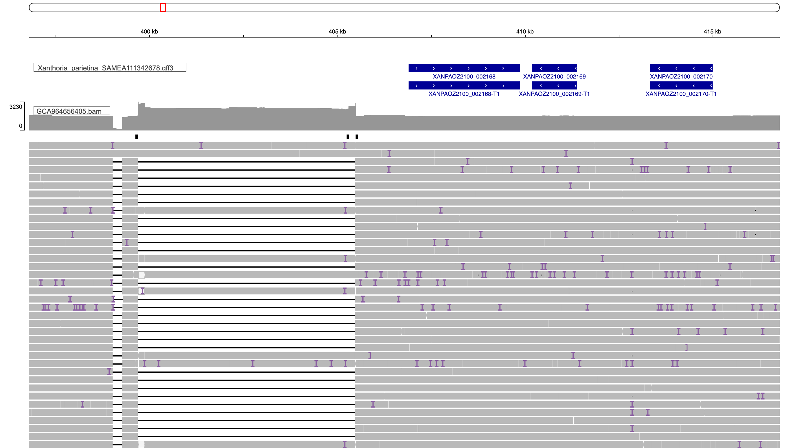
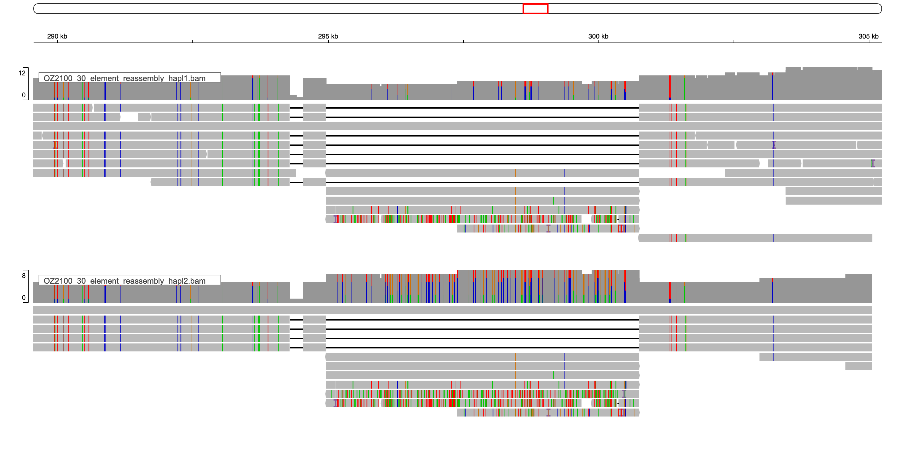

```{r setup, include=FALSE}
knitr::opts_chunk$set(echo = TRUE)
library(tidyverse)
library(kableExtra)
```

* There is a weird pattern of coverage in the end of the element, suggesting that there might be two variants (see `04_search_genomes.html`). WIll try to see if we can describe it as a structural variant

>Element end: OZ2100_30:396787-416787 (10 Kbp up and downstream of the element end) at the end of the element (399-405.5 kbp) has heterogeneity, where some reads span the entire region, but others have a gap there. The coverage is also uneven in 315-341 kbp (which is a region in the middle of the element with no genes). In the regions with genes, the coverage is even

```{r}

```

## 1.Extract the region
* Make a bed file for the element plus 200 kbp on each side
```{r,eval=F}
nano  analysis_and_temp_files/07_reassemble/element_flank.bed

OZ2100_30  104726	606787	
```
* Extract the reads. Got 102,725 reads
```{r,eval=F}
source package c92263ec-95e5-43eb-a527-8f1496d56f1a

samtools view -b -L analysis_and_temp_files/07_reassemble/element_flank.bed analysis_and_temp_files/03_starfish/read_alignments/GCA964656405.bam > analysis_and_temp_files/07_reassemble/OZ2100_30_element_flank.bam

samtools fastq analysis_and_temp_files/07_reassemble/OZ2100_30_element_flank.bam > analysis_and_temp_files/07_reassemble/OZ2100_30_element_flank.fastq
```

## 2. Re-assemble with Hifiasm
#### Reassemble a portion of reads: didn't work, as the reads were extracted not randomly
* To many reads can cause assembly fragmentation
* Looked at the stats:
  * 102,725 reads
  * Avg length: 8070.7 bp
  * Total length: 829,061,630 bp
```{r,eval=F}
source package cf33bb3d-b7c0-450b-ac7d-ebedff25d497 

readlength.sh in=analysis_and_temp_files/07_reassemble/OZ2100_30_element_flank.fastq out=analysis_and_temp_files/07_reassemble/OZ2100_30_element_read_lengths_histogram.txt
```
* Subsampled first 30,000 reads.
```{r,eval=F}
head analysis_and_temp_files/07_reassemble/OZ2100_30_element_flank.fastq -n 120000 > analysis_and_temp_files/07_reassemble/OZ2100_30_element_flank_subset.fastq
gzip analysis_and_temp_files/07_reassemble/OZ2100_30_element_flank.fastq
gzip analysis_and_temp_files/07_reassemble/OZ2100_30_element_flank_subset.fastq
```
* Assembled
```{r,eval=F}
sbatch --mem=100G -c 20 --wrap="source package 3c087633-18b1-4e77-9b08-7e68657fce66; hifiasm -o analysis_and_temp_files/07_reassemble/OZ2100_30_element_subset -t 20 analysis_and_temp_files/07_reassemble/OZ2100_30_element_flank_subset.fastq.gz"
```
* Extracted fasta
```{r,eval=F}
awk '/^S/{print ">"$2;print $3}' analysis_and_temp_files/07_reassemble/OZ2100_30_element_subset.bp.hap1.p_ctg.gfa  > analysis_and_temp_files/07_reassemble/OZ2100_30_element_subset_hapl1.fa 

awk '/^S/{print ">"$2;print $3}' analysis_and_temp_files/07_reassemble/OZ2100_30_element_subset.bp.hap2.p_ctg.gfa  > analysis_and_temp_files/07_reassemble/OZ2100_30_element_subset_hapl2.fa 
```
* This time, fewer contigs (26 and 13 respectively), but still, the longest is only 103,981 bp
```{r,eval=F}
source package 1041444f-cd25-4107-a5c7-5e86cb1728fe
seqkit fx2tab --length --name --header-line  analysis_and_temp_files/07_reassemble/OZ2100_30_element_subset_hapl2.fa  > analysis_and_temp_files/07_reassemble/OZ2100_30_element_reassembly_lengths.txt
```

* Let's map this assembly onto the original 
```{r,eval=F}
source package c92263ec-95e5-43eb-a527-8f1496d56f1a 
source package 222eac79-310f-4d4b-8e1c-0cece4150333

samtools faidx analysis_and_temp_files/03_starfish/genomes/Xanthoria_parietina_SAMEA111342678.scaffolds.fa OZ2100_30:104726-606787 > analysis_and_temp_files/07_reassemble/OZ2100_30_element_flank.fa

samtools faidx analysis_and_temp_files/07_reassemble/OZ2100_30_element_flank.fa

minimap2 -ax asm5 -t 20 analysis_and_temp_files/07_reassemble/OZ2100_30_element_flank.fa analysis_and_temp_files/07_reassemble/OZ2100_30_element_subset_hapl2.fa | samtools sort -@8 -o analysis_and_temp_files/07_reassemble/OZ2100_30_element_subset_hapl2.bam

samtools index analysis_and_temp_files/07_reassemble/OZ2100_30_element_subset_hapl2.bam

minimap2 -ax asm5 -t 20 analysis_and_temp_files/07_reassemble/OZ2100_30_element_flank.fa analysis_and_temp_files/07_reassemble/OZ2100_30_element_subset_hapl1.fa | samtools sort -@8 -o analysis_and_temp_files/07_reassemble/OZ2100_30_element_subset_hapl1.bam

samtools index analysis_and_temp_files/07_reassemble/OZ2100_30_element_subset_hapl1.bam

```

#### Reassemble all reads
* Assembled the reads with Hifiasm v0.18.5
```{r,eval=F}
sbatch --mem=100G -c 20 --wrap="source package 3c087633-18b1-4e77-9b08-7e68657fce66; hifiasm -o analysis_and_temp_files/07_reassemble/OZ2100_30_element_reassembly -t 20 analysis_and_temp_files/07_reassemble/OZ2100_30_element_flank.fastq.gz"
```
* Extracted fasta
```{r,eval=F}
awk '/^S/{print ">"$2;print $3}' analysis_and_temp_files/07_reassemble/OZ2100_30_element_reassembly.bp.hap1.p_ctg.gfa  > analysis_and_temp_files/07_reassemble/OZ2100_30_element_reassembly_hapl1.fa 

awk '/^S/{print ">"$2;print $3}' analysis_and_temp_files/07_reassemble/OZ2100_30_element_reassembly.bp.hap2.p_ctg.gfa  > analysis_and_temp_files/07_reassemble/OZ2100_30_element_reassembly_hapl2.fa 
```
* Get lengths. Got many contigs (153 in haplotype 1 and 96 in haplotype 2), longest at 254939 bp
```{r,eval=F}
source package 1041444f-cd25-4107-a5c7-5e86cb1728fe
seqkit fx2tab --length --name --header-line  analysis_and_temp_files/07_reassemble/OZ2100_30_element_reassembly_hapl1.fa  
```
* Let's map this assembly onto the original 
```{r,eval=F}
source package c92263ec-95e5-43eb-a527-8f1496d56f1a 
source package 222eac79-310f-4d4b-8e1c-0cece4150333

samtools faidx analysis_and_temp_files/03_starfish/genomes/Xanthoria_parietina_SAMEA111342678.scaffolds.fa OZ2100_30:104726-606787 > analysis_and_temp_files/07_reassemble/OZ2100_30_element_flank.fa

samtools faidx analysis_and_temp_files/07_reassemble/OZ2100_30_element_flank.fa

minimap2 -ax asm5 -t 20 analysis_and_temp_files/07_reassemble/OZ2100_30_element_flank.fa analysis_and_temp_files/07_reassemble/OZ2100_30_element_reassembly_hapl2.fa | samtools sort -@8 -o analysis_and_temp_files/07_reassemble/OZ2100_30_element_reassembly_hapl2.bam

samtools index analysis_and_temp_files/07_reassemble/OZ2100_30_element_reassembly_hapl2.bam

minimap2 -ax asm5 -t 20 analysis_and_temp_files/07_reassemble/OZ2100_30_element_flank.fa analysis_and_temp_files/07_reassemble/OZ2100_30_element_reassembly_hapl1.fa | samtools sort -@8 -o analysis_and_temp_files/07_reassemble/OZ2100_30_element_reassembly_hapl1.bam

samtools index analysis_and_temp_files/07_reassemble/OZ2100_30_element_reassembly_hapl1.bam
```

* In the end, Hifiasm created many contigs mapping onto this region, some of them nearly identical to each other. Not sure it really makes things better compared to looking at the read alignments
```{r}

```

## 3. Detecting SVs with Sniffles
```{r,eval=F}
source package abadc7d5-fa74-4687-98da-6014b6864c8c

sniffles --input analysis_and_temp_files/07_reassemble/OZ2100_30_element_flank.bam --snf analysis_and_temp_files/07_reassemble/OZ2100_30_element_flank_sniffles.snf --vcf analysis_and_temp_files/07_reassemble/OZ2100_30_element_flank_sniffles.vcf
```
* Sniffles outputs 16 SVs, of which 10 are within the Starship, 4 are upstream and 2 are downstream
* Of the SVs inside the element, we got:
  * Five deletions with VAF 0.4-0.5, including the one at the end of the element that attracted my attention earlier
  * Three insertions with VAF >0.9, including the one at the beginning of the element that attracted my attention earlier
  * One breakpoint at >0.9 VAF
  * One insertion at 0.29 VAF
* In relations to the genes inside the element:
  * Six fall in the gap between the captain and XANPAOZ2100_002163 (the gap goes 307018-361239)
  * Three fall in the space between the last gene (XANPAOZ2100_002167 ends at 376212) and the end of the element
  * Sniffles2.INS.2BS2 (position 362686, 1282 bp) overlaps with exon2 of XANPAOZ2100_002164-T1 (DUF3723 protein; the exon goes 362108-362922, - strand)
* Saved the table as `../results/SV.txt`
```{r,message=F}
library(vcfR)
library(stringr)

vcf <- read.vcfR("../analysis_and_temp_files/07_reassemble/OZ2100_30_element_flank_sniffles.vcf", verbose = FALSE)

# Make a table with all the relevant info
vcf2 <- data.frame("Position"=getPOS(vcf),
 "ID"= getID(vcf),
 "Filter" = getFILTER(vcf),
 "Quality" = getQUAL(vcf),
 "Info" = getINFO(vcf)
 )

vcf2$SV_type <- gsub(".*SVTYPE=(.*?);.*", "\\1", vcf2$Info)
vcf2$SV_length <- gsub(".*SVLEN=(.*?);.*", "\\1", vcf2$Info)
vcf2$Supporting_reads <- gsub(".*SUPPORT=(.*?);.*", "\\1", vcf2$Info)
vcf2$Variant_Allele_Frequency <- gsub(".*VAF=(.*?)$", "\\1", vcf2$Info)
vcf2$SV_length[vcf2$SV_type=="BND"]<-NA
vcf2$Filter[vcf2$Filter=="GT"]<-"GT: low number of supporting reads"
vcf2$SV_type[vcf2$SV_type=="DEL"]<-"DEL (deletion)"
vcf2$SV_type[vcf2$SV_type=="INS"]<-"INS (insertion)"
vcf2$SV_type[vcf2$SV_type=="BND"]<-"BND (break point)"

vcf2 <- vcf2 %>% mutate(Position_relative_Starship = case_when(
  Position < 304726 ~ "Upstream",
  Position > 304726 & Position < 406787 ~ "Inside the element",
  Position > 406787 ~ "Downstream")) %>%
  select(ID,Position,Position_relative_Starship,Filter,Quality,
     SV_type, SV_length,Supporting_reads, Variant_Allele_Frequency  )

write.table(vcf2, "../results/SV.txt",sep="\t",quote = F, row.names = F, col.names=T)
vcf2 %>% kable(format = "html", col.names = colnames(vcf2)) %>%
  kable_styling() %>%
  kableExtra::scroll_box(width = "100%", height = "300px")
```


#### Looking into the SV potentially disruption an exon
* Checked more closely Sniffles2.INS.2BS2
* Aligned the gene's CDS, the region in the assembly for all three X.p. assemblies, and one of the reads with this insertion
* Saved the alignment as `analysis_and_temp_files/07_reassemble/SV_Sniffles2.INS.2BS2_aligned.fasta`
* The insertion isn't in frame
* Identical insertion is present in the corresponding gene in SAMEA115359166 genome (XANPARI20_008749-T1), but the gene in GTX0501 (XANPAGTX0501_001720) is identical to the non-insertion variant in the SAMEA111342678 genome
* Potentially, an intron


