```{r setup, include=FALSE}
library(knitr)
library(tidyverse)
library(kableExtra)
knitr::opts_chunk$set(echo = TRUE)
```

**Summary:** explore how our captain relates to oher YRs, both in sequence and structure


## 1. Checking annotations
* Our captains are very short, and also the annotation is inconsistent between the genomes. Maybe the protein sequence that we have is truncated and there's more protein in the N-term (can't argue with the C-term, the stop codon is consistently present in all genomes at the same place)
* It's possible that the gene boundaries are erroneous, since as we learned later the captain isn't expressed very much in the RNA seq from pure culture (see `08_transcriptomics`)

#### Look at sequences: 5' end
* Extracted fasta of the captain gene in our three genomes (plus ~1kBp flank) and just looked at the annotations
```{r,eval=F}
samtools faidx analysis_and_temp_files/03_starfish/genomes/Xanthoria_parietina_SAMEA111342678.scaffolds.fa OZ2100_30:305000-30800

samtools faidx analysis_and_temp_files/03_starfish/genomes/Xanthoria_parietina_GTX0501.scaffolds.fa XpGTX0501_3:5000-9000

samtools faidx analysis_and_temp_files/03_starfish/genomes/Xanthoria_parietina_SAMEA115359166.scaffolds.fa XpGTX0501_3:744000-746000
```
* In SAMEA111342678, we have the shortest gene model
  * The gene is split between two exons, first is only 2 aa long. Its sequence is ML and it's preceeded by a stop codon. The intron between is only 17 bp. The second exon starts with LLQ
  * If instead of having an intron, we extand the second exon to the left, for the first 8 aa we get a perfect match to other Tangerine captains. The similarity breaks down after and in 32 aa we hit a stop-codon. 
  * In a different reading frame, we have an alternative first exon (306116-306445), which together with the second exon would make this protein a perfect match to XANPAGTX0501_001716-T1 (which also consists of two exons)
* In SAMEA115359166, the first exon also needs extending to the N-term
* If we extend the exons as described above, the 3 proteins are the same 
  * the forth bonus sequence (XANPAGTX0501_010272-T1) which resulted form Tangerine being split in GTX0501 genome is the same as the original captian in SAMEA115359166 and can be extended the same way
* In principle, it is possible to add exons in the beginning and extend the proteins further. By adding some (admittedly complicates) arrangement of 3 additional exons, we can get sequence similar to grascr1_687 (a sequence from the Starfish paper, form a lichen fungus, that on my sequence-based tree was in the same clade as our captains).
  * Contrargument: it's not clear how reliable grascr1_687 sequence is to begin with
  * The RNA data doesn't really support this (see below)


#### Cross-referencing with RNA data
* To check the annotations aligned the RNA library with the highest level of captain expression (XBA2) and another one for comparison (XBA1). Used STAR aligner and aligned the two libraries independently to each of the three genomes
```{r,eval=F}
source package /tgac/software/testing/bin/STAR-2.5.4b 
source package /tgac/software/testing/bin/gcc-4.9.1 
source package aeee87c4-1923-4732-aca2-f2aff23580cc
mkdir analysis_and_temp_files/09_captain/GTX0501_STAR_index -p
STAR --runThreadN 10  --genomeSAindexNbases 6 \
--runMode genomeGenerate \
--genomeDir analysis_and_temp_files/09_captain/GTX0501_STAR_index \
--genomeFastaFiles analysis_and_temp_files/03_starfish/genomes/Xanthoria_parietina_GTX0501.scaffolds.fa

mkdir analysis_and_temp_files/09_captain/SAMEA115359166_STAR_index -p
STAR --runThreadN 10  --genomeSAindexNbases 6 \
--runMode genomeGenerate \
--genomeDir analysis_and_temp_files/09_captain/SAMEA115359166_STAR_index \
--genomeFastaFiles analysis_and_temp_files/03_starfish/genomes/Xanthoria_parietina_SAMEA115359166.scaffolds.fa

mkdir analysis_and_temp_files/09_captain/SAMEA111342678_STAR_index -p
STAR --runThreadN 10  --genomeSAindexNbases 6 \
--runMode genomeGenerate \
--genomeDir analysis_and_temp_files/09_captain/SAMEA111342678_STAR_index \
--genomeFastaFiles analysis_and_temp_files/03_starfish/genomes/Xanthoria_parietina_SAMEA111342678.scaffolds.fa

sbatch --mem=100G -c 20 --wrap="code/star_align.sh \
/tsl/data/reads/ntalbot/lichen_tissue_rna1/xba2/xba2/raw/XBA2_1.fq.gz \
/tsl/data/reads/ntalbot/lichen_tissue_rna1/xba2/xba2/raw/XBA2_2.fq.gz \
analysis_and_temp_files/09_captain/GTX0501_STAR_index/touch 20 analysis_and_temp_files/09_captain/XBA2_to_GTX0501.bam"

sbatch --mem=100G -c 20 --wrap="code/star_align.sh \
/tsl/data/reads/ntalbot/lichen_tissue_rna1/xba2/xba2/raw/XBA2_1.fq.gz \
/tsl/data/reads/ntalbot/lichen_tissue_rna1/xba2/xba2/raw/XBA2_2.fq.gz \
analysis_and_temp_files/09_captain/SAMEA115359166_STAR_index/touch 20 analysis_and_temp_files/09_captain/XBA2_to_SAMEA115359166.bam"

sbatch --mem=100G -c 20 --wrap="code/star_align.sh \
/tsl/data/reads/ntalbot/lichen_tissue_rna1/xba2/xba2/raw/XBA2_1.fq.gz \
/tsl/data/reads/ntalbot/lichen_tissue_rna1/xba2/xba2/raw/XBA2_2.fq.gz \
analysis_and_temp_files/09_captain/SAMEA111342678_STAR_index/touch 20 analysis_and_temp_files/09_captain/XBA2_to_SAMEA111342678.bam"

samtools index analysis_and_temp_files/09_captain/XBA2_to_GTX0501Aligned.sortedByCoord.out.bam  
samtools index analysis_and_temp_files/09_captain/XBA2_to_SAMEA115359166Aligned.sortedByCoord.out.bam
samtools index analysis_and_temp_files/09_captain/XBA2_to_SAMEA111342678Aligned.sortedByCoord.out.bam

sbatch --mem=100G -c 20 --wrap="code/star_align.sh \
/tsl/data/reads/ntalbot/lichen_tissue_rna1/xba1/xba1/raw/XBA1_1.fq.gz \
/tsl/data/reads/ntalbot/lichen_tissue_rna1/xba1/xba1/raw/XBA1_2.fq.gz \
analysis_and_temp_files/09_captain/GTX0501_STAR_index/touch 20 analysis_and_temp_files/09_captain/XBA1_to_GTX0501.bam"

sbatch --mem=100G -c 20 --wrap="code/star_align.sh \
/tsl/data/reads/ntalbot/lichen_tissue_rna1/xba1/xba1/raw/XBA1_1.fq.gz \
/tsl/data/reads/ntalbot/lichen_tissue_rna1/xba1/xba1/raw/XBA1_2.fq.gz \
analysis_and_temp_files/09_captain/SAMEA115359166_STAR_index/touch 20 analysis_and_temp_files/09_captain/XBA1_to_SAMEA115359166.bam"

sbatch --mem=100G -c 20 --wrap="code/star_align.sh \
/tsl/data/reads/ntalbot/lichen_tissue_rna1/xba1/xba1/raw/XBA1_1.fq.gz \
/tsl/data/reads/ntalbot/lichen_tissue_rna1/xba1/xba1/raw/XBA1_2.fq.gz \
analysis_and_temp_files/09_captain/SAMEA111342678_STAR_index/touch 20 analysis_and_temp_files/09_captain/XBA1_to_SAMEA111342678.bam"

samtools index analysis_and_temp_files/09_captain/XBA1_to_GTX0501Aligned.sortedByCoord.out.bam  
samtools index analysis_and_temp_files/09_captain/XBA1_to_SAMEA111342678Aligned.sortedByCoord.out.bam
samtools index analysis_and_temp_files/09_captain/XBA1_to_SAMEA115359166Aligned.sortedByCoord.out.bam

```

* XBA2 data is consistent with the exon boundaries in the model XANPAGTX0501_001716-T1, for all 3 genomes. The upstream region (where I thought might be additional exons) has some read mapped, but on much smaller coverage, and there are no reads bridging the gap (the way the are reads split between existing exons 1 and 2)
  * Here is XANPAGTX0501_001716-T1, which is the one already consistent with RNA
```{r, echo=FALSE}
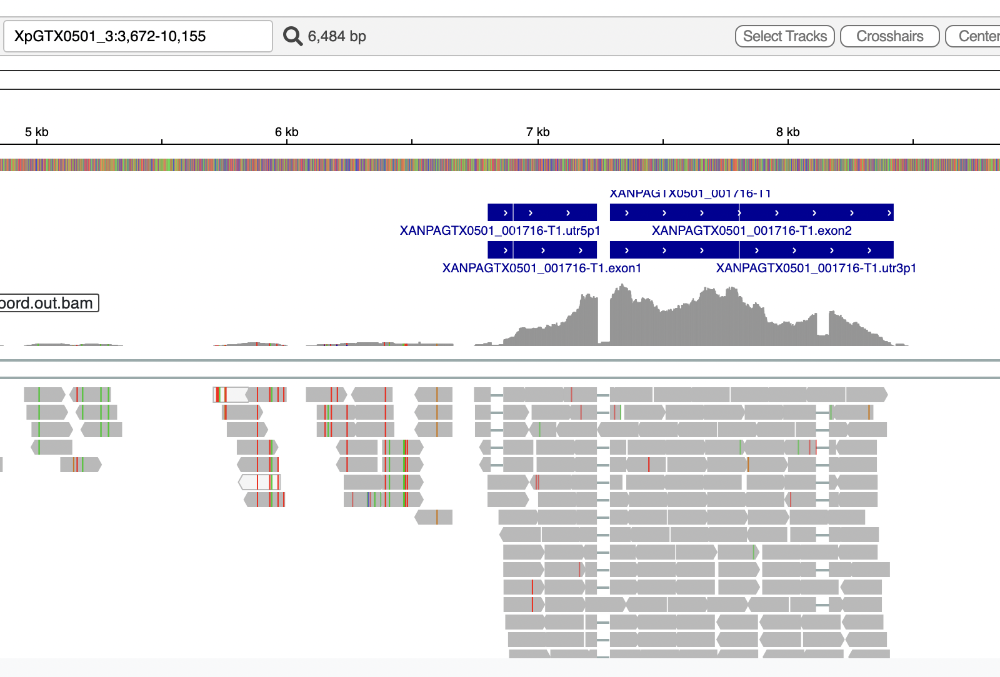
```

  * Here is XANPAOZ2100_002162-T1, which was the shortest one. I marked how the exon should be corrected
```{r, echo=FALSE}
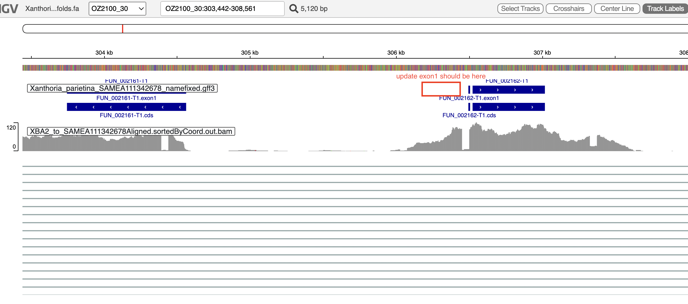
```

  * Here is XANPARI20_008752-T1, which also needs to be extended but not as much (in this genome the gene is on the -strand, that's why the orientation is different)
```{r, echo=FALSE}
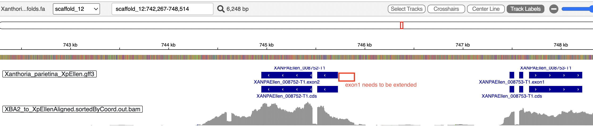
```

* The other lichen sample, XBA1, looks the same

#### Look at sequences: 3' end
* In all three genomes, the stop codon is always in the same place. There can be no argument about potential introns, since RNA coverage has no gaps there 
* Interestingly there's an intron-like gap in coverage (although not as clear-cut) after the stop-codon, in the 3' UTR.
* Could it be that the gene is 'supposed' to be longer but a recent mutation broke it? if it happened recently enough, it's concivable that tthe gene would still be transcribed
  * Point-mutation resulting in a nonsence mutation can be rejected, since there is another stop codon just a few aa later
```{r, echo=FALSE}
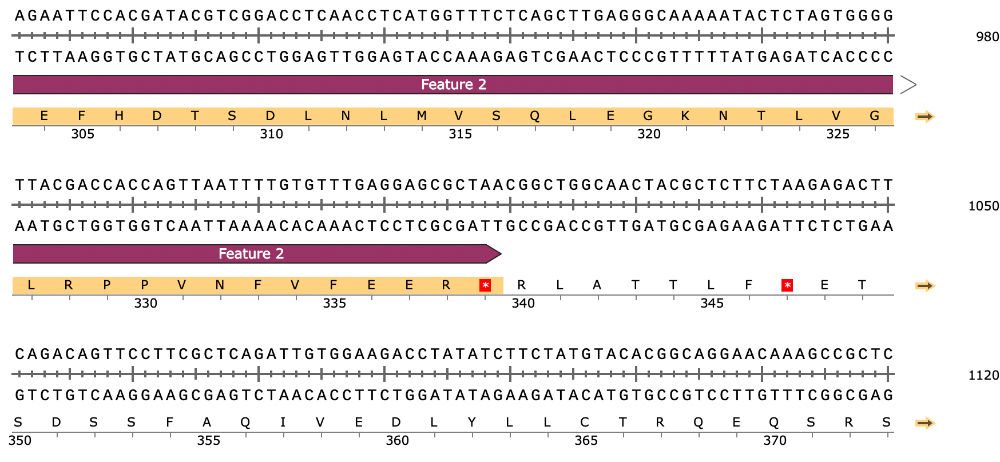
```

  * A mutation resulting in a frame shift is possible. Looking at different frames, I can get a stretch with no stop-codons for 43 aa (shifting frame 1 bp to the right) and 50 aa (2 bp shift). I tried aligning these sequences to the grascr1_687 sequence (which in the laignment extends further than our captains in the C-term), but these were not matching anything
* Here can conclude that the gene does end here. Cannot rule out a recent mutation that resulted in a frame shift and a premature ORF end, but it seems unlikely

#### Finalize sequences
* It appears that the best course of action is to correct the first exon in XANPARI20_008752-T1 and XANPAOZ2100_002162-T1 in accordance with the RNA data, but keep XANPAGTX0501_001716-T1 as is
  * NB: for XANPAOZ2100_002162-T1 both exons needed to be corrected, for XANPARI20_008752-T1 only second
* Use corrected intron boundaries to produce corrected CDS sequences for XANPARI20_008752-T1 and XANPAOZ2100_002162-T1
```{r,eval=F}
echo ">XANPAOZ2100_002162-T1 XANPAOZ2100_002162" > analysis_and_temp_files/09_captain/fixed_annotations/XANPAOZ2100_002162.cds.fa
samtools faidx analysis_and_temp_files/03_starfish/genomes/Xanthoria_parietina_SAMEA111342678.scaffolds.fa OZ2100_30:306115-306448 | tail -n +2  >> analysis_and_temp_files/09_captain/fixed_annotations/XANPAOZ2100_002162.cds.fa
samtools faidx analysis_and_temp_files/03_starfish/genomes/Xanthoria_parietina_SAMEA111342678.scaffolds.fa OZ2100_30:306501-307018 | tail -n +2 >> analysis_and_temp_files/09_captain/fixed_annotations/XANPAOZ2100_002162.cds.fa

echo ">XANPARI20_008752-T1 XANPARI20_008752" > analysis_and_temp_files/09_captain/fixed_annotations/XANPARI20_008752.cds.fa
samtools faidx analysis_and_temp_files/03_starfish/genomes/Xanthoria_parietina_SAMEA115359166.scaffolds.fa scaffold_12:745516-745849 -i | tail -n +2  >> analysis_and_temp_files/09_captain/fixed_annotations/XANPARI20_008752.cds.fa
samtools faidx analysis_and_temp_files/03_starfish/genomes/Xanthoria_parietina_SAMEA115359166.scaffolds.fa scaffold_12:744946-745463 -i | tail -n +2 >> analysis_and_temp_files/09_captain/fixed_annotations/XANPARI20_008752.cds.fa
```
* Translate CDS to protein
```{r,eval=F}
source package a684a2ed-d23f-4025-aa81-b21e27e458df 
transeq -frame 1 -sformat pearson -sequence analysis_and_temp_files/09_captain/fixed_annotations/XANPAOZ2100_002162.cds.fa -outseq analysis_and_temp_files/09_captain/fixed_annotations/XANPAOZ2100_002162.protein.fa

transeq -frame 1 -sformat pearson -sequence analysis_and_temp_files/09_captain/fixed_annotations/XANPARI20_008752.cds.fa -outseq analysis_and_temp_files/09_captain/fixed_annotations/XANPARI20_008752.protein.fa
```
* Manually fixed gff3 and protein files, saved in `analysis_and_temp_files/09_captain/fixed_annotations`

### While we're at it, let's check intron boundaries for other genes too
* Checked RNA alignemnts, and just like with the copatains, annotations from GTX0501 are most relible
* Will correct annotations from the two new genomes to match
* blast cds from GTX0501 to the other two genomes
* will not correct the unannotated models, there it's a bit too complicated to sort out which gene boundaries are correct
```{r,eval=F}
source package c92263ec-95e5-43eb-a527-8f1496d56f1a 
source package d6092385-3a81-49d9-b044-8ffb85d0c446 

#XANPARI20_008749
samtools faidx ../02_long_read_assemblies/analysis_and_temp_files/06_annotate_lecanoro/GTX0501_pred/annotate_results/Xanthoria_parietina_GTX0501.cds-transcripts.fa XANPAGTX0501_001720-T2 > analysis_and_temp_files/09_captain/fixed_annotations/XANPAGTX0501_001720.cds.fa

blastn -query analysis_and_temp_files/09_captain/fixed_annotations/XANPAGTX0501_001720.cds.fa -subject analysis_and_temp_files/03_starfish/genomes/Xanthoria_parietina_SAMEA115359166.scaffolds.fa -outfmt 6
XANPAGTX0501_001720-T2  scaffold_12     99.828  583     1       0       657     1239    701769  702351  0.0     1072
XANPAGTX0501_001720-T2  scaffold_12     100.000 424     0       0       1       424     699780  700203  0.0     784
XANPAGTX0501_001720-T2  scaffold_12     100.000 237     0       0       424     660     700254  700490  3.01e-122       438

echo ">XANPARI20_008749-T1 fixed" > analysis_and_temp_files/09_captain/fixed_annotations/XANPARI20_008749.cds.fa
samtools faidx analysis_and_temp_files/03_starfish/genomes/Xanthoria_parietina_SAMEA115359166.scaffolds.fa scaffold_12:699780-700203| tail -n +2  >> analysis_and_temp_files/09_captain/fixed_annotations/XANPARI20_008749.cds.fa
samtools faidx analysis_and_temp_files/03_starfish/genomes/Xanthoria_parietina_SAMEA115359166.scaffolds.fa scaffold_12:700255-700490  | tail -n +2  >> analysis_and_temp_files/09_captain/fixed_annotations/XANPARI20_008749.cds.fa
samtools faidx analysis_and_temp_files/03_starfish/genomes/Xanthoria_parietina_SAMEA115359166.scaffolds.fa scaffold_12:701773-702351 | tail -n +2  >> analysis_and_temp_files/09_captain/fixed_annotations/XANPARI20_008749.cds.fa

transeq -frame 1 -sformat pearson -sequence analysis_and_temp_files/09_captain/fixed_annotations/XANPARI20_008749.cds.fa -outseq analysis_and_temp_files/09_captain/fixed_annotations/XANPARI20_008749.protein.fa

#XANPARI20_008748
samtools faidx ../02_long_read_assemblies/analysis_and_temp_files/06_annotate_lecanoro/GTX0501_pred/annotate_results/Xanthoria_parietina_GTX0501.cds-transcripts.fa XANPAGTX0501_001721-T1 > analysis_and_temp_files/09_captain/fixed_annotations/XANPAGTX0501_001721.cds.fa

blastn -query analysis_and_temp_files/09_captain/fixed_annotations/XANPAGTX0501_001721.cds.fa -subject analysis_and_temp_files/03_starfish/genomes/Xanthoria_parietina_SAMEA115359166.scaffolds.fa -outfmt 6
XANPAGTX0501_001721-T1  scaffold_12     100.000 1025    0       0       1       1025    699579  698555  0.0     1893
XANPAGTX0501_001721-T1  scaffold_12     99.820  557     0       1       1022    1577    698508  697952  0.0     1022
XANPAGTX0501_001721-T1  scaffold_12     100.000 376     0       0       2007    2382    697326  696951  0.0     695
XANPAGTX0501_001721-T1  scaffold_12     100.000 351     0       0       1576    1926    697901  697551  0.0     649
XANPAGTX0501_001721-T1  scaffold_12     100.000 56      0       0       1924    1979    697505  697450  2.42e-21        104
XANPAGTX0501_001721-T1  scaffold_12     100.000 28      0       0       1980    2007    697402  697375  8.90e-06        52.8

echo ">XANPARI20_008748-T1 fixed" > analysis_and_temp_files/09_captain/fixed_annotations/XANPARI20_008748.cds.fa; samtools faidx analysis_and_temp_files/03_starfish/genomes/Xanthoria_parietina_SAMEA115359166.scaffolds.fa scaffold_12:698555-699579 -i | tail -n +2  >> analysis_and_temp_files/09_captain/fixed_annotations/XANPARI20_008748.cds.fa; samtools faidx analysis_and_temp_files/03_starfish/genomes/Xanthoria_parietina_SAMEA115359166.scaffolds.fa scaffold_12:697952-698503 -i | tail -n +2  >> analysis_and_temp_files/09_captain/fixed_annotations/XANPARI20_008748.cds.fa; samtools faidx analysis_and_temp_files/03_starfish/genomes/Xanthoria_parietina_SAMEA115359166.scaffolds.fa scaffold_12:697551-697899 -i | tail -n +2  >> analysis_and_temp_files/09_captain/fixed_annotations/XANPARI20_008748.cds.fa; samtools faidx analysis_and_temp_files/03_starfish/genomes/Xanthoria_parietina_SAMEA115359166.scaffolds.fa scaffold_12:697450-697502 -i | tail -n +2  >> analysis_and_temp_files/09_captain/fixed_annotations/XANPARI20_008748.cds.fa; samtools faidx analysis_and_temp_files/03_starfish/genomes/Xanthoria_parietina_SAMEA115359166.scaffolds.fa scaffold_12:697375-697402 -i | tail -n +2  >> analysis_and_temp_files/09_captain/fixed_annotations/XANPARI20_008748.cds.fa; samtools faidx analysis_and_temp_files/03_starfish/genomes/Xanthoria_parietina_SAMEA115359166.scaffolds.fa scaffold_12:696951-697325 -i | tail -n +2  >> analysis_and_temp_files/09_captain/fixed_annotations/XANPARI20_008748.cds.fa

transeq -frame 1 -sformat pearson -sequence analysis_and_temp_files/09_captain/fixed_annotations/XANPARI20_008748.cds.fa -outseq analysis_and_temp_files/09_captain/fixed_annotations/XANPARI20_008748.protein.fa

#XANPAOZ2100_002165

blastn -query analysis_and_temp_files/09_captain/fixed_annotations/XANPAGTX0501_001721.cds.fa -subject analysis_and_temp_files/03_starfish/genomes/Xanthoria_parietina_SAMEA111342678.scaffolds.fa -outfmt 6
XANPAGTX0501_001721-T1  OZ2100_30       100.000 1025    0       0       1       1025    363598  364622  0.0     1893
XANPAGTX0501_001721-T1  OZ2100_30       99.820  557     0       1       1022    1577    364669  365225  0.0     1022
XANPAGTX0501_001721-T1  OZ2100_30       100.000 376     0       0       2007    2382    365851  366226  0.0     695
XANPAGTX0501_001721-T1  OZ2100_30       100.000 351     0       0       1576    1926    365276  365626  0.0     649
XANPAGTX0501_001721-T1  OZ2100_30       100.000 56      0       0       1924    1979    365672  365727  2.44e-21        104
XANPAGTX0501_001721-T1  OZ2100_30       100.000 28      0       0       1980    2007    365775  365802  8.96e-06        52.8

echo ">XANPAOZ2100_002165-T1 fixed" > analysis_and_temp_files/09_captain/fixed_annotations/XANPAOZ2100_002165.cds.fa; samtools faidx analysis_and_temp_files/03_starfish/genomes/Xanthoria_parietina_SAMEA111342678.scaffolds.fa OZ2100_30:363598-364622 | tail -n +2  >> analysis_and_temp_files/09_captain/fixed_annotations/XANPAOZ2100_002165.cds.fa; samtools faidx analysis_and_temp_files/03_starfish/genomes/Xanthoria_parietina_SAMEA111342678.scaffolds.fa OZ2100_30:364674-365225 | tail -n +2  >> analysis_and_temp_files/09_captain/fixed_annotations/XANPAOZ2100_002165.cds.fa; samtools faidx analysis_and_temp_files/03_starfish/genomes/Xanthoria_parietina_SAMEA111342678.scaffolds.fa OZ2100_30:365278-365626 | tail -n +2  >> analysis_and_temp_files/09_captain/fixed_annotations/XANPAOZ2100_002165.cds.fa; samtools faidx analysis_and_temp_files/03_starfish/genomes/Xanthoria_parietina_SAMEA111342678.scaffolds.fa OZ2100_30:365675-365727 | tail -n +2  >> analysis_and_temp_files/09_captain/fixed_annotations/XANPAOZ2100_002165.cds.fa; samtools faidx analysis_and_temp_files/03_starfish/genomes/Xanthoria_parietina_SAMEA111342678.scaffolds.fa OZ2100_30:365775-365802 | tail -n +2  >> analysis_and_temp_files/09_captain/fixed_annotations/XANPAOZ2100_002165.cds.fa; samtools faidx analysis_and_temp_files/03_starfish/genomes/Xanthoria_parietina_SAMEA111342678.scaffolds.fa OZ2100_30:365852-366226 | tail -n +2  >> analysis_and_temp_files/09_captain/fixed_annotations/XANPAOZ2100_002165.cds.fa

transeq -frame 1 -sformat pearson -sequence analysis_and_temp_files/09_captain/fixed_annotations/XANPAOZ2100_002165.cds.fa -outseq analysis_and_temp_files/09_captain/fixed_annotations/XANPAOZ2100_002165.protein.fa

#XANPARI20_008746
samtools faidx ../02_long_read_assemblies/analysis_and_temp_files/06_annotate_lecanoro/GTX0501_pred/annotate_results/Xanthoria_parietina_GTX0501.cds-transcripts.fa XANPAGTX0501_001724-T1 > analysis_and_temp_files/09_captain/fixed_annotations/XANPAGTX0501_001724.cds.fa

blastn -query analysis_and_temp_files/09_captain/fixed_annotations/XANPAGTX0501_001724.cds.fa -subject analysis_and_temp_files/03_starfish/genomes/Xanthoria_parietina_SAMEA115359166.scaffolds.fa -outfmt 6
XANPAGTX0501_001724-T1  scaffold_12     99.963  2699    1       0       905     3603    690080  692778  0.0     4979
XANPAGTX0501_001724-T1  scaffold_12     100.000 431     0       0       118     548     689106  689536  0.0     797
XANPAGTX0501_001724-T1  scaffold_12     100.000 228     0       0       677     904     689794  690021  8.94e-117       422
XANPAGTX0501_001724-T1  scaffold_12     100.000 133     0       0       547     679     689598  689730  5.77e-64        246
XANPAGTX0501_001724-T1  scaffold_12     100.000 119     0       0       1       119     688939  689057  3.50e-56        220

echo ">XANPARI20_008746-T1 fixed" > analysis_and_temp_files/09_captain/fixed_annotations/XANPARI20_008746.cds.fa; samtools faidx analysis_and_temp_files/03_starfish/genomes/Xanthoria_parietina_SAMEA115359166.scaffolds.fa scaffold_12:688939-689057 | tail -n +2  >> analysis_and_temp_files/09_captain/fixed_annotations/XANPARI20_008746.cds.fa; samtools faidx analysis_and_temp_files/03_starfish/genomes/Xanthoria_parietina_SAMEA115359166.scaffolds.fa scaffold_12:689108-689536 | tail -n +2  >> analysis_and_temp_files/09_captain/fixed_annotations/XANPARI20_008746.cds.fa; samtools faidx analysis_and_temp_files/03_starfish/genomes/Xanthoria_parietina_SAMEA115359166.scaffolds.fa scaffold_12:689600-689730 | tail -n +2  >> analysis_and_temp_files/09_captain/fixed_annotations/XANPARI20_008746.cds.fa; samtools faidx analysis_and_temp_files/03_starfish/genomes/Xanthoria_parietina_SAMEA115359166.scaffolds.fa scaffold_12:689797-690021 | tail -n +2  >> analysis_and_temp_files/09_captain/fixed_annotations/XANPARI20_008746.cds.fa; samtools faidx analysis_and_temp_files/03_starfish/genomes/Xanthoria_parietina_SAMEA115359166.scaffolds.fa scaffold_12:690080-692778 | tail -n +2  >> analysis_and_temp_files/09_captain/fixed_annotations/XANPARI20_008746.cds.fa

transeq -frame 1 -sformat pearson -sequence analysis_and_temp_files/09_captain/fixed_annotations/XANPARI20_008746.cds.fa -outseq analysis_and_temp_files/09_captain/fixed_annotations/XANPARI20_008746.protein.fa

#XANPARI20_008745
samtools faidx ../02_long_read_assemblies/analysis_and_temp_files/06_annotate_lecanoro/GTX0501_pred/annotate_results/Xanthoria_parietina_GTX0501.cds-transcripts.fa XANPAGTX0501_001728-T1 > analysis_and_temp_files/09_captain/fixed_annotations/XANPAGTX0501_001728.cds.fa

blastn -query analysis_and_temp_files/09_captain/fixed_annotations/XANPAGTX0501_001728.cds.fa -subject analysis_and_temp_files/03_starfish/genomes/Xanthoria_parietina_SAMEA115359166.scaffolds.fa -outfmt 6
XANPAGTX0501_001728-T1  scaffold_12     99.148  352     3       0       102     453     679275  678924  0.0     634
XANPAGTX0501_001728-T1  scaffold_12     94.819  193     10      0       9       201     679269  679077  1.46e-81        302
XANPAGTX0501_001728-T1  scaffold_12     94.118  136     8       0       116     251     679408  679273  3.27e-53        207
XANPAGTX0501_001728-T1  scaffold_12     94.615  130     7       0       23      152     679402  679273  1.52e-51        202
XANPAGTX0501_001728-T1  scaffold_12     100.000 45      0       0       9       53      679317  679273  5.75e-16        84.2

echo ">XANPARI20_008745-T1 fixed" > analysis_and_temp_files/09_captain/fixed_annotations/XANPARI20_008745.cds.fa;samtools faidx analysis_and_temp_files/03_starfish/genomes/Xanthoria_parietina_SAMEA115359166.scaffolds.fa -i scaffold_12:679302-679379 | tail -n +2  >> analysis_and_temp_files/09_captain/fixed_annotations/XANPARI20_008745.cds.fa; samtools faidx analysis_and_temp_files/03_starfish/genomes/Xanthoria_parietina_SAMEA115359166.scaffolds.fa -i scaffold_12:678924-679253 | tail -n +2  >> analysis_and_temp_files/09_captain/fixed_annotations/XANPARI20_008745.cds.fa

transeq -frame 1 -sformat pearson -sequence analysis_and_temp_files/09_captain/fixed_annotations/XANPARI20_008745.cds.fa -outseq analysis_and_temp_files/09_captain/fixed_annotations/XANPARI20_008745.protein.fa


#XANPAOZ2100_002167
blastn -query analysis_and_temp_files/09_captain/fixed_annotations/XANPAGTX0501_001724.cds.fa -subject analysis_and_temp_files/03_starfish/genomes/Xanthoria_parietina_SAMEA111342678.scaffolds.fa -outfmt 6
XANPAGTX0501_001724-T1  OZ2100_30       99.963  2699    1       0       905     3603    373097  370399  0.0     4979
XANPAGTX0501_001724-T1  OZ2100_30       100.000 431     0       0       118     548     374071  373641  0.0     797
XANPAGTX0501_001724-T1  OZ2100_30       100.000 228     0       0       677     904     373383  373156  9.01e-117       422
XANPAGTX0501_001724-T1  OZ2100_30       100.000 133     0       0       547     679     373579  373447  5.82e-64        246
XANPAGTX0501_001724-T1  OZ2100_30       100.000 119     0       0       1       119     374238  374120  3.53e-56        220

echo ">XANPAOZ2100_002167-T1 fixed" > analysis_and_temp_files/09_captain/fixed_annotations/XANPAOZ2100_002167.cds.fa; samtools faidx analysis_and_temp_files/03_starfish/genomes/Xanthoria_parietina_SAMEA111342678.scaffolds.fa OZ2100_30:374120-374238 -i | tail -n +2  >> analysis_and_temp_files/09_captain/fixed_annotations/XANPAOZ2100_002167.cds.fa; samtools faidx analysis_and_temp_files/03_starfish/genomes/Xanthoria_parietina_SAMEA111342678.scaffolds.fa OZ2100_30:373641-374069 -i | tail -n +2  >> analysis_and_temp_files/09_captain/fixed_annotations/XANPAOZ2100_002167.cds.fa; samtools faidx analysis_and_temp_files/03_starfish/genomes/Xanthoria_parietina_SAMEA111342678.scaffolds.fa OZ2100_30:373447-373577 -i | tail -n +2  >> analysis_and_temp_files/09_captain/fixed_annotations/XANPAOZ2100_002167.cds.fa; samtools faidx analysis_and_temp_files/03_starfish/genomes/Xanthoria_parietina_SAMEA111342678.scaffolds.fa OZ2100_30:373156-373380 -i | tail -n +2  >> analysis_and_temp_files/09_captain/fixed_annotations/XANPAOZ2100_002167.cds.fa; samtools faidx analysis_and_temp_files/03_starfish/genomes/Xanthoria_parietina_SAMEA111342678.scaffolds.fa OZ2100_30:370399-373097 -i | tail -n +2  >> analysis_and_temp_files/09_captain/fixed_annotations/XANPAOZ2100_002167.cds.fa

transeq -frame 1 -sformat pearson -sequence analysis_and_temp_files/09_captain/fixed_annotations/XANPAOZ2100_002167.cds.fa -outseq analysis_and_temp_files/09_captain/fixed_annotations/XANPAOZ2100_002167.protein.fa

```

## 2. Captain phylogeny
* Inserted our captains to the phylogeny from the [Starfish paper](https://academic.oup.com/nar/article/52/10/5496/7660083)
* Downloaded the sequences used in that paper from [Figshare](https://doi.org/10.6084/m9.figshare.24430447.v1) and saved all in the folder `data/captains`
* Here will use the file `data/captains/YRsuperfamRefs.faa`, which contains sequences of 1222 selected representative 
* As outgroup, added Crypton sequences fron fungi (AAO92638.2 and KAE8209120.1)
  * First is a Cryptococcus deneoformans sequence from ([Goodwin et al. 2003](https://www.microbiologyresearch.org/content/journal/micro/10.1099/mic.0.26529-0))
  * Second is Tilletia walkeri (Ustilaginomycotina), got it by blasting the first sequence

##### Using the whole lengths as input
* Add our captains
```{r,eval=F}
cp  data/captains/YRsuperfamRefs.faa  analysis_and_temp_files/09_captain/YRsuperfamRefs_plus_ours.faa

source package c92263ec-95e5-43eb-a527-8f1496d56f1a 
samtools faidx analysis_and_temp_files/03_starfish/genomes/Xanthoria_parietina_GTX0501.proteins.fa XANPAGTX0501_001716-T1 >> analysis_and_temp_files/09_captain/YRsuperfamRefs_plus_ours.faa

samtools faidx analysis_and_temp_files/09_captain/fixed_annotations/Xanthoria_parietina_SAMEA111342678.proteins.fa XANPAOZ2100_002162-T1 >> analysis_and_temp_files/09_captain/YRsuperfamRefs_plus_ours.faa

samtools faidx analysis_and_temp_files/09_captain/fixed_annotations/Xanthoria_parietina_SAMEA115359166.proteins.fa XANPARI20_008752-T1 >> analysis_and_temp_files/09_captain/YRsuperfamRefs_plus_ours.faa

```

* Aligned and clipped. Used the E-INS-i methods, same as in the Starfish paper; for clipping used 0.9 cut-off
```{r,eval=F}
source package  05bafab5-380c-4fe6-b5b6-3df70db09722
source package /tsl/software/testing/bin/trimal-latest 
source package /tgac/software/testing/bin/gcc-4.9.1 

mafft --ep 0 --genafpair --maxiterate 1000 --thread 20 analysis_and_temp_files/09_captain/YRsuperfamRefs_plus_ours.faa > analysis_and_temp_files/09_captain/YRsuperfamRefs_plus_ours_aligned.faa

trimal -in analysis_and_temp_files/09_captain/YRsuperfamRefs_plus_ours_aligned.faa -out analysis_and_temp_files/09_captain/YRsuperfamRefs_plus_ours_aligned.phyl -gt 0.1 -phylip  -keepheader

trimal -in analysis_and_temp_files/09_captain/YRsuperfamRefs_plus_ours_aligned.faa -out analysis_and_temp_files/09_captain/YRsuperfamRefs_plus_ours_aligned_trimmed.fa -gt 0.1 -keepheader

```

* Tree using the same parameters as in the Starfish paper ( with automated model selection, 1000 SH-ALRT iterations and 1000 ultrafast rapid bootstraps)
```{r,eval=F}
sbatch --mem=10G -c 20 --partition=nbi-long --wrap="source package /tgac/software/testing/bin/iqtree-2.2.2.2; iqtree2 -s analysis_and_temp_files/09_captain/YRsuperfamRefs_plus_ours_aligned.phyl -m MFP -alrt 1000 -B 1000 --threads-max 20"
```

* Prepped the dataset to visualize family assignments
  * Used Table S4 from the Starfish paper, saved as `data/captains/YRsuperfamRefs.txt`
```{r,message=FALSE,warning=FALSE}
library(ape)
library(ggtree)
library(fuzzyjoin)

famid<-read.delim2("../analysis_and_temp_files/09_captain/YRsuperfamRefs.txt",sep="\t")
tree<-read.tree("../analysis_and_temp_files/09_captain/YRsuperfamRefs_plus_ours_aligned.phyl.contree")

treedf <- data.frame("old"=tree$tip.label)
treedf <- treedf %>% fuzzy_join(famid %>% filter(), by = c("old"="geneID"), 
                          match_fun = list( stringr::str_detect),
                          mode="left") 


cat("DATASET_COLORSTRIP\nSEPARATOR COMMA\nDATASET_LABEL,Taxonomy\nLEGEND_TITLE,Taxonomy\nLEGEND_SHAPES,1,1,1,1,1,1,1,1,1\nLEGEND_COLORS,#ab180e,#f52416,#f28e46,#fad157,#f7d87c,#ffd1c2,#4840a3,#0f870f,#ffffff\nLEGEND_LABELS,fam01,fam02,fam03,fam04,fam05,clade01,clade02,clade03,n.d.\nDATA\n",file="../analysis_and_temp_files/09_captain/YRsuperfamRefs_plus_ours_aligned_itol.txt")
itol<-treedf %>% mutate(label = case_when(
  familyID=="fam01" ~ "#ab180e",
  familyID=="fam02" ~ "#f52416",
  familyID=="fam03" ~ "#f28e46",
  familyID=="fam04" ~ "#fad157",
  familyID=="fam05" ~ "#f7d87c",
  familyID=="clade01" ~ "#ffd1c2",
  familyID %in% c("clade02","fam06","fam07","fam08") ~ "#4840a3",
  familyID %in% c("clade03","fam09","fam10","fam11") ~ "#0f870f",
  familyID=="n.d." ~ "#ffffff",
  is.na(familyID)~ "#ffffff"
  )) %>%
  select(old,label)
write.table(itol,"../analysis_and_temp_files/09_captain/YRsuperfamRefs_plus_ours_aligned_itol.txt",append=TRUE,sep=",",quote = F, row.names = F, col.names=F)

#pointer to our clade
filename2<-"../analysis_and_temp_files/09_captain/YRsuperfamRefs_plus_ours_aligned_itol2.txt"
cat("DATASET_BINARY\nSEPARATOR,COMMA\nDATASET_LABEL,GOI\nCOLOR,#b30000\nFIELD_LABELS,GOI\nFIELD_COLORS,#b30000\nFIELD_SHAPES,5\nHEIGHT_FACTOR,2.5\nMARGIN,30\nDATA\n",file=filename2)
itol2<-itol %>%
  mutate(symbol=ifelse(grepl("XANPAO",old),1,-1)) %>% select(old,symbol)
write.table(itol2,filename2,append=TRUE,sep=",",quote = F, row.names = F, col.names=F)


```

* **Results:** the backbone of the tree is poorly supported. Perhaps the problem is that we didn't trim the tree to include only conserved domains

##### Using only conserved domains
* Following the Starfish paper, selected first 512 columns in the trimmed alignment produced above
```{r,eval=F}
source package /tsl/software/testing/bin/trimal-latest 
source package /tgac/software/testing/bin/gcc-4.9.1 

trimal -in analysis_and_temp_files/09_captain/YRsuperfamRefs_plus_ours_aligned_trimmed.fa -out analysis_and_temp_files/09_captain/YRsuperfamRefs_plus_ours_aligned_filtered.phyl -keepheader -phylip -selectcols { 512-929 }

```

* Tree using the same parameters as in the Starfish paper ( with automated model selection, 1000 SH-ALRT iterations and 1000 ultrafast rapid bootstraps)
```{r,eval=F}
sbatch --mem=50G -c 20 --partition=nbi-long --wrap="source package /tgac/software/testing/bin/iqtree-2.2.2.2; iqtree2 -s analysis_and_temp_files/09_captain/YRsuperfamRefs_plus_ours_aligned_filtered.phyl -m MFP -alrt 1000 --redo -B 1000 --threads-max 20"
```

* **Results:** 
  * the backbone of the tree is much better supported, but is not entirely consistent with the tree from Fig.1 from the Starfish paper, but it seems consistent with the Fig.5 tree? Regardless, clade1 part of the tree seems quite consistent across all, and this is the part that matters, so I am willing to ignore the inconsistencies in the clade2/clade3 relationship (my clade2 is nested within clade3)
  * our captains are in the basis of clade01. In this tree, removed all nodes with <80 bootstraps
```{r, echo=FALSE}
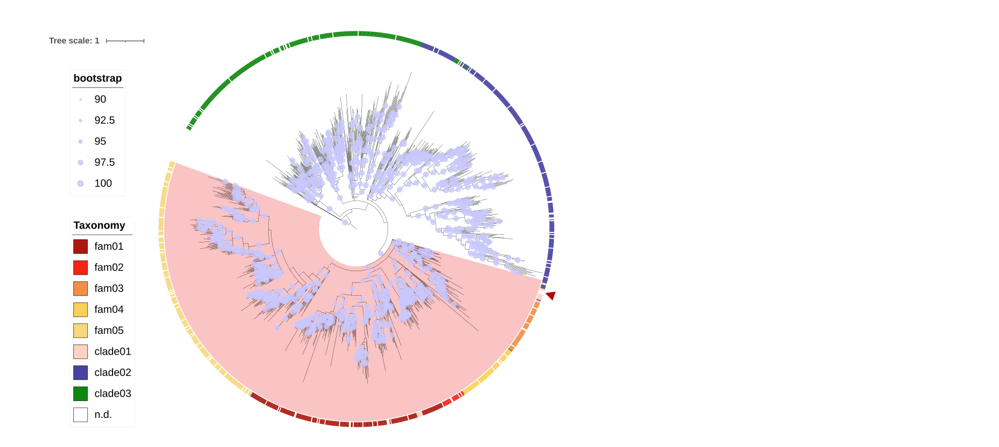
```

  * It's in a well-supported clade with other lecanoro clades
```{r, echo=FALSE}
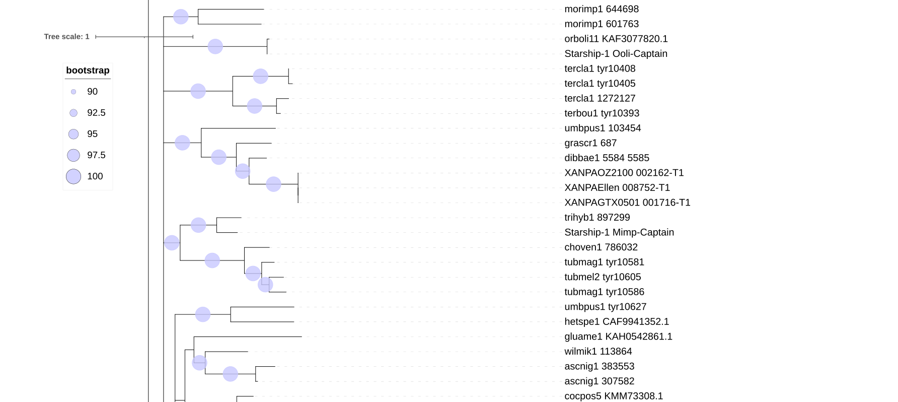
```


## 3. Structural analysis
#### Select proteins for structural predictions
* Will send to Angus our captains + a set of other captains from clade01
  * First made a curated list of 38 proteins including reps of all families (saved as `analysis_and_temp_files/03_starfish/YR_small_set.fa`)
  * Then added 262 randomly selected proteins from clade 1 to a total of 300 proteins
```{r}
library(Biostrings)

small_set <- names(readAAStringSet("../analysis_and_temp_files/09_captain/YR_small_set.fa"))

clade1_names <- treedf$geneID[!is.na(treedf$familyID) & 
  treedf$familyID %in% c("clade01","fam01","fam02","fam03","fam04","fam05") & 
    !(treedf$geneID %in% small_set)]

#select random 262 proteins
#set.seed(123)
#mid_set <- c(small_set,sample(clade1_names,262))
#write.table(mid_set,"../analysis_and_temp_files/09_captain/YR_mid_set_list.txt",sep="\t",quote = F, row.names = F,col.names=F)
#read in the selected proteins
mid_set<-read.delim2("../analysis_and_temp_files/09_captain/YR_mid_set_list.txt",header=F)[,1]

#save the fasta
fa <- readAAStringSet("../analysis_and_temp_files/09_captain/YRsuperfamRefs_plus_ours.faa")
mid_set_fa <- fa[names(fa) %in% mid_set]
writeXStringSet(mid_set_fa ,"../analysis_and_temp_files/09_captain/YR_mid_set.fa")

#save the table
mid_set_df <- treedf %>% filter(old %in% mid_set) %>% select(old,familyID) %>% dplyr::rename(geneID=old)
mid_set_df <- mid_set_df %>% left_join( data.frame(geneID=names(mid_set_fa),length=width(mid_set_fa)))
write.table(mid_set_df,"../analysis_and_temp_files/09_captain/YR_mid_set.txt",sep="\t",quote = F, row.names = F)

#save table with all YRs and marked which were in the mid set
big_set_df <- treedf %>% select(old,familyID) %>%
  mutate(included_in_subset = ifelse(old %in% mid_set,"Y","N")) %>%
  dplyr::rename(geneID=old)
write.table(big_set_df,"../analysis_and_temp_files/09_captain/YR_big_set.txt",sep="\t",quote = F, row.names = F)
```

#### Foldtree
* Angus did a AlphaFold prediction. Out of 300, got 297 predictions. All had lddt >0.4
* Did Foldtree analysis for all. This resulted in 3 trees, but the one based on sequencing data we can skip
* Make family assignments annotation file for iTOL
```{r,message=FALSE,warning=FALSE}
tree2<-read.tree("../analysis_and_temp_files/09_captain/foldtree/lddt_struct_tree.PP.nwk.rooted.final")

treedf2 <- data.frame("old"=tree2$tip.label)
treedf2 <- treedf2 %>% fuzzy_join(mid_set_df %>% filter(), by = c("old"="geneID"), 
                          match_fun = list( stringr::str_detect),
                          mode="left")

cat("DATASET_COLORSTRIP\nSEPARATOR COMMA\nDATASET_LABEL,Taxonomy\nLEGEND_TITLE,Taxonomy\nLEGEND_SHAPES,1,1,1,1,1,1,1,1,1\nLEGEND_COLORS,#ab180e,#f52416,#f28e46,#fad157,#f7d87c,#ffd1c2,#4840a3,#0f870f,#ffffff\nLEGEND_LABELS,fam01,fam02,fam03,fam04,fam05,clade01,clade02,clade03,n.d.\nDATA\n",file="../analysis_and_temp_files/09_captain/foldtree/lddt_itol.txt")
itol2<-treedf2 %>% mutate(label = case_when(
  familyID=="fam01" ~ "#ab180e",
  familyID=="fam02" ~ "#f52416",
  familyID=="fam03" ~ "#f28e46",
  familyID=="fam04" ~ "#fad157",
  familyID=="fam05" ~ "#f7d87c",
  familyID=="clade01" ~ "#ffd1c2",
  familyID %in% c("clade02","fam06","fam07","fam08") ~ "#4840a3",
  familyID %in% c("clade03","fam09","fam10","fam11") ~ "#0f870f",
  familyID=="n.d." ~ "#ffffff",
  is.na(familyID)~ "#ffffff"
  )) %>%
  select(old,label)
write.table(itol2,"../analysis_and_temp_files/09_captain/foldtree/lddt_itol.txt",append=TRUE,sep=",",quote = F, row.names = F, col.names=F)
```
* pointer to our clade
```{r,message=FALSE,warning=FALSE}
filename2<-"../analysis_and_temp_files/09_captain/foldtree/lddt_itol2.txt"
cat("DATASET_BINARY\nSEPARATOR,COMMA\nDATASET_LABEL,GOI\nCOLOR,#b30000\nFIELD_LABELS,GOI\nFIELD_COLORS,#b30000\nFIELD_SHAPES,5\nHEIGHT_FACTOR,2.5\nMARGIN,30\nDATA\n",file=filename2)
itol2<-itol2 %>%
  mutate(symbol=ifelse(grepl("XANPAG",old),1,-1)) %>% select(old,symbol)
write.table(itol2,filename2,append=TRUE,sep=",",quote = F, row.names = F, col.names=F)
```
* add histogram for sequence length
```{r,message=FALSE,warning=FALSE}
filename3<-"../analysis_and_temp_files/09_captain/foldtree/lddt_itol3.txt"
cat("DATASET_SIMPLEBAR\nSEPARATOR COMMA\nDATASET_LABEL,Length\nCOLOR,#16537e\nDATA\n",file=filename3)
itol3<-treedf2 %>% select(old,length)
write.table(itol3,filename3,append=TRUE,sep=",",quote = F, row.names = F, col.names=F)
```

* The foldtree is matching closely the sequence-based tree, and our captains form a clade with the same proteins as in the sequence-based tree. 
```{r}
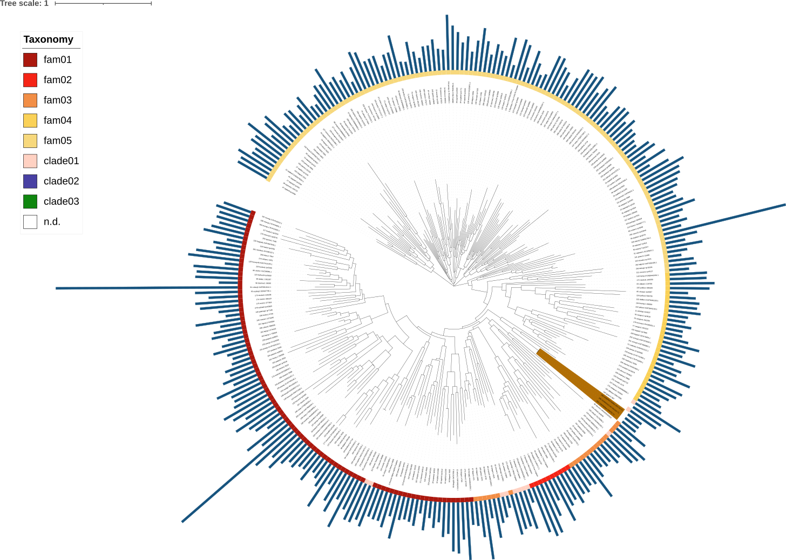
```

* The lddt tree is not really consistent with the sequence-based. The color strip showing the family assignments from Vogan&Gluck-Thaler, it’s all over the place.
```{r}
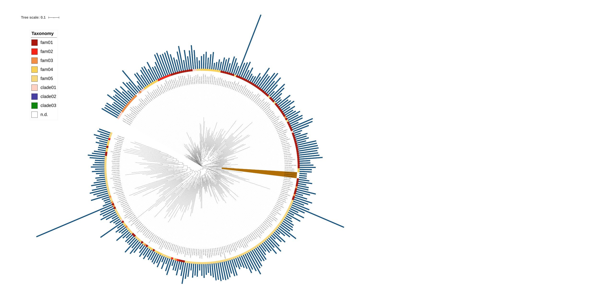
```

* Looking into the clade with our captains (lddt)
```{r}
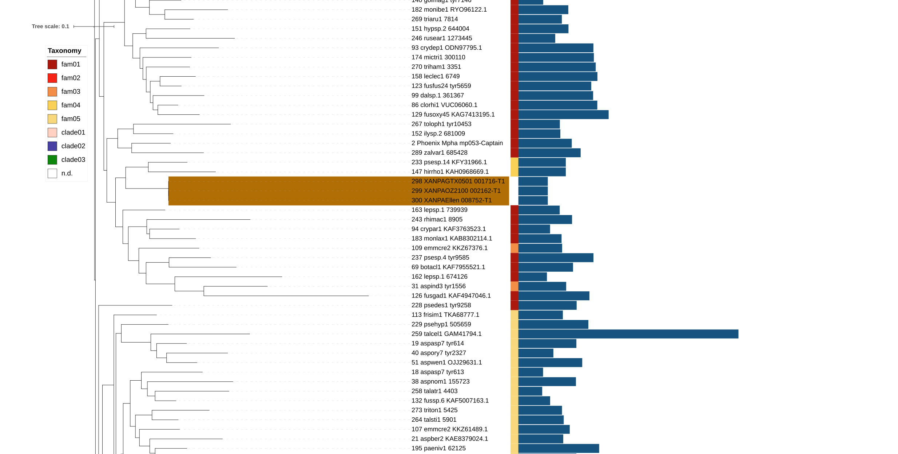
```

* The alntmscore tree is similarly inconsistent with the sequence-based families
```{r}
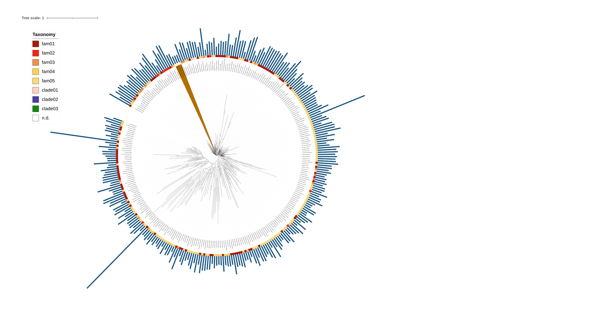
```

* Looking into the clade with our captains (almtmscore)
```{r}
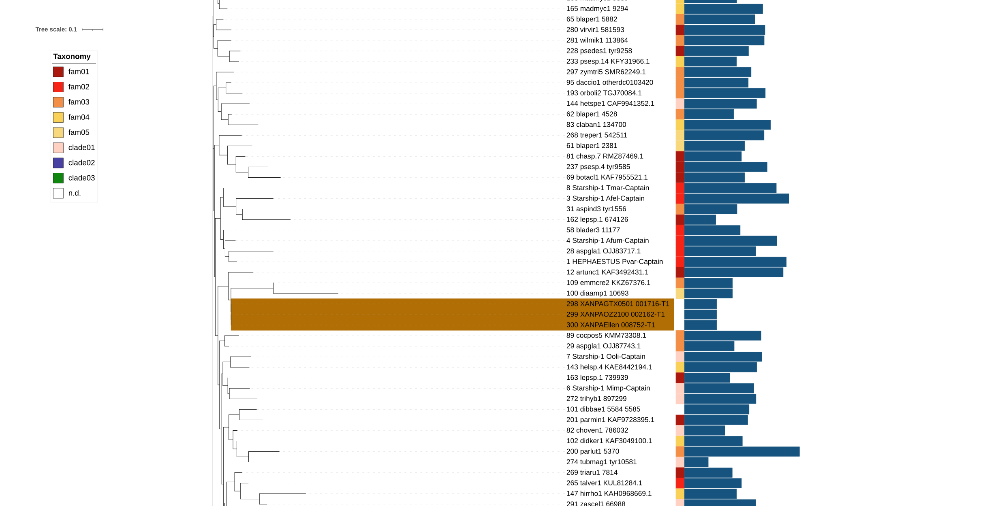
```

#### Other plots
* Got from Angus
* ChimeraX alignment of XANPAGTX0501_001716-T1 and XerA (the best match returned by FoldSeek)
```{r, echo=FALSE}
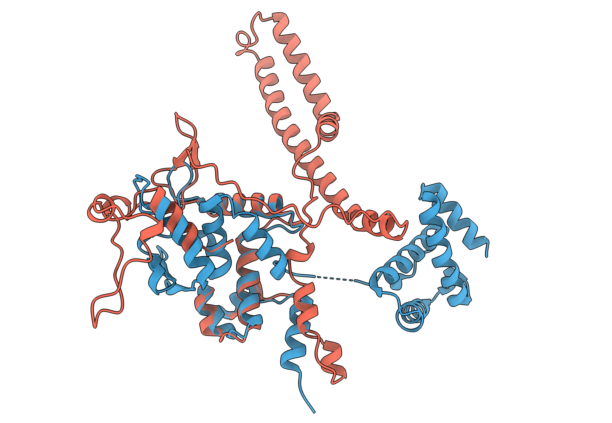
```

* RMSD plots (similarity of alignments) between XANPAGTX0501_001716-T1 and XerA + the YRs with closest position according to FoldTree. Got form Angus values and re-created the plot
```{r}
library(RColorBrewer)

rmsd <- read.csv("../results/rmsdData.csv")[1:14,]
rmsd$tree<-factor(rmsd$tree,levels=c("alntmscore","lddt","foldseek","manual"))
ggplot(rmsd) + geom_bar(aes(x=reorder(label, rmsd100),y=rmsd100,fill=tree),stat = "identity")+
  facet_grid(.~tree,scales = "free_x",space = "free")+xlab("")+
  scale_fill_brewer(palette="Dark2")+theme_bw()+
  theme(axis.text.x = element_text(angle=45, vjust = 1, hjust=1))
  
```

* Saved part of the graph with manual and foldtree
```{r}
ggplot(rmsd %>% filter(tree %in% c("foldseek","manual"))) + 
  geom_bar(aes(x=reorder(label, rmsd100),y=rmsd100,fill=tree),stat = "identity")+
  facet_grid(.~tree,scales = "free_x",space = "free")+xlab("")+
  scale_fill_brewer(palette="Dark2")+theme_bw()+
  theme(legend.position="none",axis.text.x = element_text(angle=45, vjust = 1, hjust=1))


ggsave('../results/rmsd.pdf', width = 2.5, height = 2)  
```

* Saved part of the graph with structural trees
```{r}
ggplot(rmsd %>% filter(tree %in% c("lddt","alntmscore"))) + 
  geom_bar(aes(x=reorder(label, rmsd100),y=rmsd100,fill=tree),stat = "identity")+
  facet_grid(.~tree,scales = "free_x",space = "free")+xlab("")+
  scale_fill_brewer(palette="Set1")+theme_bw()+
  theme(axis.text.x = element_text(angle=45, vjust = 1, hjust=1))
ggsave('../results/rmsd2.pdf', width = 5, height = 2.5)  
ggsave('../results/rmsd2.png', width = 5, height = 2.5)  
```

* Length of Starship compared to YRs in the reference files
  * Put Angus's notebook on how there were made as `noteboook/09.1_lengthAnalysis.pdf`
```{r, echo=FALSE}
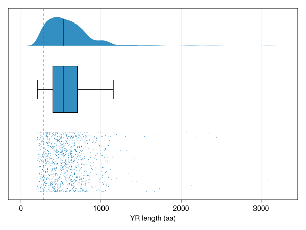
```

#### Foldseek search
* From Angus, got a json. Let's turn it into a table
```{r}
library(jsonlite)

j<-fromJSON('../analysis_and_temp_files/09_captain/foldtree/Foldseek_2025_08_29_13_19_13.json',flatten=T)$results[[1]][5:11] %>% as.list()

j2<-lapply(j, unlist, use.names=T)
  
foldseek<-do.call(rbind,j2) %>% as.data.frame()
foldseek$query <- "XANPAOZ2100_002162-T1"
foldseek<-foldseek %>% select(query, target,prob, eval,score, seqId,description)
write.table(foldseek,"../results/foldseek_search.txt",sep="\t",quote = F, row.names = F)
foldseek
```


