```{r setup, include=FALSE}
library(knitr)
library(tidyverse)
library(kableExtra)
knitr::opts_chunk$set(echo = TRUE)
```

**Summary:** prior to re-submission we decided to extend the analysis of the captains, which included captains annotated in the genomes of a bunch of mycobionts and lichen-associated fungi


## 1. Extended captain phylogeny
* Noah Brown (Gluck-Thaler lab) ran analysis on the extended set of captains, which included captains from additional gneomes of mycobionts and lichen-associated fungi
* Noah's description of this analysis is in `10.1_tree.md`
* To visualize the tree, I manually the previouslty created iTOL file `analysis_and_temp_files/09_captain/YRsuperfamRefs_plus_ours_aligned_itol.txt` for the family assignments. I modified the legend to rename the clade01 families from numbers to the proper names (see table 1 of the Starfish paper). Saved the new file as `analysis_and_temp_files/10_extended_captain/YR_reps_plus_lichen_reps_itol.txt`
* In this tree, our captain got clustered with other sequences, and xanthoria.sp..2_tyr633 became the cluster representative shown in the tree. Therefore, this is where the pointer will be
```{r,message=F}
library(ape)
tree<-read.tree("../analysis_and_temp_files/10_extended_captain/YR_reps_plus_lichen_reps.phylo.treefile.rooted")

#pointer to our clade
filename<-"../analysis_and_temp_files/10_extended_captain/YR_reps_plus_lichen_reps_itol2.txt"
cat("DATASET_BINARY\nSEPARATOR,COMMA\nDATASET_LABEL,GOI\nCOLOR,#b30000\nFIELD_LABELS,GOI\nFIELD_COLORS,#b30000\nFIELD_SHAPES,5\nHEIGHT_FACTOR,2.5\nMARGIN,30\nDATA\n",file=filename)
itol2<-data.frame(name=tree$tip.label) %>%
  mutate(symbol=ifelse(grepl("xanthoria.sp..2_tyr633",name),1,-1)) 
write.table(itol2,filename,append=TRUE,sep=",",quote = F, row.names = F, col.names=F)
```
* Saved the tree images as `results/YR_reps_plus_lichen_reps.*`
* As before, the image only shows clades with >=80 bootstrap support
```{r}
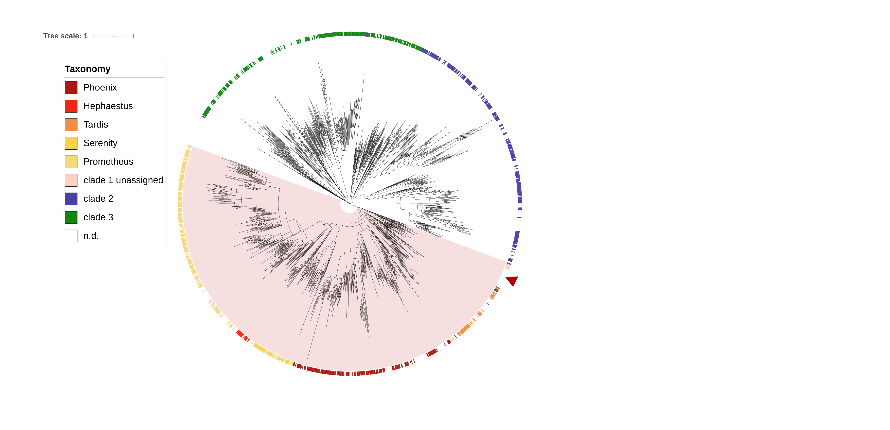
```

* Ad-hoc counting how many lichen-derived reps are added to the tree, compared to the old tree that contians only Tangerin from Xanthoria + tyrRs from the Starfish paper
```{r,message=F}

tree_old<-read.tree("../analysis_and_temp_files/09_captain/YRsuperfamRefs_plus_ours_aligned_filtered.phyl.treefile")

itol2 %>% filter(!(name %in% tree_old$tip.label)) %>% filter(!grepl("Crypton",name)) %>% nrow()

```

* Prepared table for all the captains included in the new tree
```{r,message=F}
gff <- read.delim2("../analysis_and_temp_files/10_extended_captain/lichens.tyr.filt.gff",header=F) %>%
  mutate(Name = gsub(".*Name=","",V9)) %>% rename(contig = V1, Start =V4, End = V5) %>% 
  mutate(Genome = gsub("_.*","",Name)) %>%
  select(Name,Genome,contig, Start, End)
YR_df<- read.delim("../data/captains/YRsuperfamRefs.txt")

df <- data.frame(Name=tree$tip.label) %>% left_join(gff) %>%
  mutate(Source = ifelse(is.na(contig),"Gluck-Thaler and Vogan (2024)","Newly-annotated lichen genomes")) %>%
  mutate(Note=ifelse(grepl("xanthoria.sp..2_tyr633",Name),"Representative for the cluster that included Tangerine captains from X.parietina",""))  %>%
   left_join(YR_df %>% select(geneID,familyID),by=c("Name"="geneID"))

write.table(df,"../results/large_tree_captains_metadata.csv",sep=",",quote = F, row.names = F, col.names=T,na="")
```

## 2. Tangerine clade
* Created annotation file showing the order level taxonomy
  * Changed Phlyctis annotation to Gyalectales in the metadata file
  * Here, edited Tangerine for Xanthoria to have CB domain length of 0
```{r}
library(RColorBrewer)

table<-read.delim(paste0("../analysis_and_temp_files/10_extended_captain/Tan_Fam_Metadata.csv"),sep=",") %>% filter(Captain_Sequence !="")
lengths_df <- read.delim("../analysis_and_temp_files/10_extended_captain/Family_region_lengths_add_RNA.csv",sep=",")


#prep header for taxonomy dataset
filename<-paste0("../analysis_and_temp_files/10_extended_captain/Tan_Fam_itol.txt")
cat("DATASET_COLORSTRIP\nSEPARATOR COMMA\nDATASET_LABEL,Taxonomy\nLEGEND_TITLE,Taxonomy\nLEGEND_SHAPES,1,1,1,1,1,1,1,1,1\nLEGEND_COLORS,#FF7F00,#33A02C,#E31A1C,#1F78B4,#6A3D9A,#FFFF99,#B15928,#FB9A99,#A6CEE3\nLEGEND_LABELS,Teloschistales,Ostropales,Pertusariales,Lecanorales,Umbilicariales,Acarosporales,Caliciales,Hymeneliales,Gyalectales\nDATA\n",file=filename)
itol<-table %>% mutate(label = case_when(
   grepl("Teloschistales",taxon) ~ "#FF7F00",
  grepl("Ostropales",taxon)  ~ "#33A02C",
  grepl("Pertusariales",taxon) ~ "#E31A1C",
  grepl("Lecanorales",taxon) ~ "#1F78B4",
  grepl("Umbilicariales",taxon) ~ "#6A3D9A",
  grepl("Acarosporales",taxon) ~ "#FFFF99",
  grepl("Caliciales",taxon) ~ "#B15928",
  grepl("Hymeneliales",taxon) ~ "#FB9A99",
  grepl("Gyalectales",taxon) ~ "#A6CEE3",
  T ~ "#ffffff")) %>%
  select(Captain_Sequence,label)
write.table(itol,filename,append=TRUE,sep=",",quote = F, row.names = F, col.names=F)

#prep dataset for the length of the CB domain
filename3<-"../analysis_and_temp_files/10_extended_captain/Tan_Fam_itol2.txt"
cat("DATASET_SIMPLEBAR\nSEPARATOR COMMA\nDATASET_SCALE,50,100\nSHOW_VALUE,1\n\nDATASET_LABEL,Length\nCOLOR,#16537e\nDATA\n",file=filename3)

itol_length<-table %>% left_join(lengths_df,by=c("Captain_Sequence"="Sequence")) %>% select(Captain_Sequence,CB_Domain) 
itol_length$CB_Domain[itol_length$Captain_Sequence %in% c("OZ2100_002162-T1","XpGTX0501_001716-T1","scaffold_008752-T1")]<-0
write.table(itol_length,filename3,append=TRUE,sep=",",quote = F, row.names = F, col.names=F)

```


### Lenghs of captains and domains
* Previously, Angus made a plot showing the length distributions of YRs and where Tangerine form Xanthoria fits in
* Let's extend this to other Tangerine clade members
* Input data from Noah, `analysis_and_temp_files/10_extended_captain/Family_region_lengths.csv`
* I made a corrected version, where I added manually the RNA-corrected version of Tangeirne and romived the Starfish sequences. Saved this as `analysis_and_temp_files/10_extended_captain/Family_region_lengths_add_RNA.csv`
  * the brown line shows Tangerine from Xanthoria, RNA-corrected. To get the number for CAT domain (118), I compared the sequence from Noah (which had 198) and deducted the extra region that was present in her sequence (80). I confirmed that in the alignment, the extra region is entirely within CAT domain (as it start in the position 2024, and CAT domain is 1664-5311)
  * the blue line is for Hephaestos,I got these numbers from Angus
```{r,message=F}
library(patchwork)

lengths_df$Family[lengths_df$Family=="Other_Families"]<-"Other"
lengths_df$Family[lengths_df$Family=="Tangerine"]<-"Tangerine\nfamily"
lengths_df$highlight<-"None"
lengths_df$highlight[lengths_df$Sequence=="XANPAOZ2100_002162-T1"]<-"XANPAOZ2100_002162-T1"

#add hephaestos
lengths_df2<-rbind(lengths_df,data.frame("Sequence"="HhpA","Family"="Other","CB_Domain"=75,
           "Between_CB_and_CAT_Domains"=NA,"CAT_Domain"=276, "Total_Length"=896, "highlight"="HhpA"))

p1<-ggplot(lengths_df2,aes(y=Total_Length,x=Family))+ 
  geom_boxplot(aes(fill=Family),outlier.shape = NA) +
  geom_jitter(width=0.15,aes(color=highlight,alpha=highlight,size=highlight)) +
  #geom_violin(aes(fill=Family),alpha=0.5,quantiles =  0.5,quantile.linetype=1) +
  geom_hline(yintercept=283,color="#a65607")+
  geom_hline(yintercept=896,color="#005096")+
  ylab("Length in aa")+xlab("")+ggtitle("Captain Length")+
  scale_fill_manual(values= c("Other" = "#1E88E5", "Tangerine\nfamily" = "#FFC107"))+
  scale_color_manual(values= c("None" = "black", "XANPAOZ2100_002162-T1" = "#a65607","HhpA"="#005096"))+
  scale_alpha_manual(values= c("None" = 0.1, "XANPAOZ2100_002162-T1" = 1,"HhpA"=1))+
  scale_size_manual(values= c("None" = 0.5, "XANPAOZ2100_002162-T1" = 1,"HhpA"=1))+
  theme_bw() + theme(legend.position = "none",
                     axis.text=element_text(size=6),
                     axis.title=element_text(size=6),
                     title=element_text(size=6))

p2<-ggplot(lengths_df2,aes(y=CB_Domain,x=Family))+ 
  geom_boxplot(aes(fill=Family),outlier.shape = NA) +
  geom_jitter(width=0.15,aes(color=highlight,alpha=highlight,size=highlight)) +
  #geom_violin(aes(fill=Family),alpha=0.5,quantiles =  0.5,quantile.linetype=1) +
  geom_hline(yintercept=0,color="#a65607")+
  geom_hline(yintercept=75,color="#005096")+
  ylab("")+xlab("")+ggtitle("CB Domain")+
  scale_fill_manual(values= c("Other" = "#1E88E5", "Tangerine\nfamily" = "#FFC107"))+
  scale_color_manual(values= c("None" = "black", "XANPAOZ2100_002162-T1" = "#a65607","HhpA"="#005096"))+
  scale_alpha_manual(values= c("None" = 0.1, "XANPAOZ2100_002162-T1" = 1,"HhpA"=1))+
  scale_size_manual(values= c("None" = 0.5, "XANPAOZ2100_002162-T1" = 1,"HhpA"=1))+
  theme_bw() + theme(legend.position = "none",
                     axis.text=element_text(size=6),
                     axis.title=element_text(size=6),
                     title=element_text(size=6))

p3<-ggplot(lengths_df2,aes(y=CAT_Domain,x=Family))+ 
  geom_boxplot(aes(fill=Family),outlier.shape = NA) +
  geom_jitter(width=0.15,aes(color=highlight,alpha=highlight,size=highlight)) +
  #geom_violin(aes(fill=Family),alpha=0.5,quantiles =  0.5,quantile.linetype=1) +
  geom_hline(yintercept=118,color="#a65607")+
  geom_hline(yintercept=276,color="#005096")+
  ylab("")+xlab("")+ggtitle("CAT Domain")+
  scale_fill_manual(values= c("Other" = "#1E88E5", "Tangerine\nfamily" = "#FFC107"))+
  scale_color_manual(values= c("None" = "black", "XANPAOZ2100_002162-T1" = "#a65607","HhpA"="#005096"))+
  scale_alpha_manual(values= c("None" = 0.1, "XANPAOZ2100_002162-T1" = 1,"HhpA"=1))+
  scale_size_manual(values= c("None" = 0.5, "XANPAOZ2100_002162-T1" = 1,"HhpA"=1))+
  theme_bw() + theme(legend.position = "none",
                     axis.text=element_text(size=6),
                     axis.title=element_text(size=6),
                     title=element_text(size=6))

p1+p2+p3+plot_layout(guides = 'collect')
ggsave('../results/length_updated.pdf', width = 5, height = 2.5) 
ggsave('../results/length_updated.svg', width = 5, height = 2.5) 
ggsave('../results/length_updated.png', width = 5, height = 2.5,background="white") 
```

## 3. Clades with HGT between lichen and lichen-associated fungi
* Three clades were identified as likely instances of such HGT
* Noah extracted these clades and saved as separate trees. HGT1 and HGT2 are more likely, HGT3 is less strong
* Let's visualize them using the same color scheme and logic as for the HGT analysis of the Tangerin cargo. Noah prepared tables that give the clade and the lifestyle
* first, define the function
```{r}
make_itol_annot <- function(x){
#read table
table<-read.delim(paste0("../analysis_and_temp_files/10_extended_captain/",x,"_Metadata.csv"),sep=",") %>% filter(Captain_Sequence !="")

#remove rows that contain enries not represented in the tree
tree<-read.tree(paste0("../analysis_and_temp_files/10_extended_captain/",x,".phylo.treefile.rooted"))
table<-table %>% filter(Captain_Sequence %in% tree$tip.label)

#prep header for taxonomy dataset
filename<-paste0("../analysis_and_temp_files/10_extended_captain/",x,"_itol.txt")
cat("DATASET_COLORSTRIP\nSEPARATOR COMMA\nDATASET_LABEL,Taxonomy\nLEGEND_TITLE,Taxonomy\nLEGEND_SHAPES,1,1,1,1\nLEGEND_COLORS,#E6AB02,#1B9E77,#d1ff87,#c3f5fa\nLEGEND_LABELS,Lecanoromycetes,Chaetothyriales,other Eurotiomycetes,Arthoniomycetes\nDATA\n",file=filename)

itol<-table %>% mutate(label = case_when(
   grepl("Lecanoromycetes",taxon) ~ "#E6AB02",
  grepl("Chaetothyriales",taxon) | grepl("Chaetothryiales",taxon) ~ "#1B9E77", #Noah had a typo in the table, so here included both correct spelling and the typo
  !grepl("Chaetothyriales",taxon) & grepl("Eurotiomycetes",taxon) ~ "#d1ff87",
  grepl("Arthoniomycetes",taxon) ~ "#c3f5fa",
  T ~ "#ffffff")) %>%
  select(Captain_Sequence,label)
write.table(itol,filename,append=TRUE,sep=",",quote = F, row.names = F, col.names=F)


#prep header for lifestyle dataset
filename2<-paste0("../analysis_and_temp_files/10_extended_captain/",x,"_itol2.txt")
cat("DATASET_SYMBOL\nSEPARATOR,COMMA\nDATASET_LABEL,Lifestyle\nLEGEND_TITLE,Lifestyle\nLEGEND_COLORS,#facac0,#540a06\nLEGEND_SHAPES,5,1\nHEIGHT_FACTOR,2.5,2.5\nMARGIN,30,30\nLEGEND_LABELS,Lichen-forming,Lichen-associated\nDATA\n",file=filename2)
itol2<-table %>%
  mutate(label = case_when(lifestyle =="Endolichenic" ~ "1,2.5,#540a06,1,1",
         lifestyle =="Lichenized" ~ "5,2.5,#facac0,1,1",
         T~"5,2.5,#ffffff,-1,-1")) %>%
  select(Captain_Sequence,label)

write.table(itol2,filename2,append=TRUE,sep=",",quote = F, row.names = F, col.names=F)}

```
* Now make the annotation files
```{r}
make_itol_annot("Clade_A")
make_itol_annot("Clade_B")
make_itol_annot("Clade_C")
```
* Clade A. In multiple clades there's mixing up of lecanoromycete and Eurotios, including both Chaetothyriales and lichen-forming
```{r}
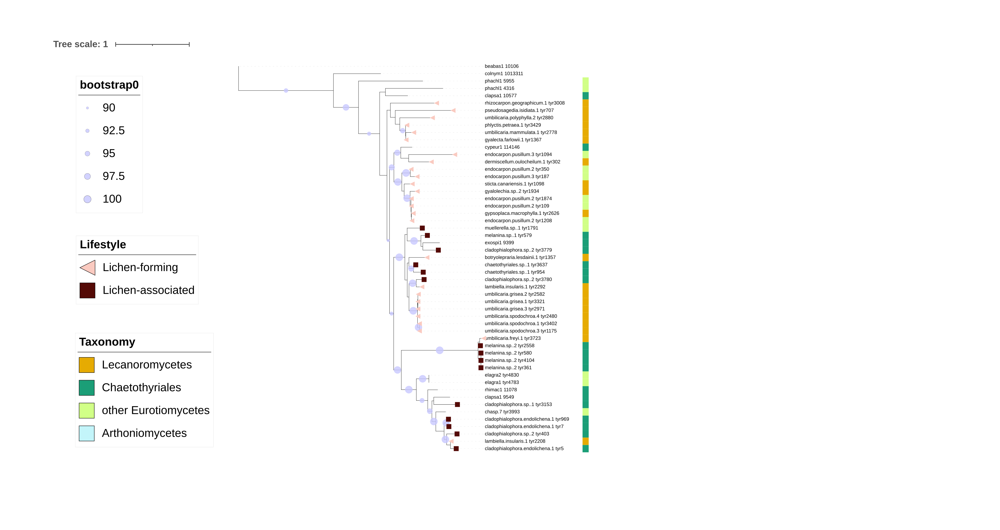
```

* Clade B is a bit less straightforward. Lichen-associated Eurotios form a separate well-supported clade. But there is a 90% bootstrap supported clade with mixing up of lecanoros and lichen-forming eurotios
```{r}
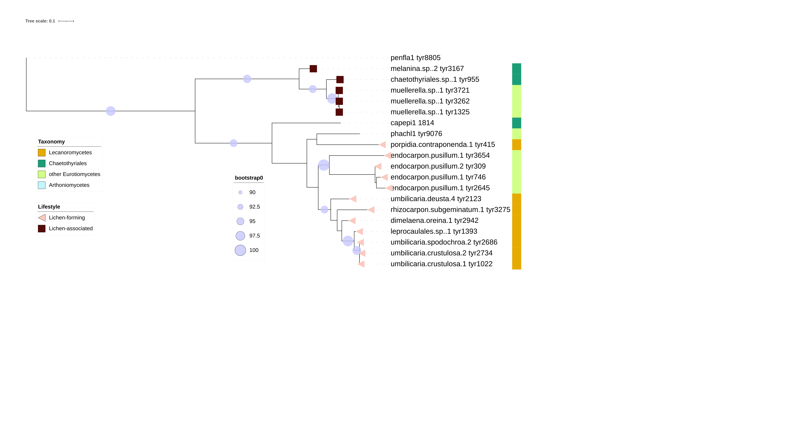
```

* Clade C is more certain again. It has a well-supported clade consisiting of many lecanoro sequences (the collapsed clade contain 144 sequences, all of lecanoros) and lichen-forming eurotios, plus another clade with a single Lecanoro sequence clustered inside a eurotio clade
```{r}
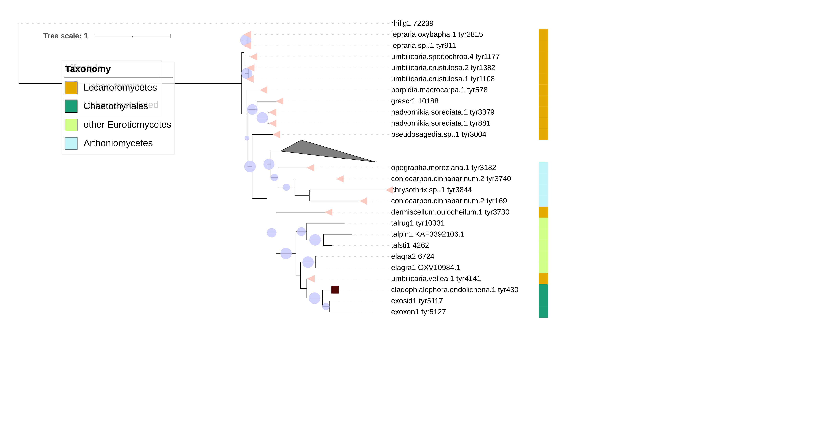
```

* This is where the clades are in the context of the big tree
```{r}
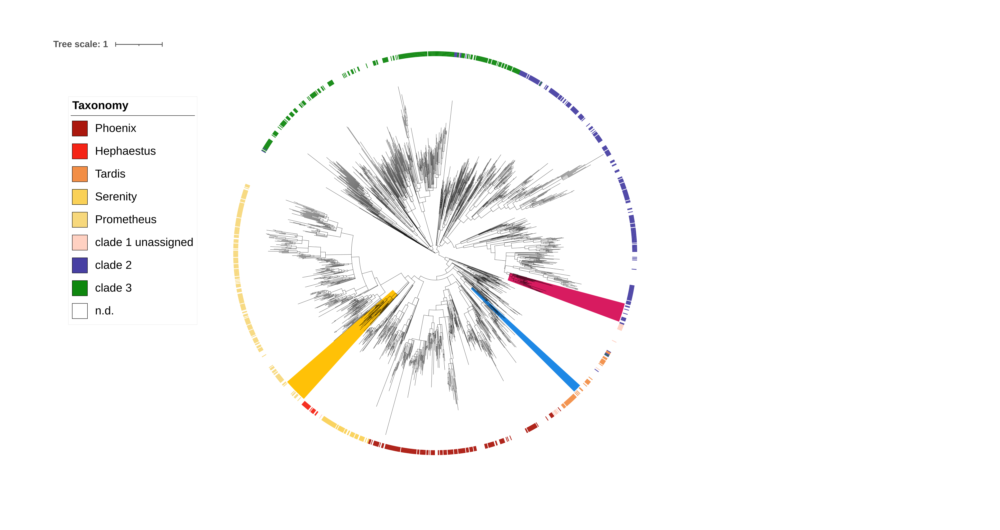
```

## 4. Extended structural analysis
* Got from Angus the new set of Foldtree trees. He also sent a fasta file, which looks like it included the new sequences that Noah sent to him
* Let's rename the sequences to remove number_ from some names and make them compatible with the sequence-based tree
```{r,message=F}
library(ape)
foldtree<-read.tree("../analysis_and_temp_files/10_extended_captain/foldtree_struct_tree.PP.nwk.rooted.final")
foldtree$tip.label <- sub("^[0-9]+_","",foldtree$tip.label)
write.tree(foldtree,"../analysis_and_temp_files/10_extended_captain/foldtree_struct_tree.PP.nwk.rooted.final.renamed")

lddt<-read.tree("../analysis_and_temp_files/10_extended_captain/lddt_struct_tree.PP.nwk.rooted.final")
lddt$tip.label <- sub("^[0-9]+_","",lddt$tip.label)
write.tree(lddt,"../analysis_and_temp_files/10_extended_captain/lddt_struct_tree.PP.nwk.rooted.final.renamed")

alntmscore<-read.tree("../analysis_and_temp_files/10_extended_captain/alntmscore_struct_tree.PP.nwk.rooted.final")
alntmscore$tip.label <- sub("^[0-9]+_","",alntmscore$tip.label)
write.tree(alntmscore,"../analysis_and_temp_files/10_extended_captain/alntmscore_struct_tree.PP.nwk.rooted.final.renamed")


```
* Let's first check where in the sequence-based phylogeny are these sequences, to check how fully they represent the whole set. To be on the safe side, we'll use the sequence names extracted from the tree file
```{r,message=F}
library(ape)

#make itol annotation file for pointers
filename<-"../analysis_and_temp_files/10_extended_captain/YR_reps_plus_lichen_reps_itol3_show_struct.txt"
cat("DATASET_BINARY\nSEPARATOR,COMMA\nDATASET_LABEL,Selected for structural analysis\nCOLOR,#3256a8\nFIELD_LABELS,Selected_for_structural_analysis\nFIELD_COLORS,#3256a8\nFIELD_SHAPES,5\nHEIGHT_FACTOR,2.5\nMARGIN,30\nLEGEND_TITLE,Selected\nLEGEND_COLORS,#3256a8\nLEGEND_SHAPES,5\nLEGEND_LABELS,Selected for structural analysis\nDATA\n",file=filename)
itol3<-data.frame(name=tree$tip.label) %>%
  mutate(symbol=ifelse(name %in% foldtree$tip.label,1,-1)) 
write.table(itol3,filename,append=TRUE,sep=",",quote = F, row.names = F, col.names=F)

```
* It looks ok. There are some chunks missing from the clade 2 and 3 - this is because in the old structural analysis we only had clade 1 captains, to keep the dataset smaller. Now we have lichen-derived captains from clades 2 and 3 as well, and I think there's plenty of them to be representative 
```{r}
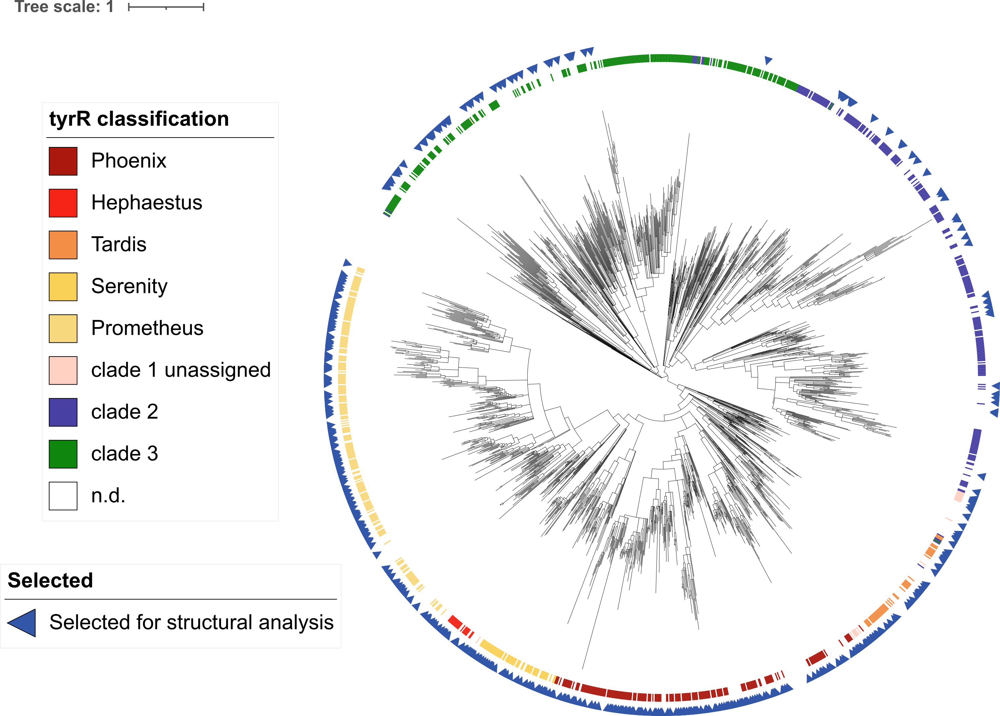
```

* Now let's make annotation file for the Foldtree that will show the tangerine family captains. All but one are grouped in a single clade, which however contains some non-tangerin species
```{r,message=F}

filename<-"../analysis_and_temp_files/10_extended_captain/foldtree_struct_tree_itol_tangerine.txt"
cat("DATASET_BINARY\nSEPARATOR,COMMA\nDATASET_LABEL,Tangerine\nCOLOR,#3256a8\nFIELD_LABELS,Tangerine\nFIELD_COLORS,#3256a8\nFIELD_SHAPES,5\nHEIGHT_FACTOR,2.5\nMARGIN,30\nLEGEND_TITLE,Selected\nLEGEND_COLORS,#3256a8\nLEGEND_SHAPES,5\nLEGEND_LABELS,Tangerine family\nDATA\n",file=filename)
itol4<-data.frame(name=foldtree$tip.label) %>%
  mutate(symbol=ifelse(name %in% table$Captain_Sequence | grepl("XANPA",name),1,-1)) 
write.table(itol4,filename,append=TRUE,sep=",",quote = F, row.names = F, col.names=F)
```

* Visualizing the trees! All of them have some lichen-derived Captains from clades 2 and 3, bu no 'reference' tyrRs form these clades. Which makes things a bit difficult. Might think about dropping/collapsing them (sigh!), or at least making some impromtu labels for them, so that they are visible on the tree as themselves

### Foldtree: structure-informed sequence based
* Foldtree is quite similar to the sequence tree (NB: here I re-rooted tree at the split between clade 1 and clades 2/3). All but one sequence form Tangerine are grouped within one clade
```{r}
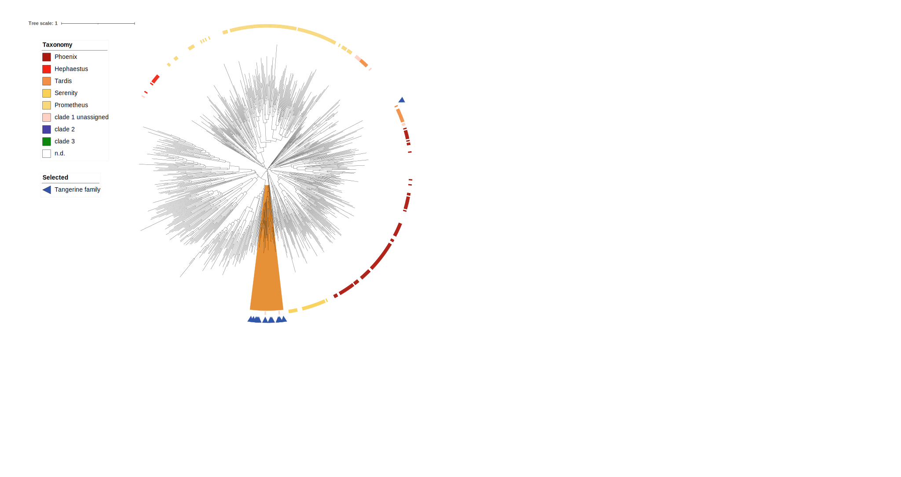
```

* Not all of the sequences in this clade are in the Tangerine clade tree. Some of them I checked, and they are not in the big tree either, so I right now I can't tell whether they would be within Tangerine-sequence-clade or not. The arthoniomycete sequences close by were in the sequence tree grouped together with Hephaestus (not within the clade, but basal to it; this concerns Opegrapha and Arthonia, the two other sequences are not in the sequence-based tree)
```{r}
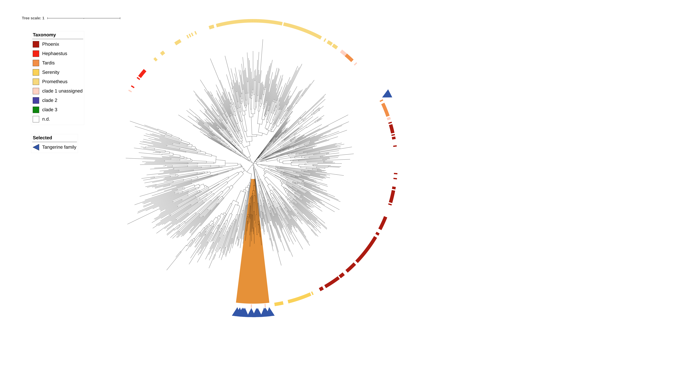
```

### LDDT tree: local structure
* LDDT tree is not consistent with sequence-based tree. Still, most Tangerine clade is grouped together
```{r}
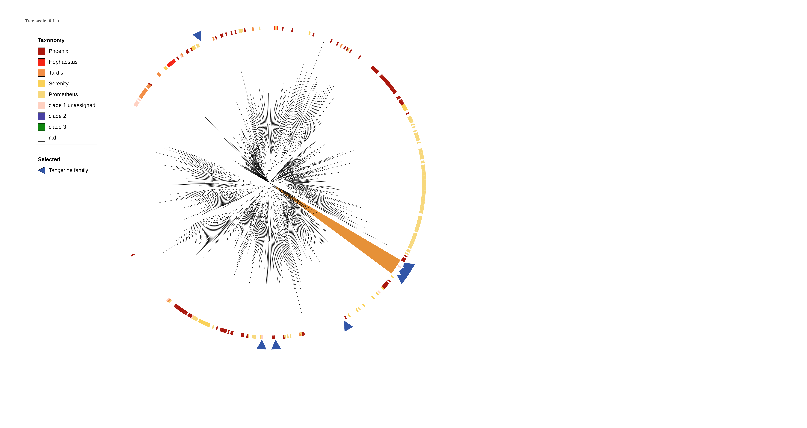
```

* Tangerine sequences from Xanthroia ended up being split into two different clades?? All three are away from the rest of the Tangerine clade, which I would image is due to the missing CB domain
```{r}
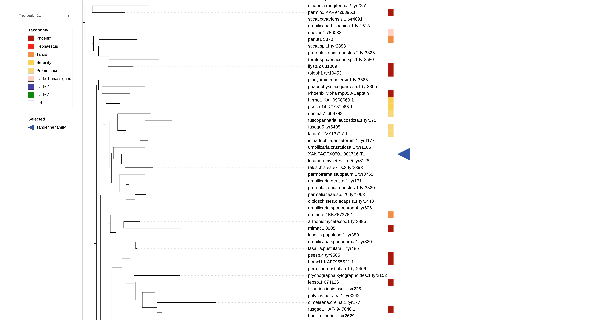
```

### ALNTMSCORE tree: global structure
* ALNTMSCORE tree is even less consistent with sequence-based tree! Tangerine family has been spread all over
```{r}
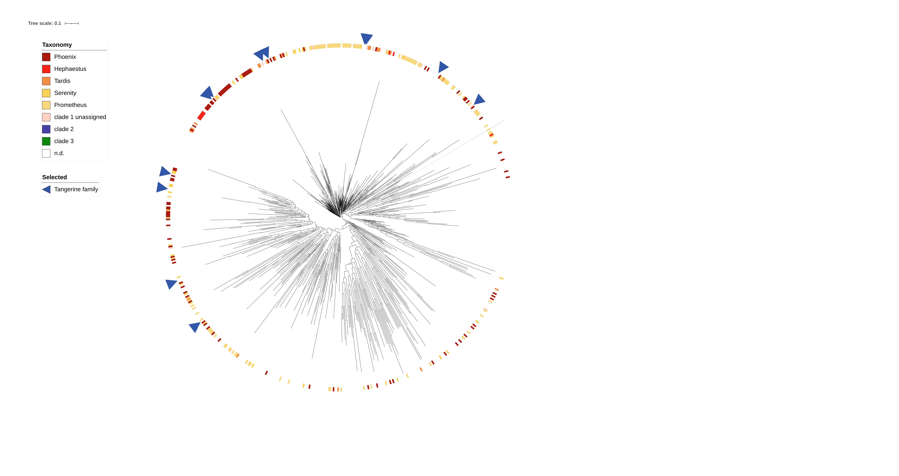
```

* All three Tangerine sequences from Xanthoria are in different places
```{r}
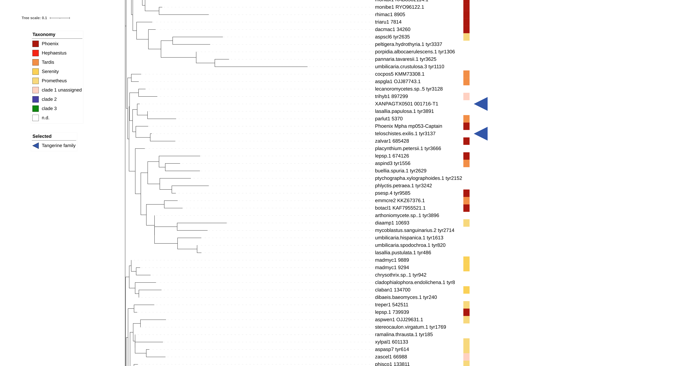
```

* Prepare list of the captains used in this analysis for the supplementary
  * Angus took the set of representative lichen-derived captains that Noah sent him, and selected those with 203–999 residues, inclusive
```{r}
foldtree_df <- data.frame("Captain"=foldtree$tip.label) %>% left_join(YR_df,by=c("Captain"="geneID")) %>%
  select(Captain,familyID) %>%
  mutate(Source = case_when(!is.na(familyID) ~ "Gluck-Thaler and Vogan (2024)",
         Captain=="XANPAGTX0501_001716-T1" ~ "Tangerine element from X. parietina",
         T ~ "Newly-annotated lichen genomes")) %>%
  mutate(Genome = str_replace(Captain,"_.*$",""))
foldtree_df$Genome[foldtree_df$Captain=="XANPAGTX0501_001716-T1"] <- "X. parietina GTX0501"
foldtree_df$Genome[grepl("-Captain",foldtree_df$Captain)] <- ""
foldtree_df$familyID[is.na(foldtree_df$familyID) ] <- ""
write.table(foldtree_df,"../results/foldtree_copatains_metadata.txt",sep="\t",quote = F, row.names = F, col.names=T)

```

## 5. Triple-check captain annotation
* Used tBLASTn of Hephaestus against the nucleotide sequence of the Tangerine element
  * used the query sequence form the Starfish paper
```{r,eval=F}
/Users/gulnaratagirdzhanova/Documents/software/ncbi-blast-2.10.0+/bin/tblastn -query analysis_and_temp_files/10_extended_captain/HEPHAESTUS_captain.faa -subject data/data_shared_with_gluck-thaler_lab/Tangerine_elements.fna -evalue 0.05 > analysis_and_temp_files/10_extended_captain/tblastn_hephaestus_tangerine_element.txt

/Users/gulnaratagirdzhanova/Documents/software/ncbi-blast-2.10.0+/bin/tblastn -query analysis_and_temp_files/10_extended_captain/HEPHAESTUS_captain.faa -subject data/data_shared_with_gluck-thaler_lab/Tangerine_elements.fna -outfmt 6 -evalue 0.05
```
* Got low-quality hits to a portion of HEPHAESTUS (aa 379-495) corresponding to 1736-2086 bp from the start of the element OZ2100_s00001. In the 'absolute' coordinates it translates to 306462-306812. The gene coordinates (updated based on RNA) are 306115-307018
```
HEPHAESTUS_Pvar-Captain	scaffold_s00008|-|Xanthoria	23.077	117	90	0	379	495	1736	2086	2.14e-05	41.2
HEPHAESTUS_Pvar-Captain	OZ2100_s00001|+|Xanthoria	23.077	117	90	0	379	495	1736	2086	2.14e-05	41.2
```
* To detemine which portion of the Tangerine captain sequence this hit corresponds to, I extracted the tBLASTn-predicted aa sequence and mapped it to Tangerine captain sequence (RNA-corrected). There is corresponded to 112-215

* Noah's Starfish run produced a different version of the sequence. SLightly odd that it doesn't start with M
```
>xanthoria.parietina.2_tyr340 (corresponds to XANPAOZ2100_002162-T1)
ILLLAYTGLRPKAIVESDIKGIRRTNEALKYKDINLILVRLRDGAAPLLVIKIRIVFDKGRRHRRCS
KTLTLYENCVQPVMCPIVHFLALAFVDKAFHPSLVNAGLSVHRLHSFACPGGRPMIEFRFRD
TILDTPIFRPSVRGFAGKETDPSKALSSSAIGLWMARLGERAGFPHRLKPYCLRRLDAGVSQP
QLLQILGHRKIETFQKHYQSTDMVVDVQATFLGFTSKSDIIKEIGKLCLRQDPNLPRSLTIDQK
LQARNQPELQQLERQRNVLTQGLRAHFAKLKDGAATSEFAQRQNVIGQLYRERARAKKEH
FQRVLREFHDTSDLNLMVSQLEGKNTLVGLRPPVNFVFEER
```
* By poking around, I figured out what exon configuration would result in this sequence:
  * xanthoria.parietina.2_tyr340: 305,825-305,977 + 306,064-306,448 + 306,501-307,018
  * compare to the RNA-corrected version of XANPAOZ2100_002162-T1: 306,115-306,448 + 306,501-307,018
* What's up with the new first exon? If we extend it beyond the start, we immediately hit a stop-codon in 5 codons. If we extend it beyone the end, we hit a stop-codon in 16 codons. Neither the extended flanks, nor the exon itself contain any M. This really doesn't seem to work, unless there is yet another intron somewhere.
* RNA data doesn't support this exon either. 
  * The purple rectangle shows the position if this exon. Only ~7 reads maps there, and some map to the 'intron' area too
```{r}
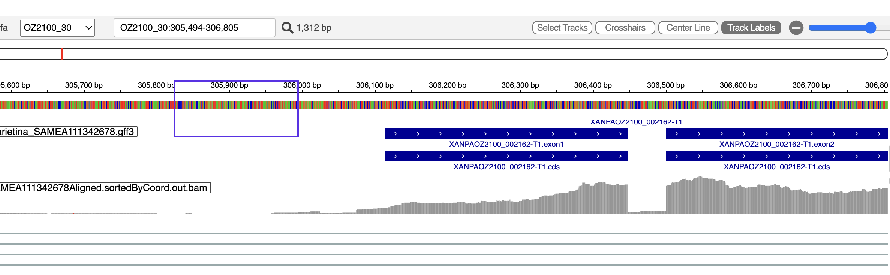
```


